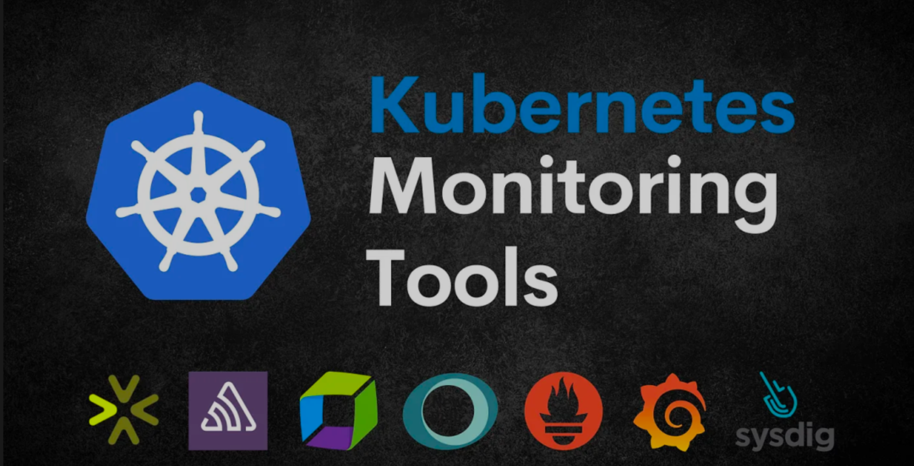
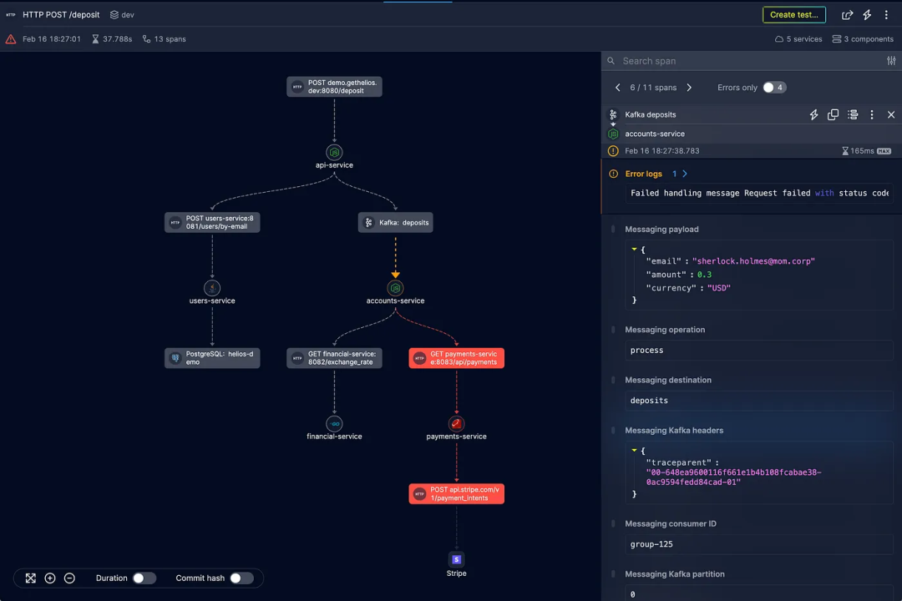
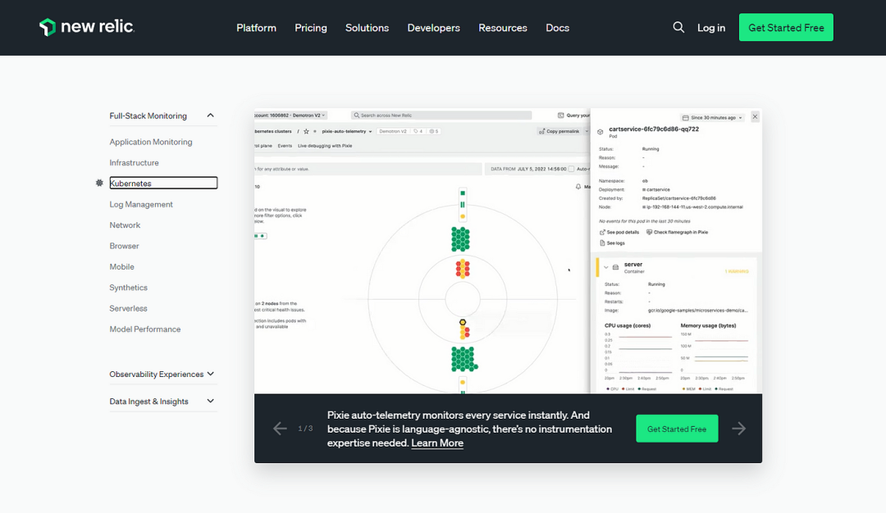
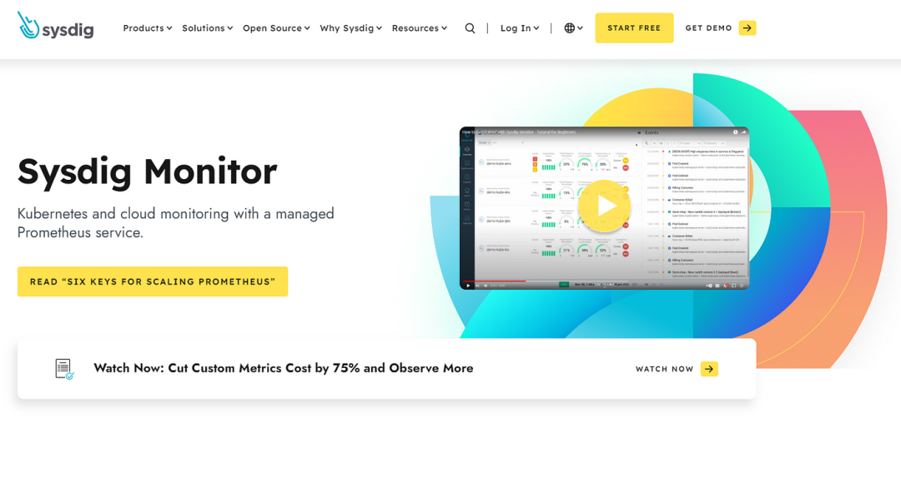
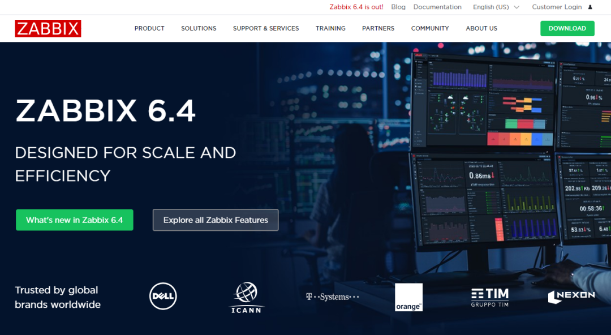
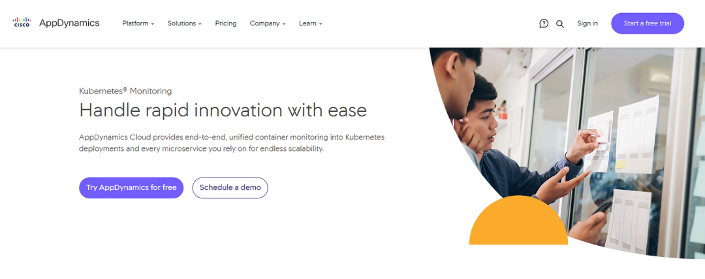
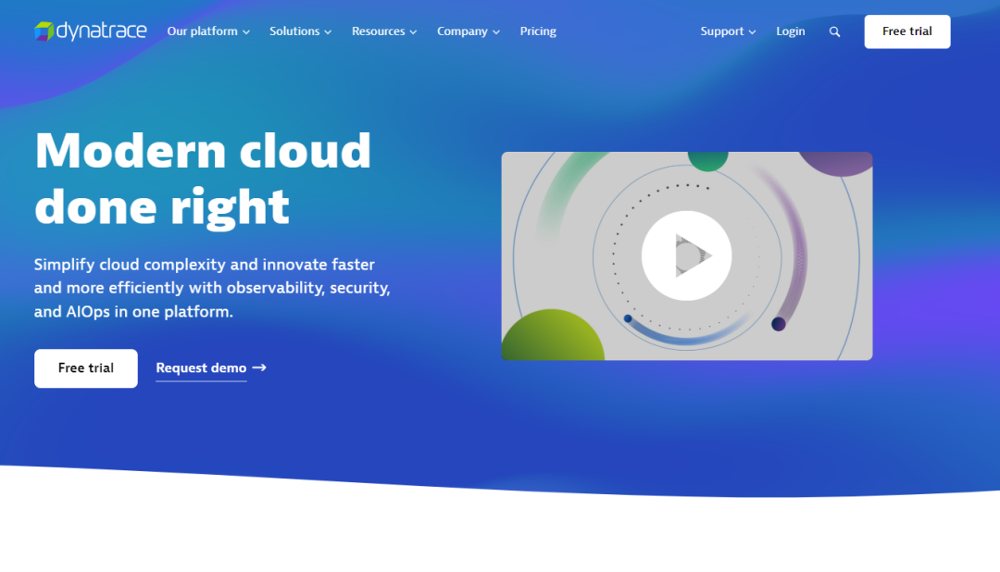
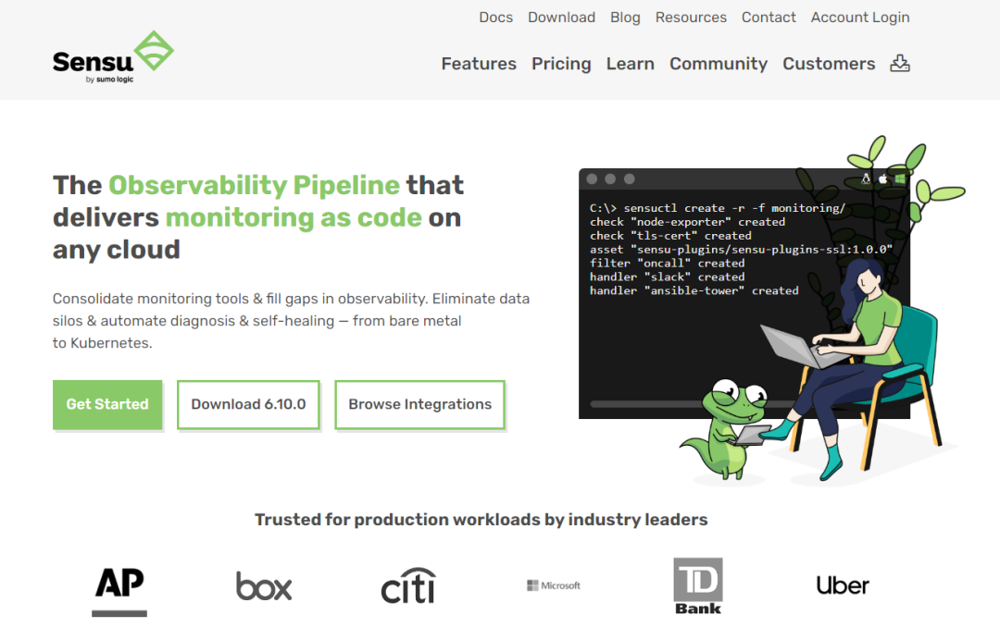

# **1 监控解决方案：10个 Kubernetes 监控工具**

Kubernetes (K8s) 是开发人员中最常用的容器编排平台。它自动化部署、扩展和管理容器的能力彻底改变了我们大规模构建和运行应用程序的方式。然而，随着 Kubernetes 变得越来越流行，为了提供高性能应用程序，对强大的监控解决方案的需求变得更加迫切。

监控 Kubernetes 可以深入了解集群和应用程序的运行状况、性能和资源利用率。它使开发人员能够主动识别瓶颈、解决问题并确保容器化基础设施的最佳状态。

因此，在本文中，我将讨论十大 Kubernetes 监控工具及其功能，以帮助您提高基于 Kubernetes 的应用程序的性能。

## 1 Helios

Helios是专门为 **分布式环境** 设计的综合监控工具。

它为基于 Kubernetes 的应用程序提供强大的监控功能和端到端可见性，以有效跟踪和管理其性能。

您可以使用Helios OpenTelemetry SDK轻松将 Helios 安装到 Kubernetes 集群。

### **Helios的特点**

* 为复杂的同步和异步流（例如 HTTP 请求和事件流）提供可视化。
* 提供整个系统的单一概述。
* 通过分析有效负载和错误数据帮助识别性能瓶颈。
* Lambda 调用的工作流程重新创建。HTTP 请求、Kafka 和 RabbitMQ 消息。
* 支持与现有日志、测试、错误监控等轻松集成。
* 支持多种语言，包括Python、JavaScript、Node.js、Java、Ruby、.NET、Go、C++和Collector。

## 2 Prometheus

Prometheus是一个开源监控和警报工具包，专为 Kubernetes 等动态云原生环境而设计。它提供了有关 Kubernetes 集群的运行状况和性能的宝贵见解。使用 Prometheus，您可以有效地监控和分析各种指标，例如 Pod、节点和容器的 CPU 和内存利用率、网络流量和吞吐量、Pod 和节点可用性等。

### **Prometheus的特点**

* 积极的社区支持。
* 收集并存储用于监控指标的时间序列数据。
* 用于数据分析和可视化的强大查询语言。
* 警报功能可通知用户异常情况。
* 与 Grafana 无缝集成，创建直观的仪表板。

## 3 New Relic

New Relic是一个基于云的监控和可观察平台，为 Kubernetes 环境提供广泛的支持。

它为 Kubernetes 集群内的应用程序、容器和基础设施提供了一系列监控功能。**借助 New Relic APM，您可以跟踪集群中的关键指标，例如响应时间、吞吐量、CPU 利用率和错误率，以识别瓶颈、解决问题并优化性能**。

### **New Relic的特点**

* 实时性能监控和故障排除。
* 深入了解应用程序、容器和基础设施。
* Kubernetes集群的自动发现和映射。
* 用于容量规划和优化的高级分析。
* 提供可定制的可视化效果。
* 可以处理大规模部署和高数据量。

## 4 Grafana

Grafana是一种流行的开源数据可视化和监控工具，可与Kubernetes监控系统无缝集成。它提供灵活的查询功能和过滤器，允许用户检索有关 Kubernetes 集群的特定数据，以获得更深入的了解。

### Grafana的特点

* 可定制的仪表板，用于可视化各种来源的指标。
* 支持众多数据源，包括 Prometheus、Graphite 和 InfluxDB。
* 丰富的可视化选项集，包括图形、图表和警报。
* 协作共享和注释功能可实现有效的团队协作。
* 用户友好的界面可以轻松导航和探索数据，从而实现 Kubernetes 集群的高效监控和故障排除。

## 5 DataDog

Datadog是一个云监控平台，为Kubernetes提供全面的监控和可观察能力。

借助 Datadog，您可以深入了解 Kubernetes 环境，从而监控应用程序、容器和基础设施的性能和运行状况。它提供了一系列监控功能和工具，可帮助您有效识别和解决问题，确保 Kubernetes 集群的顺利运行

### **DataDog的特点**

* 实时指标、日志和跟踪可视化。
* 自动发现和监控 Kubernetes 组件。
* 异常检测和警报以主动响应事件。
* 与流行的 CI/CD 和自动化工具无缝集成。
* 可定制的交互式仪表板。

## **6 Sysdig**

Sysdig是一个功能强大的容器智能平台，可对 Kubernetes 环境进行监控和故障排除。

借助 Sysdig，您可以获得有关容器、Pod 和集群的性能和运行状况的宝贵见解。它提供实时监控和分析，使您能够快速识别和解决影响 Kubernetes 基础设施的问题。

### **Sysdig 的特点**

* 深入的容器可见性，包括网络活动和系统调用。
* 持续监控容器、pod 和集群。
* 通过深入的容器洞察进行高级故障排除。
* 运行时安全监控和合规性检查。

## **7 Zabbix**

Zabbix是一个企业级监控解决方案，提供强大的 Kubernetes 集群监控功能。

借助 Zabbix，您可以有效监控 Kubernetes 环境的运行状况和性能。**此外，您还可以使用 Zabbiz 监控整个 IT 基础设施，包括网络、服务器、云服务和应用程序。**

### **Zabbix的特点**

* 基于代理的监控，用于收集指标和性能数据。
* 灵活且可定制的警报和通知机制。
* 用于优化资源配置的容量规划和趋势分析。
* 广泛的报告和可视化选项。
* 支持主要云服务提供商的云部署，包括 AWS、GCP 和 Digitel Ocean。
* 高可用性。

## 8 AppDynamics

AppDynamics是一款应用程序性能监控工具，旨在提供对基于 Kubernetes 的应用程序的全面可见性。AppDynamics 使您能够主动监控和解决潜在问题，确保 Kubernetes 部署的顺利运行。此外，它还提供可视化功能，可以轻松监控 Kubernetes 集群的可用性、性能和依赖性。

### AppDynamics的特点

* 自动发现和映射应用程序依赖项。
* 用于识别性能瓶颈的代码级见解。
* 实时业务影响分析，确定问题的优先级。
* 主动异常检测和根本原因分析。
* 人工智能辅助警报。
* 提供有关基础设施运行状况如何影响 Kubernetes 环境的相关性。

## 9 Dynatrace

Dynatrace是一个先进的可观察性平台，为 Kubernetes 环境提供全面的监控和管理功能。它提供对容器化应用程序的自动监控和发现，使您能够了解它们的行为和依赖关系。其端到端事务跟踪功能允许您跟踪和优化应用程序的性能。

### Dynatrace 的特点

* 动态微服务的自动监控和发现。
* 人工智能驱动的问题识别和根本原因分析。
* 精确的端到端事务跟踪以优化性能。
* 自动容量规划和自动扩展建议。

## 10 Sensu

Sensu是一个适用于 Kubernetes 和其他云原生架构的开源监控框架。它提供了灵活且可扩展的监控方法，允许您使用代理和无代理选项来监控 Kubernetes 环境。

Sensu的架构通过其分布式设计确保了高可用性和容错能力。

### Sensu的特点

* 针对混合或多云 Kubernetes 环境的多云监控。
* 自动化 DevOps 管道。
* 分布式架构，实现高可用性和容错能力。
* 广泛的集成和插件支持。
* 定制监控工作流程。
