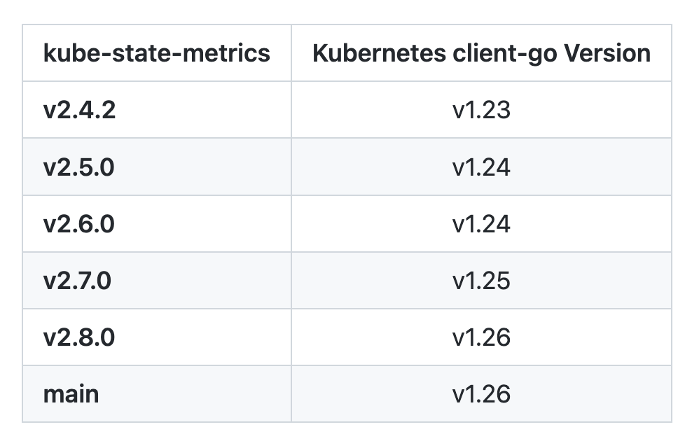
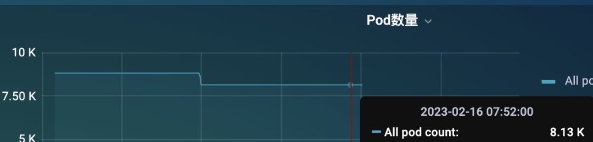
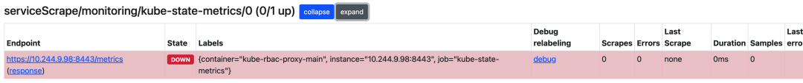
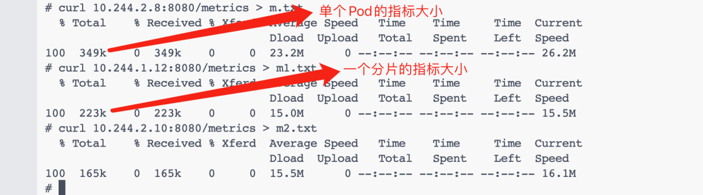

# **第十节 kube-state-metrics 在大规模集群下的优化(2023)**

当我们使用 Prometheus 来监控 Kubernetes 集群的时候，**kube-state-metrics（KSM）** 基本属于一个必备组件，它通过 Watch APIServer 来生成资源对象的状态指标，它并不会关注单个 Kubernetes 组件的健康状况，而是关注各种资源对象的健康状态，比如 Deployment、Node、Pod、Ingress、Job、Service 等等，每种资源对象中包含了需要指标，我们可以在官方文档 https://github.com/kubernetes/kube-state-metrics/tree/main/docs 处进行查看。

要安装 KSM 也非常简单，代码仓库中就包含了对应的资源清单文件，但是在安装的时候记得要和你的 K8s 集群版本对应




我这里的测试集群是 v1.25 版本的，所以我先切换到该分支：

```
$ git clone https://github.com/kubernetes/kube-state-metrics && cd kube-state-metrics
$ git checkout v2.7.0
$ kubectl apply -f examples/standard
```

该方式会以 Deployment 方式部署一个 KSM 实例：

```
$ kubectl get deploy -n kube-system kube-state-metrics
NAME                 READY   UP-TO-DATE   AVAILABLE   AGE
kube-state-metrics   1/1     1            1           2m49s
$ kubectl get pods -n kube-system -l app.kubernetes.io/name=kube-state-metrics
NAME                                  READY   STATUS    RESTARTS   AGE
kube-state-metrics-548546fc89-zgkx5   1/1     Running   0          2m51s
```

然后只需要让 Prometheus 来发现 KSM 实例就可以了，当然有很多方式，比如可以通过添加注解来自动发现，**也可以单独为 KSM 创建一个独立的 Job，如果使用的是 Prometheus Operator，也可以创建 ServiceMonitor 对象来获取 KSM 指标数据**。

这种方式对于小规模集群是没太大问题的，数据量不大，可以正常提供服务，只需要保证 KSM 高可用就可以在生产环境使用了。但是对于大规模的集群来说，就非常困难了，比如我们这里有一个 8K 左右 Pod 的集群，不算特别大。



但是只通过一个 KSM 实例来提供 metrics 指标还是非常吃力的，这个时候可能大部分情况下是获取不到指标的，因为 metrics 接口里面的数据量太大了。



即使偶尔获取到了，也需要话花很长时间，要知道我们会每隔 `scrape_interval `的时间都会去访问该指标接口的，可能前面一次请求还没结束，下一次请求又发起了，要解决这个问题就得从 KSM 端入手解决，在 KSM 的启动参数中我们可以配置过滤掉一些不需要的指标标签：

```
$ kube-state-metrics -h
kube-state-metrics is a simple service that listens to the Kubernetes API server and generates metrics about the state of the objects.

Usage:
  kube-state-metrics [flags]
  kube-state-metrics [command]

Available Commands:
  completion  Generate completion script for kube-state-metrics.
  help        Help about any command
  version     Print version information.

Flags:
      --add_dir_header                             If true, adds the file directory to the header of the log messages
      --alsologtostderr                            log to standard error as well as files (no effect when -logtostderr=true)
      --apiserver string                           The URL of the apiserver to use as a master
      --config string                              Path to the kube-state-metrics options config file
      --custom-resource-state-config string        Inline Custom Resource State Metrics config YAML (experimental)
      --custom-resource-state-config-file string   Path to a Custom Resource State Metrics config file (experimental)
      --custom-resource-state-only                 Only provide Custom Resource State metrics (experimental)
      --enable-gzip-encoding                       Gzip responses when requested by clients via 'Accept-Encoding: gzip' header.
  -h, --help                                       Print Help text
      --host string                                Host to expose metrics on. (default "::")
      --kubeconfig string                          Absolute path to the kubeconfig file
      --log_backtrace_at traceLocation             when logging hits line file:N, emit a stack trace (default :0)
      --log_dir string                             If non-empty, write log files in this directory (no effect when -logtostderr=true)
      --log_file string                            If non-empty, use this log file (no effect when -logtostderr=true)
      --log_file_max_size uint                     Defines the maximum size a log file can grow to (no effect when -logtostderr=true). Unit is megabytes. If the value is 0, the maximum file size is unlimited. (default 1800)
      --logtostderr                                log to standard error instead of files (default true)
      --metric-allowlist string                    Comma-separated list of metrics to be exposed. This list comprises of exact metric names and/or regex patterns. The allowlist and denylist are mutually exclusive.
      --metric-annotations-allowlist string        Comma-separated list of Kubernetes annotations keys that will be used in the resource' labels metric. By default the metric contains only name and namespace labels. To include additional annotations provide a list of resource names in their plural form and Kubernetes annotation keys you would like to allow for them (Example: '=namespaces=[kubernetes.io/team,...],pods=[kubernetes.io/team],...)'. A single '*' can be provided per resource instead to allow any annotations, but that has severe performance implications (Example: '=pods=[*]').
      --metric-denylist string                     Comma-separated list of metrics not to be enabled. This list comprises of exact metric names and/or regex patterns. The allowlist and denylist are mutually exclusive.
      --metric-labels-allowlist string             Comma-separated list of additional Kubernetes label keys that will be used in the resource' labels metric. By default the metric contains only name and namespace labels. To include additional labels provide a list of resource names in their plural form and Kubernetes label keys you would like to allow for them (Example: '=namespaces=[k8s-label-1,k8s-label-n,...],pods=[app],...)'. A single '*' can be provided per resource instead to allow any labels, but that has severe performance implications (Example: '=pods=[*]'). Additionally, an asterisk (*) can be provided as a key, which will resolve to all resources, i.e., assuming '--resources=deployments,pods', '=*=[*]' will resolve to '=deployments=[*],pods=[*]'.
      --metric-opt-in-list string                  Comma-separated list of metrics which are opt-in and not enabled by default. This is in addition to the metric allow- and denylists
      --namespaces string                          Comma-separated list of namespaces to be enabled. Defaults to ""
      --namespaces-denylist string                 Comma-separated list of namespaces not to be enabled. If namespaces and namespaces-denylist are both set, only namespaces that are excluded in namespaces-denylist will be used.
      --node string                                Name of the node that contains the kube-state-metrics pod. Most likely it should be passed via the downward API. This is used for daemonset sharding. Only available for resources (pod metrics) that support spec.nodeName fieldSelector. This is experimental.
      --one_output                                 If true, only write logs to their native severity level (vs also writing to each lower severity level; no effect when -logtostderr=true)
      --pod string                                 Name of the pod that contains the kube-state-metrics container. When set, it is expected that --pod and --pod-namespace are both set. Most likely this should be passed via the downward API. This is used for auto-detecting sharding. If set, this has preference over statically configured sharding. This is experimental, it may be removed without notice.
      --pod-namespace string                       Name of the namespace of the pod specified by --pod. When set, it is expected that --pod and --pod-namespace are both set. Most likely this should be passed via the downward API. This is used for auto-detecting sharding. If set, this has preference over statically configured sharding. This is experimental, it may be removed without notice.
      --port int                                   Port to expose metrics on. (default 8080)
      --resources string                           Comma-separated list of Resources to be enabled. Defaults to "certificatesigningrequests,configmaps,cronjobs,daemonsets,deployments,endpoints,horizontalpodautoscalers,ingresses,jobs,leases,limitranges,mutatingwebhookconfigurations,namespaces,networkpolicies,nodes,persistentvolumeclaims,persistentvolumes,poddisruptionbudgets,pods,replicasets,replicationcontrollers,resourcequotas,secrets,services,statefulsets,storageclasses,validatingwebhookconfigurations,volumeattachments"
      --shard int32                                The instances shard nominal (zero indexed) within the total number of shards. (default 0)
      --skip_headers                               If true, avoid header prefixes in the log messages
      --skip_log_headers                           If true, avoid headers when opening log files (no effect when -logtostderr=true)
      --stderrthreshold severity                   logs at or above this threshold go to stderr when writing to files and stderr (no effect when -logtostderr=true or -alsologtostderr=false) (default 2)
      --telemetry-host string                      Host to expose kube-state-metrics self metrics on. (default "::")
      --telemetry-port int                         Port to expose kube-state-metrics self metrics on. (default 8081)
      --tls-config string                          Path to the TLS configuration file
      --total-shards int                           The total number of shards. Sharding is disabled when total shards is set to 1. (default 1)
      --use-apiserver-cache                        Sets resourceVersion=0 for ListWatch requests, using cached resources from the apiserver instead of an etcd quorum read.
  -v, --v Level                                    number for the log level verbosity
      --vmodule moduleSpec                         comma-separated list of pattern=N settings for file-filtered logging

Use "kube-state-metrics [command] --help" for more information about a command.
```

可以通过 `--metric-allowlist` 或者 `--metric-denylist` 参数进行过滤。但是如果即使过滤了不需要的指标或标签后指标接口数据仍然非常大又该怎么办呢？

其实我们可以想象一下，无论怎么过滤，请求一次到达 metrics 接口后的数据量都是非常大的，这个时候是不是只能对指标数据进行拆分了，可以部署多个 KSM 实例，每个实例提供一部分接口数据，是不是就可以缓解压力了，这其实就是我们常说的水平分片。

为了水平分片 `kube-state-metrics`，它已经实现了一些自动分片功能，它是通过以下标志进行配置的：

* `--shard` (从 0 开始)
* `--total-shards`

分片是通过对 Kubernetes 对象的 UID 进行 MD5 哈希和对总分片数进行取模运算来完成的，每个分片决定是否由 `kube-state-metrics` 的相应实例处理对象。

**不过需要注意的是，`kube-state-metrics` 的所有实例，即使已经分片，也会处理所有对象的网络流量和资源消耗，而不仅仅是他们负责那部分对象，要优化这个问题，Kubernetes API 需要支持分片的 list/watch 功能**。


在最理想的情况下，每个分片的内存消耗将比未分片设置少 1/n。

通常，为了使 kube-state-metrics 能够迅速返回其指标给 Prometheus，需要进行内存和延迟优化。

减少 `kube-state-metrics` 和 `kube-apiserver `之间的延迟的一种方法是使用 `--use-apiserver-cache` 标志运行 `KSM`，除了减少延迟，这个选项还将导致减少对 etcd 的负载，所以我们也是建议启用该参数的

当然如果使用了分片模式，则最好对分片相关指标进行监控，以确保分片设置符合预期，可以用下面两个报警规则来进行报警：

```
- alert: KubeStateMetricsShardingMismatch
    annotations:
      description: kube-state-metrics pods are running with different --total-shards configuration, some Kubernetes objects may be exposed multiple times or not exposed at all.
      summary: kube-state-metrics sharding is misconfigured.
    expr: |
      stdvar (kube_state_metrics_total_shards{job="kube-state-metrics"}) != 0
    for: 15m
    labels:
      severity: critical
- alert: KubeStateMetricsShardsMissing
  annotations:
    description: kube-state-metrics shards are missing, some Kubernetes objects are not being exposed.
    summary: kube-state-metrics shards are missing.
  expr: |
    2^max(kube_state_metrics_total_shards{job="kube-state-metrics"}) - 1
      -
    sum( 2 ^ max by (shard_ordinal) (kube_state_metrics_shard_ordinal{job="kube-state-metrics"}) )
    != 0
  for: 15m
  labels:
    severity: critical
```

由于手动去配置分片可能会出现错误，所以 KSM 也提供了自动分片的功能，可以通过 StatefulSet 方式来部署多个副本的 KSM，自动分片允许每个分片在 StatefulSet 中部署时发现其实例位置，这对于自动配置分片非常有用。

**所以要启用自动分片，必须通过 `StatefulSet` 运行 `kube-state-metrics`，并通过 `--pod` 和 `--pod-namespace `标志将 pod 名称和命名空间传递给 `kube-state-metrics` 进程**，如下所示

```
apiVersion: apps/v1
kind: StatefulSet
metadata:
  name: kube-state-metrics
  namespace: kube-system
spec:
  replicas: 10
  selector:
    matchLabels:
      app.kubernetes.io/name: kube-state-metrics
  serviceName: kube-state-metrics
  template:
    metadata:
      labels:
        app.kubernetes.io/component: exporter
        app.kubernetes.io/name: kube-state-metrics
        app.kubernetes.io/version: 2.8.0
    spec:
      automountServiceAccountToken: true
      containers:
      - args:
        - --pod=$(POD_NAME)
        - --pod-namespace=$(POD_NAMESPACE)
        env:
        - name: POD_NAME
          valueFrom:
            fieldRef:
              fieldPath: metadata.name
        - name: POD_NAMESPACE
          valueFrom:
            fieldRef:
              fieldPath: metadata.namespace
        image: registry.k8s.io/kube-state-metrics/kube-state-metrics:v2.8.0
        # ......
```

**使用这种部署分片的方法，当你想要通过单个 Kubernetes 资源（在这种情况下为单个 StatefulSet）管理 KSM 分片时是很有用的，而不是每个分片都有一个 Deployment，这种优势在部署大量分片时尤为显着**。

当然使用自动分片的部署方式也是有缺点的，主要是来自于 StatefulSet 支持的滚动升级策略，当由 StatefulSet 管理时，一个一个地替换 pod，当 pod 先被终止后，然后再重新创建，这样的升级速度较慢，也可能会导致每个分片的短暂停机，如果在升级期间进行 Prometheus 抓取，则可能会错过 kube-state-metrics 导出的某些指标。

自动分片功能的示例清单在 `examples/autosharding` 目录中可以找到，可以直接通过下面的命令来部署：

```
$ kubectl apply -k examples/autosharding
```

上面的命令会以 StatefulSet 方式部署 2 个 KSM 实例：

```
$ kubectl get pods -n kube-system -l app.kubernetes.io/name=kube-state-metrics
NAME                   READY   STATUS             RESTARTS   AGE
kube-state-metrics-0   1/1     Running            0          70m
kube-state-metrics-1   1/1     Running            0          65m
```

可以随便查看一个 Pod 的日志：

```
$ kubectl logs -f kube-state-metrics-1 -nkube-system
I0216 05:53:23.151163       1 wrapper.go:78] Starting kube-state-metrics
I0216 05:53:23.154495       1 server.go:125] "Used default resources"
I0216 05:53:23.154923       1 types.go:184] "Using all namespaces"
I0216 05:53:23.155556       1 server.go:166] "Metric allow-denylisting" allowDenyStatus="Excluding the following lists that were on denylist: "
W0216 05:53:23.155792       1 client_config.go:617] Neither --kubeconfig nor --master was specified.  Using the inClusterConfig.  This might not work.
I0216 05:53:23.178553       1 server.go:311] "Tested communication with server"
I0216 05:53:23.241024       1 server.go:316] "Run with Kubernetes cluster version" major="1" minor="25" gitVersion="v1.25.3" gitTreeState="clean" gitCommit="434bfd82814af038ad94d62ebe59b133fcb50506" platform="linux/arm64"
I0216 05:53:23.241169       1 server.go:317] "Communication with server successful"
I0216 05:53:23.245132       1 server.go:263] "Started metrics server" metricsServerAddress="[::]:8080"
I0216 05:53:23.246148       1 metrics_handler.go:103] "Autosharding enabled with pod" pod="kube-system/kube-state-metrics-1"
I0216 05:53:23.246233       1 metrics_handler.go:104] "Auto detecting sharding settings"
I0216 05:53:23.246267       1 server.go:252] "Started kube-state-metrics self metrics server" telemetryAddress="[::]:8081"
I0216 05:53:23.253477       1 server.go:69] levelinfomsgListening onaddress[::]:8081
I0216 05:53:23.253477       1 server.go:69] levelinfomsgListening onaddress[::]:8080
I0216 05:53:23.253944       1 server.go:69] levelinfomsgTLS is disabled.http2falseaddress[::]:8080
I0216 05:53:23.254534       1 server.go:69] levelinfomsgTLS is disabled.http2falseaddress[::]:8081
I0216 05:53:23.297524       1 metrics_handler.go:80] "Configuring sharding of this instance to be shard index (zero-indexed) out of total shards" shard=1 totalShards=2
I0216 05:53:23.411710       1 builder.go:257] "Active resources" activeStoreNames="certificatesigningrequests,configmaps,cronjobs,daemonsets,deployments,endpoints,horizontalpodautoscalers,ingresses,jobs,leases,limitranges,mutatingwebhookconfigurations,namespaces,networkpolicies,nodes,persistentvolumeclaims,persistentvolumes,poddisruptionbudgets,pods,replicasets,replicationcontrollers,resourcequotas,secrets,services,statefulsets,storageclasses,validatingwebhookconfigurations,volumeattachments"
```

可以看到有类型 "Configuring sharding of this instance to be shard index (zero-indexed) out of total shards" shard=1 totalShards=2 这样的日志信息，表面自动分片成功了。

我们可以去分别获取下分片的指标数据大小，并和未分片之前的进行对比，可以看到分片后的指标明显减少了，如果单个实例的指标数据还是太大，则可以增加 StatefulSet 的副本数即可。



**此外我们还可以单独针对 pod 指标按照每个节点进行分片，只需要加上 `--node` 和 `--resource` 即可**，这个时候我们直接使用一个 DaemonSet 来创建 KSM 实例即可，如下所示：

```
apiVersion: apps/v1
kind: DaemonSet
spec:
  template:
    spec:
      containers:
      - image: registry.k8s.io/kube-state-metrics/kube-state-metrics:IMAGE_TAG
        name: kube-state-metrics
        args:
        - --resource=pods
        - --node=$(NODE_NAME)
        env:
        - name: NODE_NAME
          valueFrom:
            fieldRef:
              apiVersion: v1
              fieldPath: spec.nodeName
```

**对于其他的指标我们也可以使用 `--resource` 来单独指定部署，也可以继续使用分片的方式。**

总结来说就是对于大规模集群使用 `kube-state-metrics` 需要做很多优化：

* **过滤不需要的指标和标签**
* **通过分片降低 KSM 实例压力**
* **可以使用 DaemonSet 方式单独针对 pod 指标进行部署**