# **2023 云原生系统监控**

1. 理解监控系统的意义和分类
2. 理解 Prometheus 的架构
3. Prometheus 的指标类型
4. 深入理解 Prometheus 数据采集、数据存储和数据消费

## **监控系统**

**为什么监控，监控什么内容？**

* 对自己系统的运行状态了如指掌，有问题及时发现，而不让用户先发现我们系统不能使用。
* 我们也需要知道我们的服务运行情况。


**监控目的**

* 长期趋势分析：比如资源用量预测
* **对照分析**：比如两个版本的系统运行资源使用情况的差异
* **告警**：当系统出现或者即将出现故障时，监控系统需要迅速反应并通知管理员
* **故障分析与定位**：通过对不同监控监控以及历史数据的分析，能够找到并解决根源问题
* **数据可视化**：通过可视化仪表盘能够直接荻取系统的运行状态、资源使用情况、以及服务运行状态等直观的信息

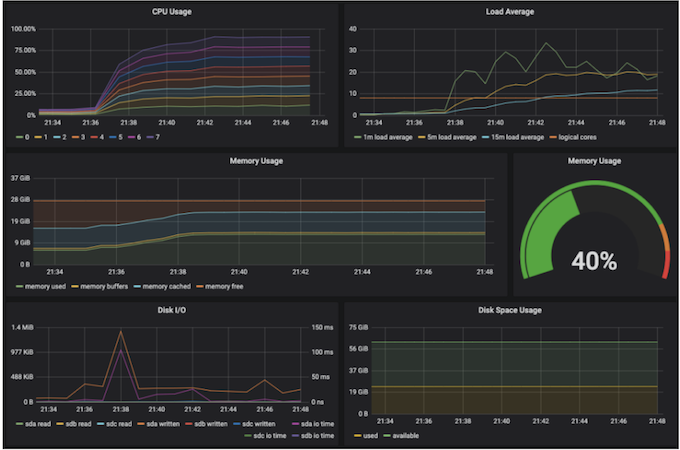

### **监控的分类**

**黑盒监控**
	
* **实现机制**
	* 从系统外部监控。
	* 对应用运行逻辑一无所知。
	* 基于 ping, http request 等检测手段，并等待检测结果．
* **应用场景**
	* 从系统外部观测整体可用性。
	* 无法获得系统内部的运行情况。
	* 测试结果通常是布尔型：成功或失败，无法全方位监控。


**白盒监控**

* **实现机制**
	* 通过侵入性代码采集系统指标（如cgroup） 和自定义业务指标（如 httpcode，并发request，用户行为信息等）
* **应用场景**
	* 黑盒监控的补充
	* 通过白盒能够了解其内部的实际运行状态，通过对监控指标的观察能够预判可能出现的问题，从而对潜在的不确定因素进行优化。
	* 监控指标丰富可扩展，可监控 CPU 利用率，也可以监控并发请求数量。

### **Prometheus 架构**

由前 Google 员工，受 Google 内部 Borgman 的启发，2012 年开始的开源项目，2018 年进入毕业状态。Prometheus: 先见之明

* **以指标名称和键值对唯一标识的基于时间序列的多维数据模型**
* **支持多维灵活查询的 PromQL**
* 与存储系统解耦
* **基于 HTTP协议的Pull模式进行时间序列指标采集**
* 中间网关支持 Push 模式
* **基于静态配置和或服务发现的目标发现机制**
* 灵活的图像化展示

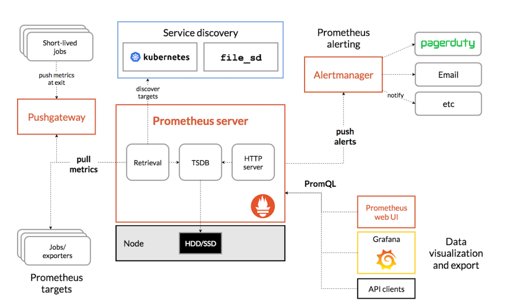

### Prometheus数据模型

* **指标名与标签（Metrics Name和Labels）**
	* 每个业务指标由指标名称和键值对标签唯一标识
* **采样点（Samples）**
	* **每次指标收集到的来样数据由两部分组成**
		* Timestamp
		* Value
* **指标表示方式**
	* OpenTSDB的标示方式
		* `<metric name>(<labelname>=<labelvalue>，...)`
	* 示例
		* `api_http_requests_total{method="POST", handler="/messages"}`

### Prometheus的指标类型

* **counter（计数器器）**
	* **Counter 类型代表一种样本数据单调递增的指标，即只增不减，除非
监控系统发生了重置**


* **Gauge (仪表盘)**
	* Gauge 类型代表一种样本数据可以任意变化的指标，**即可增可减**

* **Histogram (直方图)**
	* Histogram 在一段时间范围内对数据进行采样(通常是请求持续时间或响应大小等）并将其计入可配置的存储桶（bucket）中，**后续可通过指定区间筛选样本，也可以统计、样本总数，最后一般将数据展示为直方图**，
	* 样本的值分布在 bucket 中的数量，命名为`<basenames_bucket{le="<上边界>"}`。
	* 所有样木值的大小总和，命名为 `<basename>_sum`
	* 样本总数，命名为`<basename>_count`， 值和`<basename>_bucket{le="+lnf"}`相同。

* **Summary（摘要）**
	* 与Histogram 类型类似，用于表示一段时间内的数据采样结果(通常是请求持续时间或响应大小等），但它直接存储了分位数通过客户端计算，然后展示出来），而不是通过区间来计算。
	* **它们都包含了`<basename>_sum`和`<basename>_count`指标**。
	* Histogram需要通过`<basename>_bucket`来计算分位数，而
Summary则直接存储了分位数的值。

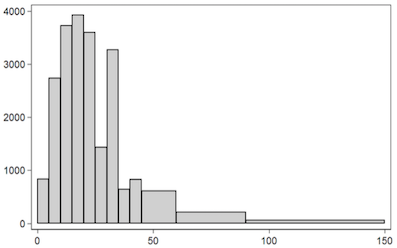

### Redis故障后限流、降级的应急预案

极少的空间来标识超大量的数据，所以一旦relis 出现了故障。数据库很快就会招架不住，很有可能就会宕机。 数据库宕机系统就会挂，

**两种解决方法： 一个是降级，一个是限流**。

* **降级**： 可以使用本地缓存，将缓存数据在这个jvm中，一旦redis故障查不到，就直接启用本地缓存，就不用走数据库。 那么请求过来， 就可以直接从这个本地缓存中拿数据，常见的本地缓存的像这个guava， ehcache， caffeine。 性能和稳定性能各方面都很优秀

* **限流**  **一般在网关层做一些限制**， 此如说这个qps是1万， 可以把这个流量控制在每秒1,000个。 那么其他的其他的一些请求就查接打回， 在源头上做好把关。然后在界面上做一些友好提示， 排队中请稍后再试，限流算法有很多，像令牌牌筒算法， 漏筒算法，还有滑动窗口算法。**目的就是为了通过这个限流算法， 来挡住这个流量洪峰， 避免直接去沖击数据库**

### 监控数据的采集 (Push or Pull)

|   | Push  | Pull |
|:------------- |:---------------:| -------------:|
| 代表应用     | InfluxDB  |        Prometheus  |
| 发起者     | 被监控方发起        |    监控系统发起（短时1ob 如何监控？） |
| 网络需求 |  目标地址固定，容易绕过防火墙     |  需要连接所有被监控方，通常需要与被监控房部署在一起 |
| 并发     | 由被监控系统上报数据，容易对监控系统造成较大并发压力，导致监控系统网络拥塞或者系统过载 |   可由监控系统轮训并顺序拉取，无并发问题 |
| 故障感知     | 若监控系统假死，被监控方无法感知，可能会继续推送数据导致雪崩    |  若系统超负荷，数据采集会变慢，雪崩几率较小 |
| 目标发现 | 被监控目标主动上报，无需进行目标发现   |    需要主动发现被监控目标 |

### 在Kubernetes 集群中的监控系统

每个节点的kubelet 会收集当前节点host上所有信息，包括 CPU、内存、磁盘等。Prometheus 会pull这些信息，给每个节点打上标签来区分不同的节点。

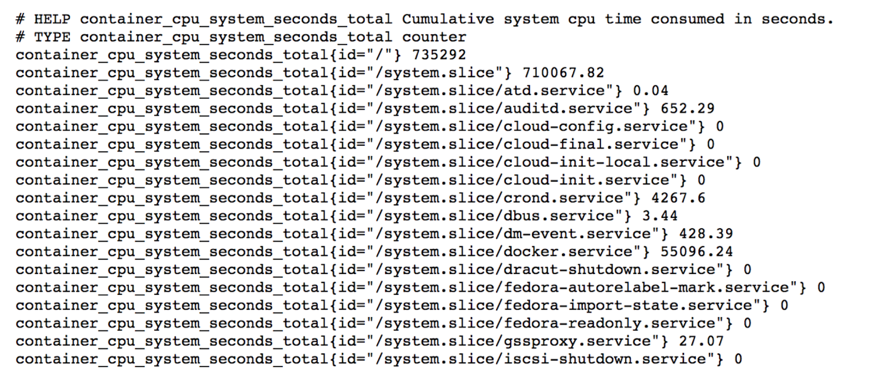

### 在 Kubernetes 中汇报指标

应用 Pod 需要声明上报指标端口和地址

```
apiVersion: v1
kind: Pod
metadata:
  annotations:
    prometheus.io/port: http-metrics
    prometheus.io/scrape: "true"
name: loki-0
  namespace: default
spec:
ports:
 - containerPort: 3100
   name: http-metrics
   protocol: TCP
```


**应用启动时， 需要注册metrics**

```
http.Handle(“/metrics”, promhttp.Handler()）
http.ListenAndserve(sever.MetricsBindAddress, nil）
```

**注册指标**

```
funcRegisterMetrics(){
	registerMetriconce.Do(func(){
		prometheus.MustRegister(APIServerRequests）
		prometheus.MustRegister(WorkQueueSize）
	})
}
```


**代码中输出指标**

```
metrics.AddAPIServerReguest(controllerName, constants.CoreAPIGroup, constants.SecretResource，constants.Get, cn.Namespace）
```

### 在Kubernetes 集群中的监控系统

**Kubernetes的控制平面组件，包括各种controller名都原生的暴露Prometheus格式的metrics。**

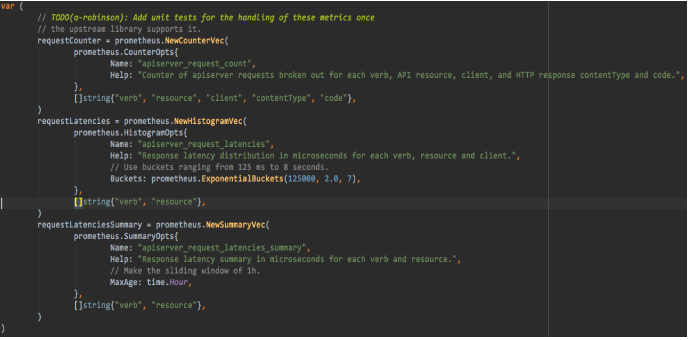

**数据的存储(TSDB）**

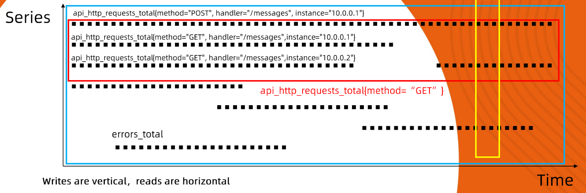

* **纵向写：每一次数据采集，会汇报周期内所有指标数据**
* 横向读：指标读取通常是按特定序列读取，**单条时间序列=Metrics Name ＋ 唯一的labels**。

**数据的存储机制**

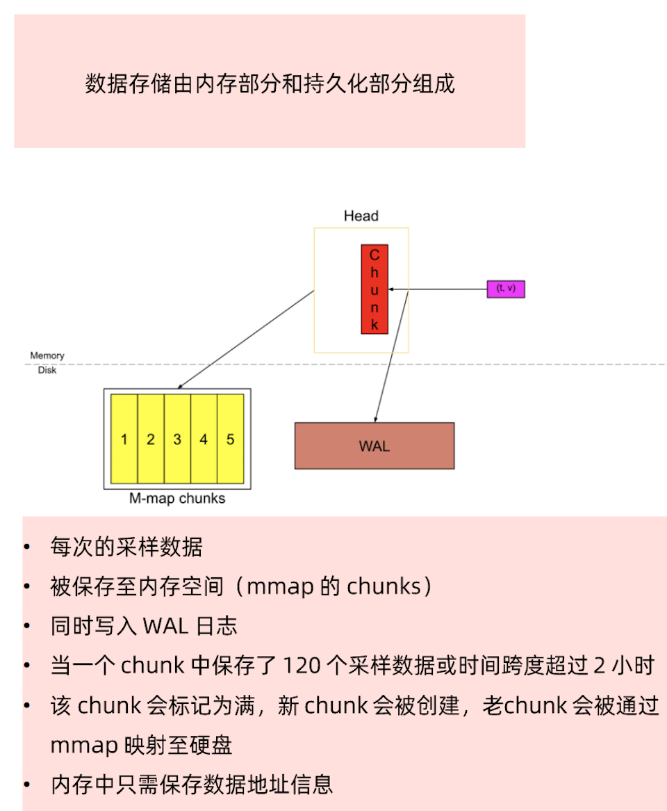

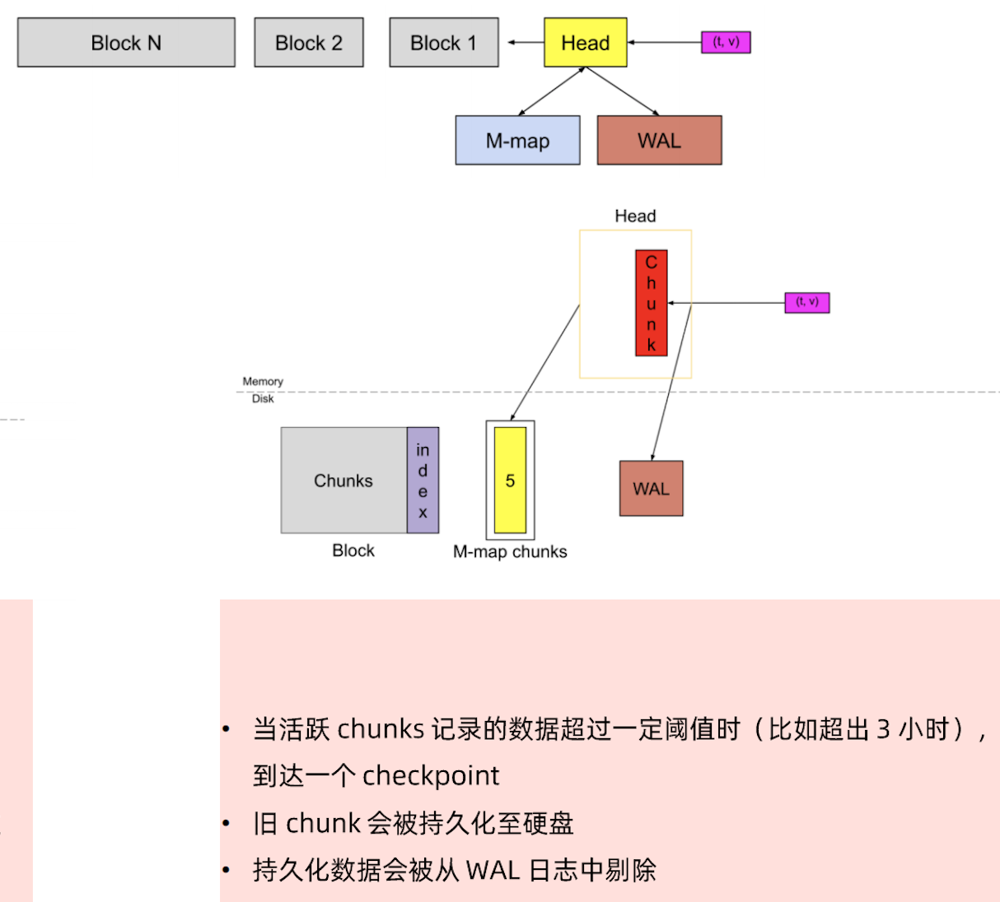

### 数据索引

* 每一个block中，每个时间序列都有一个唯一ID。
* 索引模块维护了一个键值Label到ID的映射关系
* 通过K路轮训完成时间序列的高效查询。

```
{
	__name__ = "request_total", 
	pod = "mynginx-0", 
	status = 200，
	method = "GET"
}
```

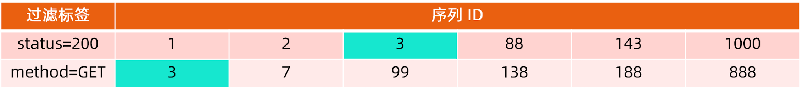

### **数据的压缩**

* Time 压缩

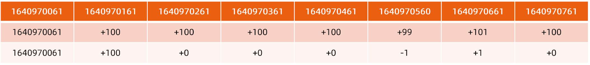

* Series 压缩

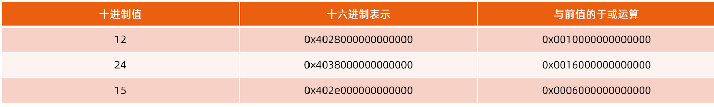

### **存储规划**

* **一个采样点**
	* 8字节时间戳+8字节值，总计16字节
	* 压缩后平均1.37字节/采样点，12倍空间节省！
* **500万个活跃时间序列**
	* 30秒采样间隔
	* 1个月历史保留
* **合计需要166000个采样数据/秒**
* **总计需要存储432Billion采样数据**
	* 每个采样点8字节时间截+8字节值，总计需要8T存储
	* 应用压缩算法后只需0.8TB存储空间

### **数据的查询与消费PromQL**

* `histogram_quantile(0.95, sum(rate(httpserver_execution_latency_seconds_bucket[5M])) by (le))`
* Histogram是直方图，`httpserver_execution_latency_seconds_bucket` 是直方图指标，是将 `httpserver` 处理请求的时间放入不同的桶内，其表达的是落在不同时长区间的响应次数。
* `by（le）` ，是将采集的数据按桶的上边界分组。
* `rate(httpserver_execution_latency_seconds_bucket[5m])`，计算的是五分钟内的变化率。
* `sum()`，是将所有指标的变化率总计。
* 0.95，是取95分位。

**综上：上述表达式计算的是`httpserver`处理请求时，`95%`的请求在五分钟内，在不同响应时间区间的处理的数量的变化情况。**

### **在 Kubernetes 集群中的监控系统**

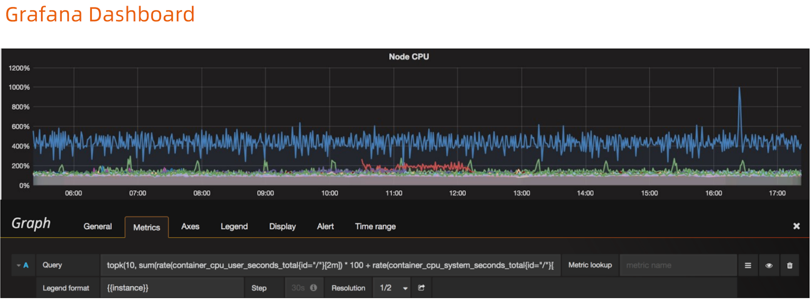

**开启告警**

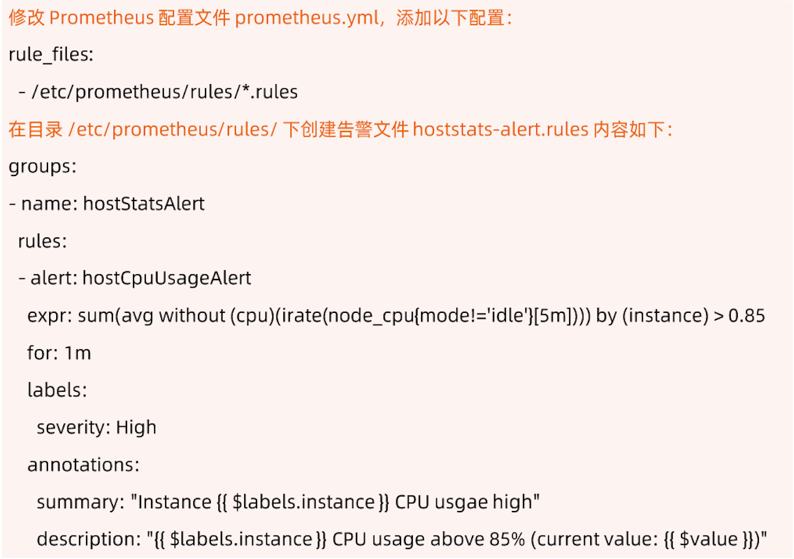

### **以 Thanos 应对规模化挑战**

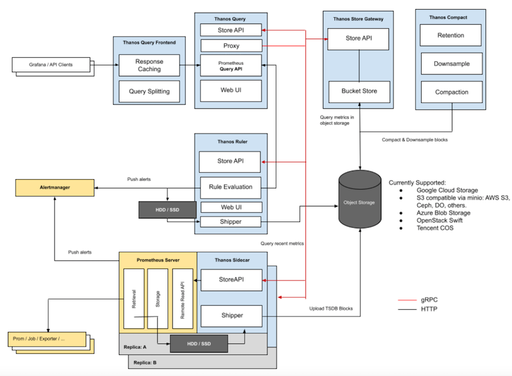
