# **第一节 Prometheus 系统介绍 2022**

## **1 简介**

Prometheus 是古希腊神话里泰坦族的一名神明，名字的意思是“先见之明”，下图中是 Prometheus 被宙斯惩罚，饱受肝脏日食夜长之苦。

其官网封面图引导语：From metrics to insight，从指标到洞察力，通过指标去洞察你的系统，为我们的系统提**供指标收集和监控的开源解决方案**。也就是说，Prometheus 是一个数据监控的解决方案，让我们能随时掌握系统运行的状态，快速定位问题和排除故障。


Prometheus 发展速度很快，12 年开发完成，16 年加入 CNCF，成为继 Kubernetes 之后第二个 CNCF 托管的项目，目前 GitHub 42k 的 🌟，而且社区很活跃，维护频率很高，基本稳定在 1 个月 1 个小版本的迭代速度。


## **2 整体生态**

Prometheus 提供了从**指标暴露，到指标抓取、存储和可视化**，以及最后的监控告警等一系列组件。

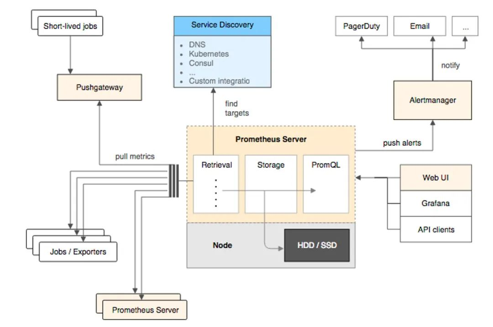

### **2-1 指标暴露**

**每一个被 Prometheus 监控的服务都是一个 Job，Prometheus 为这些 Job 提供了官方的 SDK ，利用这个 SDK 可以自定义并导出自己的业务指标**，也可以使用 Prometheus 官方提供的各种常用组件和中间件的 Exporter（比如常用的 MySQL，Consul 等等）。

对于短时间执行的脚本任务或者不好直接 Pull 指标的服务，**<mark>Prometheus 提供了 PushGateWay 网关给这些任务将服务指标主动推 Push 到网关，Prometheus 再从这个网关里 Pull 指标</mark>**。

### **2-2 指标抓取**

上面提到了 Push 和 Pull，其实这是两种指标抓取模型。

**<mark>Pull 模型：监控服务主动拉取被监控服务的指标。</mark>**


**被监控服务一般通过主动暴露 metrics 端口或者通过 Exporter 的方式暴露指标**，监控服务依赖服务发现模块发现被监控服务，从而去定期的抓取指标。

**<mark>Push 模型：被监控服务主动将指标推送到监控服务，可能需要对指标做协议适配，必须得符合监控服务要求的指标格式。</mark>**

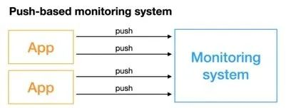

对于 Prometheus 中的指标抓取，采用的是 Pull 模型，**默认是一分钟去拉取一次指标**，

* **通过 Prometheus.yaml 配置文件中的 `scrape_interval` 配置项配置，Prometheus 对外都是用的 Pull 模型**
* **一个是 Pull Exporter 的暴露的指标，**
* **一个是 Pull PushGateway 暴露的指标。**

### **2-3 指标存储和查询**


指标抓取后会存储在内置的时序数据库中，Prometheus 也提供了 PromQL 查询语言给我们做指标的查询，我们可以在 Prometheus 的 WebUI 上通过 PromQL，可视化查询我们的指标，也可以很方便的接入第三方的可视化工具，例如 Grafana。


### **2-4 监控告警**

Prometheus 提供了 Alertmanageer 基于 PromQL 来做系统的监控告警，当 PromQL 查询出来的指标超过我们定义的阈值时，Prometheus 会发送一条告警信息到 Alertmanager，manager 会将告警下发到配置好的邮箱或者微信。


## **3 工作原理**

Prometheus 的从被监控服务的注册到指标抓取到指标查询的流程分为五个步骤：


### **3-1 服务注册**

被监控服务在 Prometheus 中是一个 Job 存在，被监控服务的所有实例在 Prometheus 中是一个 target 的存在，**<mark>所以被监控服务的注册就是在 Prometheus 中注册一个 Job 和其所有的 target</mark>**，这个注册分为：

* 静态注册
* 动态注册

静态注册：**静态的将服务的 IP 和抓取指标的端口号配置在 Prometheus yaml 文件的 `scrape_configs` 配置下**：

```
scrape_configs:
 - job_name: "prometheus"
   static_configs:
   - targets: ["localhost:9090"]
```
以上就是注册了一个名为 Prometheus 的服务，这个服务下有一个实例，暴露的抓取地址是 localhost:9090。

**动态注册**：动态注册就是在 Prometheus yaml 文件的 `scrape_configs` 配置下配置服务发现的地址和服务名，Prometheus 会去该地址，**根据你提供的服务名动态发现实例列表，在 Prometheus 中，支持 Consul、DNS、文件、Kubernetes 等多种服务发现机制**。

**基于 Consul 的服务发现：**

```
 - job_name: "node_export_consul"
  metrics_path: /node_metrics
  scheme: http
  consul_sd_configs:
   - server: localhost:8500
     services:
     - node_exporter
```

**`consul_sd_configs`**

我们 Consul 的地址就是：localhost:8500，服务名是 `node_exporter`，在这个服务下有一个 exporter 实例：localhost:9600。

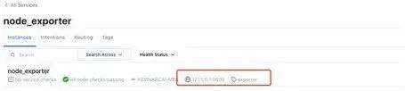

**<mark>注意：如果是动态注册，最好加上这两配置，静态注册指标拉取的路径会默认的帮我们指定为 `metrics_path:/metrics`，所以如果暴露的指标抓取路径不同或者是动态的服务注册，最好加上这两个配置。</mark>**

```
metrics_path: /node_metrics
scheme: http
```

不然会报错“INVALID is not a valid start token”，演示下，百度了一下，这里可能是数据格式不统一导致。

最后可以在 WebUI 中查看发现的实例：


目前，Prometheus 支持多达二十多种服务发现协议：

```
<azure_sd_config>
<consul_sd_config>
<digitalocean_sd_config>
<docker_sd_config>
<dockerswarm_sd_config>
<dns_sd_config>
<ec2_sd_config>
<openstack_sd_config>
<file_sd_config>
<gce_sd_config>
<hetzner_sd_config>
<http_sd_config>
<kubernetes_sd_config>
<kuma_sd_config>
<lightsail_sd_config>
<linode_sd_config>
<marathon_sd_config>
<nerve_sd_config>
<serverset_sd_config>
<triton_sd_config>
<eureka_sd_config>
<scaleway_sd_config>
<static_config>
```

### **3-2 配置更新**

在更新完 Prometheus 的配置文件后，我们需要更新我们的配置到程序内存里，这里的更新方式有两种，**第一种简单粗暴，就是重启 Prometheus，第二种是动态更新的方式**。


**<mark>如何实现动态的更新 Prometheus 配置</mark>**。

**第一步：首先要保证启动 Prometheus 的时候带上启动参数：`--web.enable-lifecycle`。**

```
prometheus --config.file=/usr/local/etc/prometheus.yml --web.enable-lifecycle
```

第二步：去更新我们的 Prometheus 配置。


第三步：更新完配置后，我们可以通过 Post 请求的方式，动态更新配置：

```
curl -v --request POST 'http://localhost:9090/-/reload'
```

原理：

Prometheus 在 Web 模块中，注册了一个 handler：

```
if o.EnableLifecycle {
  router.Post("/-/quit", h.quit)
  router.Put("/-/quit", h.quit)
  router.Post("/-/reload", h.reload) // reload配置
  router.Put("/-/reload", h.reload)
}
```

通过 `h.reload` 这个 handler 方法实现：这个 handler 就是往一个 channle 中发送一个信号：

```
func (h *Handler) reload(w http.ResponseWriter, r *http.Request) {
  rc := make(chan error)
  h.reloadCh <- rc  // 发送一个信号到channe了中
  if err := <-rc; err != nil {
   http.Error(w, fmt.Sprintf("failed to reload config: %s", err), http.StatusInternalServerError)
  }
}
```

在 main 函数中会去监听这个 channel，只要有监听到信号，就会做配置的 reload，重新将新配置加载到内存中：

 ```
 case rc := <-webHandler.Reload():
  if err := reloadConfig(cfg.configFile, cfg.enableExpandExternalLabels, cfg.tsdb.EnableExemplarStorage, logger, noStepSubqueryInterval, reloaders...); err != nil {
   level.Error(logger).Log("msg", "Error reloading config", "err", err)
   rc <- err
  } else {
   rc <- nil
  }
 ```

### **3-3 指标抓取和存储**

Prometheus 对指标的抓取采取主动 Pull 的方式，**即周期性的请求被监控服务暴露的 Metrics 接口或者是 PushGateway**，从而获取到 Metrics 指标，**默认时间是 15s 抓取一次**，配置项如下：

```
global:
 scrape_interval: 15s
```

抓取到的指标会被以时间序列的形式保存在内存中，并且定时刷到磁盘上，默**认是两个小时回刷一次**。并且为了防止 Prometheus 发生崩溃或重启时能够恢复数据，Prometheus 也提供了类似 **MySQL 中 binlog 一样的预写日志，当 Prometheus 崩溃重启时，会读这个预写日志来恢复数据**。

## **4 Metric 指标**

### **4-1 数据模型**


Prometheus 采集的所有指标都是以时间序列的形式进行存储，每一个时间序列有三部分组成：

* 指标名和指标标签集合：`metric_name{<label1=v1>,<label2=v2>....}`，指标名：表示这个指标是监控哪一方面的状态，比如 `http_request_total` 表示请求数量；
	* 指标标签：描述这个指标有哪些维度，比如 `http_request_total` 这个指标，有请求状态码 `code = 200/400/500`，请求方式 `method = get/post` 等，实际上指标名称实际上是以标签的形式保存，这个标签是 name，即：name=。
* 时间戳：描述当前时间序列的时间，单位：毫秒
* 样本值：当前监控指标的具体数值，比如 `http_request_total ` 的值就是请求数是多少。


所有的指标也都是通过如下所示的格式来标识的：

```
# HELP  // HELP：这里描述的指标的信息，表示这个是一个什么指标，统计什么的
# TYPE  // TYPE：这个指标是什么类型的
<metric name>{<label name>=<label value>, ...} value  // 指标的具体格式，<指标名>{标签集合} 指标值
```

### **4-2 指标类型**

**Prometheus 底层存储上其实并没有对指标做类型的区分，都是以时间序列的形式存储**，但是为了方便用户的使用和理解不同监控指标之间的差异，

`Prometheus` 定义了 4 种不同的指标类型：计数器 `counter`，仪表盘` gauge`，直方图 `histogram`，摘要 `summary`。

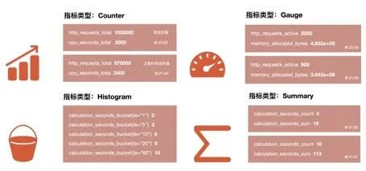

**Counter 计数器：**

Counter 类型和 Redis 的自增命令一样，**只增不减**，通过 Counter 指标可以统计 Http 请求数量，请求错误数，**接口调用次数等单调递增的数据**。**同时可以结合 increase 和 rate 等函数统计变化速率，后续我们会提到这些内置函数**。

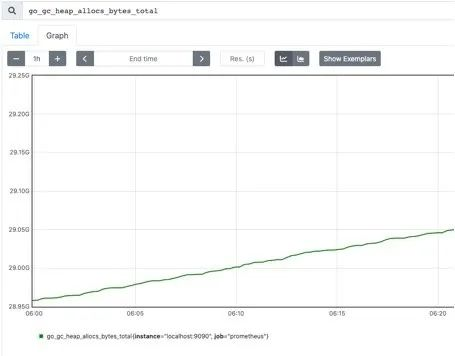


**Gauge 仪表盘：**

**和 Counter 不同，Gauge 是可增可减的，可以反映一些动态变化的数据，例如当前内存占用，CPU 利用**，Gc 次数等动态可上升可下降的数据，在 Prometheus 上通过 Gauge，可以不用经过内置函数直观的反映数据的变化情况，如下图表示堆可分配的空间大小：

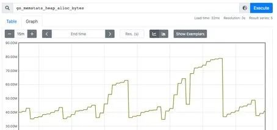

**Histogram 直方图：**

Histogram 是一种直方图类型，**可以观察到指标在各个不同的区间范围的分布情况**，如下图所示：可以观察到请求耗时在各个桶的分布。


有一点要注意的是，**Histogram 是累计直方图，即每一个桶的是只有上区间**，例如下图表示小于 0.1 毫秒（le="0.1"）的请求数量是 18173 个，小于 0.2 毫秒（le="0.2"）的请求是 18182 个，在 le="0.2" 这个桶中是包含了 le="0.1"这个桶的数据，如果我们要拿到 0.1 毫秒到 0.2 毫秒的请求数量，可以通过两个桶想减得到。

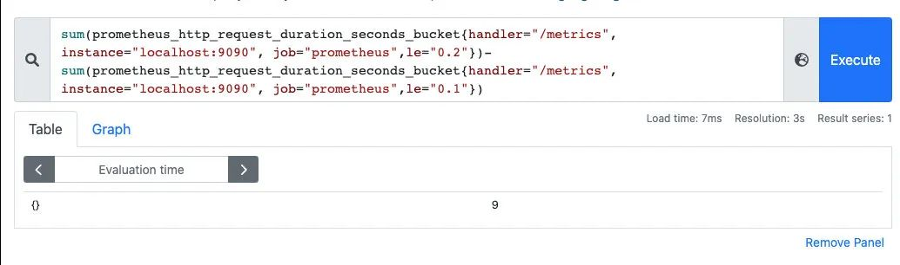

**在直方图中，还可以通过 `histogram_quantile` 函数求出百分位**数，比如 P50、P90、P99 等数据。

**Summary 摘要：**

Summary 也是用来做统计分析的，和 Histogram 区别在于，**Summary 直接存储的就是百分位数**，如下所示：可以直观的观察到样本的中位数，P90 和 P99。

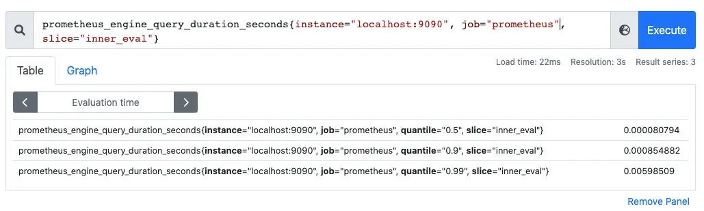

Summary 的百分位数是客户端计算好直接让 Prometheus 抓取的，不需要 Prometheus 计算，直方图是通过内置函数 `histogram_quantile` 在 Prometheus 服务端计算求出。

### **4-3 指标导出**

标导出有两种方式，**一种是使用 Prometheus 社区提供的定制好的 Exporter 对一些组件诸如 MySQL，Kafka 等的指标作导出，也可以利用社区提供的 Client 来自定义指标导出**。

```
github.com/prometheus/client_golang/prometheus/promhttp
```

自定义 Prometheus exporter：

```
package main
import (
  "net/http"
  "github.com/prometheus/client_golang/prometheus/promhttp"
)

func main() {
  http.Handle("/metrics", promhttp.Handler())
  http.ListenAndServe(":8080", nil)
}
```

访问：`http://localhost:8080/metrics`，即可看到导出的指标，这里我们没有自定义任何的指标，但是能看到一些内置的 Go 的运行时指标和 promhttp 相关的指标，这个 Client 默认为我们暴露的指标，`go_：` 以 go 为前缀的指标是关于 Go 运行时相关的指标，比如垃圾回收时间、goroutine 数量等，这些都是 Go 客户端库特有的，其他语言的客户端库可能会暴露各自语言的其他运行时指标。

**promhttp：来自 promhttp 工具包的相关指标，用于跟踪对指标请求的处理**。

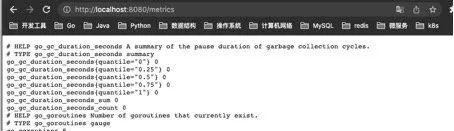

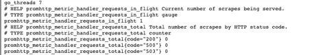

添加自定义指标：

```
package main
import (
  "net/http"

  "github.com/prometheus/client_golang/prometheus"
  "github.com/prometheus/client_golang/prometheus/promhttp"
)

func main() {

  // 1.定义指标（类型，名字，帮助信息）
  myCounter := prometheus.NewCounter(prometheus.CounterOpts{
   Name: "my_counter_total",
   Help: "自定义counter",
  })
  // 2.注册指标
  prometheus.MustRegister(myCounter)
  // 3.设置指标值
  myCounter.Add(23)

  http.Handle("/metrics", promhttp.Handler())
  http.ListenAndServe(":8080", nil)

}
```

运行：


模拟下在业务中上报接口请求量：

```
package main

import (
  "fmt"
  "net/http"
  "github.com/prometheus/client_golang/prometheus"
)

var (
  MyCounter prometheus.Counter
)


// init 注册指标
func init() {
  // 1.定义指标（类型，名字，帮助信息）
  MyCounter = prometheus.NewCounter(prometheus.CounterOpts{
   Name: "my_counter_total",
   Help: "自定义counter",
  })

  // 2.注册指标
  prometheus.MustRegister(MyCounter)
}

// Sayhello
func Sayhello(w http.ResponseWriter, r *http.Request) {
  // 接口请求量递增
  MyCounter.Inc()
  fmt.Fprintf(w, "Hello World!")
}
```
main.go：

```
package main
import (
  "net/http"
  "github.com/prometheus/client_golang/prometheus/promhttp"
)
func main() {
  http.Handle("/metrics", promhttp.Handler())
  http.HandleFunc("/counter",Sayhello)
  http.ListenAndServe(":8080", nil)
}
```

一开始启动时，指标 counter 是 0：

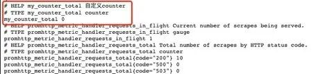

调用：/counter 接口后，指标数据发生了变化，这样就可以简单实现了接口请求数的统计：


对于其他指标定义方式是一样的：

```
var (
  MyCounter prometheus.Counter
  MyGauge prometheus.Gauge
  MyHistogram prometheus.Histogram
  MySummary prometheus.Summary

)

// init 注册指标
func init() {
  // 1.定义指标（类型，名字，帮助信息）
  MyCounter = prometheus.NewCounter(prometheus.CounterOpts{
   Name: "my_counter_total",
   Help: "自定义counter",
  })

  // 定义gauge类型指标
  MyGauge = prometheus.NewGauge(prometheus.GaugeOpts{
   Name: "my_gauge_num",
   Help: "自定义gauge",

  })

  // 定义histogram
  MyHistogram = prometheus.NewHistogram(prometheus.HistogramOpts{
   Name: "my_histogram_bucket",
   Help: "自定义histogram",
   Buckets: []float64{0.1,0.2,0.3,0.4,0.5},  // 需要指定桶

  })

  // 定义Summary
  MySummary = prometheus.NewSummary(prometheus.SummaryOpts{
   Name: "my_summary_bucket",
   Help: "自定义summary",
   // 这部分可以算好后在set
   Objectives: map[float64]float64{
     0.5: 0.05,
     0.9: 0.01,
     0.99: 0.001,
   },
  })

  // 2.注册指标
  prometheus.MustRegister(MyCounter)
  prometheus.MustRegister(MyGauge)
  prometheus.MustRegister(MyHistogram)
  prometheus.MustRegister(MySummary)
}
```


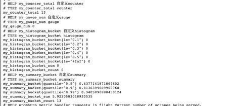

上面的指标都是没有设置标签的，我们一般的指标都是带有标签的，如何设置指标的标签呢？

如果我要设置带标签的 counter 类型指标，只需要将原来的 NewCounter 方法替换为 NewCounterVec 方法即可，并且传入标签集合。

```
MyCounter *prometheus.CounterVec
// 1.定义指标（类型，名字，帮助信息）
MyCounter = prometheus.NewCounterVec(
  prometheus.CounterOpts{
  Name: "my_counter_total",
  Help: "自定义counter",
  },
  // 标签集合
  []string{"label1","label2"},
)
// 带标签的set指标值
MyCounter.With(prometheus.Labels{"label1":"1","label2":"2"}).Inc()
```

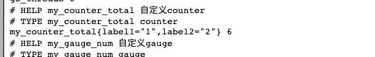

## **5 PromQL**

刚刚提到了 Prometheus 中指标有哪些类型以及如何导出我们的指标，现在指标导出到 Prometheus 了，利用其提供的 PromQL 可以查询我们导出的指标。

PromQL 是 Prometheus 为我们提供的函数式的查询语言，查询表达式有四种类型：

* 字符串：只作为某些内置函数的参数出现
* 标量：单一的数字值，可以是函数参数，也可以是函数的返回结果
* **瞬时向量：某一时刻的时序数据**
* **区间向量：某一时间区间内的时序数据集合**

### **5-1 瞬时查询**

直接通过指标名即可进行查询，查询结果是当前指标最新的时间序列，比如查询 Gc 累积消耗的时间：

```
go_gc_duration_seconds_count
```

**我们可以看到查询出来有多个同名指标结果，可以用`{}`做标签过滤查询：比如我们想查指定实例的指标**。


```
go_gc_duration_seconds_count{instance="127.0.0.1:9600"}
```

而且也支持则表达式，通过 `=~ `指定正则表达式，如下所示：查询所有 instance 是 localhost 开头的指标。

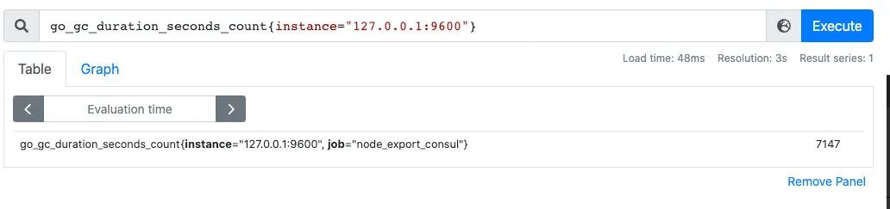

```
go_gc_duration_seconds_count{instance=~"localhost.*"}
```

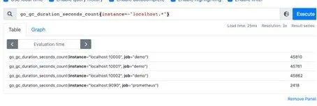

### **5-2 范围查询**

**范围查询的结果集就是区间向量，可以通过`[]`指定时间来做范围查询**，查询 5 分钟内的 Gc 累积消耗时间：

```
go_gc_duration_seconds_count{}[5m]
```

注意：这里范围查询第一个点并不一定精确到刚刚好 5 分钟前的那个时序样本点，他是以 5 分钟作为一个区间，寻找这个区间的第一个点到最后一个样本点。


时间单位：

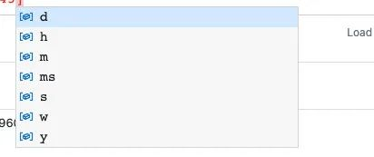

d：天，h：小时，m：分钟，ms：毫秒，s：秒，w：周，y：年

同样支持类似 SQL 中的 offset 查询，如下：查询一天前当前 5 分钟前的时序数据集：

```
go_gc_duration_seconds_count{}[5m] offset 1d
```

### **5-3 内置函数**

Prometheus 内置了很多函数，这里主要记录下常用的几个函数的使用：

**rate 和 irate 函数**

rate 函数可以用来求指标的平均变化速率：`rate函数=时间区间前后两个点的差 / 时间范围`。

一般 rate 函数可以用来求某个时间区间内的请求速率，也就是我们常说的 QPS：


**但是 rate 函数只是算出来了某个时间区间内的平均速率，没办法反映突发变化，假设在一分钟的时间区间里，前 50 秒的请求量都是 0 到 10 左右，但是最后 10 秒的请求量暴增到 100 以上，这时候算出来的值可能无法很好的反映这个峰值变化**。

**<mark>这个问题可以通过 irate 函数解决，irate 函数求出来的就是瞬时变化率。</mark>**

时间区间内最后两个样本点的差 / 最后两个样本点的时间差。


可以通过图像看下两者的区别：**irate 函数的图像峰值变化大，rate 函数变化较为平缓。**

**rate 函数：**

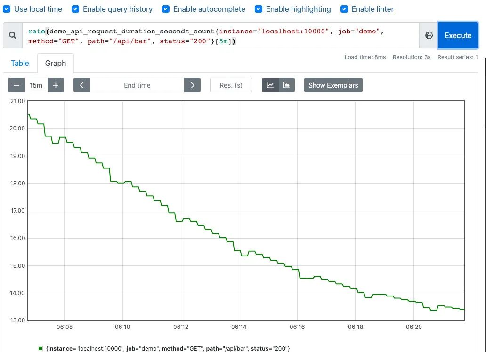

**irate 函数：**


**聚合函数：`Sum() by() without()`**

也是上边的例子，我们在求指定接口的 QPS 的时候，可能会出现多个实例的 QPS 的计算结果，如下是存在多个接口，三个服务的 QPS。

```
rate(demo_api_request_duration_seconds_count{job="demo", method="GET", status="200"}[5m])
```

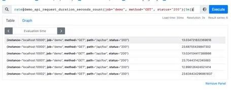


利用 Sum 函数可以将三个 QPS 聚合，即可得到整个服务该接口的 QPS：**其实 Sum 就是将指标值做相加**。

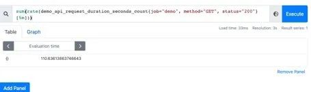


但是这样直接的相加太笼统抽象了，可以配合 by 和 without 函数在 sum 的时候，基于某些标签分组，类似 SQL 中的 group by。

例如，我可以根据请求接口标签分组：这样拿到的就是具体接口的 QPS：

```
sum(rate(demo_api_request_duration_seconds_count{job="demo", method="GET", status="200"}[5m])) by(path)
```


**也可以不根据接口路径分组：通过 without 指定**：

```
sum(rate(demo_api_request_duration_seconds_count{job="demo", method="GET", status="200"}[5m])) without(path)
```


可以通过 `histogram_quantile` 函数做数据统计：**可以用来统计百分位数：第一个参数是百分位，第二个 histogram 指标，这样计算出来的就是中位数，即 P50**。

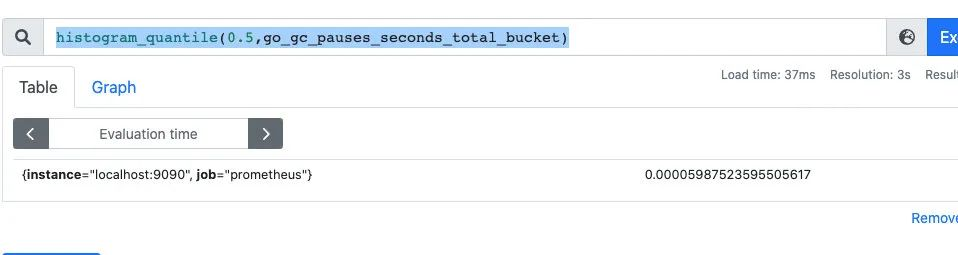

在刚刚写的自定义 exporter 上新增几个 histogram 的样本点：

```
MyHistogram.Observe(0.3)
MyHistogram.Observe(0.4)
MyHistogram.Observe(0.5)
```

自定义桶：

```
// 定义histogram
MyHistogram = prometheus.NewHistogram(prometheus.HistogramOpts{
  Name: "my_histogram_bucket",
  Help: "自定义histogram",
  Buckets: []float64{0.1,0.2,0.3,0.4,0.5},  // 需要指定桶
})
```

上报数据：

```
MyHistogram.Observe(0.1)
MyHistogram.Observe(0.3)
MyHistogram.Observe(0.4)
```


重新计算 P50，P99：

```
histogram_quantile(0.5,my_histogram_bucket_bucket)
```

```
histogram_quantile(0.99,my_histogram_bucket_bucket)
```

桶设置的越合理，计算的误差越小。

## **6 Grafana 可视化**

除了可以利用 Prometheus 提供的 webUI 可视化我们的指标外，还可以接入 Grafana 来做指标的可视化。

* 第一步，对接数据源： 配置好 prometheus 的地址
* 第二步，创建仪表盘：
	* 编辑仪表盘
	* 在 Metrics 处编写 PromQL 即可完成查询和可视化
	* 仪表盘编辑完后，可以导出对应的 json 文件，方便下次导入同样的仪表盘：


## **7 监控告警**

AlertManager 是 Prometheus 提供的告警信息下发组件，包含了对告警信息的分组，下发，静默等策略。配置完成后可以在 WebUI 上看到对应的告警策略信息。告警规则也是基于 PromQL 进行定制的。

编写告警配置：**当 `Http_srv` 这个服务挂了，Prometheus 采集不到指标，并且持续时间 1 分钟，就会触发告警**。

```
groups:
\- name: simulator-alert-rule
 rules:
 \- alert: HttpSimulatorDown
  expr: sum(up{job="http_srv"}) == 0
  for: 1m
  labels:
   severity: critical
```

在 `prometheus.yml` 中配置告警配置文件，需要配置上 Alertmanager 的地址和告警文件的地址。

```
\# Alertmanager configuration
alerting:
 alertmanagers:
 \- static_configs:
  \- targets: ['localhost:9093']
\# Load rules once and periodically evaluate them according to the global 'evaluation_interval'.
rule_files:
  \- "alert_rules.yml"
  \#- "first_rules.yml"
```

配置告警信息，例如告警发送地址，告警内容模版，分组策略等都在 Alertmanager 的配置文件中配置：

```
global:
 smtp_smarthost: 'smtp.qq.com:465'
 smtp_from: 'xxxx@qq.com'
 smtp_auth_username: 'xxxx@qq.com'
 smtp_auth_password: 'xxxx'
 smtp_require_tls: false

route:
 group_interval: 1m
 repeat_interval: 1m
 receiver: 'mail-receiver'


# group_by       //采用哪个标签作为分组
# group_wait      //分组等待的时间，收到报警不是立马发送出去，而是等待一段时间，看看同一组中是否有其他报警，如果有一并发送
# group_interval    //告警时间间隔
# repeat_interval   //重复告警时间间隔，可以减少发送告警的频率
# receiver       //接收者是谁
# routes        //子路由配置

receivers:
\- name: 'mail-receiver'
 email_configs:
  \- to: 'xxxx@qq.com'
```

当我 kill 进程：


Prometheus 已经触发告警：

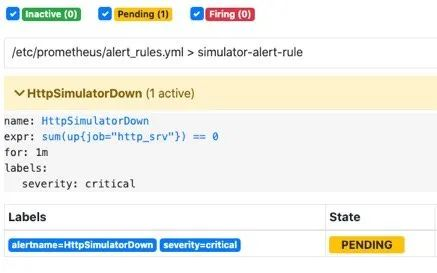

在等待 1 分钟，如果持续还是符合告警策略，则状态为从 pending 变为 FIRING 会发送邮件到我的邮箱。

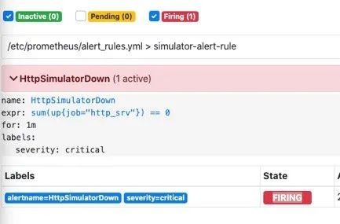

此时我的邮箱收到了一条告警消息：


Alertmanager 也支持对告警进行静默，在 Alertmanager 的 WebUI 中配置即可：


间隔了 4 分钟，没有收到告警，静默生效：


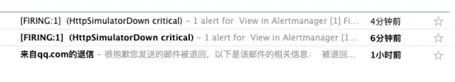

一个小时没有收到告警信息：

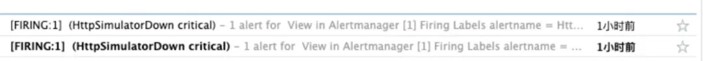