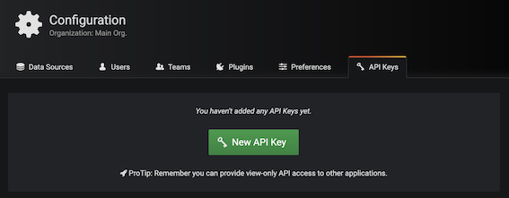
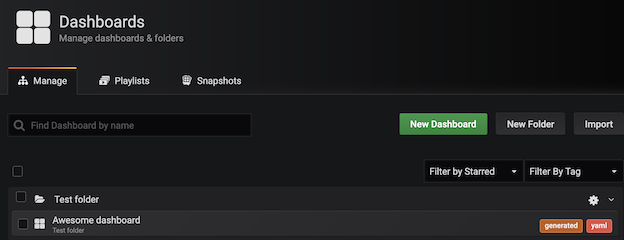
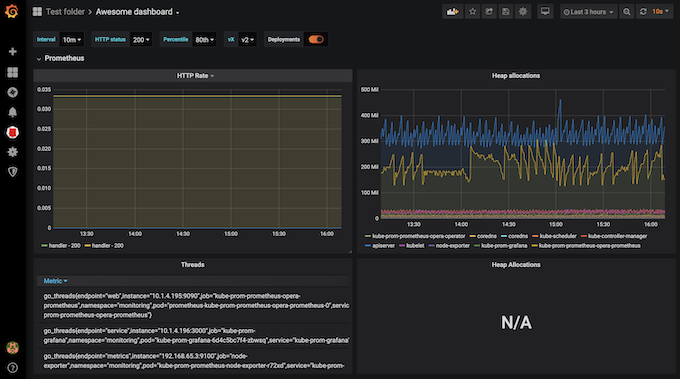

# **3 用 Kubernetes darks资源对象创建Grafana Dashboard**

我们在使用 `Grafana Dashboard` 来展示我们的监控图表的时候，很多时候我们都是去找别人已经做好的 `Dashboard` 拿过来改一改，但是这样也造成了很多使用 `Grafana` 的人员压根不知道如何去自定义一个 `Dashboard`，虽然这并不是很困难。这里我们介绍一个比较新颖（骚）的工具：[DARK](https://github.com/K-Phoen/dark)，**全称 `Dashboards As Resources in Kubernetes`.，意思就是通过 `Kubernetes` 的资源对象来定义 `Grafana Dashboard`，实现原理也很简单，也就是通过 `CRD` 来定义 `Dashboard`，然后通过和 `Grafana` 的 `API Token` 进行交互实现 `Dashboard` 的 `CRUD`**。

下面我们来看下如何使用 `DARK` 定义 `Grafana Dashboard`。首先 `Clone `项目代码：

```
$ git clone https://github.com/K-Phoen/dark.git
```

然后安装 CRD 资源：

```
$ kubectl apply -f k8s/crd.yaml
customresourcedefinition.apiextensions.k8s.io/grafanadashboards.k8s.kevingomez.fr created
```
然后通过 `Secre`t 对象创建 `Grafana` 的 `API KEYS`，在 `Grafana` 主界面中，选择左侧的**配置菜单 -> `API Keys` 创建 `API Keys`**，选择 **`Editor` 的角色**




```
kubectl port-forward svc/kube-prom-grafana -n monitoring 3000:80
```
创建完成后会弹出一个对话框显示对应的 `API Keys`，使用这个 `KEY` 来创建一个对应的` Secret` 对象：

```
$ kubectl create secret generic dark-tokens --from-literal=grafana=<替换成APIKEY>
```

```
kubectl create secret generic dark-tokens --from-literal=grafana=eyJrIjoiNDR4S0swU1dTNHNlS3pnMTZaUDh3OG54cXhJTGFxQ1QiLCJuIjoiZGFyay10b2tlbiIsImlkIjoxfQ==

secret/dark-tokens created
```

然后修改 `k8s/cluster-role.yaml`文件，如下所示：

```
apiVersion: v1
kind: ServiceAccount
metadata:
  name: dark
---
kind: ClusterRole
apiVersion: rbac.authorization.k8s.io/v1
metadata:
  name: dashboards-viewer
rules:
- apiGroups: ["k8s.kevingomez.fr"]
  resources: ["grafanadashboards"]
  verbs: ["get", "watch", "list"]
- apiGroups: [""]
  resources: ["events"]
  verbs: ["create", "patch"]
---
apiVersion: rbac.authorization.k8s.io/v1
kind: ClusterRoleBinding
metadata:
  name: dashboards-viewer-cluster
subjects:
  - kind: ServiceAccount
    name: dark
    namespace: default
roleRef:
  kind: ClusterRole
  name: dashboards-viewer
  apiGroup: rbac.authorization.k8s.io
```
```
$ kubectl apply -f cluster-role.yaml 
serviceaccount/dark created
clusterrole.rbac.authorization.k8s.io/dashboards-viewer created
clusterrolebinding.rbac.authorization.k8s.io/dashboards-viewer-cluster created
```

修改 `k8s/deployment.yaml `文件，将 `GRAFANA_HOST` 环境变量修改成自己的 `Grafana` 的地址，由于我这里 `Grafana` 也安装在 `Kubernetes` 集群中的，所以直接用 `DNS` 形式配置，然后加上上面创建的 `dark` 这个 `ServiceAccount`：

```
apiVersion: apps/v1
kind: Deployment
metadata:
  name: dark
  labels:
    app: dark
spec:
  replicas: 1
  selector:
    matchLabels:
      app: dark
  template:
    metadata:
      labels:
        app: dark
    spec:
      serviceAccountName: dark
      containers:
        - name: dark
          image: kphoen/dark:latest
          env:
            - name: GRAFANA_HOST
              value: http://kube-prom-grafana.monitoring:80
            - name: GRAFANA_TOKEN
              valueFrom:
                secretKeyRef:
                  key: grafana
                  name: dark-tokens
      volumes:
        - name: dark-tokens
          secret:
            secretName: dark-tokens
```

修改完成后直接创建上面的 Controller：

```
$ kubectl apply -f deployment.yaml 
deployment.apps/dark created
$ kubectl get pod -l app=dark
NAME                   READY   STATUS    RESTARTS   AGE
dark-849776f75-zz67c   1/1     Running   0          2m39s
```

现在 Controller 定义好过后，实际上我们就可以去通过 `CRD` 对象来定义 `Grafana Dashboard` 了，如下所示定义了一个 `GrafanaDashboard` 对象，在对象中我们完全就可以根据自己的需求去定义内容了，比如定义 `annotations`、`variables`、`graph`、`table` 都可以，当然最重要的还是数据源要正确，以及查询语句：（`example-dashboards.yaml`）
 
```
apiVersion: k8s.kevingomez.fr/v1
kind: GrafanaDashboard
metadata:
  name: example-dashboard
folder: "Test folder"
spec:
  title: Awesome dashboard
  editable: true
  shared_crosshair: true
  tags: [generated, yaml]
  auto_refresh: 10s
  tags_annotations:
    - name: Deployments
      datasource: "Prometheus"
      color: "#5794F2"
      tags: ["deploy", "production"]
  variables:
    - interval:
        name: interval
        label: Interval
        values: ["30s", "1m", "5m", "10m", "30m", "1h", "6h", "12h"]
    - query:
        name: status
        label: HTTP status
        datasource: Prometheus
        request: "label_values(prometheus_http_requests_total, code)"
    - const:
        name: percentile
        label: Percentile
        default: 80
        values_map:
          50th: "50"
          75th: "75"
          80th: "80"
          85th: "85"
          90th: "90"
          95th: "95"
          99th: "99"
    - custom:
        name: vX
        default: v2
        values_map:
          v1: v1
          v2: v2
  rows:
    - name: Prometheus
      panels:
        - graph:
            title: HTTP Rate
            height: 400px
            datasource: Prometheus
            targets:
              - prometheus:
                  query: "rate(promhttp_metric_handler_requests_total[$interval])"
                  legend: "{{handler}} - {{ code }}"
        - graph:
            title: Heap allocations
            height: 400px
            datasource: Prometheus
            targets:
              - prometheus:
                  query: "go_memstats_heap_alloc_bytes"
                  legend: "{{job}}"
                  ref: A
        - table:
            title: Threads
            datasource: Prometheus
            targets:
              - prometheus:
                  query: "go_threads"
            hidden_columns: ["Time"]
            time_series_aggregations:
              - label: AVG
                type: avg
              - label: Current
                type: current
        - single_stat:
            title: Heap Allocations
            datasource: Prometheus
            targets:
              - prometheus:
                  query: 'go_memstats_heap_alloc_bytes{job="prometheus"}'
            unit: bytes
            thresholds: ["26000000", "28000000"]
            color: ["value"]
    - name: "Some text, because it might be useful"
      panels:
        - text:
            title: Some awesome text?
            markdown: "Markdown syntax help: [commonmark.org/help](https://commonmark.org/help/)\n${percentile}"
        - text:
            title: Some awesome html?
            html: "Some <b>awesome</b> html?"
```

同样直接创建上面的示例文件：

```
$ kubectl apply -f example-dashboards.yaml
grafanadashboard.k8s.kevingomez.fr/example-dashboard created

$ kubectl get dashboards
NAME                AGE
example-dashboard   10s
```

```
$ kubectl logs dark-57c5c58bf8-llxqj 
W0327 07:58:12.389816       1 client_config.go:543] Neither --kubeconfig nor --master was specified.  Using the inClusterConfig.  This might not work.
I0327 07:58:12.390943       1 controller.go:87] Setting up event handlers
I0327 07:58:12.391669       1 controller.go:118] Starting dark-controller
I0327 07:58:12.391702       1 controller.go:121] Waiting for informer caches to sync
I0327 07:58:12.492291       1 controller.go:126] Starting workers
I0327 07:58:12.492380       1 controller.go:132] Started workers
I0327 07:58:12.657649       1 controller.go:197] Successfully synced 'default/example-dashboard'
I0327 07:58:12.658620       1 event.go:278] Event(v1.ObjectReference{Kind:"GrafanaDashboard", Namespace:"default", Name:"example-dashboard", UID:"5fd1337c-1ebb-41c6-b226-eaa500862073", APIVersion:"k8s.kevingomez.fr/v1", ResourceVersion:"1221348", FieldPath:""}): type: 'Normal' reason: 'Synced' GrafanaDashboard synced successfully
```

在 `Controller` 中也可以看到对应的日志信息，资源对象创建成功以后，现在去 `Grafana `页面上查看可以看到已经新增了一个 `Test folder` 的文件夹以及 `Awesome dashboard`：



查看 Dashboard 就可以看到和上面 CRD 中定义的各种图表信息了：



这样我们就使用 Kubernetes 资源对象去定义了 `Grafana Dashboard` 了，这种方式比直接在页面上去手动配置显然要更优雅，也符合 `everything as code `的思想