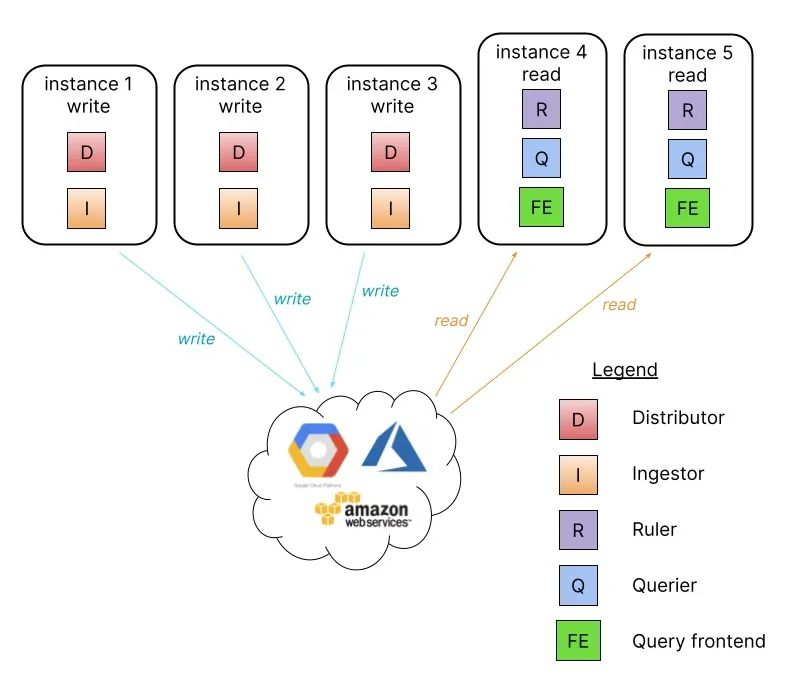
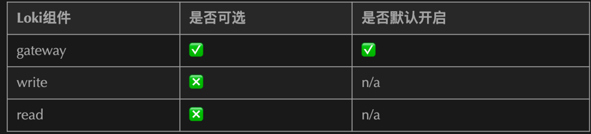
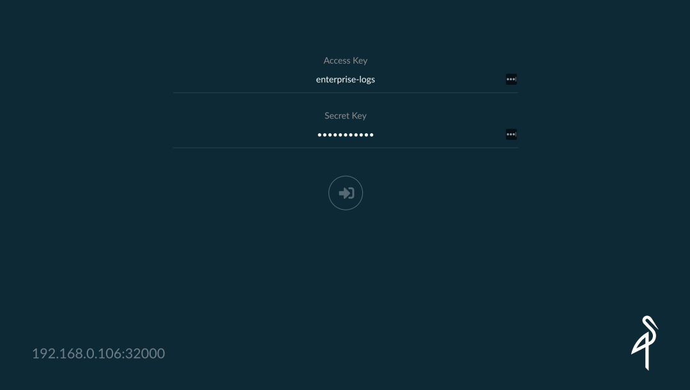
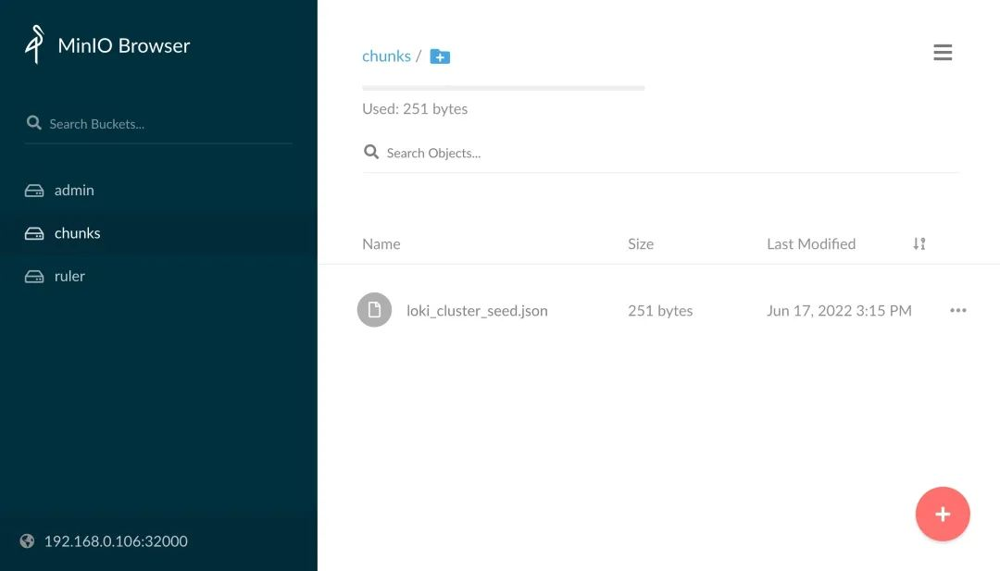
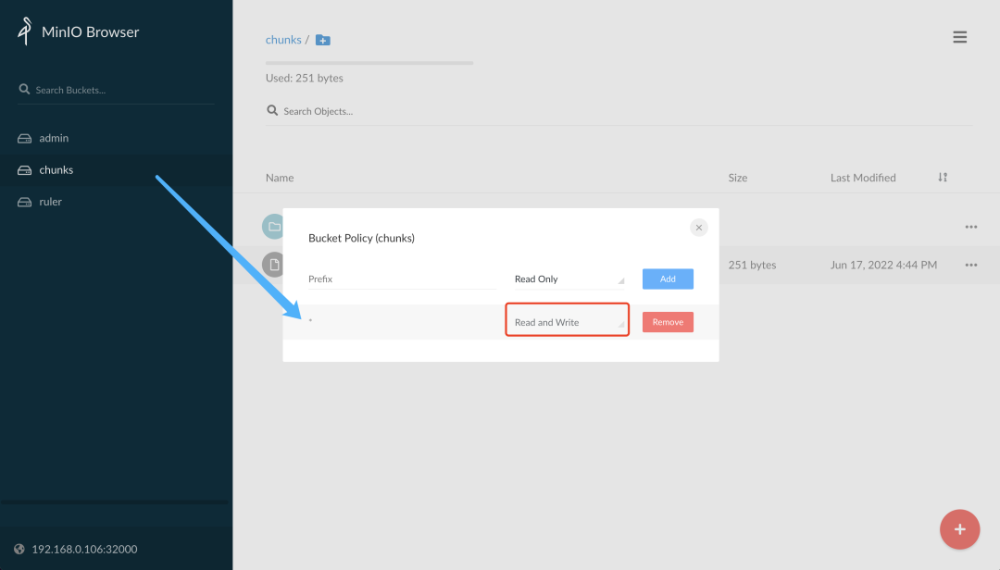
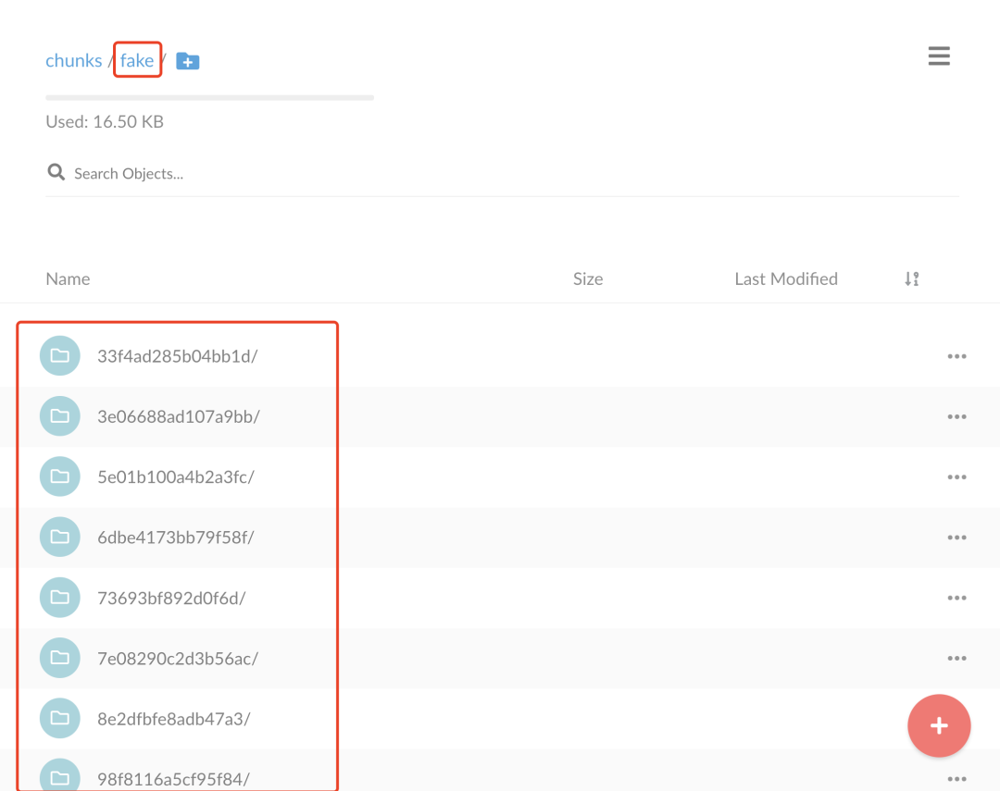
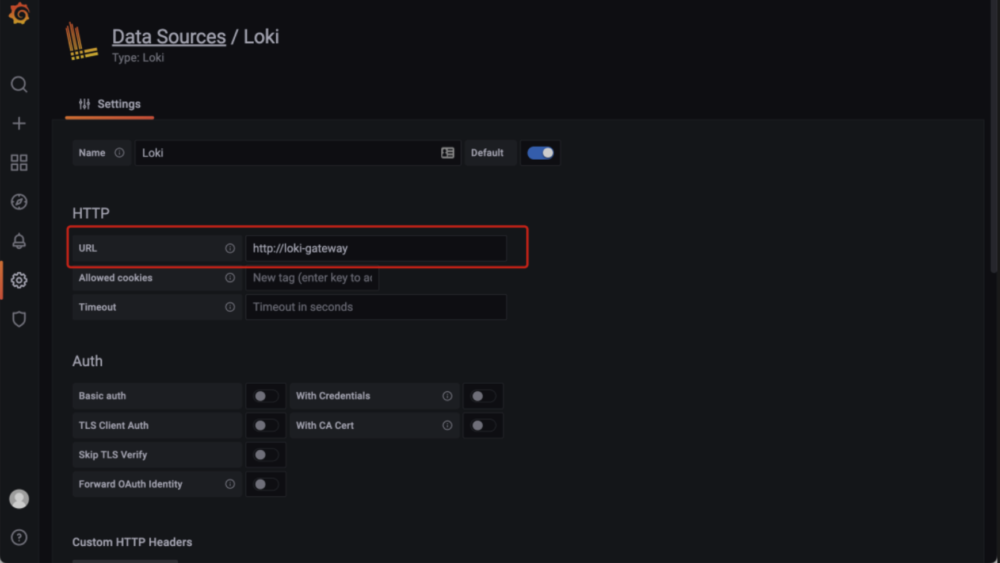

# **5 使用读写分离模式扩展 Grafana Loki**

Loki 由多个微服务组件构建而成，可以作为一个可水平扩展的分布式系统运行，Loki 的独特设计可以将整个分布式系统的代码编译成单个二进制或 Docker 映像，单个二进制文件的行为由 `-target` 命令行标志控制。

## **单体模式**

最简单的操作模式是设置 `-target=all`，这是默认的方式，**不需要指定，这就是单体模式**，它以单个二进制文件或 Docker 映像的形式在单个进程中运行 Loki 的所有微服务组件。


**单体模式对于快速开始使用 Loki 以及每天数据量约100GB的读写量非常有用。**

**将单体模式部署水平扩展至更多实例可以通过使用共享对象存储，配置 `memberlist_config` 属性在所有实例之间共享状态。**


**可以通过使用 `memberlist_config` 配置和共享对象存储运行两个 Loki 实例来配置高可用性**。**以循环方式将流量路由到所有 Loki 实例**。并行查询受限于实例数量和定义的查询并行度。

单体模式的安装非常简单，直接使用 grafana/loki-stack 这个 Helm Chart 包安装即可。

## **读写分离模式**

如果你每天的日志量超过几百 GB，或者你想进行读写分离，Loki 提供了简单的可扩展部署模式。这种部署模式可以扩展到每天数 TB 甚至更多的日志。




在这种模式下，**Loki 的组件微服务被绑定到两个目标中：`-target=read` 和 `-target=write`，BoltDB compactor 服务将作为读取目标的一部分运行**。


分离读写路径有以下优点：

* 通过提供专用节点提高写入路径的可用性
* 可单独扩展读取路径以按需添加/删除查询性能

这种读写分离的模式需要在 Loki 前面有一个负载均衡器，它将 `/loki/api/v1/push` 流量路由到写入节点，所有其他请求都转到读取节点，流量应该以循环方式发送。

## **安装**

我们同样使用 Helm Chart 进行安装，首先获取读写分离模型的 Chart 包：

```

$ helm repo add grafana https://grafana.github.io/helm-charts
$ helm pull grafana/loki-simple-scalable --untar --version 1.4.1
$ cd loki-simple-scalable
```

**该 Chart 包支持下表中显示的组件，Ingester、distributor、querier 和 query-frontend 都会安装，其他组件是可选的**。



这里我们使用 MinIO 来作为远程数据存储，分别配置读和写的 Loki 实例副本数为2，为了在 Loki 前面添加一个负载均衡器，需要开启 Gateway，对应的 Values 文件如下所示：

```
# ci/minio-values.yaml
loki:
  commonConfig:
    path_prefix: /var/loki
    replication_factor: 2
  authEnabled: false

# Configuration for the write
write:
  # -- Number of replicas for the write
  replicas: 3
  affinity: |
    podAntiAffinity:
      preferredDuringSchedulingIgnoredDuringExecution:
        - weight: 1
          podAffinityTerm:
            labelSelector:
              matchLabels:
                {{- include "loki.writeSelectorLabels" . | nindent 12 }}
            topologyKey: kubernetes.io/hostname
  persistence:
    size: 1Gi
    storageClass: local-path

# Configuration for the read node(s)
read:
  # -- Number of replicas for the read
  replicas: 3
  affinity: |
    podAntiAffinity:
      preferredDuringSchedulingIgnoredDuringExecution:
        - weight: 1
          podAffinityTerm:
            labelSelector:
              matchLabels:
                {{- include "loki.readSelectorLabels" . | nindent 12 }}
            topologyKey: kubernetes.io/hostname
  persistence:
    size: 1Gi
    storageClass: local-path

# Configuration for the gateway
gateway:
  # -- Specifies whether the gateway should be enabled
  enabled: true
# -------------------------------------
# Configuration for `minio` child chart
# -------------------------------------
minio:
  enabled: true
  accessKey: enterprise-logs
  secretKey: supersecret
  service:
    type: NodePort
    nodePort: 32000
  buckets:
    - name: chunks
      policy: none
      purge: false
    - name: ruler
      policy: none
      purge: false
    - name: admin
      policy: none
      purge: false
  persistence:
    size: 1Gi
    storageClass: local-path
  resources:
    requests:
      cpu: 100m
      memory: 256Mi
```

然后使用上面的 values 文件来安装读写分离模式的 Loki：

```
$ helm upgrade --install loki -n logging -f ci/minio-values.yaml .
Release "loki" does not exist. Installing it now.
NAME: loki
LAST DEPLOYED: Fri Jun 17 14:53:20 2022
NAMESPACE: logging
STATUS: deployed
REVISION: 1
TEST SUITE: None
NOTES:
***********************************************************************
 Welcome to Grafana Loki
 Chart version: 1.4.1
 Loki version: 2.5.0
***********************************************************************

Installed components:
* gateway
* read
* write

This chart requires persistence and object storage to work correctly.
Queries will not work unless you provide a `loki.config.common.storage` section with
a valid object storage (and the default `filesystem` storage set to `null`), as well
as a valid `loki.config.schema_config.configs` with an `object_store` that
matches the common storage section.

For example, to use MinIO as your object storage backend:

loki:
  config:
    common:
      storage:
        filesystem: null
        s3:
          endpoint: minio.minio.svc.cluster.local:9000
          insecure: true
          bucketnames: loki-data
          access_key_id: loki
          secret_access_key: supersecret
          s3forcepathstyle: true
    schema_config:
      configs:
        - from: "2020-09-07"
          store: boltdb-shipper
          object_store: s3
          schema: v11
          index:
            period: 24h
            prefix: loki_index_
```

安装完成后查看 Pod 状态是否正常：

```
$ kubectl get pods -n logging
NAME                            READY   STATUS    RESTARTS   AGE
loki-gateway-67f76958d7-bq46l   1/1     Running   0          91m
loki-minio-87c9bc6f5-jxdcn      1/1     Running   0          70m
loki-read-0                     1/1     Running   0          81s
loki-read-1                     1/1     Running   0          81s
loki-read-2                     1/1     Running   0          81s
loki-write-0                    1/1     Running   0          81s
loki-write-1                    1/1     Running   0          81s
loki-write-2                    1/1     Running   0          81s
```

可以看到分别部署了两个副本的 write 和 read 的 Loki，另外还有一个 gateway 的 Pod，gateway 实际上就是一个 nginx 应用，用来将 `/loki/api/v1/push` 请求路由到 `write` 节点去，我们可以查看 `gateway` 的配置来验证：

```
$ kubectl get cm -n logging loki-gateway -o yaml
apiVersion: v1
data:
  nginx.conf: |
    worker_processes  5;  ## Default: 1
    error_log  /dev/stderr;
    pid        /tmp/nginx.pid;
    worker_rlimit_nofile 8192;

    events {
      worker_connections  4096;  ## Default: 1024
    }

    http {
      client_body_temp_path /tmp/client_temp;
      proxy_temp_path       /tmp/proxy_temp_path;
      fastcgi_temp_path     /tmp/fastcgi_temp;
      uwsgi_temp_path       /tmp/uwsgi_temp;
      scgi_temp_path        /tmp/scgi_temp;

      default_type application/octet-stream;
      log_format   main '$remote_addr - $remote_user [$time_local]  $status '
            '"$request" $body_bytes_sent "$http_referer" '
            '"$http_user_agent" "$http_x_forwarded_for"';
      access_log   /dev/stderr  main;

      sendfile     on;
      tcp_nopush   on;
      resolver kube-dns.kube-system.svc.cluster.local;

      server {
        listen             8080;

        location = / {
          return 200 'OK';
          auth_basic off;
        }
\
        location = /api/prom/push {
          proxy_pass       http://loki-write.logging.svc.cluster.local:3100$request_uri;
        }

        location = /api/prom/tail {
          proxy_pass       http://loki-read.logging.svc.cluster.local:3100$request_uri;
          proxy_set_header Upgrade $http_upgrade;
          proxy_set_header Connection "upgrade";
        }

        location ~ /api/prom/.* {
          proxy_pass       http://loki-read.logging.svc.cluster.local:3100$request_uri;
        }

        location = /loki/api/v1/push {
          proxy_pass       http://loki-write.logging.svc.cluster.local:3100$request_uri;
        }

        location = /loki/api/v1/tail {
          proxy_pass       http://loki-read.logging.svc.cluster.local:3100$request_uri;
          proxy_set_header Upgrade $http_upgrade;
          proxy_set_header Connection "upgrade";
        }

        location ~ /loki/api/.* {
          proxy_pass       http://loki-read.logging.svc.cluster.local:3100$request_uri;
        }
      }
    }
kind: ConfigMap
metadata:
  annotations:
    meta.helm.sh/release-name: loki
    meta.helm.sh/release-namespace: logging
  creationTimestamp: "2022-06-17T06:53:22Z"
  labels:
    app.kubernetes.io/component: gateway
    app.kubernetes.io/instance: loki
    app.kubernetes.io/managed-by: Helm
    app.kubernetes.io/name: loki
    app.kubernetes.io/version: 2.5.0
    helm.sh/chart: loki-simple-scalable-1.4.1
  name: loki-gateway
  namespace: logging
  resourceVersion: "4968787"
  uid: ba9ba1c0-8561-41cb-8b55-287f352b5ee8
```

上面就是一个典型的 Nginx 配置，从配置可以看出会把请求 `/api/prom/push` 和 `/loki/api/v1/push` 这两个 Push API 代理到 `http://loki-write.logging.svc.cluster.local:3100$request_uri`;，

**也就是上面的两个 `loki-write` 节点，而读取相关的接口被代理到 `loki-read` 节点，然后 `loki-write 启动参数配置 `-target=write`， `loki-read` 启动参数配置 `-target=read`，这样去实现读写分离** 不过读写的应用是共享同一个配置文件的，如下所示：


```
$ kubectl get cm -n logging loki -o yaml
apiVersion: v1
data:
  config.yaml: |
    auth_enabled: false
    common:
      path_prefix: /var/loki
      replication_factor: 2
      storage:
        s3:
          access_key_id: enterprise-logs
          bucketnames: chunks
          endpoint: loki-minio.logging.svc:9000
          insecure: true
          s3forcepathstyle: true
          secret_access_key: supersecret
    limits_config:
      enforce_metric_name: false
      max_cache_freshness_per_query: 10m
      reject_old_samples: true
      reject_old_samples_max_age: 168h
      split_queries_by_interval: 15m
    memberlist:
      join_members:
      - loki-memberlist
    ruler:
      storage:
        s3:
          bucketnames: ruler
    schema_config:
      configs:
      - from: "2022-06-17"
        index:
          period: 24h
          prefix: loki_index_
        object_store: s3
        schema: v12
        store: boltdb-shipper
    server:
      grpc_listen_port: 9095
      http_listen_port: 3100
......
```

其中 `common.storage.s3`  指定的是 MinIO 的相关配置，通过 `memberlist.join_members` 来指定成员，其实就是所有的读写节点：

```
$ kubectl get svc loki-memberlist -n logging -o wide
NAME              TYPE        CLUSTER-IP   EXTERNAL-IP   PORT(S)    AGE   SELECTOR
loki-memberlist   ClusterIP   None         <none>        7946/TCP   54m   app.kubernetes.io/instance=loki,app.kubernetes.io/name=loki,app.kubernetes.io/part-of=memberlist
$ kubectl get pods -n logging -l app.kubernetes.io/part-of=memberlist
NAME           READY   STATUS    RESTARTS   AGE
loki-read-0    1/1     Running   0          32s
loki-read-1    1/1     Running   0          72s
loki-read-2    1/1     Running   0          115s
loki-write-0   1/1     Running   0          4s
loki-write-1   1/1     Running   0          55s
loki-write-2   1/1     Running   0          116s
```

到这里我们就完成了 Loki 读写分离模式的部署。

## **Promtail写数据**

为了验证应用是否正常，接下来我们再安装 Promtail 和 Grafana 来进行数据的读写。

获取 promtail 的 Chart 包并解压：

```
$ helm pull grafana/promtail --untar
$ cd promtail
```

创建一个如下所示的 values 文件：

```
# ci/simple-values.yaml
rbac:
  pspEnabled: false
config:
  lokiAddress: http://loki-gateway/loki/api/v1/push
```

注意我们需要将 Promtail 中配置的 Loki 地址为 `http://loki-gateway/loki/api/v1/push`，

**这样就是 Promtail 将日志数据首先发送到 Gateway 上面去，然后 Gateway 根据我们的 Endpoints 去转发给 write 节点**，使用上面的 values 文件来安装 Promtail：

```
$ helm upgrade --install promtail -n logging -f ci/simple-values.yaml .
Release "promtail" does not exist. Installing it now.
NAME: promtail
LAST DEPLOYED: Fri Jun 17 16:01:08 2022
NAMESPACE: logging
STATUS: deployed
REVISION: 1
TEST SUITE: None
NOTES:
***********************************************************************
 Welcome to Grafana Promtail
 Chart version: 5.1.0
 Promtail version: 2.5.0
***********************************************************************

Verify the application is working by running these commands:

* kubectl --namespace logging port-forward daemonset/promtail 3101
* curl http://127.0.0.1:3101/metrics
```

正常安装完成后会在每个节点上运行一个 promtail：

```

$ kubectl get pods -n logging -l app.kubernetes.io/name=promtail
NAME             READY   STATUS    RESTARTS   AGE
promtail-5r9hl   1/1     Running   0          2m25s
promtail-85mk4   1/1     Running   0          2m25s
promtail-qlfnv   1/1     Running   0          2m25s
```

正常 promtail 就已经在开始采集所在节点上的所有容器日志了，**然后将日志数据 Push 给 gateway，gateway 转发给 write 节点，我们可以查看 gateway 的日志：**

```
$ kubectl logs -f loki-gateway-67f76958d7-bq46l -n logging
10.244.1.170 - - [17/Jun/2022:08:09:03 +0000]  204 "POST /loki/api/v1/push HTTP/1.1" 0 "-" "promtail/2.5.0" "-"
10.244.1.170 - - [17/Jun/2022:08:09:04 +0000]  204 "POST /loki/api/v1/push HTTP/1.1" 0 "-" "promtail/2.5.0" "-"
10.244.2.205 - - [17/Jun/2022:08:09:05 +0000]  204 "POST /loki/api/v1/push HTTP/1.1" 0 "-" "promtail/2.5.0" "-"
......
```

可以看到 gateway 现在在一直接接收着 `/loki/api/v1/push` 的请求，也就是 `promtail` 发送过来的，正常来说现在日志数据已经分发给 `write` 节点了，`write` 节点将数据存储在了 `minio` 中，可以去查看下 minio 中已经有日志数据了，前面安装的时候为 `minio` 服务指定了一个 `32000` 的 `NodePort` 端口：



登录信息为：

* accessKey: enterprise-logs
* secretKey: supersecret



可以看到 minio 的 chunks 这个 bucket 中并没有日志数据，这是因为上面我们创建的 bucket 默认只有读取的权限，**我们可以将该 bucket 修改为具有读写的权限**：



**正常修改后就会产生一个 fake 的目录了**，这是默认没有提供多租户的数据目录，该目录下面存储着日志的 chunk 数据：



这是 Loki 日志的写入的路径。

## **Grafana读数据**

下面我们来验证下读取路径，安装 Grafana 对接 Loki：

```
$ helm pull grafana/grafana --untar
$ cd grafana
```

创建如下所示的 values 配置文件：

```
lues 配置文件：

# ci/simple-values.yaml
service:
  type: NodePort
  nodePort: 32001
rbac:
  pspEnabled: false
persistence:
  enabled: true
  storageClassName: local-path
  accessModes:
    - ReadWriteOnce
  size: 1Gi
```

直接使用上面的 values 文件安装 Grafana：

```
$ helm upgrade --install grafana -n logging -f ci/simple-values.yaml .
Release "grafana" has been upgraded. Happy Helming!
NAME: grafana
LAST DEPLOYED: Fri Jun 17 17:00:24 2022
NAMESPACE: logging
STATUS: deployed
REVISION: 2
NOTES:
1. Get your 'admin' user password by running:

   kubectl get secret --namespace logging grafana -o jsonpath="{.data.admin-password}" | base64 --decode ; echo

2. The Grafana server can be accessed via port 80 on the following DNS name from within your cluster:

   grafana.logging.svc.cluster.local

   Get the Grafana URL to visit by running these commands in the same shell:
export NODE_PORT=$(kubectl get --namespace logging -o jsonpath="{.spec.ports[0].nodePort}" services grafana)
     export NODE_IP=$(kubectl get nodes --namespace logging -o jsonpath="{.items[0].status.addresses[0].address}")
     echo http://$NODE_IP:$NODE_PORT


3. Login with the password from step 1 and the username: admin
```

可以通过上面提示中的命令获取登录密码：

```
$ kubectl get secret --namespace logging grafana -o jsonpath="{.data.admin-password}" | base64 --decode ; echo
```

然后使用上面的密码和 admin 用户名登录 Grafana：

登录后进入 Grafana 添加一个数据源，这里需要注意要填写 gateway 的地址 http://loki-gateway：


保存数据源后，可以进入 Explore 页面过滤日志，比如我们这里来实时查看 gateway 这个应用的日志，如下图所示：


如果你能看到最新的日志数据那说明我们部署成功了读写分离模式的 Loki，读写分离模式可以大大提高 Loki 的性能和容量，如果这种模式还不能满足你的数据量，那么可以使用微服务模式来部署 Loki 了