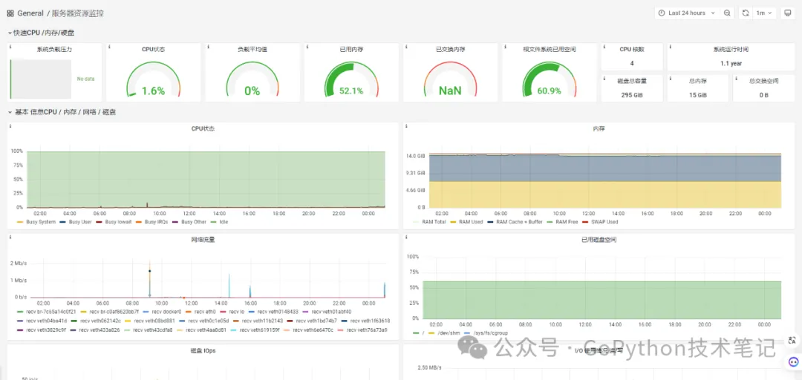
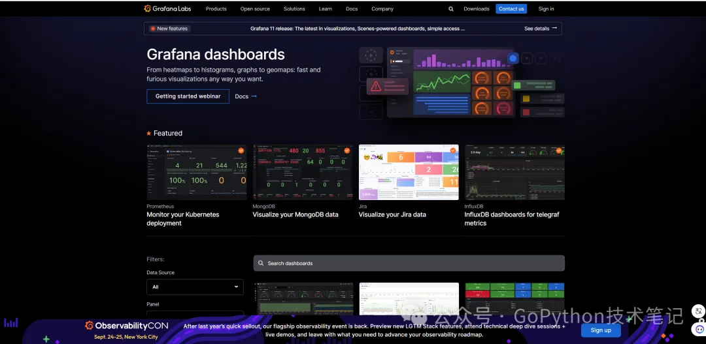

# 使用 Prometheus 和 Grafana 实现服务器运行状态监控（基于 Docker）

## 引言

在现代运维中，监控服务器的运行状态是保证服务稳定性的关键。本文将介绍如何使用 Docker 来部署 Prometheus 和 Grafana，并结合 `node_exporter` 进行服务器状态监控。

通过简单的配置和部署，我们可以实时掌握服务器的运行状况，提前发现并处理潜在问题


## 1、准备工作

首先确保你的服务器已经安装了 Docker 和 Docker Compose。如果没有安装，可以通过以下命令安装：

```
# 安装 Docker
curl -fsSL https://get.docker.com -o get-docker.sh
sh get-docker.sh

# 安装 Docker Compose
sudo curl -L "https://github.com/docker/compose/releases/download/1.29.2/docker-compose-$(uname -s)-$(uname -m)" -o /usr/local/bin/docker-compose
sudo chmod +x /usr/local/bin/docker-compose
```

## 2、编写 Docker Compose 文件

我们将使用 Docker Compose 来编排 Prometheus、Grafana 和 `node_exporter` 的容器。新建一个目录并在其中创建 `docker-compose.yml `文件：

```
version: '3.7'

services:
  prometheus:
    image: prom/prometheus:latest
    container_name: prometheus
    volumes:
      - ./prometheus.yml:/etc/prometheus/prometheus.yml
    ports:
      - "9090:9090"

  grafana:
    image: grafana/grafana:latest
    container_name: grafana
    ports:
      - "3000:3000"
    environment:
      - GF_SECURITY_ADMIN_PASSWORD=admin

  node-exporter:
    image: prom/node-exporter:latest
    container_name: node-exporter
    ports:
      - "9100:9100"
```

## 3、配置 Prometheus

在同一目录下创建 `prometheus.yml` 配置文件：

```
global:
  scrape_interval: 15s

scrape_configs:
  - job_name: 'node_exporter'
    static_configs:
      - targets: ['node-exporter:9100']
```

## 4、 启动服务

在 docker-compose.yml 文件所在的目录下运行以下命令启动所有服务：

```
docker-compose up -d
```

## 5、访问 Grafana

服务启动后，可以通过浏览器访问 http://localhost:3000 打开 Grafana。默认的用户名和密码均为 admin。

## 6、配置 Grafana 来显示 Prometheus 数据

### 添加数据源：


进入 Grafana 仪表盘。

点击左侧的 “齿轮” 图标（Configuration）并选择 “Data Sources”。

点击 “Add data source”，选择 “Prometheus”，然后设置 URL 为 http://prometheus:9090。

点击 “Save & Test” 以确认连接成功。

### 创建仪表盘：


点击左侧的 “加号” 图标（Create）并选择 “Dashboard”。

点击 “Add new panel”。

在查询部分，选择 Prometheus 作为数据源，并输入适当的 Prometheus 查询语句，例如 `node_cpu_seconds_total`。

配置完毕后，点击 “Save” 保存仪表盘。



granafa 提供很多可视化模版可供参考，地址：https://grafana.com/grafana/dashboards/


