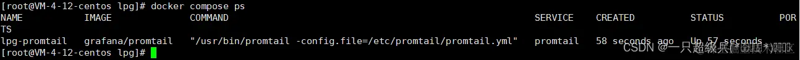
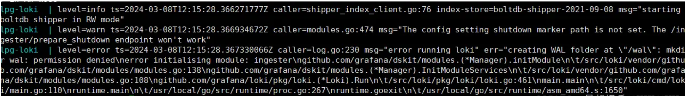
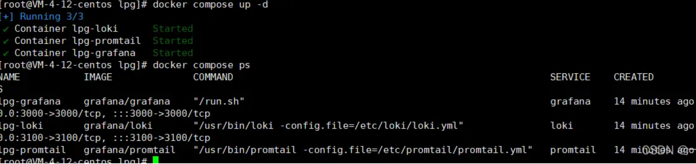
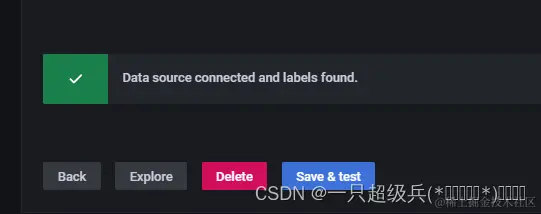

# Docker上部署LPG（loki+promtail+grafana）踩坑复盘

https://github.com/ruanbekker/docker-promtail-loki/tree/main

按照文章描述，主要准备loki、promtail、docker-compose文件，修改其中部分配置，得到如下文件：

## 网上配置

`loki.yml`不用修改:

```
auth_enabled: false

server:
  http_listen_port: 3100

ingester:
  lifecycler:
    address: 127.0.0.1
    ring:
      kvstore:
        store: inmemory
      replication_factor: 1
    final_sleep: 0s
  chunk_idle_period: 1h    # 此时没有接收到新日志的任何块都将被刷新
  max_chunk_age: 1h      # 所有的块将刷新时，他们达到这个年龄，默认是1h
  chunk_target_size: 1048576 # Loki将尝试构建最大为1.5MB的块，如果先达到chunk_idle_period或max_chunk_age，则首先刷新
  chunk_retain_period: 30s  # 如果使用索引缓存，必须大于索引读缓存TTL(默认索引读缓存TTL为5m)
  max_transfer_retries: 0   # 块传输禁用

schema_config:
  configs:
    - from: 2021-9-8
      store: boltdb-shipper
      object_store: filesystem
      schema: v11
      index:
        prefix: index_
        period: 24h

storage_config:
  boltdb_shipper:
    active_index_directory: /loki/boltdb-shipper-active
    cache_location: /loki/boltdb-shipper-cache
    cache_ttl: 24h     # 可以在更长的查询周期内提高更快的性能，使用更多的磁盘空间
    shared_store: filesystem
  filesystem:
    directory: /loki/chunks

compactor:
  working_directory: /loki/boltdb-shipper-compactor
  shared_store: filesystem

limits_config:
  reject_old_samples: true
  reject_old_samples_max_age: 168h

chunk_store_config:
  max_look_back_period: 0s

table_manager:
  retention_deletes_enabled: false
  retention_period: 0s

ruler:
  storage:
    type: local
    local:
      directory: /loki/rules
  rule_path: /loki/rules-temp
  alertmanager_url: http://localhost:9093
  ring:
    kvstore:
      store: inmemory
  enable_api: true
```

### 2 promtail.yml 不用修改:

```
server:
  http_listen_port: 9080
  grpc_listen_port: 0

positions:
  filename: /tmp/positions.yaml

clients:
  - url: http://loki:3100/loki/api/v1/push

scrape_configs:
  - job_name: system
    static_configs:
      - targets:
          - localhost
        labels:
          job: varlogs
          __path__: /var/log/*log
```

### `docker-compose.yml` 修改`service`挂载部分:

```
version: "3"

services:
  # 日志存储和解析
  loki:
    image: grafana/loki
    container_name: lpg-loki
    volumes:
      - /opt/docker/loki/:/etc/loki/
    # 修改loki默认配置文件路径
    command: -config.file=/etc/loki/loki.yml
    ports:
      - 3100:3100
  
  # 日志收集器
  promtail:
    image: grafana/promtail
    container_name: lpg-promtail
    volumes:
      # 将需要收集的日志所在目录挂载到promtail容器中
      - /opt/logs/health-center/:/var/log/
      - /opt/docker/promtail:/etc/promtail/
    # 修改promtail默认配置文件路径
    command: -config.file=/etc/promtail/promtail.yml
  
  # 日志可视化
  grafana:
    image: grafana/grafana
    container_name: lpg-grafana
    ports:
      - 3000:3000
```

```
/opt/docker
- promtail
- lpg
- loki
```

## 部署踩坑

cd到`docker-compose.yml`目录下，后台运行`docker compose up -d`，第一次拉取镜像较久

> 踩坑过程中我注意到直接后台运行然后用logs命令来看日志会更好一些

**2. 完事之后先来几个命令校验：**

docker compose ps，发现只有promtail是运行的



`docker compose logs loki`，看一下loki日志，提到日期解析异常的问题：


经过一顿gpt，发现是loki配置中的日期没有按照yyyy-MM-dd的格式，于是修改loki配置：

```
schema_config:
  configs:
    - from: 2024-07-01
      store: boltdb-shipper
      object_store: filesystem
      schema: v11
      index:
        prefix: index_
        period: 24h
```

完事后先`docker compose stop`停下来，再重跑一次，然后查看进程，发现，还是loki起不来 查看日志，这次是这样：




一顿gpt后他说可能是什么目录权限问题，不过网上找到更简便的方式，只需要在loki中添加一句(wal)：

```
ingester:
  lifecycler:
    address: 127.0.0.1
    ring:
      kvstore:
        store: inmemory
      replication_factor: 1
    final_sleep: 0s
  chunk_idle_period: 1h    # 此时没有接收到新日志的任何块都将被刷新
  max_chunk_age: 1h      # 所有的块将刷新时，他们达到这个年龄，默认是1h
  chunk_target_size: 1048576 # Loki将尝试构建最大为1.5MB的块，如果先达到chunk_idle_period或max_chunk_age，则首先刷新
  chunk_retain_period: 30s  # 如果使用索引缓存，必须大于索引读缓存TTL(默认索引读缓存TTL为5m)
  max_transfer_retries: 0   # 块传输禁用
  wal:
    dir: /loki/.cache/loki/wal/
```

还是重来一次，暂停，启动，检查进程，这次可以了。



3. 后续就是上grafana配置loki了。

配置的时候也遇到一个大坑了，就是保存测试的时候提示：

Data source connected, but no labels received. Verify that Loki and Promtail is configured properly.


最后在网上看到说加点日志就解决了，果然，在promtail放日志的目录下添加新的日志，再test，就检测到了



后续继续研究多目录收集以及多机器日志收集，踩了坑再继续复盘。

**`http://loki:3100`**