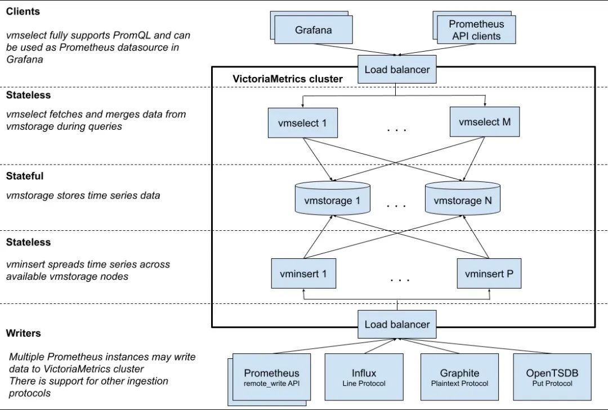
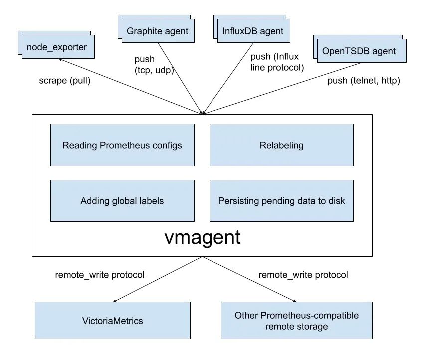
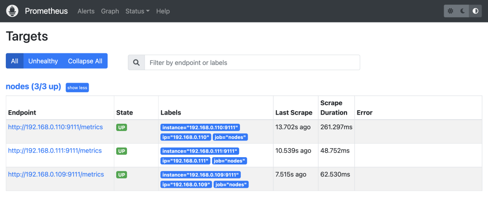
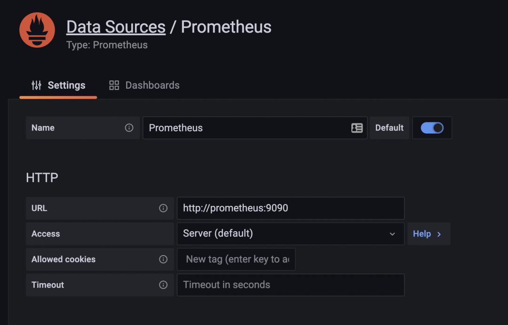
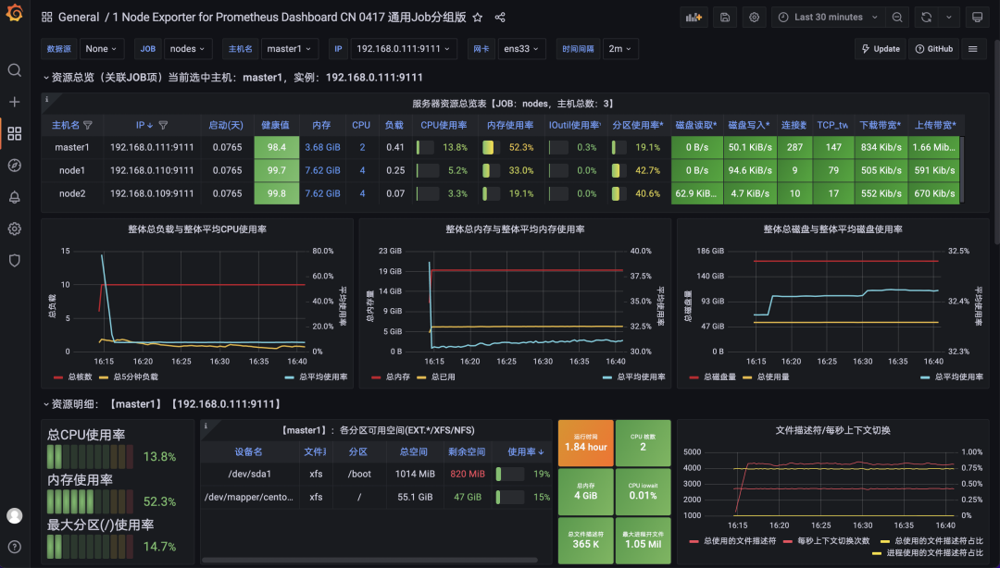
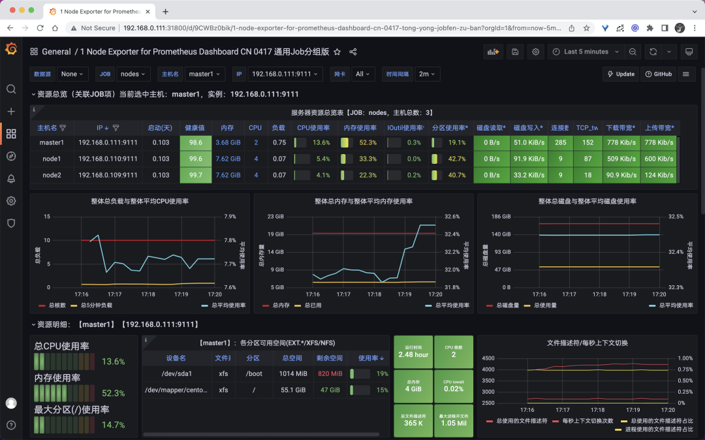
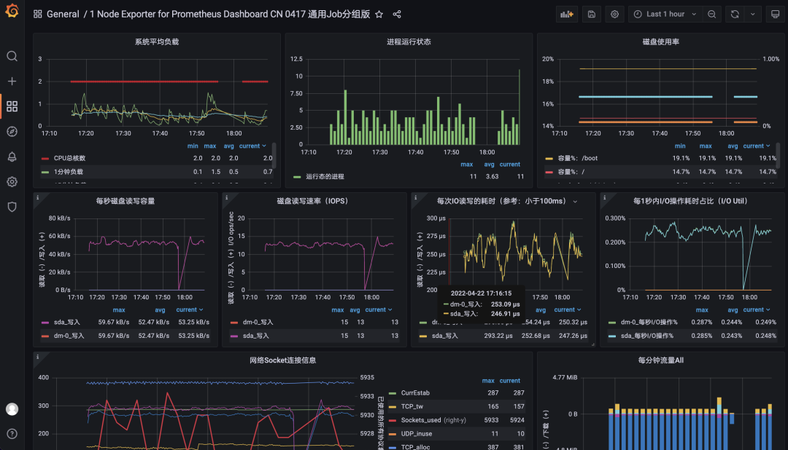
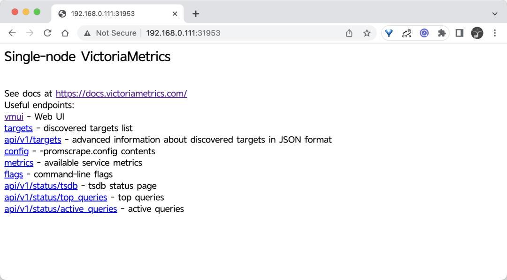
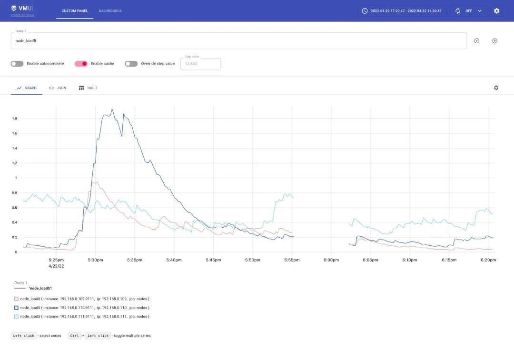

# **第二节 Prometheus长期远程存储方案VictoriaMetrics入门实践**

VictoriaMetrics(简称VM) 是一个支持高可用、经济高效且可扩展的监控解决方案和时间序列数据库，可用于 Prometheus 监控数据做长期远程存储。

前面章节我们介绍了 Thanos 方案也可以用来解决 Prometheus 的高可用和远程存储的问题，那么为什么我们还要使用 VictoriaMetrics 呢？

**<mark>相对于 Thanos，VictoriaMetrics 主要是一个可水平扩容的本地全量持久化存储方案</mark>**，VictoriaMetrics 不仅仅是时序数据库，它的优势主要体现在以下几点。

前面章节我们介绍了 Thanos 方案也可以用来解决 Prometheus 的高可用和远程存储的问题，那么为什么我们还要使用 VictoriaMetrics 呢？

相对于 Thanos，**<mark>VictoriaMetrics 主要是一个可水平扩容的本地全量持久化存储方案，VictoriaMetrics 不仅仅是时序数据库</mark>**，它的优势主要体现在以下几点。

* 对外支持 Prometheus 相关的 API，可以直接用于 Grafana 作为 Prometheus 数据源使用
* **指标数据摄取和查询具备高性能和良好的可扩展性，性能比 InfluxDB 和 TimescaleDB 高出 20 倍**
* **这处理高基数时间序列时，内存方面也做了优化，比 InfluxDB 少 10x 倍，比 Prometheus、Thanos 或 Cortex 少 7 倍**
* 高性能的数据压缩方式，与 TimescaleDB 相比，可以将多达 70 倍的数据点存入有限的存储空间，与 Prometheus、Thanos 或 Cortex 相比，所需的存储空间减少 7 倍
* 它针对具有高延迟 IO 和低 IOPS 的存储进行了优化
* 提**供全局的查询视图，多个 Prometheus 实例或任何其他数据源可能会将数据摄取到 VictoriaMetrics**

* **操作简单**

	* VictoriaMetrics 由一个没有外部依赖的小型可执行文件组成
	* 所有的配置都是通过明确的命令行标志和合理的默认值完成的
	* **所有数据都存储在 - storageDataPath 命令行参数指向的目录中**
	* 可以使用 vmbackup/vmrestore 工具轻松快速地从实时快照备份到 S3 或 GCS 对象存储中

* 支持从第三方时序数据库获取数据源
* 由于存储架构，它可以保护存储在非正常关机（即 OOM、硬件重置或 kill -9）时免受数据损坏
* 同样支持指标的 relabel 操作

## **1 架构**

VM 分为单节点和集群两个方案，根据业务需求选择即可。单节点版直接运行一个二进制文件既，官方建议采集数据点(data points)低于 100w/s，**推荐 VM 单节点版，简单好维护，但不支持告警**。集群版支持数据水平拆分。下图是 VictoriaMetrics 集群版官方的架构图。



主要包含以下几个组件：

* **vmstorage：数据存储**以及查询结果返回，默认端口为 8482
* **vminsert：数据录入，可实现类似分片**、副本功能，默认端口 8480
* **vmselect：数据查询，汇总和数据去重**，默认端口 8481
* **vmagent：数据指标抓取，支持多种后端存储**，会占用本地磁盘缓存，默认端口 8429
* **vmalert：报警相关组件**，不如果不需要告警功能可以不使用该组件，默认端口为 8880

**集群方案把功能拆分为 vmstorage、 vminsert、vmselect 组件，如果要替换 Prometheus，还需要使用 vmagent、vmalert**。

从上图也可以看出 vminsert 以及 vmselect 都是无状态的，所以扩展很简单，只有 vmstorage 是有状态的。

vmagent 的主要目的是用来收集指标数据然后存储到 VM 以及 Prometheus 兼容的存储系统中（支持 `remote_write` 协议即可）。

下图是 vmagent 的一个简单架构图，可以看出该组件也实现了 metrics 的 push 功能，此外还有很多其他特性：

* 替换 prometheus 的 scraping target
* 支持基于 prometheus relabeling 的模式添加、移除、修改 labels，可以方便在数据发送到远端存储之前进行数据的过滤
* 支持多种数据协议，influx line 协议，graphite 文本协议，opentsdb 协议，prometheus remote write 协议，json lines 协议，csv 数据
* 支持收集数据的同时，并复制到多种远端存储系统
* **支持不可靠远端存储（通过本地存储 `~remoteWrite.tmpDataPath` )，同时支持最大磁盘占用**
* 相比 prometheus 使用较少的内存、cpu、磁盘 io 以及网络带宽



接下来我们就分别来介绍了 VM 的单节点和集群两个方案的使用。

## **2 单节点**

**这里我们采集 node-exporter 为例进行说明**，**首先使用 Prometheus 采集数据，然后将 Prometheus 数据远程写入 VM 远程存储，由于 VM 提供了 vmagent 组件，最后我们使用 VM 来完全替换 Prometheus，可以使架构更简单、更低的资源占用**。

这里我们将所有资源运行在 kube-vm 命名空间之下：

```
kubectl create ns kube-vm
```

首先我们这 `kube-vm` 命名空间下面使用 DaemonSet 控制器运行 `node-exporter`，对应的资源清单文件如下所示：

```
# vm-node-exporter.yaml
apiVersion: apps/v1
kind: DaemonSet
metadata:
  name: node-exporter
  namespace: kube-vm
spec:
  selector:
    matchLabels:
      app: node-exporter
  template:
    metadata:
      labels:
        app: node-exporter
    spec:
      hostPID: true
      hostIPC: true
      hostNetwork: true
      nodeSelector:
        kubernetes.io/os: linux
      containers:
        - name: node-exporter
          image: prom/node-exporter:v1.3.1
          args:
            - --web.listen-address=$(HOSTIP):9111
            - --path.procfs=/host/proc
            - --path.sysfs=/host/sys
            - --path.rootfs=/host/root
            - --no-collector.hwmon # 禁用不需要的一些采集器
            - --no-collector.nfs
            - --no-collector.nfsd
            - --no-collector.nvme
            - --no-collector.dmi
            - --no-collector.arp
            - --collector.filesystem.ignored-mount-points=^/(dev|proc|sys|var/lib/containerd/.+|/var/lib/docker/.+|var/lib/kubelet/pods/.+)($|/)
            - --collector.filesystem.ignored-fs-types=^(autofs|binfmt_misc|cgroup|configfs|debugfs|devpts|devtmpfs|fusectl|hugetlbfs|mqueue|overlay|proc|procfs|pstore|rpc_pipefs|securityfs|sysfs|tracefs)$
          ports:
            - containerPort: 9111
          env:
            - name: HOSTIP
              valueFrom:
                fieldRef:
                  fieldPath: status.hostIP
          resources:
            requests:
              cpu: 150m
              memory: 180Mi
            limits:
              cpu: 150m
              memory: 180Mi
          securityContext:
            runAsNonRoot: true
            runAsUser: 65534
          volumeMounts:
            - name: proc
              mountPath: /host/proc
            - name: sys
              mountPath: /host/sys
            - name: root
              mountPath: /host/root
              mountPropagation: HostToContainer
              readOnly: true
      tolerations: # 添加容忍
        - operator: "Exists"
      volumes:
        - name: proc
          hostPath:
            path: /proc
        - name: dev
          hostPath:
            path: /dev
        - name: sys
          hostPath:
            path: /sys
        - name: root
          hostPath:
            path: /
```

由于前面章节中我们也创建了 `node-exporter`，为了防止端口冲突，这里我们使用参数 `--web.listen-address=$(HOSTIP):9111` 配置端口为 `9111`。直接应用上面的资源清单即可。

```
kubectl apply -f vm-node-exporter.yaml

☸ ➜ kubectl get pods -n kube-vm -owide
NAME                  READY   STATUS    RESTARTS   AGE    IP              NODE      NOMINATED NODE   READINESS GATES
node-exporter-c4d76   1/1     Running   0          118s   192.168.0.109   node2     <none>           <none>
node-exporter-hzt8s   1/1     Running   0          118s   192.168.0.111   master1   <none>           <none>
node-exporter-zlxwb   1/1     Running   0          118s   192.168.0.110   node1     <none>           <none>
```

然后重新部署一套独立的 Prometheus，为了简单我们直接使用 `static_configs` 静态配置方式来抓取 `node-exporter` 的指标，配置清单如下所示：

```
# vm-prom-config.yaml
apiVersion: v1
kind: ConfigMap
metadata:
  name: prometheus-config
  namespace: kube-vm
data:
  prometheus.yaml: |
    global:
      scrape_interval: 15s
      scrape_timeout: 15s
    scrape_configs:
    - job_name: "nodes"
      static_configs:
      - targets: ['192.168.0.109:9111', '192.168.0.110:9111', '192.168.0.111:9111']
      relabel_configs: # 通过 relabeling 从 __address__ 中提取 IP 信息，为了后面验证 VM 是否兼容 relabeling
      - source_labels: [__address__]
        regex: "(.*):(.*)"
        replacement: "${1}"
        target_label: 'ip'
        action: replace
```

上面配置中通过 relabel 操作从 `__address__` 中将 IP 信息提取出来，后面可以用来验证 VM 是否兼容 relabel 操作。

同样要给 Prometheus 数据做持久化，所以也需要创建一个对应的 PVC 资源对象：

```
# apiVersion: storage.k8s.io/v1
# kind: StorageClass
# metadata:
#   name: local-storage
# provisioner: kubernetes.io/no-provisioner
# volumeBindingMode: WaitForFirstConsumer
---
apiVersion: v1
kind: PersistentVolume
metadata:
  name: prometheus-data
spec:
  accessModes:
    - ReadWriteOnce
  capacity:
    storage: 20Gi
  storageClassName: local-storage
  local:
    path: /data/k8s/prometheus
  persistentVolumeReclaimPolicy: Retain
  nodeAffinity:
    required:
      nodeSelectorTerms:
        - matchExpressions:
            - key: kubernetes.io/hostname
              operator: In
              values:
                - node2
---
apiVersion: v1
kind: PersistentVolumeClaim
metadata:
  name: prometheus-data
  namespace: kube-vm
spec:
  accessModes:
    - ReadWriteOnce
  resources:
    requests:
      storage: 20Gi
  storageClassName: local-storage
```

然后直接创建 Prometheus 即可，将上面的 PVC 和 ConfigMap 挂载到容器中，通过 `--config.file ` 参数指定配置文件文件路径，指定 TSDB 数据路径等，资源清单文件如下所示：

```
# vm-prom-deploy.yaml
apiVersion: apps/v1
kind: Deployment
metadata:
  name: prometheus
  namespace: kube-vm
spec:
  selector:
    matchLabels:
      app: prometheus
  template:
    metadata:
      labels:
        app: prometheus
    spec:
      volumes:
        - name: data
          persistentVolumeClaim:
            claimName: prometheus-data
        - name: config-volume
          configMap:
            name: prometheus-config
      containers:
        - image: prom/prometheus:v2.35.0
          name: prometheus
          args:
            - "--config.file=/etc/prometheus/prometheus.yaml"
            - "--storage.tsdb.path=/prometheus" # 指定tsdb数据路径
            - "--storage.tsdb.retention.time=2d"
            - "--web.enable-lifecycle" # 支持热更新，直接执行localhost:9090/-/reload立即生效
          ports:
            - containerPort: 9090
              name: http
          securityContext:
            runAsUser: 0
          volumeMounts:
            - mountPath: "/etc/prometheus"
              name: config-volume
            - mountPath: "/prometheus"
              name: data
---
apiVersion: v1
kind: Service
metadata:
  name: prometheus
  namespace: kube-vm
spec:
  selector:
    app: prometheus
  type: NodePort
  ports:
    - name: web
      port: 9090
      targetPort: http
```

直接应用上面的资源清单即可。

```
☸ ➜ kubectl apply -f vm-prom-config.yaml
☸ ➜ kubectl apply -f vm-prom-pvc.yaml
☸ ➜ kubectl apply -f vm-prom-deploy.yaml
☸ ➜ kubectl get pods -n kube-vm -owide
NAME                      READY   STATUS    RESTARTS   AGE     IP              NODE      NOMINATED NODE   READINESS GATES
node-exporter-c4d76       1/1     Running   0          27m     192.168.0.109   node2     <none>           <none>
node-exporter-hzt8s       1/1     Running   0          27m     192.168.0.111   master1   <none>           <none>
node-exporter-zlxwb       1/1     Running   0          27m     192.168.0.110   node1     <none>           <none>
prometheus-dfc9f6-2w2vf   1/1     Running   0          4m58s   10.244.2.102    node2     <none>           <none>
☸ ➜ kubectl get svc -n kube-vm
NAME         TYPE       CLUSTER-IP      EXTERNAL-IP   PORT(S)          AGE
prometheus   NodePort   10.103.38.114   <none>        9090:31890/TCP   4m10s
```

部署完成后可以通过 `http://<node-ip>:31890` 访问 Prometheus，正常可以看到采集的 3 个 node 节点的指标任务。



同样的方式重新部署 Grafana，资源清单如下所示：

```
# vm-grafana.yaml
apiVersion: apps/v1
kind: Deployment
metadata:
  name: grafana
  namespace: kube-vm
spec:
  selector:
    matchLabels:
      app: grafana
  template:
    metadata:
      labels:
        app: grafana
    spec:
      volumes:
        - name: storage
          persistentVolumeClaim:
            claimName: grafana-data
      containers:
        - name: grafana
          image: grafana/grafana:main
          imagePullPolicy: IfNotPresent
          ports:
            - containerPort: 3000
              name: grafana
          securityContext:
            runAsUser: 0
          env:
            - name: GF_SECURITY_ADMIN_USER
              value: admin
            - name: GF_SECURITY_ADMIN_PASSWORD
              value: admin321
          volumeMounts:
            - mountPath: /var/lib/grafana
              name: storage
---
apiVersion: v1
kind: Service
metadata:
  name: grafana
  namespace: kube-vm
spec:
  type: NodePort
  ports:
    - port: 3000
  selector:
    app: grafana
---
apiVersion: v1
kind: PersistentVolume
metadata:
  name: grafana-data
spec:
  accessModes:
    - ReadWriteOnce
  capacity:
    storage: 1Gi
  storageClassName: local-storage
  local:
    path: /data/k8s/grafana
  persistentVolumeReclaimPolicy: Retain
  nodeAffinity:
    required:
      nodeSelectorTerms:
        - matchExpressions:
            - key: kubernetes.io/hostname
              operator: In
              values:
                - node2
---
apiVersion: v1
kind: PersistentVolumeClaim
metadata:
  name: grafana-data
  namespace: kube-vm
spec:
  accessModes:
    - ReadWriteOnce
  resources:
    requests:
      storage: 1Gi
  storageClassName: local-storage
```

```
☸ ➜ kubectl apply -f vm-grafana.yaml
☸ ➜ kubectl get svc -n kube-vm |grep grafana
grafana      NodePort   10.97.111.153   <none>        3000:31800/TCP   62s
```

同样通过 `http://<node-ip>:31800` 就可以访问 Grafana 了，进入 Grafana 配置 Prometheus 数据源。



然后导入 16098 这个 Dashboard，导入后效果如下图所示。



到这里就完成了使用 Prometheus 收集节点监控指标，接下来我们来使用 VM 来改造现有方案。

## **3 远程存储 VictoriaMetrics**

首先需要一个单节点模式的 VM，运行 VM 很简单，可以直接下载对应的二进制文件启动，也可以使用 docker 镜像一键启动，我们这里同样部署到 Kubernetes 集群中。资源清单文件如下所示。

```
# vm-grafana.yaml
apiVersion: apps/v1
kind: Deployment
metadata:
  name: victoria-metrics
  namespace: kube-vm
spec:
  selector:
    matchLabels:
      app: victoria-metrics
  template:
    metadata:
      labels:
        app: victoria-metrics
    spec:
      volumes:
        - name: storage
          persistentVolumeClaim:
            claimName: victoria-metrics-data
      containers:
        - name: vm
          image: victoriametrics/victoria-metrics:v1.76.1
          imagePullPolicy: IfNotPresent
          args:
            - -storageDataPath=/var/lib/victoria-metrics-data
            - -retentionPeriod=1w
          ports:
            - containerPort: 8428
              name: http
          volumeMounts:
            - mountPath: /var/lib/victoria-metrics-data
              name: storage
---
apiVersion: v1
kind: Service
metadata:
  name: victoria-metrics
  namespace: kube-vm
spec:
  type: NodePort
  ports:
    - port: 8428
  selector:
    app: victoria-metrics
---
apiVersion: v1
kind: PersistentVolume
metadata:
  name: victoria-metrics-data
spec:
  accessModes:
    - ReadWriteOnce
  capacity:
    storage: 20Gi
  storageClassName: local-storage
  local:
    path: /data/k8s/vm
  persistentVolumeReclaimPolicy: Retain
  nodeAffinity:
    required:
      nodeSelectorTerms:
        - matchExpressions:
            - key: kubernetes.io/hostname
              operator: In
              values:
                - node2
---
apiVersion: v1
kind: PersistentVolumeClaim
metadata:
  name: victoria-metrics-data
  namespace: kube-vm
spec:
  accessModes:
    - ReadWriteOnce
  resources:
    requests:
      storage: 20Gi
  storageClassName: local-storage
```

这里我们使用 `-storageDataPath` 参数指定了数据存储目录，然后同样将该目录进行了持久化，-`retentionPeriod` 参数可以用来配置数据的保持周期。直接应用上面的资源清单即可。

```
☸ ➜ kubectl apply -f vm-single-node-deploy.yaml
☸ ➜ kubectl get svc victoria-metrics -n kube-vm
NAME               TYPE       CLUSTER-IP       EXTERNAL-IP   PORT(S)          AGE
victoria-metrics   NodePort   10.106.216.248   <none>        8428:31953/TCP   75m
☸ ➜ kubectl get pods -n kube-vm -l app=victoria-metrics
NAME                                READY   STATUS    RESTARTS   AGE
victoria-metrics-57d47f4587-htb88   1/1     Running   0          3m12s
☸ ➜ kubectl logs -f victoria-metrics-57d47f4587-htb88 -n kube-vm
2022-04-22T08:59:14.431Z        info    VictoriaMetrics/lib/logger/flag.go:12   build version: victoria-metrics-20220412-134346-tags-v1.76.1-0-gf8de318bf
2022-04-22T08:59:14.431Z        info    VictoriaMetrics/lib/logger/flag.go:13   command line flags
2022-04-22T08:59:14.431Z        info    VictoriaMetrics/lib/logger/flag.go:20   flag "retentionPeriod"="1w"
2022-04-22T08:59:14.431Z        info    VictoriaMetrics/lib/logger/flag.go:20   flag "storageDataPath"="/var/lib/victoria-metrics-data"
2022-04-22T08:59:14.431Z        info    VictoriaMetrics/app/victoria-metrics/main.go:52 starting VictoriaMetrics at ":8428"...
2022-04-22T08:59:14.432Z        info    VictoriaMetrics/app/vmstorage/main.go:97        opening storage at "/var/lib/victoria-metrics-data" with -retentionPeriod=1w
......
2022-04-22T08:59:14.449Z        info    VictoriaMetrics/app/victoria-metrics/main.go:61 started VictoriaMetrics in 0.017 seconds
2022-04-22T08:59:14.449Z        info    VictoriaMetrics/lib/httpserver/httpserver.go:91 starting http server at http://127.0.0.1:8428/
```

到这里我们单节点的 VictoriaMetrics 就部署成功了。接下来我们只需要在 Prometheus 中配置远程写入我们的 VM 即可，更改 Prometheus 配置：

```
# vm-prom-config2.yaml
apiVersion: v1
kind: ConfigMap
metadata:
  name: prometheus-config
  namespace: kube-vm
data:
  prometheus.yaml: |
    global:
      scrape_interval: 15s
      scrape_timeout: 15s
    remote_write:    # 远程写入到远程 VM 存储
    - url: http://victoria-metrics:8428/api/v1/write
    scrape_configs:
    - job_name: "nodes"
      static_configs:
      - targets: ['192.168.0.109:9111', '192.168.0.110:9111', '192.168.0.111:9111']
      relabel_configs: # 通过 relabeling 从 __address__ 中提取 IP 信息，为了后面验证 VM 是否兼容 relabeling
      - source_labels: [__address__]
        regex: "(.*):(.*)"
        replacement: "${1}"
        target_label: 'ip'
        action: replace
```

重新更新 Prometheus 的配置资源对象：


```
☸ ➜ kubectl apply -f vm-prom-config2.yaml
# 更新后执行 reload 操作重新加载 prometheus 配置
☸ ➜ curl -X POST "http://192.168.0.111:31890/-/reload"
```

配置生效后 Prometheus 就会开始将数据远程写入 VM 中，我们可以查看 VM 的持久化数据目录是否有数据产生来验证：

```
☸ ➜ ll /data/k8s/vm/data/
total 0
drwxr-xr-x 4 root root 38 Apr 22 17:15 big
-rw-r--r-- 1 root root  0 Apr 22 16:59 flock.lock
drwxr-xr-x 4 root root 38 Apr 22 17:15 small
```

现在我们去直接将 Grafana 中的数据源地址修改成 VM 的地址：


修改完成后重新访问 node-exporter 的 dashboard，正常可以显示，证明 VM 是兼容的。



### **替换 Prometheus**

上面我们将 Prometheus 数据远程写入到了 VM，但是 Prometheus 开启 remote write 功能后会增加其本身的资源占用，理论上其实我们也可以完全用 VM 来替换掉 Prometheus，这样就不需要远程写入了，而且本身 VM 就比 Prometheus 占用更少的资源。

现在我们先停掉 Prometheus 的服务：

```
☸ ➜ kubectl scale deploy prometheus --replicas=0 -n kube-vm
```

然后将 Prometheus 的配置文件挂载到 VM 容器中，使用参数 `-promscrape.config` 来指定 Prometheus 的配置文件路径，如下所示：

```
# vm-single-node-deploy2.yaml
apiVersion: apps/v1
kind: Deployment
metadata:
  name: victoria-metrics
  namespace: kube-vm
spec:
  selector:
    matchLabels:
      app: victoria-metrics
  template:
    metadata:
      labels:
        app: victoria-metrics
    spec:
      volumes:
        - name: storage
          persistentVolumeClaim:
            claimName: victoria-metrics-data
        - name: prometheus-config
          configMap:
            name: prometheus-config
      containers:
        - name: vm
          image: victoriametrics/victoria-metrics:v1.76.1
          imagePullPolicy: IfNotPresent
          args:
            - -storageDataPath=/var/lib/victoria-metrics-data
            - -retentionPeriod=1w
            - -promscrape.config=/etc/prometheus/prometheus.yaml
          ports:
            - containerPort: 8428
              name: http
          volumeMounts:
            - mountPath: /var/lib/victoria-metrics-data
              name: storage
            - mountPath: /etc/prometheus
              name: prometheus-config
```

记得先将 Prometheus 配置文件中的 `remote_write` 模块去掉，然后重新更新 VM 即可：

```

☸ ➜ kubectl apply -f vm-prom-config.yaml
☸ ➜ kubectl apply -f vm-single-node-deploy2.yaml
☸ ➜ kubectl get pods -n kube-vm -l app=victoria-metrics
NAME                                READY   STATUS    RESTARTS       AGE
victoria-metrics-8466844968-ncfnp   1/1     Running   2 (3m3s ago)   3m45s
☸ ➜ kubectl logs -f victoria-metrics-8466844968-ncfnp -n kube-vm
......
2022-04-22T10:01:59.837Z        info    VictoriaMetrics/app/victoria-metrics/main.go:61 started VictoriaMetrics in 0.022 seconds
2022-04-22T10:01:59.837Z        info    VictoriaMetrics/lib/httpserver/httpserver.go:91 starting http server at http://127.0.0.1:8428/
2022-04-22T10:01:59.837Z        info    VictoriaMetrics/lib/httpserver/httpserver.go:92 pprof handlers are exposed at http://127.0.0.1:8428/debug/pprof/
2022-04-22T10:01:59.838Z        info    VictoriaMetrics/lib/promscrape/scraper.go:103   reading Prometheus configs from "/etc/prometheus/prometheus.yaml"
2022-04-22T10:01:59.838Z        info    VictoriaMetrics/lib/promscrape/config.go:96     starting service discovery routines...
2022-04-22T10:01:59.839Z        info    VictoriaMetrics/lib/promscrape/config.go:102    started service discovery routines in 0.000 seconds
2022-04-22T10:01:59.840Z        info    VictoriaMetrics/lib/promscrape/scraper.go:395   static_configs: added targets: 3, removed targets: 0; total targets: 3
```

从 VM 日志中可以看出成功读取了 Prometheus 的配置，并抓取了 3 个指标（node-exporter）。现在我们再去 Grafana 查看 node-exporter 的 Dashboard 是否可以正常显示。先保证数据源是 VM 的地址。


这样我们就使用 VM 替换掉了 Prometheus，我们也可以这 Grafana 的 Explore 页面去探索采集到的指标。




## **4 UI 界面**

VM 单节点版本本身自带了一个 Web UI 界面 - vmui，不过目前功能比较简单，可以直接通过 VM 的 NodePort 端口进行访问。

```
☸ ➜ kubectl get svc victoria-metrics -n kube-vm
NAME               TYPE       CLUSTER-IP       EXTERNAL-IP   PORT(S)          AGE
victoria-metrics   NodePort   10.106.216.248   <none>        8428:31953/TCP   75m
```

我们这里可以通过 http://<node-ip>:31953 访问到 vmui：



可以通过 /vmui 这个 endpoint 访问 UI 界面：



如果你想查看采集到的指标 targets，那么可以通过 `/targets` 这个 endpoint 来获取：


这些功能基本上可以满足我们的一些需求，但是还是太过简单，如果你习惯了 Prometheus 的 UI 界面，那么我们可以使用 promxy 来代替 vmui，而且 promxy 还可以进行多个 VM 单节点的数据聚合，以及 targets 查看等，对应的资源清单文件如下所示：

```

# vm-promxy.yaml
apiVersion: v1
kind: ConfigMap
metadata:
  name: promxy-config
  namespace: kube-vm
data:
  config.yaml: |
    promxy:
      server_groups:
      - static_configs:
        - targets: [victoria-metrics:8428]  # 指定vm地址，有多个则往后追加即可
        path_prefix: /prometheus  # 配置前缀
---
apiVersion: apps/v1
kind: Deployment
metadata:
  name: promxy
  namespace: kube-vm
spec:
  selector:
    matchLabels:
      app: promxy
  template:
    metadata:
      labels:
        app: promxy
    spec:
      containers:
        - args:
            - "--config=/etc/promxy/config.yaml"
            - "--web.enable-lifecycle"
            - "--log-level=trace"
          env:
            - name: ROLE
              value: "1"
          command:
            - "/bin/promxy"
          image: quay.io/jacksontj/promxy
          imagePullPolicy: Always
          name: promxy
          ports:
            - containerPort: 8082
              name: web
          volumeMounts:
            - mountPath: "/etc/promxy/"
              name: promxy-config
              readOnly: true
        - args: # container to reload configs on configmap change
            - "--volume-dir=/etc/promxy"
            - "--webhook-url=http://localhost:8082/-/reload"
          image: jimmidyson/configmap-reload:v0.1
          name: promxy-server-configmap-reload
          volumeMounts:
            - mountPath: "/etc/promxy/"
              name: promxy-config
              readOnly: true
      volumes:
        - configMap:
            name: promxy-config
          name: promxy-config
---
apiVersion: v1
kind: Service
metadata:
  name: promxy
  namespace: kube-vm
spec:
  type: NodePort
  ports:
    - port: 8082
  selector:
    app: promxy
```

直接应用上面的资源对象即可：

```

☸ ➜ kubectl apply -f vm-promxy.yaml
☸ ➜ kubectl get pods -n kube-vm -l app=promxy
NAME                      READY   STATUS    RESTARTS   AGE
promxy-5f7dfdbc64-l4kjq   2/2     Running   0          6m45s
☸ ➜ kubectl get svc promxy -n kube-vm
NAME               TYPE       CLUSTER-IP       EXTERNAL-IP   PORT(S)          AGE
promxy             NodePort   10.110.19.254    <none>        8082:30618/TCP   6m12s
```

访问 Promxy 的页面效果和 Prometheus 自带的 Web UI 基本一致的。

