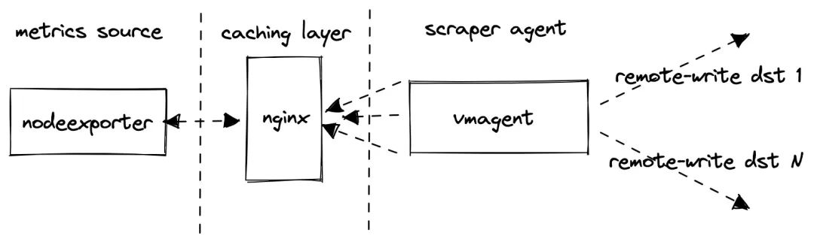
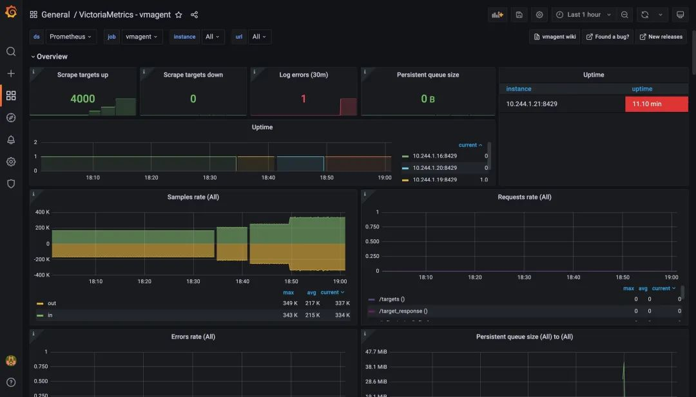

# **第七节 对Prometheus兼容的时序数据库进行压力测试**

为了在不同 VictoriaMetrics 版本之间或 VictoriaMetrics 与其他支持 Prometheus `remote_write` 协议的解决方案之间进行比较，VictoriaMetrics 专门提供了一个 `Prometheus-benchmark` 的项目。

## **1 实现原理**

该项目的实现其实非常简单：

* 使用 `node_exporter` 用作类似生产环境指标的来源
* 在 `node_exporter` 前面挂了一个 nginx 用作缓存代理，当抓取太多的指标时，这可以减少 node_exporter 的负载
* 使用 vmagent 来抓取 `node_exporter` 指标并通过 `Prometheus remote_write` 协议将它们转发到配置的目标。如果设置了多个目标，则多个 vmagent 实例独立地将抓取的数据推送到这些目标去



不过需要注意，**该测试并不会从配置的 `remote_write` 目标收集指标 ，它只会采集内部组件 vmagent 和 vmalert 的指标，他会假设对测试的 Prometheus 存储系统的监控是单独进行的，比如下面我们以单节点的 VictoriaMetrics 来作为 `remote_write` 的目标，那么我们可以自行对其进行监控。**

该项目的核心实现就是根据传入的一系列参数不断去更新抓取指标的配置文件，然后 vmagent 根据该项目暴露的接口获取其配置 `-promscrape.config` 去抓取指标，核心代码如下所示：

```
package main

import (
 "flag"
 "fmt"
 "log"
 "math/rand"
 "net/http"
 "sync"
 "time"

 "gopkg.in/yaml.v2"
)

var (
 listenAddr                 = flag.String("httpListenAddr", ":8436", "TCP address for incoming HTTP requests")
 targetsCount               = flag.Int("targetsCount", 100, "The number of scrape targets to return from -httpListenAddr. Each target has the same address defined by -targetAddr")
 targetAddr                 = flag.String("targetAddr", "demo.robustperception.io:9090", "Address with port to use as target address the scrape config returned from -httpListenAddr")
 scrapeInterval             = flag.Duration("scrapeInterval", time.Second*5, "The scrape_interval to set at the scrape config returned from -httpListenAddr")
 scrapeConfigUpdateInterval = flag.Duration("scrapeConfigUpdateInterval", time.Minute*10, "The -scrapeConfigUpdatePercent scrape targets are updated in the scrape config returned from -httpListenAddr every -scrapeConfigUpdateInterval")
 scrapeConfigUpdatePercent  = flag.Float64("scrapeConfigUpdatePercent", 1, "The -scrapeConfigUpdatePercent scrape targets are updated in the scrape config returned from -httpListenAddr ever -scrapeConfigUpdateInterval")
)

func main() {
 flag.Parse()
 flag.VisitAll(func(f *flag.Flag) {
  log.Printf("-%s=%s", f.Name, f.Value)
 })
 c := newConfig(*targetsCount, *scrapeInterval, *targetAddr)
 var cLock sync.Mutex
 p := *scrapeConfigUpdatePercent / 100
 r := rand.New(rand.NewSource(time.Now().UnixNano()))
 go func() {
  rev := 0
  for range time.Tick(*scrapeConfigUpdateInterval) {
   rev++
   revStr := fmt.Sprintf("r%d", rev)
   cLock.Lock()
   for _, sc := range c.ScrapeConfigs {
    for _, stc := range sc.StaticConfigs {
     if r.Float64() >= p {
      continue
     }
     stc.Labels["revision"] = revStr
    }
   }
   cLock.Unlock()
  }
 }()
 rh := func(w http.ResponseWriter, r *http.Request) {
  cLock.Lock()
  data := c.marshalYAML()
  cLock.Unlock()
  w.Header().Set("Content-Type", "text/yaml")
  w.Write(data)
 }
 hf := http.HandlerFunc(rh)
 log.Printf("starting scrape config updater at http://%s/", *listenAddr)
 if err := http.ListenAndServe(*listenAddr, hf); err != nil {
  log.Fatalf("unexpected error when running the http server: %s", err)
 }
}

func (c *config) marshalYAML() []byte {
 data, err := yaml.Marshal(c)
 if err != nil {
  log.Fatalf("BUG: unexpected error when marshaling config: %s", err)
 }
 return data
}

func newConfig(targetsCount int, scrapeInterval time.Duration, targetAddr string) *config {
 scs := make([]*staticConfig, 0, targetsCount)
 for i := 0; i < targetsCount; i++ {
  scs = append(scs, &staticConfig{
   Targets: []string{targetAddr},
   Labels: map[string]string{
    "instance": fmt.Sprintf("host-%d", i),
    "revision": "r0",
   },
  })
 }
 return &config{
  Global: globalConfig{
   ScrapeInterval: scrapeInterval,
  },
  ScrapeConfigs: []*scrapeConfig{
   {
    JobName:       "node_exporter",
    StaticConfigs: scs,
   },
  },
 }
}

// config represents essential parts from Prometheus config defined at https://prometheus.io/docs/prometheus/latest/configuration/configuration/
type config struct {
 Global        globalConfig    `yaml:"global"`
 ScrapeConfigs []*scrapeConfig `yaml:"scrape_configs"`
}

// globalConfig represents essential parts for `global` section of Prometheus config.
//
// See https://prometheus.io/docs/prometheus/latest/configuration/configuration/
type globalConfig struct {
 ScrapeInterval time.Duration `yaml:"scrape_interval"`
}

// rapeConfig represents essential parts for `scrape_config` section of Prometheus config.
//
// See https://prometheus.io/docs/prometheus/latest/configuration/configuration/#scrape_config
type scrapeConfig struct {
 JobName       string          `yaml:"job_name"`
 StaticConfigs []*staticConfig `yaml:"static_configs"`
}

// staticConfig represents essential parts for `static_config` section of Prometheus config.
//
// See https://prometheus.io/docs/prometheus/latest/configuration/configuration/#static_config
type staticConfig struct {
 Targets []string          `yaml:"targets"`
 Labels  map[string]string `yaml:"labels"`
}
```

我们可以通过配置下面的一些参数来控制压力测试：

**targetsCount**

targetsCount 定义有多少 `node_exporter` 抓取目标被添加到 vmagent 的抓取配置中，每个都包含一个唯一的 instance 标签，该参数会影响抓取指标的数量和基数。通常，一个 `node_exporter` 会产生大约 815 个唯一指标，因此当 targetsCount 设置为1000时，测试会生成大约 `815*100=815K` 的活跃时间序列。

**scrapeInterval**

scrapeInterval 定义了抓取每个目标的频率，此参数会影响数据摄取率，间隔越小，数据摄取率越高。

**远程存储**

`remoteStorages` 包含一个测试的系统列表，将抓取的指标推送过去，如果设置了多个目标，则多个 vmagent 实例会分别将相同的数据推送到多个目标。

**Churn rate**

scrapeConfigUpdatePercent 和 scrapeConfigUpdateInterval 可用于生成非零的时间序列流失率，这在 Kubernetes 监控中是非常典型的场景。

## **2 如何使用**

一个典型的场景是可以运行多个 VictoriaMetrics，然后在 remoteStorages 部分列出它们的地址，该测试的默认配置是 targetsCount=1000 和 scrapeInterval=10s 导致大约 80k 样本/秒：

```
800 metrics-per-target * 1k targets / 10s = 80k samples/s
```

然后我们可以通过 VictoriaMetrics 官方的 Grafana dasbhoards 比较资源使用、数据压缩和整体性能。

该项目默认通过 Helm Chart 的方式来进行安装，默认会安装一个 single 模式的 VictoriaMetrics 实例，直接 Clone 项目：

```
$ git clone https://github.com/VictoriaMetrics/prometheus-benchmark
$ cd prometheus-benchmark
```

然后可以根据自己的需求修改 `chart/values.yaml` 配置参数，我这里的配置如下所示：

```
vmtag: "v1.77.1"

# targetsCount defines the number of nodeexporter instances to scrape.
# This option allows to configure the number of active time series to push
# to remoteStorages.
# Every nodeexporter exposes around 815 unique metrics, so when targetsCount
# is set to 1000, then the benchmark generates around 815*100=815K active time series.
targetsCount: 2000

# scrapeInterval defines how frequently to scrape nodeexporter targets.
# This option allows to configure data ingestion rate per every remoteStorages.
# For example, if the benchmark generates 815K active time series and scrapeInterval
# is set to 10s, then the data ingestion rate equals to 815K/10s = 81.5K samples/sec.
scrapeInterval: 10s

# queryInterval is how often to send queries from files/alerts.yaml to remoteStorages.readURL
# This option can be used for tuning read load at remoteStorages.
# It is a good rule of thumb to keep it in sync with scrapeInterval.
queryInterval: 10s

# scrapeConfigUpdatePercent is the percent of nodeexporter targets
# which are updated with unique label on every scrape config update
# (see scrapeConfigUpdateInterval).
# This option allows tuning time series churn rate.
# For example, if scrapeConfigUpdatePercent is set to 1 for targetsCount=1000,
# then around 10 targets gets updated labels on every scrape config update.
# This generates around 815*10=8150 new time series every scrapeConfigUpdateInterval.
scrapeConfigUpdatePercent: 1

# scrapeConfigUpdateInterval specifies how frequently to update labels
# across scrapeConfigUpdatePercent nodeexporter targets.
# This option allows tuning time series churn rate.
# For example, if scrapeConfigUpdateInterval is set to 10m for targetsCount=1000
# and scrapeConfigUpdatePercent=1, then around 10 targets gets updated labels every 10 minutes.
# This generates around 815*10=8150 new time series every 10 minutes.
scrapeConfigUpdateInterval: 10m

# writeConcurrenty is the number of concurrent tcp connections to use
# for sending the data to the tested remoteStorages.
# Increase this value if there is a high network latency between prometheus-benchmark
# components and the tested remoteStorages.
writeConcurrency: 16

# remoteStorages contains a named list of Prometheus-compatible systems to test.
# These systems must support data ingestion via Prometheus remote_write protocol.
# These systems must also support Prometheus querying API if query performance
# needs to be measured additionally to data ingestion performance.
remoteStorages:
  vm-0:
    # writeURL 表示用来接收 Prometheus remote_write 协议的远程存储
    # 例如：
    # - 单节点VictoriaMetrics模式：http://<victoriametrics-addr>:8428/api/v1/write for single-node 
    # - 集群VictoriaMetrics模式：http://<vminsert-addr>:8480/insert/0/prometheus/api/v1/write
    writeURL: "http://my-bench-prometheus-benchmark-vmsingle.default.svc.cluster.local:8428/api/v1/write"
    
    # readURL 是可选的，如果需要测试测试的性能则需要配置，通过发送报警规则（files/alerts.yaml）给 readURL 进行测试
    # 例如：
    # - 单节点VictoriaMetrics模式：http://<victoriametrics-addr>:8428/
    # - 集群VictoriaMetrics模式：http://<vmselect-addr>:8481/select/0/prometheus/
    readURL: "http://my-bench-prometheus-benchmark-vmsingle.default.svc.cluster.local:8428/"
    writeBearerToken: ""
    readBearerToken: ""
  # vm-1:  # 如果有多个远程存储系统可以继续配置即可
  #   writeURL: "http://victoria-metrics-victoria-metrics-cluster-vminsert.default.svc.cluster.local:8480/insert/1/prometheus/api/v1/write"
  #   readURL: "http://victoria-metrics-victoria-metrics-cluster-vmselect.default.svc.cluster.local:8481/select/1/prometheus/"
```

现在项目代码中默认带一个单节点的 VictoriaMetrics，但是 Charts 模板中没有添加 Service 对象，操作不是很方便，我们添加一个 `chart/templates/vmsingle/service.yaml` 文件，内容如下所示：

```
apiVersion: v1
kind: Service
metadata:
  name: {{ include "prometheus-benchmark.fullname" . }}-vmsingle
  namespace: {{ .Release.Namespace }}
  labels:
    {{- include "prometheus-benchmark.labels" . | nindent 4 }}
spec:
  type: ClusterIP
  selector:
    job: vmsingle
    {{- include "prometheus-benchmark.selectorLabels" . | nindent 4 }}
  ports:
  - port: 8428
    targetPort: 8428
```

配置完过后在项目根目录下面执行下面的命令即可开始测试：

```
$ make install
```

上面的命令会使用 Helm 进行安装：

```

$ kubectl get pods         
NAME                                                          READY   STATUS    RESTARTS   AGE
grafana-db468ccf9-mtn87                                       1/1     Running   0          90m
my-bench-prometheus-benchmark-nodeexporter-76c497cf59-m5k66   2/2     Running   0          49m
my-bench-prometheus-benchmark-vmagent-vm-0-6bcbbb5fd8-8rhcx   2/2     Running   0          49m
my-bench-prometheus-benchmark-vmalert-vm-0-6f6b565ccc-snsk5   2/2     Running   0          49m
my-bench-prometheus-benchmark-vmsingle-585579fbf5-cpzhg       1/1     Running   0          49m

$ kubectl get svc 
NAME                                         TYPE        CLUSTER-IP      EXTERNAL-IP   PORT(S)    AGE
my-bench-prometheus-benchmark-nodeexporter   ClusterIP   10.96.156.144   <none>        9102/TCP   50m
my-bench-prometheus-benchmark-vmsingle       ClusterIP   10.96.75.242    <none>        8428/TCP   50m
```

其中的 node-exporter 应用包含两个容器，一个是应用本身，另外一个是 nginx 包装了一层用于缓解 node-exporter 的压力。然后我们可以给 Grafana 配置监控数据源 `http://my-bench-prometheus-benchmark-vmsingle:8428`，导入几个 VictorialMetrics 官方提供的 Grafana Dashboard：[https://grafana.com/orgs/victoriametrics](https://grafana.com/orgs/victoriametrics)。

下图为 vmagent 的监控图表，从图表上可以看出现在抓取的指标目标为2000，和上面配置一致，而且没人出现任何错误，证明现在 vmagent 还在压力范围内。


同样我们也可以查看下 VictoriaMetrics 这个单节点的远程存储的监控图表，可以看到目前也可以正常运行，活跃的时间序列也达到了一百多万。


除了可以从上面的监控图表来查看压力测试的结果之外，我们还可以去通过下面的一些指标来验证是否达到了压力位了：

* 数据摄取率:

```
sum(rate(vm_promscrape_scraped_samples_sum{job="vmagent"})) by (remote_storage_name)
```

* 将数据包发送到配置的远程存储时丢弃的数据包数。如果该值大于零，则远程存储拒绝接受传入的数据。在这种情况下，建议检查远程存储日志和 vmagent 日志。

```
sum(rate(vmagent_remotewrite_packets_dropped_total{job="vmagent"})) by (remote_storage_name)
```

* 将数据发送到远程存储时的重试次数。如果该值大于零，那么这表明远程存储无法处理工作负载。在这种情况下，建议检查远程存储日志和 vmagent 日志。

```
sum(rate(vmagent_remotewrite_retries_count_total{job="vmagent"})) by (remote_storage_name)
```

* vmagent 端尚未发送到远程存储的挂起数据量。如果图形增长，则远程存储无法跟上给定的数据摄取率。可以尝试在 `chart/values.yaml` 中增加 `writeConcurrency`，如果 prometheus benchmark 的 vmagent 之间存在较高的网络延迟，则可能会有所帮助。

```
sum(vm_persistentqueue_bytes_pending{job="vmagent"}) by (remote_storage_name)
```

* 从 `chart/files/alerts.yaml` 执行查询时的错误数。如果该值大于零，则远程存储无法处理查询工作负载。在这种情况下，建议检查远程存储日志和 vmalert 日志。

```
sum(rate(vmalert_execution_errors_total{job="vmalert"})) by (remote_storage_name)
```

这些指标我们可以通过执行 `make monitor` 命令来进行查询：

```
$ make monitor
kubectl port-forward `kubectl -n default get pods -n default -l 'job=vmsingle,chart-name=my-bench-prometheus-benchmark' -o name` 8428
Forwarding from 127.0.0.1:8428 -> 8428
Forwarding from [::1]:8428 -> 8428
```

然后可以在浏览器中访问 http://127.0.0.1:8428/vmui 来验证上面的指标，如下所示：


从我们这里的测试来看 2000 个抓取目标并没有达到上限，所以我们还可以继续增加该值进行测试，比如增加到 2500，如果各个组件都还可以正常运行，那么再增加到 3000 继续测试：

```
$ make install
```

比如我这里测试 4000 个抓取目录，也就是 `800 metrics-per-target * 4k targets / 10s = 320k samples/s` 仍然可以正常运行，看来 VictoriaMetrics 官方说的单节点模式可以支持每秒一百万样本的数据应该还是相对靠谱的。



使用下面的命令即可结束测试：

```
make delete
```

## **2 总结**

在通过对 Prometheus `remote_write` 协议接受数据的不同解决方案或同一解决方案的不同版本进行压力测试比较时，我们应该会得出一个大致的结论了。例如，Prometheus 本身、Cortex、Thanos、M3DB 和 TimescaleDB 等方案的性能表现如何，但是，我们始终建议不要简单地相信这些基准测试，而是要验证生产数据的数量和资源使用情况。
