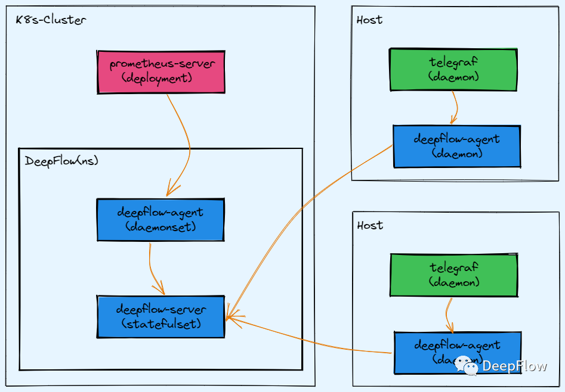
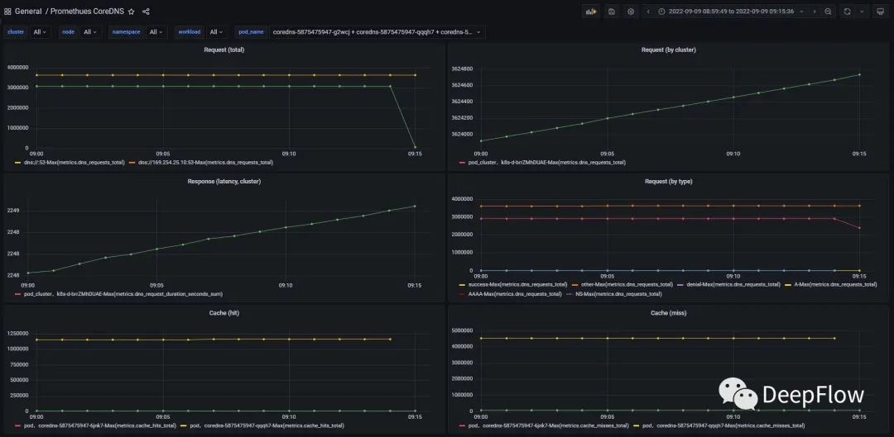
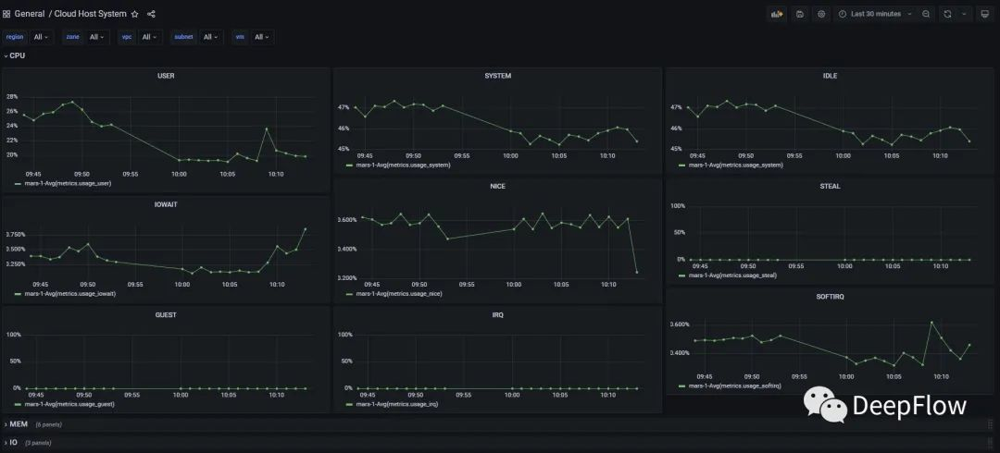
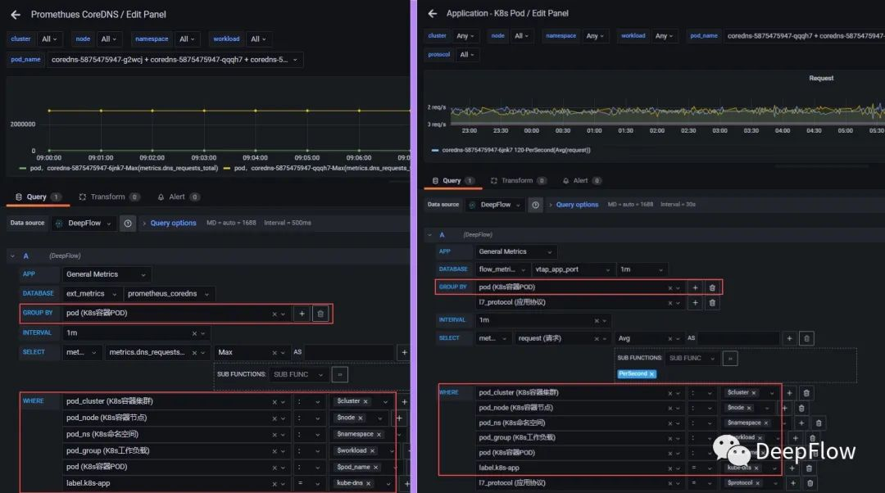
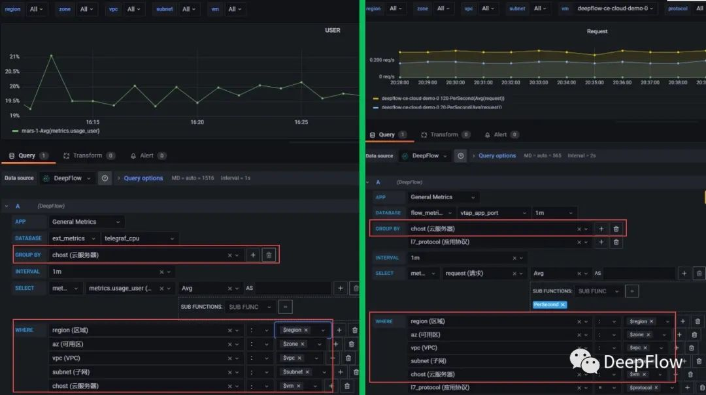
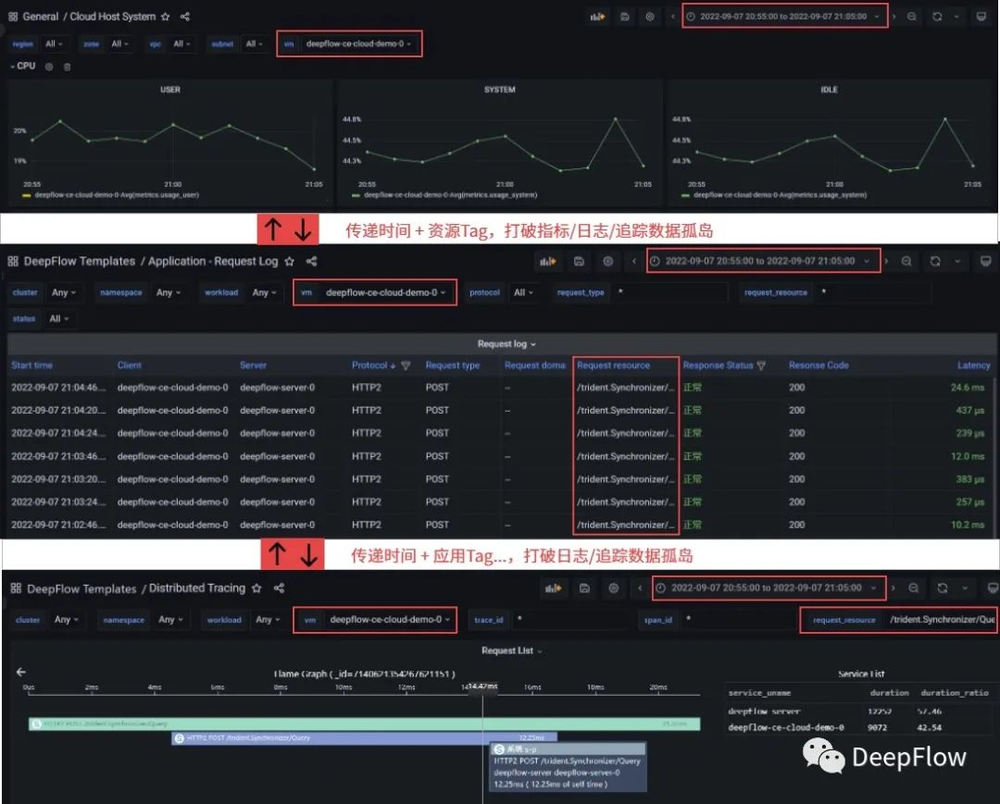
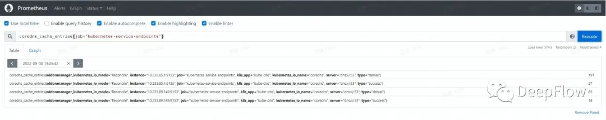
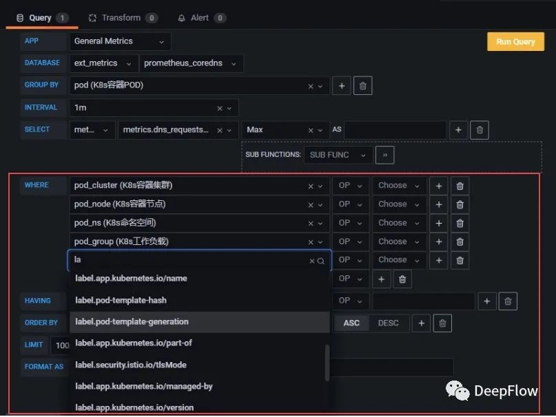

# **1 DeepFlow AutoTagging 之 Prometheus 标签标准化**

DeepFlow 是一个**高度自动化**的可观测性**协作**平台，其中的协作体现在对各类数据的标准化上。

**对于可观测性三大支柱之一的 Metrics，DeepFlow 不仅可利用 eBPF 自动采集应用程序的系统、网络、应用全栈黄金指标（AutoMetrics）**，

也可集成目前主流的指标数据源，例如云原生环境下的 Prometheus，传统环境中的 Telegraf 等。

**DeepFlow 的 AutoTagging 和 SmartEncoding 机制为所有数据源自动注入丰富的标准化标签，降低了开发运维人员构造数据标签的工作负担，也使得可观测性从此告别了数据孤岛**。

我们的系列文章将会逐一剖析 DeepFlow AutoTagging 的能力，作为开始，本文主要介绍以下四方面的内容：

* DeepFlow **如何集成** Prometheus/Telegraf 的指标数据
* DeepFlow **如何标准化注入** 丰富的标签，告别数据孤岛
* DeepFlow **如何自动化注入**的标签，降低标签注入负担
* DeepFlow **如何提升性能**，丰富化标准化与节能减排两不误

## **集成 Prometheus/Telegraf**

DeepFlow 目前支持集成 Prometheus 和 Telegraf 的指标，并自动为其注入丰富的标准化标签。集成 Prometheus/Telegraf 的数据流如下：



**集成 Prometheus 的配置见下：我们唯一要做的只是配置 `prometheus-server` 的 `remote_write`（对 remote_read 的支持也在排期中）**

```
remote_write:
  - url: http://${DEEPFLOW_AGENT_SVC}/api/v1/prometheus
```

**集成 Telegraf 的配置见下**：也只是需要指定 `output.http` 的端点。

```
[[outputs.http]]
  url = "http://${DEEPFLOW_AGENT_SVC}/api/v1/telegraf"
  data_format = "influx"
```

**`deepflow-agent` 需要打开数据接收（默认关闭，减少监听端口）**，详细配置命令请参考在线文档[1]：

```
vtap_group_id: <your-agent-group-id>
external_agent_http_proxy_enabled: 1
```

不超过五行配置，即可完成 Prometheus 或 Telegraf 的集成，并可以基于集成数据在 Grafana 中快速构建 Dashboard。例如基于 Prometheus 数据的容器环境 Dashboard：



基于 Telegraf 数据的 Host 环境 Dashaboard：



## **标签标准化，告别数据孤岛**

* **K8s 自定义 Label**：工作负载 Label、ReplicaSet Label、Pod Label，常见的 Label 例如 owner、commitId、version、env、group 等
* **K8s 资源信息**：集群、节点、命名空间、服务、Ingress、工作负载（Deployment/StatefulSet/DaemonSet）、ReplicaSet、Pod
* **云资源信息**：支持各大公有云 API，区域、可用区、云服务器、VPC、子网、路由器、安全组、NAT网关、负载均衡器、对等连接、云企业网、RDS、Redis

这些标签的数量还在持续增长中，未来我们也会增加对服务注册中心信息、进程信息等相关的标签，正在持续迭代中。

**不同数据源的指标数据，仅需传递一个唯一标签到 DeepFlow，即可全自动形式注入 DeepFlow 的所有标准化标签。**


对于 eBPF/cBPF 采集到的应用性能全栈指标，通过 IP 关联至所有的标签；对于 Prometheus 数据，通过 pod、instance 等标签扩展；对于 Telegraf 数据，通过 `pod_name`、运行IP 等标签扩展。

下面我们结合 DeepFlow 的 SQL API 和 Grafana Panel，实际来看看注入的标准化标签在实战中产生的丝滑效果。

**打通 AutoMetrics 和 Integration Metrics：**

下图左图为通过 Prometheus 集成的数据，右图为 DeepFlow eBPF/cBPF AutoMetrics。得益于标签的标准化，我们基于容器 Pod、K8s 自定义 Label 等信息的一个查询条件可以查询不同数据源。



下图左图为通过 Telegraf 集成的数据，右图为 DeepFlow eBPF/cBPF AutoMetrics。同样，我们基于云服务器、VPC 等资源信息的一个查询条件可以查询不同数据源。



**打通 Metrics、Tracing、Logging 三大支柱：**

得益于 DeepFlow 中所有数据的标签标准化，使用者不用关心不同数据源的差异，真正的打破数据孤岛。利用相同的标签、时间范围，即使在不懂底层原理、不懂业务逻辑、不懂组件架构等情况下，也能快速将整个系统相关的数据关联起来，快速定位问题发现根因。



## **标签自动化，降低工作负担**

Prometheus 的 relabeling 机制能够对 Metrics 的标签进行灵活的管理，Metrics 的所有标签都是在这个阶段统一注入或转换的，特别是 K8s 资源相关的信息。但是 relabeling 的配置非常复杂，以默认的 `kubernetes-service-endpoints` 配置为例我们来感受一下（期望没有戳中你的伤心处）：

```- job_name: kubernetes-service-endpoints
  # ...
  relabel_configs:
  - source_labels: [__meta_kubernetes_service_annotation_prometheus_io_scrape]
    separator: ;
    regex: "true"
    replacement: $1
    action: keep
  - source_labels: [__meta_kubernetes_service_annotation_prometheus_io_scrape_slow]
    separator: ;
    regex: "true"
    replacement: $1
    action: drop
  - source_labels: [__meta_kubernetes_service_annotation_prometheus_io_scheme]
    separator: ;
    regex: (https?)
    target_label: __scheme__
    replacement: $1
    action: replace
  - source_labels: [__meta_kubernetes_service_annotation_prometheus_io_path]
    separator: ;
    regex: (.+)
    target_label: __metrics_path__
    replacement: $1
    action: replace
  - source_labels: [__address__, __meta_kubernetes_service_annotation_prometheus_io_port]
    separator: ;
    regex: (.+?)(?::\d+)?;(\d+)
    target_label: __address__
    replacement: $1:$2
    action: replace
  - separator: ;
    regex: __meta_kubernetes_service_annotation_prometheus_io_param_(.+)
    replacement: __param_$1
    action: labelmap
  - separator: ;
    regex: __meta_kubernetes_service_label_(.+)
    replacement: $1
    action: labelmap
  - source_labels: [__meta_kubernetes_namespace]
    separator: ;
    regex: (.*)
    target_label: namespace
    replacement: $1
    action: replace
  - source_labels: [__meta_kubernetes_service_name]
    separator: ;
    regex: (.*)
    target_label: service
    replacement: $1
    action: replace
  - source_labels: [__meta_kubernetes_pod_node_name]
    separator: ;
    regex: (.*)
    target_label: node
    replacement: $1
    action: replace
```


可以想象如果我们要加更多的标签，或者我们要给自己的业务加标签，会变得更复杂。所以一般 relabeling 这种事，我是断（让）然（开）拒（发）绝（干）的！


**当使用 DeepFlow 集成 Prometheus 数据时，得益于 AutoTagging 机制，我们能够根据 instance 或 pod 自动扩展丰富的 K8s 自定义 Label、K8s 资源、云资源标签，不需要做任何的配置（又能和开发做朋友了）**。

那么，现在你可以将 relabeling 配置进行精简了（instance 标签总是会存在，对于 HostNet Pod 保留 pod 标签即可），精简之后的 Prometheus 变得非常清爽：



怎么查这些标签呢，切换到 Grafana 中，**DeepFlow 已经自动给 kubernetes-service-endpoints 指标量注入了非常丰富的标签**：




##**SmartEncoding，极致性能**

业务开发以及 Prometheus relabeling 为数据注入的标签过多时，通常会造成 Prometheus 巨大的存算压力。相信骨灰级 Prometheus 玩家痛苦的回忆就是在 keep、drop、replace 之间进行艰难的抉择。接入 DeepFlow 后，ClickHouse 的稀疏索引直接解决了高基标签问题，再也不用 drop 开发辛苦打的标签了。

那么大家可能会思考，DeepFlow 自动注入了这么多标签，会不会导致自身 agent 和 server 的资源消耗飙升？利用 SmartEncoding机制，我们将所有云资源、容器资源标签的注入成本降低了 10 倍，将 K8s 自定义 Label 的注入成本降到了 0。相关细节和可重现的 Benchmark 代码我们也会在后续的文章中逐步分享，同时也欢迎社区的小伙伴试用、压测、反馈。

## **未来展望**

Remote Read：是的，不支持 `remote_read` 接口的 Prometheus 方案是没有灵魂的，我们将会在后续版本中完善此能力。实现这个能力后，大家也可以切换为更加轻量级的 Prometheus Agent Mode 了。

PromQL：为了降低大家的使用门槛，并且让指标、追踪、日志有统一的查询体验，DeepFlow 使用标准的 SQL API。但 PromQL 实在太火了，而且有大量已经存在的告警策略、Grafana Dashaboard 基于此建立。DeepFlow 将会提供 PromQL 作为一种查询方言。

云资源标签、服务注册中心：除了自动注入云资源、容器资源、K8s 自定义 Label 以外，我们也会在后续版本中支持公有云资源标签以及服务注册中心信息的同步。

进程信息：eBPF 是 DeepFlow 的看家本领，无论是否在容器环境中，我们都会将通过 eBPF 采集到的进程信息注入到所有观测数据中。


## **关于 DeepFlow**

DeepFlow 是一款开源的高度自动化的可观测性平台，是为云原生应用开发者建设可观测性能力而量身打造的全栈、全链路、高性能数据引擎。DeepFlow 使用 eBPF、WASM、OpenTelemetry 等新技术，创新的实现了 AutoTracing、AutoMetrics、AutoTagging、SmartEncoding 等核心机制，帮助开发者提升埋点插码的自动化水平，降低可观测性平台的运维复杂度。利用 DeepFlow 的可编程能力和开放接口，开发者可以快速将其融入到自己的可观测性技术栈中。

GitHub 地址：https://github.com/deepflowys/deepflow

