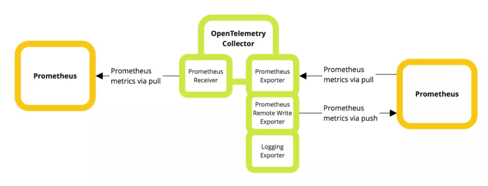
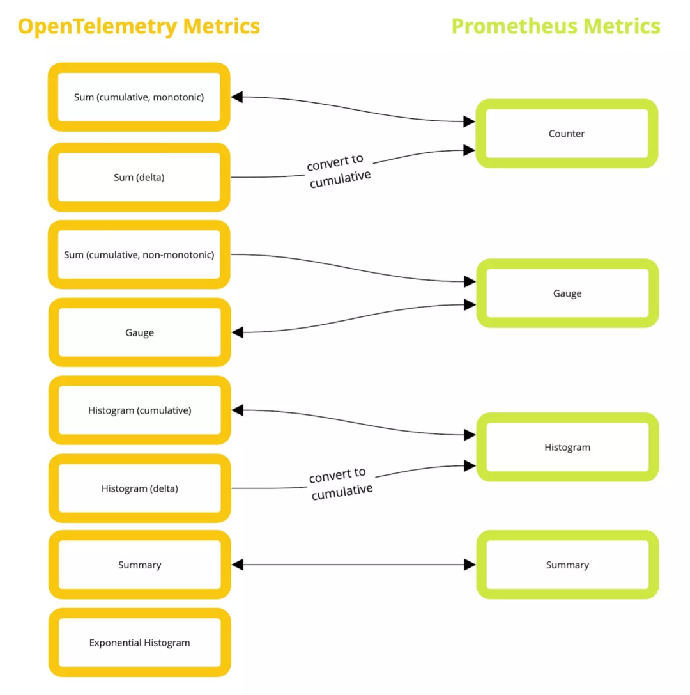

# **2 Prometheus与OpenTelemetry该选哪个？**

## **1 Prometheus vs. OpenTelemetry指标：共同点**

Prometheus是一个可观测性工具（包括收集、存储和查询），它使用的指标模型是为适应自己的需要而设计的

**另一方面，OpenTelemetry的指标组件将许多不同的数据模型转化为一个单一的框架（提供无存储或查询的集合）**。

这些核心差异反映了系统的复杂性：**Prometheus是一个直接的模型，通常以文本形式暴露出来，而OpenTelemetry是由三种模型组成的更复杂的系列，使用二进制格式进行传输。**

这两个系统也允许通过SDK进行代码级的监控，**但OpenTelemetry也专注于支持自动埋点，尽可能不会侵入应用程序。**

那么，你可以创建的指标之间有什么重叠？


本质上，OpenTelemetry允许表示所有Prometheus指标类型（**Counters、Gauges、Summaries和Histograms**）。

尽管如此，**Prometheus仍然不能表示OpenTelemetry指标的某些配置，包括Delta表示法和指数Histograms**（尽管这些将很快在Prometheus中被支持），以及整数数值类型。

**<mark>换句话说，Prometheus指标是OpenTelemetry指标的一个严格子集</mark>**。


## **2 主要区别**

虽然内部模型的工作方式有一些差异，但从开发者的角度来看，两者之间的实际差异更多是与生态系统有关。

**Prometheus提供指标收集、存储和查询。它通常通过一个简单的爬虫系统收集指标，从主机中提取数据**。

Prometheus数据库存储这些数据，然后你可以用Prometheus查询语言PromQL来查询。

Prometheus数据库可以处理大量的数据，但它并不是正式意义上的长期存储解决方案，所以数据通常在一段时间后被发送到另一个存储解决方案，如Promsale，但仍然可以通过PromQL进行读取。

**<mark>OpenTelemetry的领域要小得多。它通过推送或拉动，使用统一的API收集指标（以及链路追踪和日志），可能会对它们进行转换，并将它们发送到其他系统进行存储或查询。</mark>**

通过只关注可观测性中与应用程序交互的部分，**OpenTelemetry将Signal的创建与存储、查询问题解耦**。

具有讽刺意味的是，**这意味着OpenTelemetry的指标往往最终会回到Prometheus或与Prometheus兼容的系统中**。

当我们在看实际的指标类型时，有几个区别：


* **OpenTelemetry可以将指标表示为差值，而不是累积值，存储每个数据点之间的差异，而不是累积值**。Prometheus在设计上不允许这样做，尽管你可以在查询时计算出这些值。这不是OpenTelemetry的默认选项，主要用于那些只表示为速率的指标。
* OpenTelemetry还允许指标点值是整数而不是浮点数，这是Prometheus无法表达的。
* OpenTelemetry可以给Histogram附加一些额外的元数据，**允许跟踪最大和最小值**。
* 最后，OpenTelemetry有一个指数直方图聚合类型（它使用一个公式和一个比例来计算桶的大小）。Prometheus目前还不能表示这个，但确实有一个完全兼容的指标类型正在开发中。


## **3 — 选择其一**

如果你还没有对这两种技术中的一种进行投资，在Prometheus和OpenTelemetry之间的选择可能会归结为四个问题：

* **你是否计划捕获链路追踪、日志和指标**？如果是这样，OpenTelemetry将允许你使用相同的库来测量所有三种信号类型，这是一个很大的好处。你甚至可以把所有这三种信号发送到同一个后端，并使用一种语言来查询它们（例如，Promscale和SQL）。

* **你是否重视稳定性和经过战斗考验的系统？**如果是这样，随着OpenTelemetry在生产上的逐步推广，**Prometheus或许是最近这几年的正确答案**。

* **你想使用一个多步骤的路由和转换管道吗**？如果是这样，也许OpenTelemetry可能值得一看。

你希望能够保持尽可能的灵活性吗？那么OpenTelemetry就适合你，因为它不实现任何存储或查询，给你最大的灵活性。

**大多数组织可能会混合使用两种标准。Prometheus用于基础设施监控，利用更成熟的集成生态系统从数百个组件中提取指标，而OpenTelemetry用于已开发的服务**

**许多工程师可能会使用Prometheus作为后端来存储Prometheus和OpenTelemetry指标，并需要确保他们产生的OpenTelemetry指标与Prometheus兼容。**

在实践中，**这意味着选择时间的累积聚合，并且只使用Prometheus支持的OpenTelemetry指标类型**（在Prometheus增加对OpenTelemetry指数直方图的支持之前，暂不考虑这些指标）。

## **4 — 在Prometheus和OpenTelemetry之间转换**

如果你既想混合使用，同时也想匹配标准，那么好消息是OpenTelemetry提供了OpenTelemetry收集器，它可以帮助同时兼顾两个方向（如果在某些情况下需要，甚至在类型之间进行转换）。

**OpenTelemetry Collector是可插拔的，允许在运行时使用配置文件来启用Receiver和Exporter组件**。

我们将使用contrib包，其中包括许多Receiver和Exporter。你可以从GitHub的[Release页面](https://github.com/open-telemetry/opentelemetry-collector-releases/releases) 下载相应的二进制文件。另外，如果你在生产中运行采集器，你也可以使用[OpenTelemetry收集器构建工具](https://github.com/open-telemetry/opentelemetry-collector/tree/main/cmd/builder) 编译一个只包含你需要的组件的版本。

在下面的例子中，我们用以下的配置文件运行采集器，该文件保存为config.yaml：

```
receivers:
prometheus:
config:
  scrape_configs:
    - job_name: demo
      scrape_interval: 15s
      static_configs:
        - targets: ['localhost:9090']

exporters:
prometheus:
 endpoint: "0.0.0.0:1234"
logging:
loglevel: debug

service:
telemetry:
logs:
  level: debug
pipelines:
metrics:
  receivers: [prometheus]
  processors: []
  exporters: [logging,prometheus]
```

然后我们可以通过以下命令启动采集器：

```
otelcol –config config.yaml
```

采集器将使用Prometheus Receiver来尝试抓取Prometheus服务，地址是`http://localhost:9100`。如果你需要一些东西来测试，你可以启动一个使用这个端口的本地`node_exporter`。

当数据从这个服务中被抓取时，你会看到它显示在收集器的日志输出中，而且它也可以从Prometheus Exporter的端点中获得，收集器运行在`http://localhost:1234`。

**<mark>Prometheus的远程写入（Remote Write）Exporter也是一个选择，但在现阶段它的应用范围比较有限，只能处理积累Counters和Gauges。</mark>**



> 说明Prometheus如何与OpenTelemetry收集器互动

在Prometheus的上下文中，**Counter是单调的（持续增加），而Gauge则不是（它可以上升和下降）**

**Summary报告百分位，不需要那么多的客户端计算。另一方面，Histogram更灵活，提供原始桶的宽度和计数值**

相比之下，OpenTelemetry有五种指标类型：**Sums、Gauges、Summaries、Histograms和指数Histograms**。


如果你是一个创建OpenTelemetry指标的开发者，你处理的是事件模型（Event Model），然后由OpenTelemetry SDK翻译（用于传输）为OpenTelemetry协议（OTLP）流模型。

我们在这里引用的指标类型是OTPL模型的一部分，[Prometheus Receiver](https://github.com/open-telemetry/opentelemetry-collector-contrib/blob/main/receiver/prometheusreceiver/README.md)直接翻译成这种模型。

幸运的是，这些新的指标类型是不言自明的，直接映射到Prometheus的指标类型上（Summary只为Prometheus兼容而实现，你不会在其他地方看到它的使用）。指数Histogram是个例外，它目前不能被转换到Prometheus指标（但将来可以被转换）。

下图描述了每个方向上的映射是如何工作的



OpenTelemetry承诺对Prometheus指标进行无损转换，使用户能够根据需要进行转换而不必担心数据丢失。

## **5 — 将Prometheus转换成OpenTelemetry**

让我们通过看Prometheus抓取和OpenTelemetry指标的例子来探索Prometheus到OpenTelemetry的转换是如何进行的。

**虽然OpenTelemetry没有像Prometheus那样的文本协议，但我们可以使用Logging Exporter来发射捕获到的指标的文本转储形式**。

OpenTelemetry将从抓取任务本身提取一些信息并存储起来，产生以下输出，其中定义了将附加到所有指标的资源标签。

```
Resource SchemaURL:
Resource labels:
 -> service.name: STRING(node-exporter)
 -> service.instance.id: STRING(127.0.0.1:9100)
 -> net.host.port: STRING(9100)
 -> http.scheme: STRING(http)
Counters
```

如果我们有如下的Prometheus抓取数据，并把采集器指向它：

```
HELP http_requests_total Total HTTP requests served
TYPE http_requests_total counter
http_requests_total{method="post",code="200"} 1028
http_requests_total{method="post",code="400"}    5
```

然后收集器将从日志Exporter中输出以下指标。

```
Metric #0
Descriptor:
 -> Name: http_requests_total
 -> Description: Total HTTP requests served
 -> Unit:
 -> DataType: Sum
 -> IsMonotonic:true-> AggregationTemporality: AGGREGATION_TEMPORALITY_CUMULATIVE
NumberDataPoints #0
Data point attributes:
 -> code: STRING(200)
 -> method: STRING(post)
StartTimestamp: 2022-06-16 11:49:22.117 +0000 UTC
Timestamp: 2022-06-16 11:49:22.117 +0000 UTC
Value: 1028.000000
NumberDataPoints #1
Data point attributes:
 -> code: STRING(400)
 -> method: STRING(post)
StartTimestamp: 2022-06-16 11:49:22.117 +0000 UTC
Timestamp: 2022-06-16 11:49:22.117 +0000 UTC
Value: 5.00000
```

我们可以看到指标的类型（DataType）**是Sum，AggregationTemporality是Cumulative（Prometheus支持的唯一聚合方式）**。

**每个数据点有两个时间戳，以跟踪Counter的复位。Timestamp是记录的时间，StartTimestamp是收到第一个样本的时间或最后一次计数器复位的时间，没有指定单位**。

**这是因为Prometheus指定单位的方式是将其作为文本度量名称的一部分，这不能被OpenTelemetry Collector准确解码**

### **Gauges**

如果我们有一个Prometheus的Gauge数据，并抓取它：

```
HELP node_filesystem_avail_bytes Available bytes in filesystems
TYPE node_filesystem_avail_bytes gauge
node_filesystem_avail_bytes{method="/data",fstype="ext4"} 250294
```

我们会在采集器上看到如下数据：

```
Metric #0
Descriptor:
 -> Name: node_filesystem_avail_bytes
 -> Description: Available bytes in filesystems
 -> Unit:
 -> DataType: Gauge
NumberDataPoints #0
Data point attributes:
 -> fstype: STRING(ext4)
 -> method: STRING(/data)
StartTimestamp: 1970-01-01 00:00:00 +0000 UTC
Timestamp: 2022-06-23 07:42:07.117 +0000 UTC
Value: 250294.000000
```

这里，数据类型被设置为Gauge。Gauge是OpenTelemetry将转换为的默认指标类型，所以在Prometheus的数据中缺少# TYPE行，将导致出现一个Gauge。


**Prometheus本身实际上并不会使用类型信息（它在内部并不区分Counter和Gauge），所以一些Exporter会放弃这两行注释，以使抓取行为更有效率。这将导致所有OpenTelemetry指标都是Gauge。**

### **Histograms**

Prometheus的histogram数据如下：

```
HELP http_request_duration_seconds Histogram of latencies for HTTP requests.
TYPE http_request_duration_seconds histogram
http_request_duration_seconds_bucket{handler="/",le="0.1"} 25547
http_request_duration_seconds_bucket{handler="/",le="0.2"} 26688
http_request_duration_seconds_bucket{handler="/",le="0.4"} 27760
http_request_duration_seconds_bucket{handler="/",le="1"} 28641
http_request_duration_seconds_bucket{handler="/",le="3"} 28782
http_request_duration_seconds_bucket{handler="/",le="8"} 28844
http_request_duration_seconds_bucket{handler="/",le="20"} 28855
http_request_duration_seconds_bucket{handler="/",le="60"} 28860
http_request_duration_seconds_bucket{handler="/",le="120"} 28860
http_request_duration_seconds_bucket{handler="/",le="+Inf"} 28860
http_request_duration_seconds_sum{handler="/"} 1863.80491025699
http_request_duration_seconds_count{handler="/"} 28860
```

在OpenTelemetry的日志Exporter中会以如下格式表示：

```
Metric #0
Descriptor:
 -> Name: prometheus_http_request_duration_seconds
 -> Description: Histogram of latencies for HTTP requests.
 -> Unit:
 -> DataType: Histogram
 -> AggregationTemporality: AGGREGATION_TEMPORALITY_CUMULATIVE
HistogramDataPoints #0
Data point attributes:
 -> handler: STRING(/)
StartTimestamp: 2022-06-23 07:54:07.117 +0000 UTC
Timestamp: 2022-06-23 07:54:07.117 +0000 UTC
Count: 28860
Sum: 1863.804910
ExplicitBounds #0: 0.100000
ExplicitBounds #1: 0.200000
ExplicitBounds #2: 0.400000
ExplicitBounds #3: 1.000000
ExplicitBounds #4: 3.000000
ExplicitBounds #5: 8.000000
ExplicitBounds #6: 20.000000
ExplicitBounds #7: 60.000000
ExplicitBounds #8: 120.000000
Buckets #0, Count: 25547
Buckets #1, Count: 1141
Buckets #2, Count: 1072
Buckets #3, Count: 881
Buckets #4, Count: 141
Buckets #5, Count: 62
Buckets #6, Count: 11
Buckets #7, Count: 5
Buckets #8, Count: 0
Buckets #9, Count: 0
```

我们可以看到在OpenTelemetry中创建了一个Histogram，但有一点我们不能做的是包括最小值和最大值（OpenTelemetry支持，但Prometheus不支持）。

### Summaries

Prometheus的summary数据如下：

```
HELP prometheus_rule_evaluation_duration_seconds The duration for a rule to execute.
TYPE prometheus_rule_evaluation_duration_seconds summary
prometheus_rule_evaluation_duration_seconds{quantile="0.5"} 6.4853e-05
prometheus_rule_evaluation_duration_seconds{quantile="0.9"} 0.00010102
prometheus_rule_evaluation_duration_seconds{quantile="0.99"} 0.000177367
prometheus_rule_evaluation_duration_seconds_sum 1.623860968846092e+06
prometheus_rule_evaluation_duration_seconds_count 1.112293682e+09
```

在OpenTelemetry的日志Exporter中会以如下格式表示：

```
Metric #3
Descriptor:
 -> Name: prometheus_rule_evaluation_duration_seconds
 -> Description: The duration for a rule to execute.
 -> Unit:
 -> DataType: Summary
SummaryDataPoints #0
StartTimestamp: 2022-06-23 07:50:22.117 +0000 UTC
Timestamp: 2022-06-23 07:50:22.117 +0000 UTC
Count: 1112293682
Sum: 1623860.968846
QuantileValue #0: Quantile 0.500000, Value 0.000065
QuantileValue #1: Quantile 0.900000, Value 0.000101
QuantileValue #2: Quantile 0.990000, Value 0.000177
```

我们可以看到，这里选择了OpenTelemetry Summary指标类型——记住这是为Prometheus集成明确创建的，不应该在其他地方使用。**它类似于直方图的输出，但是列出了百分位，而不是明确的桶和桶计数**。

## **6 将OpenTelemetry转换成Prometheus**

使用Prometheus Exporter允许抓取，或者使用Prometheus Remote Write Exporter直接推送到另一个Prometheus实例，我们可以将指标从OpenTelemetry发送到Prometheus。这方面没有任何意外：如果转换被支持，它的发生不会有任何精度的损失。

**需要记住的一点是，有一些OpenTelemetry指标的配置，我们不能直接转化为Prometheus指标，因为Prometheus有一个更受约束的模型。**


任何AggregationTemporality为DELTA的指标将被Prometheus Exporter转换回CUMULATIVE（并且将被Prometheus Remote Write Exporter拒绝）。Prometheus Remote Write Exporter也会拒绝Summary和Histogram指标，但这些指标由Prometheus Exporter完美管理。 带有整数值的OpenTelemetry指标将被转换为浮点数。

例如，从Prometheus Exporter（当以上部分的所有例子都被消费后）进行的抓取会产生以下结果。你会看到，每个值都与前面几节中输入的Prometheus值完全相同，没有任何保真度的损失。

```
HELP http_request_duration_seconds Histogram of latencies for HTTP requests.
TYPE http_request_duration_seconds histogram
http_request_duration_seconds_bucket{handler="/",instance="127.0.0.1:9100",job="node-exporter",le="0.1"} 25547
http_request_duration_seconds_bucket{handler="/",instance="127.0.0.1:9100",job="node-exporter",le="0.2"} 26688
http_request_duration_seconds_bucket{handler="/",instance="127.0.0.1:9100",job="node-exporter",le="0.4"} 27760
http_request_duration_seconds_bucket{handler="/",instance="127.0.0.1:9100",job="node-exporter",le="1"} 28641
http_request_duration_seconds_bucket{handler="/",instance="127.0.0.1:9100",job="node-exporter",le="3"} 28782
http_request_duration_seconds_bucket{handler="/",instance="127.0.0.1:9100",job="node-exporter",le="8"} 28844
http_request_duration_seconds_bucket{handler="/",instance="127.0.0.1:9100",job="node-exporter",le="20"} 28855
http_request_duration_seconds_bucket{handler="/",instance="127.0.0.1:9100",job="node-exporter",le="60"} 28860
http_request_duration_seconds_bucket{handler="/",instance="127.0.0.1:9100",job="node-exporter",le="120"} 28860
http_request_duration_seconds_bucket{handler="/",instance="127.0.0.1:9100",job="node-exporter",le="+Inf"} 28860
http_request_duration_seconds_sum{handler="/",instance="127.0.0.1:9100",job="node-exporter"} 1863.80491025699
http_request_duration_seconds_count{handler="/",instance="127.0.0.1:9100",job="node-exporter"} 28860
HELP http_requests_total Total HTTP requests served
TYPE http_requests_total counter
http_requests_total{code="200",instance="127.0.0.1:9100",job="node-exporter",method="post"} 907
http_requests_total{code="400",instance="127.0.0.1:9100",job="node-exporter",method="post"} 5
HELP node_filesystem_avail_bytes Available bytes in filesystems
TYPE node_filesystem_avail_bytes gauge
node_filesystem_avail_bytes{fstype="ext4",instance="127.0.0.1:9100",job="node-exporter",method="/data"} 250294
HELP prometheus_rule_evaluation_duration_seconds The duration for a rule to execute.
TYPE prometheus_rule_evaluation_duration_seconds summary
prometheus_rule_evaluation_duration_seconds{instance="127.0.0.1:9100",job="node-exporter",quantile="0.5"} 6.4853e-05
prometheus_rule_evaluation_duration_seconds{instance="127.0.0.1:9100",job="node-exporter",quantile="0.9"} 0.00010102
prometheus_rule_evaluation_duration_seconds{instance="127.0.0.1:9100",job="node-exporter",quantile="0.99"} 0.000177367
prometheus_rule_evaluation_duration_seconds_sum{instance="127.0.0.1:9100",job="node-exporter"} 1.623860968846092e+06
prometheus_rule_evaluation_duration_seconds_count{instance="127.0.0.1:9100",job="node-exporter"} 1.112293682e+09
HELP scrape_duration_seconds Duration of the scrape
TYPE scrape_duration_seconds gauge
scrape_duration_seconds{instance="127.0.0.1:9100",job="node-exporter"} 0.003231334
HELP scrape_samples_post_metric_relabeling The number of samples remaining after metric relabeling was applied
TYPE scrape_samples_post_metric_relabeling gauge
scrape_samples_post_metric_relabeling{instance="127.0.0.1:9100",job="node-exporter"} 20
HELP scrape_samples_scraped The number of samples the target exposed
TYPE scrape_samples_scraped gauge
scrape_samples_scraped{instance="127.0.0.1:9100",job="node-exporter"} 20
HELP scrape_series_added The approximate number of new series in this scrape
TYPE scrape_series_added gauge
scrape_series_added{instance="127.0.0.1:9100",job="node-exporter"} 20
HELP up The scraping was successful
TYPE up gauge
up{instance="127.0.0.1:9100",job="node-exporter"} 1
```

当转换到Prometheus时，请记住我们目前只有两种选择：

* 一种是使用Prometheus Exporter，这意味着我们所有的数据都以单一的抓取的方式暴露出来，如果你有大量的序列，就不能很好地扩展。
* 第二个选项是使用Prometheus Remote Write Exporter，我们希望它有更好的扩展性，**但仅限于Counter和Gauge，并且不会进行DELTA到CUMULATIVE的转换（它将丢弃这些指标）**。

## 7  决定时刻

总结一下，Prometheus和OpenTelemetry提供的指标实现的角度略有不同。Prometheus是事实上的标准，涵盖了指标的创建、存储和查询，而OpenTelemetry比较新，只涵盖指标的生成。不过，它也支持使用相同的SDK进行跟踪和记录。

你主要可以在两者之间进行转换，而不会有任何精度上的损失——但是你要知道，有些指标类型会有轻微的变化。

**例如，所有OpenTelemetry的DELTA指标在导出为Prometheus指标之前将被转换为CUMULATIVE，而且Prometheus在增加支持之前不能表示OpenTelemetry的指数直方图**

**Prometheus会给你一个久经考验的系统。而OpenTelemetry，则是一个更广泛和灵活的标准。**