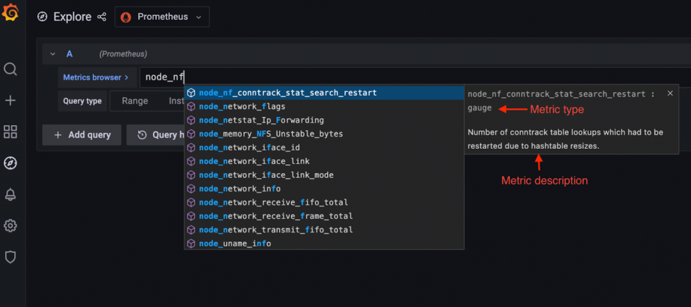
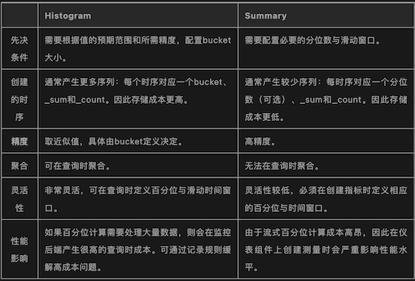

# **L3 Prometheus的四种指标类型**

指标是用来衡量性能、消耗、效率和许多其他软件属性随时间的变化趋势。它们允许工程师通过警报和仪表盘来监控一系列测量值的演变（如CPU或内存使用量、请求持续时间、延迟等）。

在其最基本的形式中，一个指标数据点是由以下三个部分构成：

* **一个指标名称**
* **收集该数据点的时间戳**
* 一个由数字表示的测量值

在过去的十年里，随着系统变得越来越复杂，出现了维度度量的概念，也就是说，度量还包括一组标签或标识（即维度），以提供额外的上下文。**支持维度指标的监控系统允许工程师通过查询特定的指标名称，并通过标签进行过滤和分组，从而轻易地在多个组件和维度上汇总和分析一个指标**。


**Prometheus定义了一个度量说明格式和一个远程写入协议，社区和许多供应商都采用这个协议来说明和收集度量成为事实上的标准**。

**OpenMetrics是另一个CNCF项目，它建立在Prometheus导出格式的基础上**，为收集度量标准提供了一个与厂商无关的标准化模型，旨在成为互联网工程任务组（IEFT）的一部分。

最近，另一个CNCF项目OpenTelemetry出现了，**它的目标是提供一个新的标准，能够统一指标、链路跟踪和日志的收集，使跨领域的遥测信号收集和关联更容易**。

## **Prometheus指标**

首先要做的事。Prometheus收集的指标有四种，作为其暴露格式的一部分。

* Counters
* Gauges
* Histograms
* Summaries


Prometheus使用拉取模型来收集这些指标；也就是说，**Prometheus主动抓取暴露指标的HTTP端点**。

这些端点可以是由被监控的组件自然暴露，也可以通过社区建立的数百个Prometheus导出器之一暴露出来。Prometheus提供了不同编程语言的客户端库，你可以用它来监控你的代码

由于服务发现机制和集群内的共享网络访问，拉取模型在监控Kubernetes集群时效果很好，**但用Prometheus监控动态的虚拟机集群、AWS Fargate容器或Lambda函数就比较困难了。**


为什么呢？主要原因是交易确定要抓取的指标端点，而且对这些端点的访问可能受到网络安全策略的限制。为了解决其中的一些问题，社区在2021年底发布了Prometheus Agent Mode，它只收集指标并使用远程写入协议将其发送到监控后端。


**Prometheus可以抓取Prometheus暴露格式和OpenMetrics格式的指标**。在这两种情况下，**指标通过HTTP接口暴露，使用简单的基于文本的格式**（更常用和广泛支持）或更有效和强大的Protobuf格式。文本格式的一大优势是它的可读性，这意味着你可以在浏览器中打开它或使用像curl这样的工具来检索当前暴露的指标集。

Prometheus使用一个非常简单的指标模型，有四种指标类型，只在客户端SDK中支持。所有的指标类型都是用一种数据类型或由多个单一数据类型的组合在暴露格式中表示。这个数据类型包括一个指标名称、一组标签和一个浮点数。时间戳是由监控后端（例如Prometheus）或代理在抓取指标时添加的。

**指标名称和标签集的每个唯一组合定义了一条时间序列，而每个时间戳和浮点数定义了一个系列中的样本（即一个数据点）。**

一些惯例被用来表示不同的度量类型。

Prometheus暴露格式的一个非常有用的特点是能够将元数据与度量相关联，以定义其类型并提供描述。例如，Prometheus提供了这些信息，Grafana利用这些信息向用户显示额外的上下文信息，帮助他们选择正确的度量并应用正确的PromQL函数。



> Grafana中的指标浏览器显示Prometheus指标的列表，并显示有关这些指标的额外背景。

以下是一个通过Prometheus暴露格式暴露的指标的案例。

```
# HELP http_requests_total Total number of http api requests
# TYPE http_requests_total counter
http_requests_total{api="add_product"} 4633433

# HELP用来为指标提供描述，# TYPE为指标提供类型。
```

现在，让我们来更详细地介绍一下每个Prometheus指标类型。

### 计数器（Counter）

**Counter类型指标被用于单调增加的测量结果**。因此它们总是累积的数值，值只能上升。唯一的例外是Counter重启，在这种情况下，它的值会被重置为零。

**Counter的实际值通常本身并不十分有用**。一个计数器的值经常被用来计算两个时间戳之间的delta或者随时间变化的速率。

**例如，Counter的一个典型用例是记录API调用次数，这是一个总是会增加的测量值。**

```
# HELP http_requests_total Total number of http api requests
# TYPE http_requests_total counter
http_requests_total{api="add_product"} 4633433
```

指标名称是`http_requests_total`，它有一个名为api的标签，值为`add_product`，Counter的值为4633433。

这意味着自从上次服务启动或Counter重置以来，`add_product`的API已经被调用了4633433次。按照惯例，Counter类型的指标通常以`_total`为后缀。

这个绝对数字并没有给我们提供多少信息，**但当与PromQL的rate函数（或其他监控后端的类似函数）一起使用时，它可以帮助我们了解该API每秒收到的请求数**。下面的PromQL查询计算了过去5分钟内每秒的平均请求数。

```
rate(http_requests_total{api="add_product"}[5m])
```

**为了计算一段时期内的绝对变化，我们将使用delta函数，在PromQL中称为increate()**：

```
increase(http_requests_total{api="add_product"}[5m])
```

**这将返回过去5分钟内的总请求数，这相当于用每秒的速率乘以间隔时间的秒数（在我们的例子中是5分钟）**：

```
rate(http_requests_total{api="add_product"}[5m]) * 5 * 60
```

其他你可能会使用Counter类型指标的例子：**测量电子商务网站的订单数量，在网络接口上发送和接收的字节数，或者应用程序中的错误数量**。

**如果它是一个会一直上升的指标，那么就使用一个Counter**。

下面是一个例子，说明如何使用Prometheus客户端库在Python中创建和增加一个计数器指标：

```
from prometheus_client import Counter
api_requests_counter = Counter(
                        'http_requests_total',
                        'Total number of http api requests',
                        ['api']
                       )
api_requests_counter.labels(api='add_product').inc()
```

需要注意的是，由于Counter可以被重置为零，你要确保你用来存储和查询指标的后端能够支持这种情况，并且在Counter重启的情况下仍然提供准确的结果。Prometheus和兼容PromQL的Prometheus远程存储系统，如Promscale，可以正确处理Counter重启。

### **仪表（Gauge）**

**Gauge指标用于可以任意增加或减少的测量。**

这是你可能更熟悉的指标类型，因为即使没有经过额外处理的实际值也是有意义的，它们经常被使用到。**例如，测量温度、CPU和内存使用的指标，或者队列的大小都是Gauge**。

例如，为了测量一台主机的内存使用情况，我们可以使用一个Gauge指标，比如：

```
# HELP node_memory_used_bytes Total memory used in the node in bytes
# TYPE node_memory_used_bytes gauge
node_memory_used_bytes{hostname="host1.domain.com"} 943348382
```

上面的指标表明，在测量时，节点`host1.domain.com`使用的内存约为900 MB。

该指标的值是有意义的，不需要任何额外的计算，因为它告诉我们该节点上消耗了多少内存。

**与使用Counter指标时不同，rate和delta函数对Gauge没有意义**。**然而，计算特定时间序列的平均数、最大值、最小值或百分比的函数经常与`Gauge`一起使用**。

在Prometheus中，这些函数的名称是`avg_over_time`、`max_over_time`、`min_over_time`和`quantile_over_time`。

要计算过去10分钟内在host1.domain.com上使用的平均内存，你可以这样做：

```
avg_over_time(node_memory_used_bytes{hostname="host1.domain.com"}[10m])
```

要使用Prometheus客户端库在Python中创建一个Gauge指标，你可以这样做：

```
from prometheus_client import Gauge
memory_used = Gauge(
                'node_memory_used_bytes',
                'Total memory used in the node in bytes',
                ['hostname']
              )
memory_used.labels(hostname='host1.domain.com').set(943348382)
```

### **直方图（Histogram）**

**Histogram指标对于表示测量的分布很有用。它们经常被用来测量请求持续时间或响应大小。**

直方图将整个测量范围划分为一组区间，称为桶，并计算每个桶中有多少测量值。

一个直方图指标包括几个项目：

1. 一个包含测量次数的Counter。指标名称使用`_count`后缀。
2. 一个包含所有测量值之和的Counter。指标名称使用`_sum`后缀。
3. 直方图桶被暴露为一系列的Counter，使用指标名称的后缀`_bucket`和表示桶的上限的le label。

Prometheus中的桶是包含桶的边界的，即一个上限为N的桶（即le label）包括所有数值小于或等于N的数据点。

例如，测量运行在`host1.domain.com`实例上的`add_productAPI`端点实例的响应时间的Histogram指标可以表示为：

```
# HELP http_request_duration_seconds Api requests response time in seconds
# TYPE http_request_duration_seconds histogram
http_request_duration_seconds_sum{api="add_product" instance="host1.domain.com"} 8953.332
http_request_duration_seconds_count{api="add_product" instance="host1.domain.com"} 27892
http_request_duration_seconds_bucket{api="add_product" instance="host1.domain.com" le="0"}
http_request_duration_seconds_bucket{api="add_product", instance="host1.domain.com", le="0.01"} 0
http_request_duration_seconds_bucket{api="add_product", instance="host1.domain.com", le="0.025"} 8
http_request_duration_seconds_bucket{api="add_product", instance="host1.domain.com", le="0.05"} 1672
http_request_duration_seconds_bucket{api="add_product", instance="host1.domain.com", le="0.1"} 8954
http_request_duration_seconds_bucket{api="add_product", instance="host1.domain.com", le="0.25"} 14251
http_request_duration_seconds_bucket{api="add_product", instance="host1.domain.com", le="0.5"} 24101
http_request_duration_seconds_bucket{api="add_product", instance="host1.domain.com", le="1"} 26351
http_request_duration_seconds_bucket{api="add_product", instance="host1.domain.com", le="2.5"} 27534
http_request_duration_seconds_bucket{api="add_product", instance="host1.domain.com", le="5"} 27814
http_request_duration_seconds_bucket{api="add_product", instance="host1.domain.com", le="10"} 27881
http_request_duration_seconds_bucket{api="add_product", instance="host1.domain.com", le="25"} 27890
http_request_duration_seconds_bucket{api="add_product", instance="host1.domain.com", le="+Inf"} 27892
```

上面的例子包括sum、counter和12个桶。sum和counter可以用来计算一个测量值随时间变化的平均值。在PromQL中，过去5分钟的平均请求响应时间可以通过如下方式计算得到。

```
rate(http_request_duration_seconds_sum{api="add_product", instance="host1.domain.com"}[5m]) / rate(http_request_duration_seconds_count{api="add_product", instance="host1.domain.com"}[5m])
```

**它也可以被用来计算各时间序列的平均数**。下面的PromQL查询将计算出所有API和实例在过去5分钟内的平均请求响应时间。

```
sum(rate(http_request_duration_seconds_sum[5m])) / sum(rate(http_request_duration_seconds_count[5m]))
```

利用Histogram，你可以在查询时计算单个时间序列以及多个时间序列的百分位。

在PromQL中，我们将使用`histogram_quantile`函数。Prometheus使用分位数而不是百分位数。它们本质上是一样的，但是以0到1的比例表示的，而百分位数是以0到100的比例表示的。

要计算在`host1.domain.com`上运行的`add_product API`响应时间的第99百分位数（0.99四分位数），你可以使用以下查询。

```
histogram_quantile(0.99, rate(http_request_duration_seconds_bucket{api="add_product", instance="host1.domain.com"}[5m]))
```

Histograms的一大优势是可以进行汇总。下面的查询返回所有API和实例的响应时间的第99个百分点‍：

```
histogram_quantile(0.99, sum by (le) (rate(http_request_duration_seconds_bucket[5m])))
```

在云原生环境中，通常有许多相同组件的多个实例在运行，能否跨实例汇总数据是关键。

Histograms有三个主要的缺点：

* **首先，桶必须是预定义的，这需要一些前期的设计**。如果你的桶没有被很好地定义，你可能无法计算出你需要的百分比，或者会消耗不必要的资源。例如，如果你有一个总是需要超过一秒钟的API，那么拥有上限（le label）小于一秒钟的桶将是无用的，只会消耗监控后端服务器的计算和存储资源。另一方面，如果99.9%的API请求耗时少于50毫秒，那么拥有一个上限为100毫秒的初始桶将无法让你准确测量API的性能。
* **第二，他们提供的是近似的百分位数，而不是精确的百分位数**。这通常没什么问题，只要你的桶被设计为提供具有合理准确性的结果。
* **第三，由于百分位数需要在服务器端计算，当有大量数据需要处理时，它们的计算成本会非常高**。在Prometheus中减轻这种情况的一个方法是使用录制规则来预先计算所需的百分位数。

下面的例子显示了如何使用Prometheus的Python客户端库创建一个带有自定义桶的直方图指标。

```
from prometheus_client import Histogram
api_request_duration = Histogram(
                        name='http_request_duration_seconds',
                        documentation='Api requests response time in seconds',
                        labelnames=['api', 'instance'],
                        buckets=(0.01, 0.025, 0.05, 0.1, 0.25, 0.5, 1, 2.5, 5, 10, 25 )
                       )
api_request_duration.labels(
    api='add_product',
    instance='host1.domain.com'
).observe(0.3672)
```

### **汇总（Summary）**

**像直方图一样，Summary指标对于测量请求持续时间和响应体大小很有用**。

像直方图一样，汇总度量对于测量请求持续时间和响应大小很有用。

一个Summary指标包括这些指标：

* 一个包含总测量次数的Counter。指标名称使用_count后缀。
* 一个包含所有测量值之和的Counter。指标名称使用_sum后缀。可以选择使用带有分位数标签的指标名称，来暴露一些测量值的分位数指标。由于你不希望这些量值是从应用程序运行的整个时间内测得的，Prometheus客户端库通常会使用流式的分位值，这些分位值是在一个滑动的（通常是可配置的）时间窗口上计算得到的。

例如，测量在host1.domain.com上运行的`add_productAPI`端点实例的响应时间的Summary指标可以表示为：

```
# HELP http_request_duration_seconds Api requests response time in seconds
# TYPE http_request_duration_seconds summary
http_request_duration_seconds_sum{api="add_product" instance="host1.domain.com"} 8953.332
http_request_duration_seconds_count{api="add_product" instance="host1.domain.com"} 27892
http_request_duration_seconds{api="add_product" instance="host1.domain.com" quantile="0"}
http_request_duration_seconds{api="add_product" instance="host1.domain.com" quantile="0.5"} 0.232227334
http_request_duration_seconds{api="add_product" instance="host1.domain.com" quantile="0.90"} 0.821139321
http_request_duration_seconds{api="add_product" instance="host1.domain.com" quantile="0.95"} 1.528948804
http_request_duration_seconds{api="add_product" instance="host1.domain.com" quantile="0.99"} 2.829188272
http_request_duration_seconds{api="add_product" instance="host1.domain.com" quantile="1"} 34.283829292
```

上面这个例子包括总和和计数以及五个分位数。分位数0相当于最小值，分位数1相当于最大值。分位数0.5是中位数，分位数0.90、0.95和0.99相当于在`host1.domain.com`上运行的`add_product API`端点响应时间的第90、95和99个百分位。


像直方图一样，Summary指标包括总和和计数，可用于计算随时间的平均值以及不同时间序列的平均值。

Summary提供了比Histogram更精确的百分位计算结果，但这些百分位有三个主要缺点：

* **首先，客户端计算百分位是很昂贵的**。这是因为客户端库必须保持一个有序的数据点列表，以进行这种计算。在Prometheus SDK中的实现限制了内存中保留和排序的数据点的数量，这降低了准确性以换取效率的提高。注意，并非所有的Prometheus客户端库都支持汇总指标中的量值。例如，Python SDK就不支持。
* **第二，你要查询的量值必须由客户端预先定义**。只有那些已经提供了指标的量值才能通过查询返回。没有办法在查询时计算其他百分位。增加一个新的百分位指标需要修改代码，该指标才可以被使用。
* **第三，也是最重要的一点，不可能把多个Summary指标进行聚合计算**。这使得它们对动态现代系统中的大多数用例毫无用处，在这些用例中，通常我们对一个特定的组件感兴趣，这个视角是全局的，它不与特定的实例关联

下面的代码使用Prometheus的Python客户端库创建了一个Summary指标。

```
from prometheus_client import Summary
api_request_duration = Summary(
                        'http_request_duration_seconds',
                        'Api requests response time in seconds',
                        ['api', 'instance']
                       )
api_request_duration.labels(api='add_product', instance='host1.domain.com').observe(0.3672)
```

上面的代码没有定义任何量化指标，只会产生总和和计数指标。Prometheus的Python SDK不支持Summary指标中的分位数计算。


### **Histogram还是Summary？**

**在大多数情况下，直方图是首选，因为它更灵活，并允许汇总百分位数。**

在不需要百分位数而只需要平均数的情况下，或者在需要非常精确的百分位数的情况下，汇总是有用的。例如，在履行关键系统的合约责任的情况下。

下表总结了直方图和汇总表的优点和缺点。


