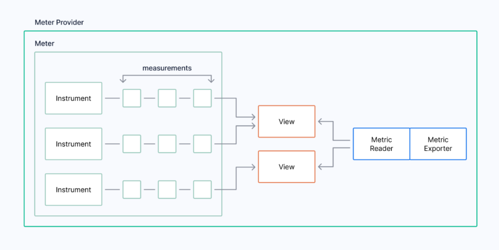
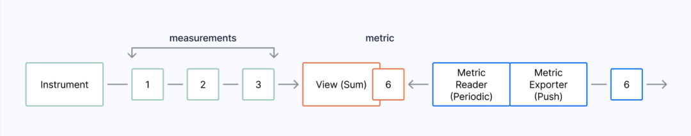
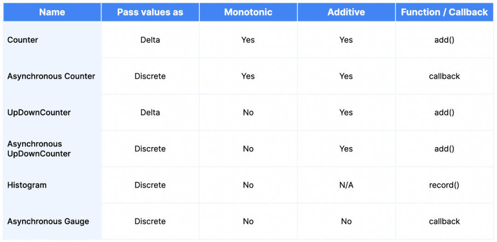
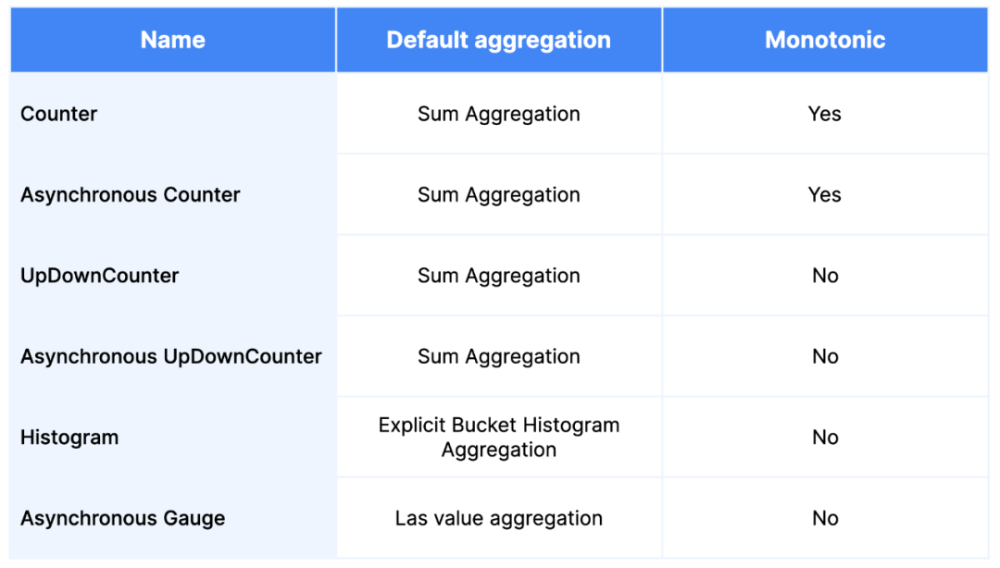

# **4 透彻理解OpenTelemetry**

**OpenTelemetry是由云原生计算基金会（CNCF）托管的一个用于基础设施性能检测的开源可观测性框架**。

该项目在几乎所有主要的云供应商（AWS、Google、Microsoft）以及可观测性供应商（包括Timescale）的贡献下得到了极大的发展，以至于它成为按活跃度和贡献者排名第二的CNCF项目，仅次于Kubernetes本身。

OpenTelemetry旨在为所有类型的可观测数据定义一个单一的标准（在OpenTelemetry的术语中被称作Signals信号），包括监控指标、日志和链路追踪。

**通过一系列的工具、库、API、SDK和exporters，OpenTelemetry从根本上简化了从服务中收集信号并将其发送到你所选用的后端服务的过程，为更多的用户和供应商打开了可观测性的大门。**

在设计OpenTelemetry指标标准时，有三个设计目标被采纳：

* **提供将监控指标与其他类型的可观察性数据相连接的能力**：要么是通过Exemplars在链路追踪和监控指标之间直接连接，要么是通过Baggage和Context提供与日志和链路追踪享有相同的相关元数据，间接地连接。
* **允许从OpenCensus标准轻松迁移到OpenTelemetry标准**。
* **在可能的情况下提供对其他主要指标实现的全面支持**。Prometheus和StatsD是专门适配的，能够完全支持：**那些迁移到OpenTelemetry的用户可以看到与使用其原生客户端类似的结果**。

OpenTelemetry提供了一个采集器，可以用来重新聚合和重定向指标数据，经常被用来创建信号管道。由于OpenTelemetry不提供后端实现（它关注的是创建、收集和发送信号），数据将流向另一个或多个系统进行存储并最终能够被查询。

**之所以OpenTelemetry有时会令人感到复杂，是因为它可以用来模拟许多不同的信号实现**。在这篇博文中，我们将聚焦于”表面”，即开发者在OpenTelemetry中使用指标时可能遇到的要素

## **1 OpenTelemetry指标**

OpenTelemetry指标与Prometheus指标略有不同，它允许在采集过程中进行更加灵活的转换，并支持许多导出类型，**包括Pull和Push模式**。

由于这种灵活性，许多现有的指标系统都可以用OpenTelemetry建模，而不会损失语义或精确性，这使它成为互操作性的完美指标系统。

OpenTelemetry有三个模型：

* **事件模型**：在这个模型中，你作为一个开发者来创建指标，
* **流模型**：OpenTelemetry使用该模型进行传输，
* **时间序列模型**：OpenTelemetry将其用于存储。

在这篇文章中讨论的指标都是事件模型的一部分，而转换则是从事件模型到流模型的转换的一部分。(作为一个开发者，你其实不需要担心这些模型，但有一个基本的了解会更有帮助）。

* **通过时间上的聚合（改变分辨率）减少传输的指标数量**
* **通过空间聚合减少传输的指标数量**（去除不需要的属性）
* 从累积表示法（Prometheus使用的）改为差值表示法（表达数值之间的变化，而不是绝对测量值）

**OpenTelemetry指标的工作方式是使用全局的MeterProvider来创建一个Meter，并将其与一个或多个Instrument相关联，`<mark>`每一个Instrument都被用来创建一系列的Measurements`</mark>`**。

这些测量值在View中被汇总为一个指标。**然后通过Metric Reader和Metric Exporter的组合来观察和导出指标（可以是拉或推）**



> 图示说明OpenTelemetry中MeterProvider的要素

**`<mark>`Instrument或Measurements是我们在应用中创建或观察到的东西，而指标则表达了我们与可观测性数据的消费者分享的该监测的当前聚合值。`</mark>`**

OpenTelemetry允许以多种方式将属性（标签）附加到指标上。最常见的有：

* **来自任何附加的资源，它可能持有定义主机的标签**。例如，一个Kubernetes Pod或一个虚拟机
* **来自当前的上下文，它将被附加到所有同步的Instrument上**
* **Measurement本身所具备的**

## 2  从Measurements到Metrics

Measurements的创建非常快，尤其是在同步的情况下，但这可能会迅速压垮一个指标管道。

为了解决这个问题，**Prometheus使用了一个带有抓取间隔的Pull机制**，

**而OpenTelemetry通过给每个Instrument附加一个Aggregation View来解决收集路径中的问题，然后将数据传递给观察它们的MetricReader和输出它们的MetricExporter**：



> 从测量到指标：OpenTelemetry中指标的收集路径图

**MetricReader负责在Instrument没有View的情况下附加默认的View，也负责定义MetricExporters，然后向其发送这些观测值。**

MetricReader还将改变指标的时间性，从默认的Cumulative（新值累加到最后一个值上，这与我们在Prometheus中看到的相同）改为Delta（度量值是新旧值之差）

**MetricReader和MetricExporter的组合决定了数据如何被发送到下游**。

**一个非常流行的方法是使用PeriodicExportingMetricReader和OTLPMetricExporter，每隔一段时间（默认为60秒）对指标进行采样，并将其发送到OpenTelemetry采集器（它将使用另一个Exporter）进行进一步处理**。许多其他的导出器可用于各种语言。

一些流行的导出器有：

* Prometheus Metric Exporter：**一个基于Pull模式的导出器，Prometheus客户端可以抓取它的端点**
* Prometheus Remote Write Exporter：**一个基于Push模式的导出器，通过Prometheus远程写入协议发送数据**
* OTLPMetricExporter：**它可以向任何理解OpenTelemetry协议的设备推送指标**
* ConsoleMetricExporter：**它被用来向控制台输出调试信息**

在Python中，初始化OpenTelemetry指标并附加一个默认的MetricReader和MetricExporter（发送指标到本地OpenTelemetry采集器），代码看起来像这样：

```
from opentelemetry._metrics import get_meter_provider, set_meter_provider
from opentelemetry.exporter.otlp.proto.grpc._metric_exporter import (
    OTLPMetricExporter,
)
from opentelemetry.sdk._metrics import MeterProvider
from opentelemetry.sdk._metrics.export import PeriodicExportingMetricReader

exporter = OTLPMetricExporter(insecure=True)
reader = PeriodicExportingMetricReader(exporter)
provider = MeterProvider(metric_readers=[reader])
set_meter_provider(provider)
```

## **3 —监测并发送Measurements**

**OpenTelemetry提供了六种类型的Instruments，我们可以用它们来捕获测量结果。它们可以被分为两大类：同步和异步**。

每个Instrument都可以发送测量值，每个Instrument都可以与属性相关联。

同步Instrument以类似于Prometheus指标的方式在应用程序代码中实现，通过在应用程序中插入代码，每次执行时都会更新一个值。它们可以与当前的Context上下文相关联（这有助于描述当前的应用状态）。

异步Instrument则会注册一个回调函数，只在观察时发送数值。例如，可以注册一个异步Instrument，每10秒报告一个传感器的值。这些Instrument不能与当前的Context相关联，因为它们位于主程序的外部，而不是在主程序运行时被调用，它们根据观察者的要求观察信号数据。在某些方面，它们类似于Prometheus通过Exporter对一个未被检测的应用程序进行监控。

**所有Instrument的创建都有一个名称、一个描述和一个测量单位（必须遵循Instrument单位规则）。**

异步Instrument还指定了回调函数，该函数被调用以观察测量结果。开发人员可以使用的OpenTelemetry Instrument类型，如下表所示。（令人困惑的是，语言呈现给用户的建议名称与测量名称不一样，用Observable来代替Asynchronous。即 `observable_counter`。）

下表概述了OpenTelemetry中Instrument类型的名称和特点。



现在，让我们来讲一下每一种Instrument类型。

### **Counter / Asynchronous Counter**

**Counter可译为”计数器”，则Asynchronous Counter译为”异步计数器”**

**Counter是一个同步Instrument，它总是在增加，即它是单调的，只接受非负的值**。

不出所料，它与Prometheus的Counter是相同的。Counter通过接收增量或Delta差值来工作。

**当使用计数器时，语言SDK中会有一个add的操作，必须提供一个非负数来增加计数器的值。**同时可以附加一组可选的属性。这些属性类似于Prometheus的标签。

**异步计数器的不同之处在于通过回调而不是add函数来操作**。当观察Instrument时，回调函数会被执行，并将传回一个或多个测量值，表示为绝对值（不是delta值）。一旦这些值被传递，它们将在内部通过计算得到delta值。

例如，你可以实现一个异步计数器，报告应用程序自启动以来所消耗的CPU时间。这一信息将在回调中从操作系统中提取并返回。可以一次性返回几个值，比如每个CPU或线程都有一个值。这些测量值总是被期望能够通过一种有意义的方式进行跨属性求和（在这种情况下，我们可以得到系统使用的总CPU时间）。

请注意，由于Python SDK还不稳定，我们需要导入 `_metrics`，而不是本文代码示例的metrics。未来可能还会有一些破坏性的变更。随着项目的进展，我们会保持更新。目前的例子是用OpenTelemetry Python SDK v1.11.1编写的。

在Python中，创建和使用计数器和异步计数器的例子看起来是这样的：

```
from opentelemetry._metrics import get_meter_provider
from opentelemetry._metrics.observation import Observation

meter = get_meter_provider().get_meter("otel-demo")

# Counter
counter = meter.create_counter("counter")

# This adds 100 to the total (a delta value)
counter.add(100,{"app": "timescale"})

# Callback function for Async counter
def observable_counter_func() -> [Observation]:
    # This reports that the current value is 10, which will be
    # converted to a delta internally
    return [Observation(10, {"app": "timescale"}]

# Async Counter
observable_counter = meter.create_observable_counter(
    "observable_counter", [observable_counter_func]
)
```

### **UpDownCounter / Asynchronous UpDownCounter**

**UpDownCounter是一个类似于Counter的同步Instrument，但它允许传递负的delta值（它可以不是单调的）**。

Counter适合表示已经提交的作业数量，而UpDownCounter则适合表示当前正在处理的作业数量（它可以向上和向下移动）。**需要注意的是，这与Prometheus中的Gauge的用法不一样，因为我们记录的是变化，而不是绝对值**

一个UpDownCounter提供了一个add操作，与Counter操作相同：与之相反的是它接受负的数据值。由属性数据关联的值被期望是可以求和的。

不出所料，异步UpDownCounter提供了一个回调接口，返回一个或多个测量值，将每个测量值表达为一个绝对值，该值将在内部被计算为delta值。

**OpenTelemetry规范指出，当被返回的值很容易被观察到时，不应该使用同步的UpDownCounter。在这种情况下，应该使用一个异步UpDownCounter来代替。**

在Python中，创建和使用UpDownCounter和Asynchronous UpDownCounter的例子看起来是这样的：

```
from opentelemetry._metrics import get_meter_provider
from opentelemetry._metrics.observation import Observation

meter = get_meter_provider().get_meter("otel-demo")

# UpDownCounter
up_down_counter = meter.create_up_down_counter("up_down_counter")

# This adds 100, then removes 10 from the total (both delta values)
up_down_counter.add(100,{"app": "timescale"})
up_down_counter.add(-10,{"app": "timescale"})

# Callback function for Async counter
def observable_up_down_counter_func() -> [Observation]:
    # This reports that the current value is 10, which will be
    # converted to a delta internally
    return [Observation(10, {"app": "timescale"})]

# Async UpDownCounter, note the observable prefix
observable_up_down_counter = meter.create_observable_up_down_counter(
    "observable_up_down_counter", [observable_up_down_counter_func]
)
```

### Histogram

Histogram可译为直方图。

Histogram是一种同步Instrument，它允许记录在统计上相互关联的多个数值。当你不想孤立地分析数据点，而是想通过跟踪落在每个预定义桶中的值的数量以及最小值和最大值（如果有进行配置）来生成关于其分布的统计信息时，你会选择Histogram。

**直方图只有一个单一的方法被暴露出来：record。记录需要一个非负的观察值，并可以附加一组可选的属性。**

当你查看HTTP响应时间时，你可能会选择直方图：知道每个请求发生时的确切响应时间可能并不那么有用（而且更适合链路追踪数据，它将暴露每个请求的开始和结束时间），但从服务层面来看，能够报告中位响应时间和超过95分位数的HTTP请求数量可能更有意思。

需要注意的是，记录测量结果并不能创建Histogram；默认的Aggregation（Explicit Bucket Histogram Aggregation）可以。当使用Histogram Instrument时，重要的是确保桶也被配置了。默认值是 `[ 0, 5, 10, 25, 50, 75, 100, 250, 500, 1000 ]`，而这并不总是理想的。你可以在下面几段看到一些创建View的例子。

在Python中，一个创建和使用直方图的例子是这样的：

```
from opentelemetry._metrics import get_meter_provider
from opentelemetry._metrics.observation import Observation

meter = get_meter_provider().get_meter("otel-demo")

# Histogram
histogram = meter.create_histogram("histogram")

# This records a value of 100
histogram.record(100,{"app": "timescale"})
```

### **Asynchronous Gauge**

**异步Gauge在OpenTelemetry API中的独特之处在于两个方面：它没有同步的实现，并且被设计用来表示那些相加没有意义的值，即使它们共享属性数据。**

这方面的一个例子是一个房子的各个房间的温度。这是常见的数据，但是把它作为一个总值来报告没有任何意义–你可能像求一个平均值或最大值，但绝不是一个总和。这是与Prometheus不同的方法，Prometheus将这些类型的要求编码到指标的命名规则中。

**在OpenTelemetry中，如果你使用一个Asynchronous Gauge，你不能像使用其他指标类型那样对其进行汇总**。

与所有的异步Instrument一样，在创建异步Instrument时，需要传递一个回调，它可以返回一个或多个（在这种情况下是完全离散的）测量值。

在Python中，创建和使用Asynchronous Gauge的例子是这样的：

```
from opentelemetry._metrics import get_meter_provider
from opentelemetry._metrics.observation import Observation

meter = get_meter_provider().get_meter("otel-demo")

# Callback function for Async gauge
def observable_gauge_func() -> [Observation]:
    # This reports that the current value is 10
    return [Observation(10, {"app": "timescale"})]

# Async Gauge, note the observable prefix
observable_gauge = meter.create_observable_gauge(
    "observable_gauge", [observable_gauge_func]
)
```

## **4 Views和Aggregations**

**OpenTelemetry中的View定义了一个Aggregation操作，它接受一系列的Measurements，并在该时间点上将其表达为一个单一的指标值**。

随着更多的Measurements被创建，指标的值会被持续更新。

**如果没有为一个Instrument创建View，那么就会根据Instrument类型选择一个默认的Aggregation**。

自定义View可以通过Meter名称、Instrument名称、Instrument类型或通配符来定位。

在OpenTelemetry中，有三种Aggregation类型：

* Sum Aggregation：简单地跟踪传入的测量值的总和（尊重输入Instrument的单调性），
* Last Value Aggregation：跟踪最后报告的值，
* Explicit Bucket Histogram Aggregation：跟踪属于每个预定义桶（必须在创建View时预定义）的测量数量，并可以跟踪最小和最大值。

下表定义了每种OpenTelemetry Instrument类型的默认Aggregation：



这段Python代码使用ConsoleMetricExporter写入控制台，也改变了所有柱状图Instrument的桶状结构：

```
from opentelemetry._metrics import get_meter_provider, set_meter_provider
from opentelemetry.sdk._metrics import MeterProvider
from opentelemetry.sdk._metrics.export import PeriodicExportingMetricReader
from opentelemetry.sdk._metrics.export import ConsoleMetricExporter
from opentelemetry.sdk._metrics.aggregation import ExplicitBucketHistogramAggregation

exporter = ConsoleMetricExporter()
reader = PeriodicExportingMetricReader(exporter)
provider = MeterProvider(
    metric_readers=[reader],
    views=[View(
        instrument_name="*”,
        aggregation=ExplicitBucketHistogramAggregation(
            (1,20,50,100,1000)
    ))],
)
set_meter_provider(provider)
```

## **总结**

OpenTelemetry标准，重点是它的六种Instrument类型：**counters、asynchronous counters、UpDownCounters、asynchronous UpDownCounters、histograms和asynchronous gauges**。
