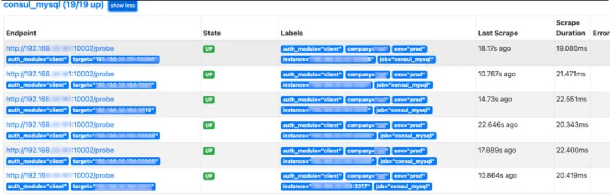
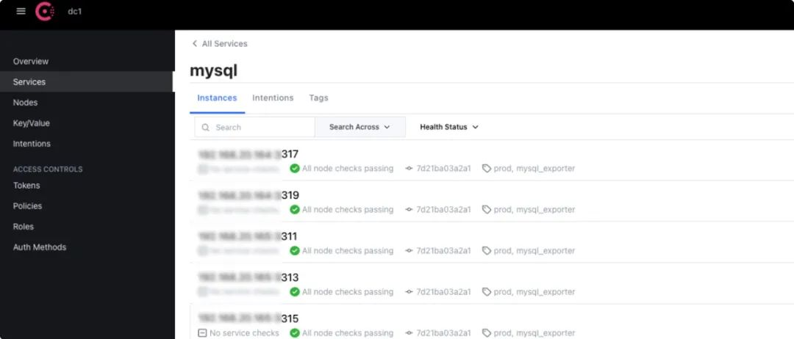

# 第三节 官方 `mysqld_exporter`支持抓取多MySQL实例

目前官方代码仓库已经支持了 1 个 mysqld_exporter 监控多个 mysql 实例(1:n)，详细的可以去看官方的代码仓库，但是目前尚未发现官方发布 release，可等待官方发布

## **部署**

> 遇到问题，记得多看日志、多检查文件配置、检查网络问题

### **授权**

```

#注意修改授权的网段
CREATE USER 'mysqld_exporter'@'192.168.1.%' IDENTIFIED BY 'cccc' WITH MAX_USER_CONNECTIONS 3;
GRANT PROCESS, REPLICATION CLIENT, SELECT ON *.* TO 'mysqld_exporter'@'192.168.1.%';
flush privileges;
```

> 此处可以在所有环境的实例中创建「相同」的 mysqld_exporter 监控账号和密码，也可以使用不同，当认证的密码不一样的时候，可以通过官方提示的配置文件配置即可。

### **准备配置文件**

**`config.my-cnf`**

此文件遵循 `.ini`格式，如果配置了不同的监控账号，你可以在该配置文件中增加不同项

```
[client]
user=mysqld_exporter
password=***************
[client-hb2]
user=monitor
password=***************
[client-hd]
user=monitor_hd
password=***************
```

注意，如果有不同的监控账号，记得在向 consul 中注册 mysql 实例的时候，记得修改 `auth_module`的元数据的值

**`docker-compose.yaml`**

```
version: '3'
services:
  mysqld_exporter:
    image: xx/mysqld_exporter:v1
    restart: always
    hostname: mysqld_exporter
    ports:
      - 10002:9104
    volumes:
      - ${PWD}/config.my-cnf:/config.my-cnf
      - /usr/share/zoneinfo/PRC:/etc/localtime
    command:
      - "--config.my-cnf=/config.my-cnf"
      - "--collect.binlog_size"
      - "--collect.info_schema.replica_host"
    container_name: mysqld-exporter
```

因为官方没有发布 release,因此需要自己拉取代码仓库，进行编译即可

* 编译 `mysqld_exporter` 二进制

```
git clone https://github.com/prometheus/mysqld_exporter.git && cd mysqld_exporter
go mod download && GOOS=linux CGO_ENABLED=0 go build -ldflags="-s -w" -installsuffix cgo -o mysqld_exporter .
# 测试
./mysqld_exporter --config.my-cnf=./config.my-cnf --collect.binlog_size --collect.info_schema.replica_host --web.listen-address=192.168.20.161:10002
```

* **封装镜像 Dockerfile**

可以采用官方的 Dockerfile 修改一下即可

```
ARG ARCH="amd64"
ARG OS="linux"
FROM quay.io/prometheus/busybox-${OS}-${ARCH}:latest
LABEL maintainer="marionxue@qq.com"

COPY ./mysqld_exporter /bin/mysqld_exporter

EXPOSE      9104
USER        nobody
ENTRYPOINT  [ "/bin/mysqld_exporter" ]
```

构建

```
docker build -t xx/mysqld_exporter:v1 -f ./Dockerfile .
```

运行测试即可

```
docker-compose up -d
```

## **写入 consul**

```
curl --location --request PUT 'http://$CONSUL_HOST:$CONSUL_PORT/v1/agent/service/register' \
--header 'x-consul-token: $CONSUL_TOKEN' \
--header 'Content-Type: application/json' \
--data-raw '{
  "id": "$MYSQLHOST:$MYSQLPORT",
  "name": "mysql",
  "tags": [
      "prod",
      "mysql_exporter"
  ],
  "meta": {
    "company": "company",
    "env": "prod",
    "instance": "$MYSQLHOST:$MYSQLPORT",
    "auth_module": "client",
    "role": "master",
    "name": "prod-1-1-master"
  }
}'
```

> 再次提醒，如果你使用了不同的监控账号，记得修改auth_module为 `config.my-cnf`文件中设置的配置项名称，否则会出现认证失败

## **配置 prometheus**

```
 - job_name: 'consul_mysql'
    metrics_path: /probe
    consul_sd_configs:
      - server: '$CONSUL_HOST:$CONSUL_PORT'
        token: '$CONSUL_TOKEN'
        services: ['mysql']
        tags: ['prod']
    relabel_configs:
      - source_labels: ["__meta_consul_service_metadata_instance"]
        target_label: __param_target
      - source_labels: ["__meta_consul_service_metadata_company"]
        target_label: company
      - source_labels: ["__meta_consul_service_metadata_env"]
        target_label: env
      - source_labels: ["__meta_consul_service_metadata_auth_module"]
        target_label: auth_module
      - source_labels: ["__meta_consul_service_metadata_auth_module"]
        target_label: __param_auth_module
      - source_labels: [__param_target]
        target_label: instance
      - target_label: __address__
        replacement: $MYSQLD_EXPORTER_HOST:$MYSQLD_EXPORTER_PORT
```

重载 Prometheus 配置文件

```
curl -XPUT http://localhost:9090/-/reload
```

**最后效果:「升级完成，总共废弃了 19 个 `mysqld_exporter `容器!」**




