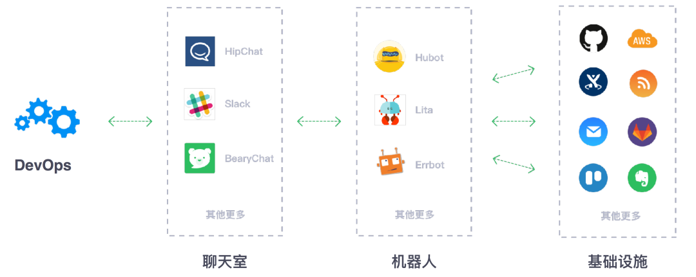
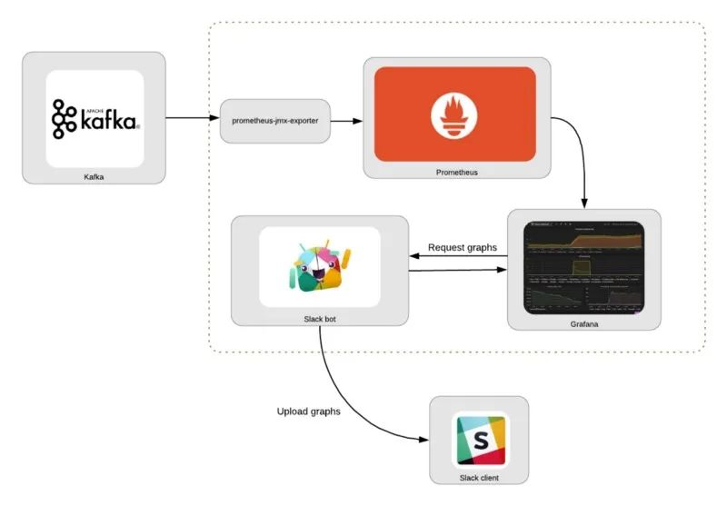
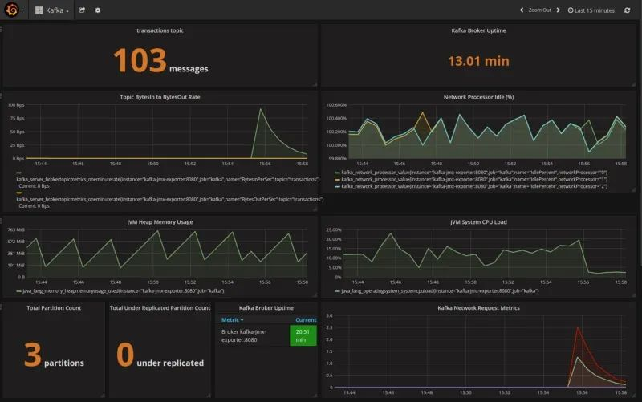
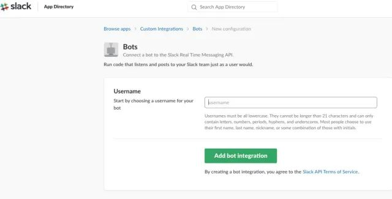
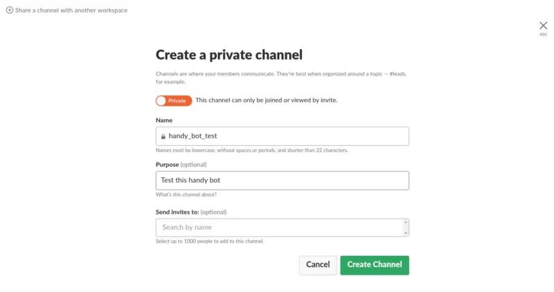
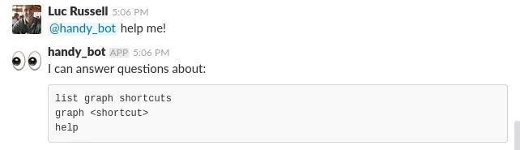

# **5 使用 Grafana、Prometheus 和 Slack 构建一个简单的 ChatOps 机器人**

一种构建简单的 ChatOps 机器人的方法，它使用 Slack 和 Grafana 来查询系统状态。当你不在办公桌前的时候，仍有基本的处理能力，例如在你的手机上，能够用对话界面检查你的系统状态。



本教程分为两部分：第一部分是构建用 Prometheus 和 Grafana 监控 Kafka 的基础设施，第二部分将用 Python 建立一个简单的机器人，它可以响应一些问题并通过 Slack 返回 Grafana 的图表。

消息通知是 Grafana 的一个原生功能，具有向 Slack 频道发送报警信息的能力，Slack bot 能够响应关于系统状态的简单问题，以协助进行故障排除。

我们的目标是设计一个在防火墙环境下运行的工具，不需要代理访问，也不需要访问任何第三方服务，如 Amazon S3。因此，图表的图像在本地文件系统中生成，并作为附件上传到 Slack，以避免在公共基础设施上托管。



## 组件

主要包含的组件如下所示：

* Kafka：一个消息流平台。
* Prometheus：一种监控系统，用于按指定的时间间隔收集指标，评估规则并触发警报。
* `prometheus-jmx-exporter`：Prometheus Exporter，可以抓取并暴露 JMX 数据，从而使我们能够从 Kafka 收集指标数据。
* **Grafana**：一个可视化平台，通常用于可视化时间序列数据，以用于基础结构和应用程序分析。这使我们能够以图形方式显示收集的指标。
* Slack：消息传递应用程序，它将使我们能够与聊天机器人进行交互。
* Slack bot：下面的第二部分中描述了一个简单的 Python 脚本，该脚本可以从 Grafana 检索图形并将其上传到 Slack。

这些步骤基于对 Kafka 的监控，但是可以采用相同的通用方法来与其他服务集成。


完整的代码可以在 [https://github.com/lucrussell/slack-chatops](https://github.com/lucrussell/slack-chatops) 这里找到。

## 监控组件

我们将使用 Grafana 和 Prometheus 来建立一个监控栈。要监控的服务是 Kafka，**这意味着我们需要一个桥梁，将 JMX 数据从 Kafka 导出到 Prometheus**。

**`prometheus-jmx-exporter` 这个 Docker 镜像就可以很好地满足了这个作用。这个服务从 Kafka 的 JMX 服务中提取指标，并通过 HTTP 暴露这些指标，因此它们可以被 Prometheus 抓取**。

为了在 Kafka 服务器中启用 JMX 指标，我们需要对 Kafka 服务做一些设置，并将 `kafka-jmx-exporter` 容器与 `Kafka` 服务连接起来。


* **确保在 kafka 容器上设置 `KAFKA_JMX_OPTS` 和 `JMX_PORT` 环境变量**
* **确保 `kafka-jmx-exporter` 和 kafka 容器在同一个网络上**
* **确保 `kafka-jmx-exporter` 容器的 `JMX_HOST` 值与 kafka 容器上的 `KAFKA_ADVERTISED_HOST_NAME` 匹配**
* **确保 `KAFKA_ADVERTISED_HOST_NAME` 在 `/etc/hosts` 中有一个对应的条目**。
* 将 `wurstmeister/kafka` 的版本固定，在 `wurstmeister/kafka` 镜像的早期版本中配置 JMX 可能会有问题

**对应的 `docker-compose.yml` 文件如下所示：**


```
  kafka:
    image: wurstmeister/kafka:1.0.0
    ports:
      - "9092:9092"
      - "1099:1099"
    depends_on:
      - zookeeper
    environment:
      - KAFKA_ADVERTISED_PORT=9092
      - KAFKA_BROKER_ID=1
      - KAFKA_ZOOKEEPER_CONNECT=zookeeper
      - KAFKA_ADVERTISED_HOST_NAME=kafka
      - ZOOKEEPER_CONNECTION_TIMEOUT_MS=180000
      - KAFKA_CREATE_TOPICS=transactions:1:1
      - KAFKA_JMX_OPTS=-Dcom.sun.management.jmxremote -Dcom.sun.management.jmxremote.authenticate=false -Dcom.sun.management.jmxremote.ssl=false -Djava.rmi.server.hostname=kafka -Dcom.sun.management.jmxremote.rmi.port=1099
      - JMX_PORT=1099
    networks:
      - backend

  kafka-jmx-exporter:
    build: ./prometheus-jmx-exporter
    ports:
      - "8080:8080"
    links:
      - kafka
    environment:
      - JMX_PORT=1099
      - JMX_HOST=kafka
      - HTTP_PORT=8080
      - JMX_EXPORTER_CONFIG_FILE=kafka.yml
    networks:
        - backend

  prometheus:
    ports:
      - 9090:9090/tcp
    image: prom/prometheus:v2.0.0
    volumes:
      - ./etc:/etc/prometheus
      - prometheus_data:/prometheus
    links:
      - kafka-jmx-exporter
    restart: always
    networks:
        - backend
```

Grafana 可以被配置为在启动时读取一个 JSON 仪表盘文件 --在 `etc/Kafka.json` 中提供了一个，预先配置了一些 Kafka 监控信息样本。


准备完成后，我们可以用 `docker-compose up -d` 命令来启动，然后用 kafkacat 向 Kafka 发送一些消息。

```
for i in `seq 1 3`;
do
        echo "hello"  | kafkacat -b kafka:9092 -t transactions
done
```

在 http://localhost:3000 查看 Kafka 仪表盘，你应该看到类似这样的面板。



## **构建 Slack 机器人**

有了监控基础设施，我们现在可以编写简单的 Slack 机器人了。

第一步是在 Slack 网站上创建和注册机器人，你可以通过登录 Slack，进入 https://api.slack.com/bot-users，然后在该页面上搜索 new bot user integration



此外还可以自定义细节，例如为机器人添加一个图标和描述。当你的机器人被创建后，接着你可以创建一个私人频道进行测试。



**然后可以使用 `/invite @handy_bot` 邀请机器人到测试频道**。


我们的机器人将回答几个简单的问题，我们将在第1-3行定义。

```
self.respond_to = ['list graph shortcuts',
                    'graph <shortcut>',
                    'help']
self.help_msg = '```\n'
for answer in self.respond_to:
    self.help_msg += f'{answer}\n'
self.help_msg += '```'
```

在 app.py 中，我们将读取配置文件并启动机器人。

```
def main(arguments=None):
    if not arguments:
        arguments = docopt(__doc__)
    config = configure(arguments['--config-file'])
    mybot = SlackBot(config)
    mybot.start()
```

其中的 start 方法如下所示：

```

def start(self):
    if self.slack_client.rtm_connect():
        print("Bot is alive and listening for messages...")
        while True:
            events = self.slack_client.rtm_read()
            for event in events:
                if event.get('type') == 'message':
                    # If we received a message, read it and respond if necessary
                    self.on_message(event)

            time.sleep(1)
```

第2行：与 Slack 的 API 建立连接 第5行：以指定的频率（1秒）轮询，检查是否有任何新事件 第7行：如果事件是一个 message，则进入 `on_message` 方法，如果我们从该方法得到一个响应，则将其打印出来，发送到消息发布的频道中。


```
def on_message(self, event):
    ...
    full_text = event.get('text', '') or ''

    if full_text.startswith(self.bot_id):
        question = full_text[len(self.bot_id):]
        if len(question) > 0:
            question = question.strip().lower()
            channel = event['channel']
            ...
            elif 'graph' in question:
                self.respond(channel, 'Please wait...', True)
```

`on_message` 方法是我们决定如何回应机器人收到的消息的地方。`generate_and_upload_graph` 是最有趣的函数，这里我们的想法是启动一个临时的 Docker 容器来捕获屏幕截图。

Grafana 确实有能力将任何图形渲染成 PNG 文件，然而，在 Grafana 的最新版本中，内部用于生成图片的 phantomjs 库似乎出现了错误。

一个更可靠的 headless  浏览工具是基于 Google Chrome 的 Puppeteer，有人已经把它包装在 Docker 镜像中了。这给了我们一个实验 Docker Python API 的机会。


```
def generate_and_upload_graph(self, filename, url, channel):
    dir_name = os.path.dirname(os.path.abspath(__file__))

    client = docker.APIClient()

    container = client.create_container(
        image='alekzonder/puppeteer:1.0.0',
        command=f'screenshot \'{url}\' 1366x768',
        volumes=[dir_name],

        host_config=client.create_host_config(binds={
            dir_name: {
                'bind': '/screenshots'
            }
        }, network_mode='host')
    )

    files1 = prepare_dir(dir_name)

    client.start(container)

    # Poll for new files
    while True:
        time.sleep(2)
        files2 = os.listdir(dir_name)
        new = [f for f in files2 if all([f not in files1, f.endswith(".png")])]
        for f in new:
            with open(f, 'rb') as in_file:
                ret = self.slack_client.api_call(
                    "files.upload",
                    filename=filename,
                    channels=channel,
                    title=filename,
                    file=io.BytesIO(in_file.read()))
                if 'ok' not in ret or not ret['ok']:
                    print('File upload failed %s', ret['error'])
            os.remove(f)
        break
```

第6:16行：使用 Docker Python API 动态地创建一个基于  `alekzonder/puppeteer` 镜像的容器。

第13行：将当前目录与容器中的 `/screenshots` 挂载，这样我们就可以将文件写入可访问的地方。

第15行：设置 `network_mode=host`，这样容器就可以在 localhost 上访问 Grafana。

第23:38行：观察新的图片被添加到目录中，并上传它们。

然后我们就可以启动机器人了，在 slackbot 目录中。

```
$ python bot.py --config=config.yaml 
Bot is alive and listening for messages...
```

机器人可以响应一些基本的请求，如下所示，当然你也可以根据你想要监控的特定系统来定制机器人的能力。



## **结论**

ChatOps 机器人可以成为有用的助手，帮助你运维运行中的系统，我们这里是一个简化的示例，但我们可以扩展到支持更复杂的场景。

利用 Docker API 来动态创建容器是一种复杂的截图机制，但当你需要快速为自己的应用程序添加一个已经被包装成 Docker 镜像的功能时，这会特别有用。