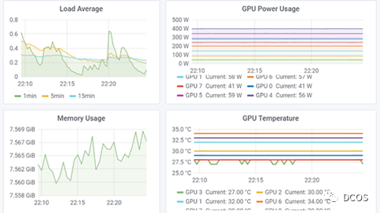
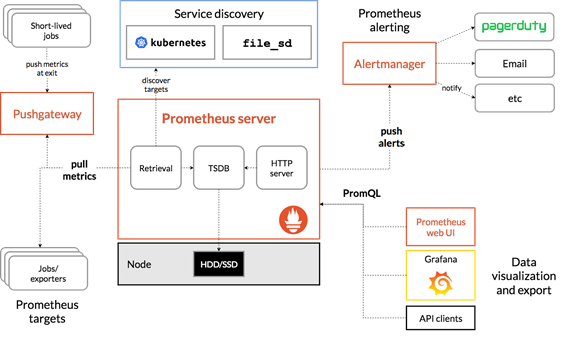
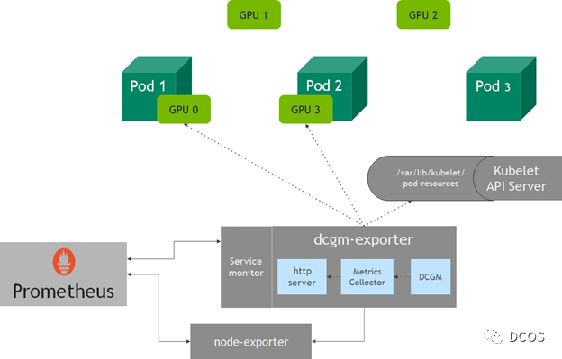
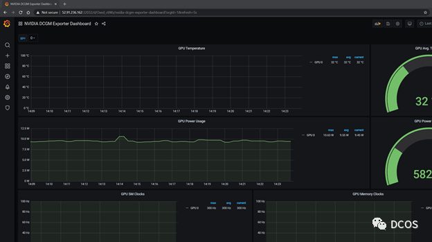
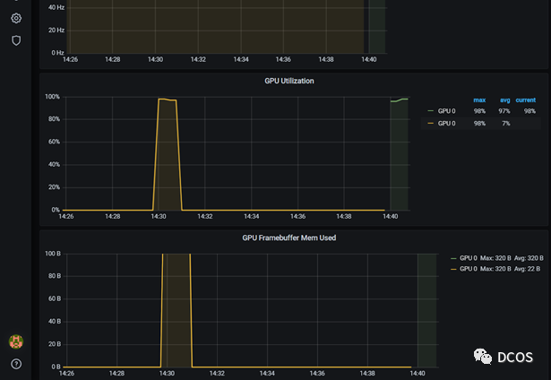
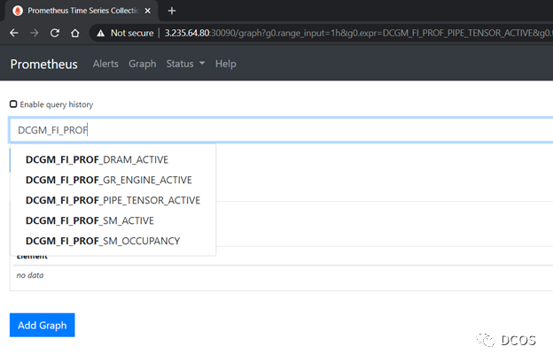
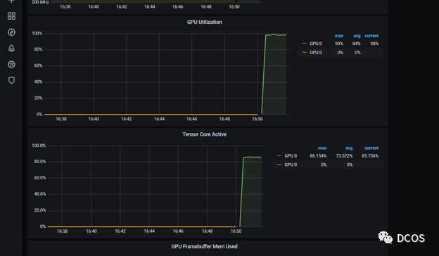

# **第十二节 监控Kubernetes集群的GPU资源**

## **一、背景说明**

### **1.1 需求说明**

对于SRE团队来说，实现监控AI、高性能计算平台上大规模GPU资源，至关重要。SRE团队可以通过GPU指标了解工作负载等相关性能，从而优化资源分配，提升资源利用率及异常诊断，以提高数据中心资源的整体效能。除了SRE及基础设施团队之外，不管你是从事GPU加速方向的研究人员，还是数据中心架构师，都可以通过相关监控指标，了解GPU利用率和工作饱和度以进行容量规划及任务调度等。

随着AI/ML工作负载的容器化，调度平台采用具备动态扩缩特性的Kubernetes解决方案，针对其监控的急迫性日益提升。在这篇文章中，我们将介绍NVIDIA数据中心GPU管理器（DCGM），以及如何将其集成到Prometheus和Grafana等开源工具中，以实现Kubernetes的GPU监控的整体解决方案。




### **1.2 NVIDIA DCGM**

NVIDIA DCGM是用于管理和监控基于Linux系统的NVIDIA GPU大规模集群的一体化工具。它是一个低开销的工具，提供多种能力，包括主动健康监控、诊断、系统验证、策略、电源和时钟管理、配置管理和审计等。

DCGM提供用于收集GPU遥测的API。特别值得关注的是GPU利用率指标、内存指标和流量指标。DCGM提供了各种语言的客户端，如C和Python。对于与容器生态系统的集成，提供基于DCGM APIs的Go绑定实现。

### **1.3 NVIDIA exporter**



在前面介绍的Go API基础上，可以通过`DCGM`向`Prometheus`暴露GPU指标。NVIDIA为此构建了`dcgm-exporter`的项目。

`dcgm-exporter` 使用 Go 绑定从 DCGM 收集 GPU 遥测数据，然后通过 http 接口 (`/metrics`) 向 Prometheus 暴露指标。

**`dcgm-exporter`可以通过使用csv格式的配置文件来定制DCGM收集的GPU指标。**

### **1.4 Kubelet设备监控**

**`dcgm-exporter`收集了节点上所有可用GPU的指标**。

**<mark>然而，在Kubernetes中，当一个节点请求GPU资源时，可能不能确定哪些GPU会被分配给pod</mark>**。

从v1.13开始，Kubelet增加了一个设备监控功能，可以通过pod-resources套接字了解分配给pod的设备，其中包括pod名称、pod命名空间和设备ID。

**`dcgm-exporter`中的http服务连接到`kubelet`中的`pod-resources`服务(`/var/lib/kubelet/pod-resources`)来识别pod上运行的GPU设备，并将GPU设备的pod相关信息添加到收集的指标中**。



## **二、GPU监控**

### **2.1 部署说明**

下面是一些设置dcgm-exporter的示例。如果使用NVIDIA GPU Operator，那么dcgm-exporter同样是部署组件之一。

文档中包含了设置Kubernetes集群的步骤。为了简洁起见，假定已经存在一个运行着NVIDIA软件组件的Kubernetes集群，例如，驱动程序、容器运行时和Kubernetes设备插件等。在使用Prometheus Operator部署Prometheus时，还可以方便地部署Grafana。在该篇文章中，为了简单起见，使用了单节点Kubernetes集群。

在设置社区提供的Prometheus Operator的Helm chart时，必须暴露Grafana供外部访问，并且`prometheusSpec.serviceMonitorSelectorNilUsesHelmValues`必须设置为false

简单来说，设置监控包括运行以下命令。

```

$ helm repo add prometheus-community \
https://prometheus-community.github.io/helm-charts

$ helm repo update
$ helm inspect values prometheus-community/kube-prometheus-stack > /tmp/kube-prometheus-stack.values
# Edit /tmp/kube-prometheus-stack.values in your favorite editor
# according to the documentation
# This exposes the service via NodePort so that Prometheus/Grafana
# are accessible outside the cluster with a browser
$ helm install prometheus-community/kube-prometheus-stack \
--create-namespace --namespace prometheus \
--generate-name \
--set prometheus.service.type=NodePort \
--set prometheus.prometheusSpec.serviceMonitorSelectorNilUsesHelmValues=false
```

此时，集群配置如下所示，其中所有的Prometheus pods和服务健康运行。

```

$ kubectl get pods -A
NAMESPACE     NAME                                                              READY   STATUS    RESTARTS   AGE
kube-system   calico-kube-controllers-8f59968d4-zrsdt                           1/1     Running   0          18m
kube-system   calico-node-c257f                                                 1/1     Running   0          18m
kube-system   coredns-f9fd979d6-c52hz                                           1/1     Running   0          19m
kube-system   coredns-f9fd979d6-ncbdp                                           1/1     Running   0          19m
kube-system   etcd-ip-172-31-27-93                                              1/1     Running   1          19m
kube-system   kube-apiserver-ip-172-31-27-93                                    1/1     Running   1          19m
kube-system   kube-controller-manager-ip-172-31-27-93                           1/1     Running   1          19m
kube-system   kube-proxy-b9szp                                                  1/1     Running   1          19m
kube-system   kube-scheduler-ip-172-31-27-93                                    1/1     Running   1          19m
kube-system   nvidia-device-plugin-1602308324-jg842                             1/1     Running   0          17m
prometheus    alertmanager-kube-prometheus-stack-1602-alertmanager-0            2/2     Running   0          92s
prometheus    kube-prometheus-stack-1602-operator-c4bc5c4d5-f5vzc               2/2     Running   0          98s
prometheus    kube-prometheus-stack-1602309230-grafana-6b4fc97f8f-66kdv         2/2     Running   0          98s
prometheus    kube-prometheus-stack-1602309230-kube-state-metrics-76887bqzv2b   1/1     Running   0          98s
prometheus    kube-prometheus-stack-1602309230-prometheus-node-exporter-rrk9l   1/1     Running   0          98s
prometheus    prometheus-kube-prometheus-stack-1602-prometheus-0                3/3     Running   1          92s
 

$ kubectl get pods -A
NAMESPACE     NAME                                                              READY   STATUS    RESTARTS   AGE
kube-system   calico-kube-controllers-8f59968d4-zrsdt                           1/1     Running   0          18m
kube-system   calico-node-c257f                                                 1/1     Running   0          18m
kube-system   coredns-f9fd979d6-c52hz                                           1/1     Running   0          19m
kube-system   coredns-f9fd979d6-ncbdp                                           1/1     Running   0          19m
kube-system   etcd-ip-172-31-27-93                                              1/1     Running   1          19m
kube-system   kube-apiserver-ip-172-31-27-93                                    1/1     Running   1          19m
kube-system   kube-controller-manager-ip-172-31-27-93                           1/1     Running   1          19m
kube-system   kube-proxy-b9szp                                                  1/1     Running   1          19m
kube-system   kube-scheduler-ip-172-31-27-93                                    1/1     Running   1          19m
kube-system   nvidia-device-plugin-1602308324-jg842                             1/1     Running   0          17m
prometheus    alertmanager-kube-prometheus-stack-1602-alertmanager-0            2/2     Running   0          92s
prometheus    kube-prometheus-stack-1602-operator-c4bc5c4d5-f5vzc               2/2     Running   0          98s
prometheus    kube-prometheus-stack-1602309230-grafana-6b4fc97f8f-66kdv         2/2     Running   0          98s
prometheus    kube-prometheus-stack-1602309230-kube-state-metrics-76887bqzv2b   1/1     Running   0          98s
prometheus    kube-prometheus-stack-1602309230-prometheus-node-exporter-rrk9l   1/1     Running   0          98s
prometheus    prometheus-kube-prometheus-stack-1602-prometheus-0                3/3     Running   1          92s
 
 
$ kubectl get svc -A
NAMESPACE     NAME                                                        TYPE        CLUSTER-IP       EXTERNAL-IP   PORT(S)                        AGE
default       kubernetes                                                  ClusterIP   10.96.0.1        <none>        443/TCP                        20m
kube-system   kube-dns                                                    ClusterIP   10.96.0.10       <none>        53/UDP,53/TCP,9153/TCP         20m
kube-system   kube-prometheus-stack-1602-coredns                          ClusterIP   None             <none>        9153/TCP                       2m18s
kube-system   kube-prometheus-stack-1602-kube-controller-manager          ClusterIP   None             <none>        10252/TCP                      2m18s
kube-system   kube-prometheus-stack-1602-kube-etcd                        ClusterIP   None             <none>        2379/TCP                       2m18s
kube-system   kube-prometheus-stack-1602-kube-proxy                       ClusterIP   None             <none>        10249/TCP                      2m18s
kube-system   kube-prometheus-stack-1602-kube-scheduler                   ClusterIP   None             <none>        10251/TCP                      2m18s
kube-system   kube-prometheus-stack-1602-kubelet                          ClusterIP   None             <none>        10250/TCP,10255/TCP,4194/TCP   2m12s
prometheus    alertmanager-operated                                       ClusterIP   None             <none>        9093/TCP,9094/TCP,9094/UDP     2m12s
prometheus    kube-prometheus-stack-1602-alertmanager                     ClusterIP   10.104.106.174   <none>        9093/TCP                       2m18s
prometheus    kube-prometheus-stack-1602-operator                         ClusterIP   10.98.165.148    <none>        8080/TCP,443/TCP               2m18s
prometheus    kube-prometheus-stack-1602-prometheus                       NodePort    10.105.3.19      <none>        9090:30090/TCP                 2m18s
prometheus    kube-prometheus-stack-1602309230-grafana                    ClusterIP   10.100.178.41    <none>        80/TCP                         2m18s
prometheus    kube-prometheus-stack-1602309230-kube-state-metrics         ClusterIP   10.100.119.13    <none>        8080/TCP                       2m18s
prometheus    kube-prometheus-stack-1602309230-prometheus-node-exporter   ClusterIP   10.100.56.74     <none>        9100/TCP                       2m18s
prometheus    prometheus-operated                                         ClusterIP   None             <none>        9090/TCP                       2m12s
```

**部署`dcgm-exporter`**

```
$ helm repo add gpu-helm-charts \
https://nvidia.github.io/gpu-monitoring-tools/helm-charts
$ helm repo update
```

**使用helm安装**

```
$ helm install \
   --generate-name \
   gpu-helm-charts/dcgm-exporter
```

结果验证

```
$ helm ls
NAME                            NAMESPACE       REVISION        APP VERSION
dcgm-exporter-1-1601677302      default         1               dcgm-exporter-1.1.0             2.0.10
nvidia-device-plugin-1601662841 default         1          nvidia-device-plugin-0.7.0      0.7.0
```

Prometheus和Grafana服务暴露如下：

```
$ kubectl get svc -A
NAMESPACE     NAME                                                      TYPE        CLUSTER-IP       EXTERNAL-IP   PORT(S)                        AGE
default       dcgm-exporter                                             ClusterIP   10.99.34.128     <none>        9400/TCP                       43d
default       kubernetes                                                  ClusterIP   10.96.0.1        <none>        443/TCP                        20m
kube-system   kube-dns                                                    ClusterIP   10.96.0.10       <none>        53/UDP,53/TCP,9153/TCP         20m
kube-system   kube-prometheus-stack-1602-coredns                          ClusterIP   None             <none>        9153/TCP                       2m18s
kube-system   kube-prometheus-stack-1602-kube-controller-manager          ClusterIP   None             <none>        10252/TCP                      2m18s
kube-system   kube-prometheus-stack-1602-kube-etcd                        ClusterIP   None             <none>        2379/TCP                       2m18s
kube-system   kube-prometheus-stack-1602-kube-proxy                       ClusterIP   None             <none>        10249/TCP                      2m18s
kube-system   kube-prometheus-stack-1602-kube-scheduler                   ClusterIP   None             <none>        10251/TCP                      2m18s
kube-system   kube-prometheus-stack-1602-kubelet                          ClusterIP   None             <none>        10250/TCP,10255/TCP,4194/TCP   2m12s
prometheus    alertmanager-operated                                       ClusterIP   None             <none>        9093/TCP,9094/TCP,9094/UDP     2m12s
prometheus    kube-prometheus-stack-1602-alertmanager                     ClusterIP   10.104.106.174   <none>        9093/TCP                       2m18s
prometheus    kube-prometheus-stack-1602-operator                         ClusterIP   10.98.165.148    <none>        8080/TCP,443/TCP               2m18s
prometheus    kube-prometheus-stack-1602-prometheus                       NodePort    10.105.3.19      <none>        9090:30090/TCP                 2m18s
prometheus    kube-prometheus-stack-1602309230-grafana                    ClusterIP   10.100.178.41    <none>        80:32032/TCP                   2m18s
prometheus    kube-prometheus-stack-1602309230-kube-state-metrics         ClusterIP   10.100.119.13    <none>        8080/TCP                       2m18s
prometheus    kube-prometheus-stack-1602309230-prometheus-node-exporter   ClusterIP   10.100.56.74     <none>        9100/TCP                       2m18s
prometheus    prometheus-operated  
```

使用32032端口暴露的Grafana服务，访问Grafana主页。使用Prometheus chart中设置的凭证登录到仪表板：`prometheus.values`中的`adminPassword`字段。

 现在要启动一个用于GPU指标的Grafana仪表板，请从Grafana仪表板（`https://grafana.com/grafana/dashboards/12239`）导入NVIDIA仪表板。
 
 
 
现在运行一些GPU工作负载，为此，DCGM社区提供了一个名为`dcgmproftester`的`CUDA`负载生成器，它可以用来生成确定性的CUDA工作负载，用于读取和验证GPU指标。

要生成一个Pod，首先必须下载DCGM并将制成镜像。以下脚本创建了一个可用于运行`dcgmproftester`的容器。这个容器可以在NVIDIA DockerHub仓库中找到。

```
#!/usr/bin/env bash
set -exo pipefail
 
mkdir -p /tmp/dcgm-docker
pushd /tmp/dcgm-docker
 
cat > Dockerfile <<EOF
ARG BASE_DIST
ARG CUDA_VER
FROM nvidia/cuda:\${CUDA_VER}-base-\${BASE_DIST}
LABEL io.k8s.display-name="NVIDIA dcgmproftester"
 
ARG DCGM_VERSION
 
WORKDIR /dcgm
RUN apt-get update && apt-get install -y --no-install-recommends \
    libgomp1 \
    wget && \
    rm -rf /var/lib/apt/lists/* && \
    wget --no-check-certificate https://developer.download.nvidia.com/compute/redist/dcgm/\${DCGM_VERSION}/DEBS/datacenter-gpu-manager_\${DCGM_VERSION}_amd64.deb && \
    dpkg -i datacenter-gpu-manager_*.deb && \
    rm -f datacenter-gpu-manager_*.deb
 
ENTRYPOINT ["/usr/bin/dcgmproftester11"]
EOF
 
DIR=.
DCGM_REL_VERSION=2.0.10
BASE_DIST=ubuntu18.04
CUDA_VER=11.0
IMAGE_NAME=nvidia/samples:dcgmproftester-$DCGM_REL_VERSION-cuda$CUDA_VER-$BASE_DIST
 
 
docker build --pull \
        -t "$IMAGE_NAME" \
        --build-arg DCGM_VERSION=$DCGM_REL_VERSION \
        --build-arg BASE_DIST=$BASE_DIST \
        --build-arg CUDA_VER=$CUDA_VER \
        --file Dockerfile \
        "$DIR"
 
popd
```

在Kubernetes集群上部署容器之前，尝试直接使用Docker运行它。在这个例子中，通过指定-t 1004来使用Tensor Cores触发FP16矩阵乘法，并以`-d 45`（45秒）的速度运行测试。您可以通过修改-t参数来尝试运行其他工作负载。

```

Skipping CreateDcgmGroups() since DCGM validation is disabled
CU_DEVICE_ATTRIBUTE_MAX_THREADS_PER_MULTIPROCESSOR: 1024
CU_DEVICE_ATTRIBUTE_MULTIPROCESSOR_COUNT: 40
CU_DEVICE_ATTRIBUTE_MAX_SHARED_MEMORY_PER_MULTIPROCESSOR: 65536
CU_DEVICE_ATTRIBUTE_COMPUTE_CAPABILITY_MAJOR: 7
CU_DEVICE_ATTRIBUTE_COMPUTE_CAPABILITY_MINOR: 5
CU_DEVICE_ATTRIBUTE_GLOBAL_MEMORY_BUS_WIDTH: 256
CU_DEVICE_ATTRIBUTE_MEMORY_CLOCK_RATE: 5001000
Max Memory bandwidth: 320064000000 bytes (320.06 GiB)
CudaInit completed successfully.
 
Skipping WatchFields() since DCGM validation is disabled
TensorEngineActive: generated ???, dcgm 0.000 (27605.2 gflops)
TensorEngineActive: generated ???, dcgm 0.000 (28697.6 gflops)
```

将其部署到Kubernetes集群上，可以通过Grafana仪表板观测相应的指标。下面的代码示例：

```
cat << EOF | kubectl create -f -
 apiVersion: v1
 kind: Pod
 metadata:
   name: dcgmproftester
 spec:
   restartPolicy: OnFailure
   containers:
   - name: dcgmproftester11
     image: nvidia/samples:dcgmproftester-2.0.10-cuda11.0-ubuntu18.04
     args: ["--no-dcgm-validation", "-t 1004", "-d 120"]
     resources:
       limits:
          nvidia.com/gpu: 1
     securityContext:
       capabilities:
          add: ["SYS_ADMIN"]
 
EOF
```

可以看到dcgmproftester pod健康运行，随后指标显示在Grafana仪表板上。GPU利用率(GrActive)已经达到了98%的利用率峰值，可能还会发现其他有趣的指标，比如功率或GPU内存。

```

$ kubectl get pods -A
NAMESPACE     NAME                                                              
READY   STATUS    RESTARTS   AGE
...
default       dcgmproftester                                                    
1/1     Running   0          6s
```

 

DCGM最近增加了一些设备级指标。其中包括细粒度的GPU利用率指标，可以监控SM占用率和Tensor Core利用率。有关更多信息，可以查看DCGM用户指南中的Profiling Metrics。

下图显示了 Prometheus获取的由`dcgm-exporter` 提供的监控指标。

 

您可以自定义Grafana仪表板，以包含DCGM的其他指标。在这种情况下，通过编辑 repo 上提供的 Grafana JSON 文件将 Tensor Core 利用率添加到仪表板中，也可以使用Grafana的Web界面进行编辑。

**下面的仪表板包括Tensor Core利用率。重新启动dcgmproftester容器后，你可以看到T4上的Tensor Core已经达到了约87%的利用率。**

 
 
  通过将GPU指标作为自定义指标和Prometheus Adapter，可以使用Horizontal Pod Autoscaler根据GPU利用率或其他指标来扩展Pod数量。