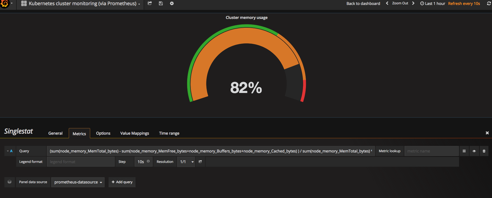
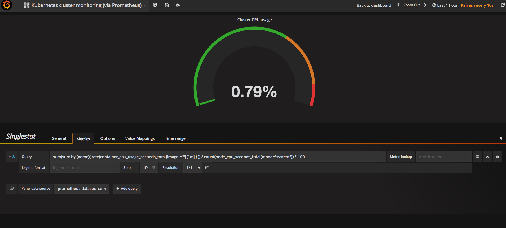
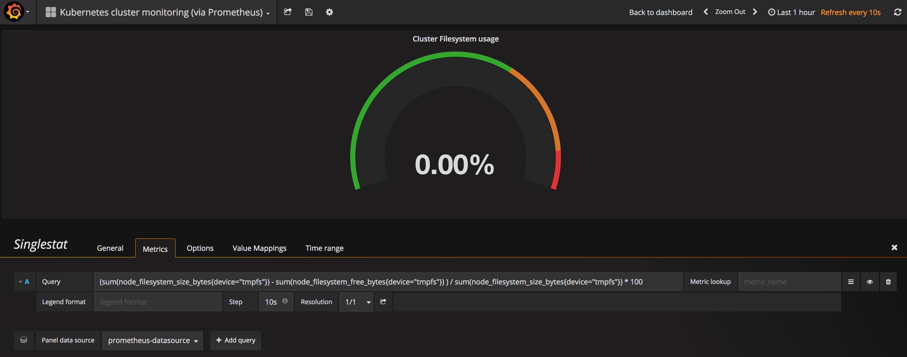
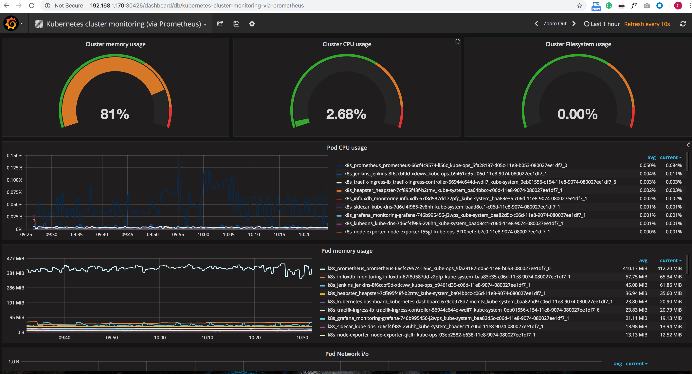
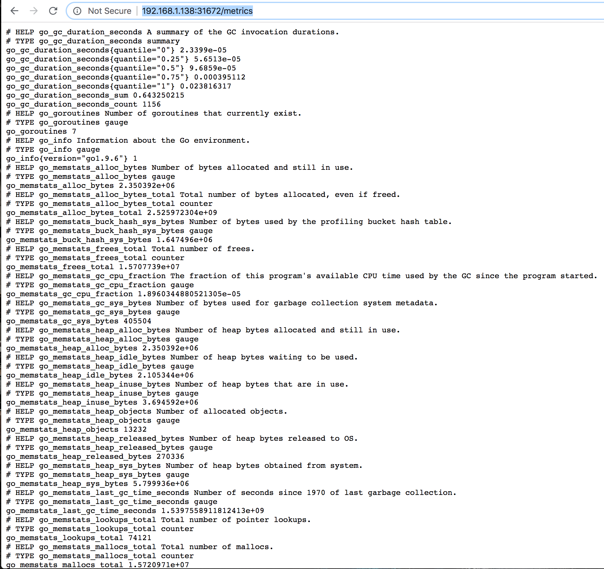

# **第三节 Grafana 显示参数设置(2018)**

根据 `kubernetes json` 文件的参数设置， 显示如下:


需要重新设置 Grafana 中的 `Cluster memory usage`, `Cluster CPU usage`, `Cluster filesystem usage`


### **Option 1** 

在 `json` 文件中修改

[kubernetes-pod-monitoring_rev1.json](kubernetes-pod-monitoring_rev1.json)


### **Option 2**

在界面中直接修改







### **Cluster memory usage**

```
(sum(node_memory_MemTotal_bytes) - sum(node_memory_MemFree_bytes+node_memory_Buffers_bytes+node_memory_Cached_bytes) ) / sum(node_memory_MemTotal_bytes) * 100
```

### **Cluster CPU usage**

```
sum(sum by (name)( rate(container_cpu_usage_seconds_total{image!=""}[1m] ) )) / count(node_cpu_seconds_total{mode="system"}) * 100
```

### **Cluster filesystem usage**

```
(sum(node_filesystem_size_bytes{device="tmpfs"}) - sum(node_filesystem_free_bytes{device="tmpfs"}) ) / sum(node_filesystem_size_bytes{device="tmpfs"}) * 100
```


### **显示如下:**




如何验证这些函数的正确性，`Prometheus`提供了API的方式进行数据查询，同样可以使用query语言进行复杂的查询任务，在上面的WEB界面上提供了基本的查询和图形化的展示功能。：


如何查询某些函数的写法， 可以再 `node` 上的 `node-exporter` 端口访问, 例如 

`http://192.168.1.138:31672/metrics`



