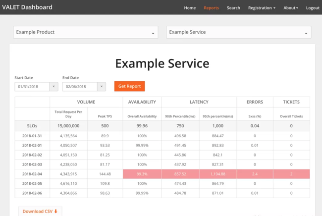
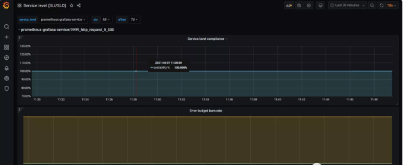

# **第十二节 通过Prometheus来做SLI/SLO监控展示**

> Service level operator有点意思，把服务SLI/SLO抽象成operator的想法就很运维


## **1 什么是SLI/SLO**

* <mark>SLI，全名Service Level Indicator，**是服务等级指标的简称**，它是衡定系统稳定性的指标</mark>。


* **<mark>SLO，全名Sevice Level Objective，是服务等级目标的简称**，也就是我们设定的稳定性目标，比如"4个9"，"5个9"等</mark>。


SRE通常通过这两个指标来衡量系统的稳定性，其主要思路就是通过SLI来判断SLO，也就是通过一系列的指标来衡量我们的目标是否达到了"几个9"。


## **2 如何选择SLI**

在系统中，常见的指标有很多种，比如：


* **系统层面：CPU使用率、内存使用率、磁盘使用率等**
* **应用服务器层面：端口存活状态、JVM的状态等**
* 应用运行层面：状态码、时延、QPS等
* **中间件层面：QPS、TPS、时延等**
* **业务层面：成功率、增长速度等**

这么多指标，应该如何选择呢？只要遵从两个原则就可以：

* 选择能够标识一个主体是否稳定的指标，如果不是这个主体本身的指标，或者不能标识主体稳定性的，就要排除在外。
* 优先选择与用户体验强相关或用户可以明显感知的指标。

通常情况下，可以直接使用谷歌的VALET指标方法。

* V：Volume，容量，服务承诺的最大容量
* A：Availability，可用性，服务是否正常
* L：Latency，延迟，服务的响应时间
* E：Error，错误率，请求错误率是多少
* T：Ticket，人工介入，是否需要人工介入

这就是谷歌使用VALET方法给的样例。



上面仅仅是简单的介绍了一下SLI/SLO，更多的知识可以学习《SRE：Google运维解密》和赵成老师的极客时间课程《SRE实践手册》。下面来简单介绍如何使用Prometheus来进行SLI/SLO监控。

### **service-level-operator**

Service level operator是为了Kubernetes中的应用SLI/SLO指标来衡量应用的服务指标，并可以通过Grafana来进行展示。

Operator主要是通过SLO来查看和创建新的指标。例如：

[https://github.com/spotahome/service-level-operator](https://github.com/spotahome/service-level-operator)

```

apiVersion: monitoring.spotahome.com/v1alpha1
kind: ServiceLevel
metadata:
  name: awesome-service
spec:
  serviceLevelObjectives:
    - name: "9999_http_request_lt_500"
      description: 99.99% of requests must be served with <500 status code.
      disable: false
      availabilityObjectivePercent: 99.99
      serviceLevelIndicator:
        prometheus:
          address: http://myprometheus:9090
          totalQuery: sum(increase(http_request_total{host="awesome_service_io"}[2m]))
          errorQuery: sum(increase(http_request_total{host="awesome_service_io", code=~"5.."}[2m]))
      output:
        prometheus:
          labels:
            team: a-team
            iteration: "3"
```

* availabilityObjectivePercent：SLO
* totalQuery：总请求数
* errorQuery：错误请求数

Operator通过totalQuert和errorQuery就可以计算出SLO的指标了。

## **3 部署service-level-operator**

> 前提：在Kubernetes集群中部署好Prometheus，我这里是采用Prometheus-Operator方式进行部署的。

首先创建RBAC

```
apiVersion: v1
kind: ServiceAccount
metadata:
  name: service-level-operator
  namespace: monitoring
  labels:
    app: service-level-operator
    component: app

---
apiVersion: rbac.authorization.k8s.io/v1
kind: ClusterRole
metadata:
  name: service-level-operator
  labels:
    app: service-level-operator
    component: app
rules:
  # Register and check CRDs.
  - apiGroups:
      - apiextensions.k8s.io
    resources:
      - customresourcedefinitions
    verbs:
      - "*"

  # Operator logic.
  - apiGroups:
      - monitoring.spotahome.com
    resources:
      - servicelevels
      - servicelevels/status
    verbs:
      - "*"

---
kind: ClusterRoleBinding
apiVersion: rbac.authorization.k8s.io/v1
metadata:
  name: service-level-operator
subjects:
  - kind: ServiceAccount
    name: service-level-operator
    namespace: monitoring 
roleRef:
  apiGroup: rbac.authorization.k8s.io
  kind: ClusterRole
  name: service-level-operator
```

然后创建Deployment

```
apiVersion: apps/v1 
kind: Deployment
metadata:
  name: service-level-operator
  namespace: monitoring
  labels:
    app: service-level-operator
    component: app
spec:
  replicas: 1
  selector:
    matchLabels:
      app: service-level-operator
      component: app
  strategy:
    rollingUpdate:
      maxUnavailable: 0
  template:
    metadata:
      labels:
        app: service-level-operator
        component: app
    spec:
      serviceAccountName: service-level-operator
      containers:
        - name: app
          imagePullPolicy: Always
          image: quay.io/spotahome/service-level-operator:latest
          ports:
            - containerPort: 8080
              name: http
              protocol: TCP
          readinessProbe:
            httpGet:
              path: /healthz/ready
              port: http
          livenessProbe:
            httpGet:
              path: /healthz/live
              port: http
          resources:
            limits:
              cpu: 220m
              memory: 254Mi
            requests:
              cpu: 120m
              memory: 128Mi
```

创建service

```
apiVersion: v1
kind: Service
metadata:
  name: service-level-operator
  namespace: monitoring
  labels:
    app: service-level-operator
    component: app
spec:
  ports:
    - port: 80
      protocol: TCP
      name: http
      targetPort: http
  selector:
    app: service-level-operator
    component: app
```


创建prometheus serviceMonitor

```
apiVersion: monitoring.coreos.com/v1
kind: ServiceMonitor
metadata:
  name: service-level-operator
  namespace: monitoring
  labels:
    app: service-level-operator
    component: app
    prometheus: myprometheus
spec:
  selector:
    matchLabels:
      app: service-level-operator
      component: app
  namespaceSelector:
    matchNames:
      - monitoring 
  endpoints:
    - port: http
      interval: 10s
```

到这里，Service Level Operator部署完成了，可以在prometheus上查看到对应的Target，如下：


然后就需要创建对应的服务指标了，如下所示创建一个示例。

```
apiVersion: monitoring.spotahome.com/v1alpha1
kind: ServiceLevel
metadata:
  name: prometheus-grafana-service
  namespace: monitoring
spec:
  serviceLevelObjectives:
    - name: "9999_http_request_lt_500"
      description: 99.99% of requests must be served with <500 status code.
      disable: false
      availabilityObjectivePercent: 99.99
      serviceLevelIndicator:
        prometheus:
          address: http://prometheus-k8s.monitoring.svc:9090
          totalQuery: sum(increase(http_request_total{service="grafana"}[2m]))
          errorQuery: sum(increase(http_request_total{service="grafana", code=~"5.."}[2m]))
      output:
        prometheus:
          labels:
            team: prometheus-grafana 
            iteration: "3"
```

上面定义了grafana应用"4个9"的SLO。

然后可以在Prometheus上看到具体的指标，如下。


接下来在Grafana上导入ID为`8793`的Dashboard，即可生成如下图表。




上面是SLI，下面是错误总预算和已消耗的错误。

下面可以定义告警规则，当SLO下降时可以第一时间收到，比如：

```
groups:
  - name: slo.rules
    rules:
      - alert: SLOErrorRateTooFast1h
        expr: |
          (
            increase(service_level_sli_result_error_ratio_total[1h])
            /
            increase(service_level_sli_result_count_total[1h])
          ) > (1 - service_level_slo_objective_ratio) * 14.6
        labels:
          severity: critical
          team: a-team
        annotations:
          summary: The monthly SLO error budget consumed for 1h is greater than 2%
          description: The error rate for 1h in the {{$labels.service_level}}/{{$labels.slo}} SLO error budget is being consumed too fast, is greater than 2% monthly budget.
      - alert: SLOErrorRateTooFast6h
        expr: |
          (
            increase(service_level_sli_result_error_ratio_total[6h])
            /
            increase(service_level_sli_result_count_total[6h])
          ) > (1 - service_level_slo_objective_ratio) * 6
        labels:
          severity: critical
          team: a-team
        annotations:
          summary: The monthly SLO error budget consumed for 6h is greater than 5%
          description: The error rate for 6h in the {{$labels.service_level}}/{{$labels.slo}} SLO error budget is being consumed too fast, is greater than 5% monthly budget.
```

第一条规则表示在1h内消耗的错误率大于30天内的2%，应该告警。第二条规则是在6h内的错误率大于30天的5%，应该告警。

下面是谷歌的的基准。


## **4 最后**

说到系统稳定性，这里不得不提到系统可用性，SRE提高系统的稳定性，最终还是为了提升系统的可用时间，减少故障时间。那如何来衡量系统的可用性呢？

目前业界有两种衡量系统可用性的方式，一个是时间维度，一个是请求维度。时间维度就是从故障出发对系统的稳定性进行评估。请求维度是从成功请求占比的角度出发，对系统稳定性进行评估。

* 时间维度：可用性 = 服务时间 / （服务时间 + 故障时间）
* 请求维度：可用性 = 成功请求数 / 总请求数

在SRE实践中，通常会选择请求维度来衡量系统的稳定性，就如上面的例子。不过，如果仅仅通过一个维度来判断系统的稳定性也有点太武断，还应该结合更多的指标，比如延迟，错误率等，而且对核心应用，核心链路的SLI应该更细致。

