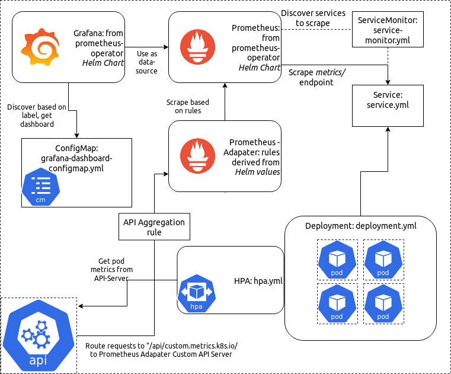
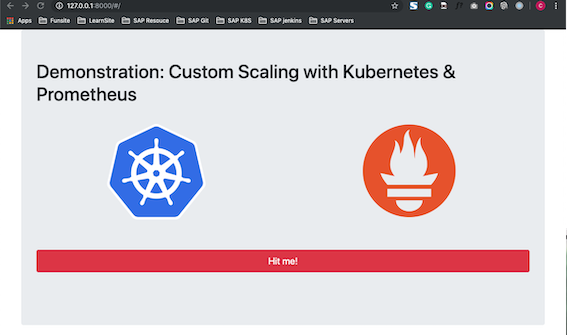
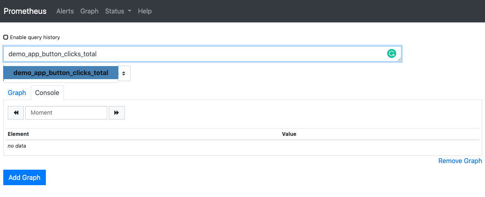

# **应用进行自定义指标扩缩容 by Prometheus-Adapter and Flask-Exporter**



##  **1 环境准备**

* `1.10.0+` 版本的 Kubernetes 集群
* 可以访问集群的节点上安装 `Helm` 和 `Kubectl` 工具
* 在集群中初始化了 `Helm`

## **2 Clone 项目**

本文使用到的相关代码都统一放置到了 `GitHub` 上，`Clone` 代码到本地：

```
$ git clone https://github.com/cnych/k8s-prometheus-custom-scaling.git
$ cd k8s-prometheus-custom-scaling
```

我们可以先来看一下将要扩容的应用。是使用 `Flask` 作为后端 `React` 作为前端的一个项目，另外还使用了 [Flask Promethues Exporter](https://github.com/rycus86/prometheus_flask_exporter) 这个第三方库，核心的后端代码如下所示：

```
from flask import Flask, render_template
from prometheus_flask_exporter.multiprocess import GunicornInternalPrometheusMetrics

application = Flask(__name__, static_folder="./public", template_folder="./templates")
metrics = GunicornInternalPrometheusMetrics(application)


@application.route("/")
def index():
    return render_template("index.html")


@application.route("/click-button", methods=["POST"])
@metrics.counter("demo_app_button_clicks", "Number of button presses by user")
def web_button():
    return {}
```


我们可以在本地先使用 `docker-compose` 来运行该应用：

```
$ docker-compose up -d
```

**报错了**

```
...
npm WARN npm npm does not support Node.js v10.15.2
npm WARN npm You should probably upgrade to a newer version of node as we
npm WARN npm can't make any promises that npm will work with this version.
npm WARN npm Supported releases of Node.js are the latest release of 4, 6, 7, 8, 9.
npm WARN npm You can find the latest version at https://nodejs.org/
...
```

**修改`Dockerfile`了** 

```
FROM ubuntu:19.04

RUN apt-get update
RUN apt-get install -y python python-pip
RUN apt-get install -y npm nodejs

COPY . /app

RUN pip install -r /app/requirements.txt
RUN npm install npm@latest -g    # update npm tp the latest version
RUN npm install --prefix /app/demo_app/src --no-package-lock
RUN npm run-script build --prefix /app/demo_app/src

WORKDIR /app/demo_app
ENV prometheus_multiproc_dir /tmp
EXPOSE 8000
CMD [ "gunicorn", "-c", "config.py", "-w", "4", "-b", "0.0.0.0:8000", "server"]
```

启动后可以在浏览器中打开 `localhost:8000` 来访问我们的应用：



这是一个非常简单的 `Web` 应用，点击 `Hit me!` 按钮会向网站的一个服务端点发起一个 `POST` 请求，该端点上的 `Promethues` 装饰器会将该请求记录下来。

每次接收到 `POST` 请求时，应用程序都会增加一个 `Prometheus Counter`，我们可以通过应用的 `/metrics` 接口来获取指标数据，最终我们会将该接口配置到 `Prometheus` 中定期抓取指标数据。

```
$ curl -s localhost:8000/metrics | grep demo_app_button_clicks
# HELP demo_app_button_clicks_total Multiprocess metric
# TYPE demo_app_button_clicks_total counter
demo_app_button_clicks_total 0.0
```

`Prometheus Counter（计数器）`只会增加：永远不会减少，我们可以在页面上点击下按钮，然后再来看下指标数据的变化，正常来说会得到如下所示的信息：

```
$ curl -s localhost:8000/metrics | grep demo_app_button_clicks
# HELP demo_app_button_clicks_total Multiprocess metric
# TYPE demo_app_button_clicks_total counter
demo_app_button_clicks_total 3.0
```

## **2 安装 Prometheus Operator**

我们这里来使用 `Prometheus Operator`，这个 `Operator` 通过抽象化 Prometheus 的部署来我们提供了更加简单方便的方法来使用 Prometheus，执行如下命令在 kube-ops 命名空间下面安装 `Prometheus Operator`：

```
helm install stable/prometheus-operator -f helm-values/prometheus-operator-values.yml -n prome-demo --namespace kube-ops
NAME:   prome-demo
LAST DEPLOYED: Mon Nov 18 16:19:55 2019
NAMESPACE: kube-ops
STATUS: DEPLOYED

RESOURCES:
==> v1/ClusterRole
NAME                                       AGE
prome-demo-grafana-clusterrole             35s
prome-demo-prometheus-oper-operator        35s
prome-demo-prometheus-oper-operator-psp    35s
prome-demo-prometheus-oper-prometheus      35s
prome-demo-prometheus-oper-prometheus-psp  35s
psp-prome-demo-kube-state-metrics          35s
psp-prome-demo-prometheus-node-exporter    35s
...

NOTES:
The Prometheus Operator has been installed. Check its status by running:
  kubectl --namespace kube-ops get pods -l "release=prome-demo"

Visit https://github.com/coreos/prometheus-operator for instructions on how
to create & configure Alertmanager and Prometheus instances using the Operator.
```

在安装完成后可以使用上面的提示命令来查看 Pod 的状态：

```
$ kubectl --namespace kube-ops get pods -l "release=prome-demo"
NAME                                                   READY   STATUS    RESTARTS   AGE
prome-demo-grafana-6c774cf988-d9dct                    2/2     Running   0          23h
prome-demo-prometheus-node-exporter-srkr6              1/1     Running   0          23h
prome-demo-prometheus-oper-operator-6f74cf9578-whvdx   2/2     Running   0          23h
```

### **可能出现的问题 `psp Configuration` **

```
$ kubectl --namespace kube-ops get pods -l "release=prome-demo"
NAME                                                   READY   STATUS         RESTARTS   AGE
prome-demo-grafana-944f89874-kf8nt                     0/2     Init:Blocked   0          10m
```

我们可以看到大部分 `Pod `都正常了，但是 `grafana` 这个 `Pod` 现在是处于 `Init:Blocked` 状态，我们可以使用 `kubectl describe` 命令查看下 `Pod` 的运行事件：

```
$ kubectl describe pod prome-demo-grafana-944f89874-kf8nt -n kube-ops
Name:               prome-demo-grafana-944f89874-kf8nt
Namespace:          kube-ops
Priority:           0
PriorityClassName:  <none>
Node:               ydzs-node2/10.151.30.23
Start Time:         Fri, 27 Sep 2019 09:02:42 +0800
Labels:             app=grafana
                    pod-template-hash=944f89874
                    release=prome-demo
Annotations:        checksum/config: 062340540c04487760c6487c9c4195fdca5ed6521330d6b842b61f3964fcabe4
                    checksum/dashboards-json-config: 01ba4719c80b6fe911b091a7c05124b64eeece964e09c058ef8f9805daca546b
                    checksum/sc-dashboard-provider-config: 511400f9e888cb5ae2906a914e06cbdcb1f19904cf150384c0bb9831723bee45
                    checksum/secret: 5bf8b81f17dbd08ebd81e7e67fd393d5936aeadf8285480e899cd28a92267890
                    container.apparmor.security.beta.kubernetes.io/grafana: runtime/default
                    container.apparmor.security.beta.kubernetes.io/grafana-sc-dashboard: runtime/default
                    container.apparmor.security.beta.kubernetes.io/grafana-sc-datasources: runtime/default
                    kubernetes.io/psp: prome-demo-grafana
                    seccomp.security.alpha.kubernetes.io/pod: docker/default
Status:             Pending
Reason:             AppArmor
Message:            Cannot enforce AppArmor: AppArmor is not enabled on the host
IP:
Controlled By:      ReplicaSet/prome-demo-grafana-944f89874
......
```

我们仔细观察其中有一句 **`Cannot enforce AppArmor: AppArmor is not enabled on the host` 这样的 `Message` 信息**，这是因为我们集群中开启了 `PSP` 安全策略，而我们使用 `Helm` 安装 `Prometheus Operator` 的时候，会给我们添加上一些 `PSP` 对象：

```
$ kubectl get psp -l release=prome-demo
NAME                                    PRIV    CAPS   SELINUX    RUNASUSER   FSGROUP     SUPGROUP    READONLYROOTFS   VOLUMES
prome-demo-grafana                      false          RunAsAny   RunAsAny    RunAsAny    RunAsAny    false            configMap,emptyDir,projected,secret,downwardAPI,persistentVolumeClaim
prome-demo-grafana-test                 false          RunAsAny   RunAsAny    RunAsAny    RunAsAny    false            configMap,downwardAPI,emptyDir,projected,secret
prome-demo-prometheus-node-exporter     false          RunAsAny   RunAsAny    MustRunAs   MustRunAs   false            configMap,emptyDir,projected,secret,downwardAPI,persistentVolumeClaim,hostPath
prome-demo-prometheus-oper-operator     false          RunAsAny   RunAsAny    MustRunAs   MustRunAs   false            configMap,emptyDir,projected,secret,downwardAPI,persistentVolumeClaim
prome-demo-prometheus-oper-prometheus   false          RunAsAny   RunAsAny    MustRunAs   MustRunAs   false            configMap,emptyDir,projected,secret,downwardAPI,persistentVolumeClaim
```

**我们可以编辑 `prome-demo-grafana` 这个 `PSP` 对象**：

```
$ kubectl edit psp prome-demo-grafana
```

由于我们集群中没有安装 `apparmor`，所以我们直接将 `annotations` 当中的两行数据删除即可：

```
apparmor.security.beta.kubernetes.io/allowedProfileNames: runtime/default
apparmor.security.beta.kubernetes.io/defaultProfileName: runtime/default
```

## **3 扩容**

### **3-1 部署应用到集群中**

在我们的代码目录下面执行下面的部署命令：

```
$ kubectl apply -f manifests/deployment.yml -f manifests/service.yml -f manifests/ingress.yml
deployment.apps/prometheus-demo-app created
service/prometheus-demo-app created
```
这会创建一个我们应用的 `Deployment` 和 `Service` 资源对象到我们集群中，

> 此外，还包括一个 `Ingress` 资源对象，用来暴露给外部用户使用的。

```
manifests/ingress.yml
```

* [外部服务发现之 ingress(一)](https://github.com/Chao-Xi/JacobTechBlog/blob/master/k8s_tutorial/k8s_adv17_ingress1.md)
* [`nginx-ingress` 的安装使用](https://github.com/Chao-Xi/JacobTechBlog/blob/master/k8s_tutorial/k8s_adv51_Nginx_Ingress.md)

```
apiVersion: networking.k8s.io/v1beta1
kind: Ingress
metadata:
  name: prometheus-demo-app
spec:
  rules:
    - host: prom-demo.ny152.com
      http:
        paths:
          - path: /
            backend:
              serviceName: prometheus-demo-app
              servicePort: 8080
# apiVersion: traefik.containo.us/v1alpha1
# kind: IngressRoute
# metadata:
#   name: prometheus-demo-app
# spec:
#   entryPoints:
#     - web
#   routes:
#   - match: Host(`prom-demo.ny152.com`)  #注意修改
#     kind: Rule
#     services:
#     - name: prometheus-demo-app
#       port: 8080
```


然后为了方便我们在浏览器中访问 `Prometheus` 的 `Dashboard`，我们将部署的 `Prometheus` 的 `Service` 改成 `NodePort` 类型：

```
$ kubectl edit svc prome-demo-prometheus-oper-prometheus -n kube-ops
# 将 spec.type 改成 NodePort

$ kubectl get svc -n kube-ops -l release=prome-demo
NAME                                    TYPE        CLUSTER-IP       EXTERNAL-IP   PORT(S)            AGE
prome-demo-grafana                      NodePort    10.106.151.204   <none>        80:31310/TCP       23h
prome-demo-prometheus-node-exporter     ClusterIP   10.111.181.43    <none>        9100/TCP           23h
prome-demo-prometheus-oper-operator     ClusterIP   10.110.17.60     <none>        8080/TCP,443/TCP   23h
prome-demo-prometheus-oper-prometheus   NodePort    10.107.93.192    <none>        9090:31339/TCP     23h
```

**然后我们就可以通过 `http://NodeIP:31339` 来访问我们的 `Prometheus` 页面了，切换到 `/targets` 页面下面，就会看到正在监控的端点列表了，其中就包括安装 `Prometheus Operator` 的 `CRD` 控制器**，当然可能默认情况下有一些监控数据有问题，这个时候就需要我们根据自己集群的实际情况去做对应的调整了：


接下来我们就来部署我们自己的应用监控，让 Proemthues 也可以抓取到我们自己的应用监控指标数据，执行下面的命令即可：

```
$ kubectl apply -f manifests/service-monitor.yml
servicemonitor.monitoring.coreos.com/prometheus-demo-app created
```

**该资源对象内容非常简单，就是一个简单的 `ServiceMonitor` 对象，`ServiceMonitor` 是 `Prometheus` 获取应用监控数据的一个 `CRD` 对象**，对 `ServiceMonitor` 不够熟悉的可以查看我们前面的[Prometheus Operator 的相关文档](https://github.com/Chao-Xi/JacobTechBlog/blob/master/k8s_dev/prometheus/11Adv_Prometheus_Operator.md)

```
apiVersion: monitoring.coreos.com/v1
kind: ServiceMonitor
metadata:
  name: prometheus-demo-app
  namespace: kube-ops
spec:
  endpoints:
  - bearerTokenFile: /var/run/secrets/kubernetes.io/serviceaccount/token
    interval: 15s
    port: web
  selector:
    matchLabels:
      app: prometheus-demo-app
  namespaceSelector:
    matchNames:
    - default
```


该对象通知 `Prometheus Operator` 配置运行中的 `Prometheus` 实例，监听带有标签 `app=prometheus-demo-app` 的服务。

现在我们再去 `Prometheus` 的页面上面查看 `/targets` 页面就会发现我们的应用已经配置在里面了，然后在 `Dashboard` 页面上输入下面的 `promql` 语句：


```
demo_app_button_clicks_total
```

这个指标就反应出了我们应用程序的所有实例中按钮的总共点击次数。



## **4 扩容**


我们这里使用一个名为 [Prometheus Adapter for Kubernetes Metrics APIs
](https://github.com/DirectXMan12/k8s-prometheus-adapter/) 的 `k8s` 的 `API` 扩展应用，它可以使用用户自定义的 `Prometheus` 查询来使用 `k8s` 资源和自定义指标 API。

接下来我们将 `Prometheus-Adapter` 安装到集群中，并添加一个规则来跟踪每个 Pod 的请求。规则的定义我们可以参考官方文档，每个规则大致可以分为4个部分：

* `Discovery`：它指定 `Adapter` 应该**如何找到该规则的所有 `Prometheus` 指标**
* `Association`：指定 `Adapter` 应该如**何确定和特定的指标关联的 `Kubernetes` 资源**
* `Naming`：指定 `Adapter` 应该**如何在自定义指标 `API` 中暴露指标**
* `Querying`：指定**如何将对一个获多个 `Kubernetes` 对象上的特定指标的请求转换为对 `Prometheus` 的查询**


下面我们就来编写我们自己的规则，首先添加 `rules` 熟悉到配置文件中：

```
rules: []
```


### **4-1 discover**

我们这里只需要发现（`discover`）一个指标 `demo_app_button_clicks_total`，添加一个非空的 `Pod` 标签匹配来过滤：

```
rules:
- seriesQuery: 'demo_app_button_clicks_total{pod!=""}'
```

### **4-2 Association**

关联（`Association`）就非常简单了，`Prometheus` 标签都直接映射到 `Kubernetes` 资源（`job`、`namespace`、`pod` 等等），所以我们可以使用一个模板来隐射资源：

```
rules:
- seriesQuery: 'demo_app_button_clicks_total{pod!=""}'
  resources: {template: "<<.Resource>>"}
```

### **4-3 naming**

我们演示应用的按钮点击总和实际上用处不大，我们需要按照每个 Pod 来进行扩容，然后在规则中添加一个简单的命名（`naming`）定义：

```
rules:
- seriesQuery: 'demo_app_button_clicks_total{pod!=""}'
  resources: {template: "<<.Resource>>"}
  name:
    matches: "^(.*)_total"
    as: "${1}_per_second"
```

### **4-4 Querying**

然后就可以定义查询（`Querying`）了：

```
seriesQuery: 'demo_app_button_clicks_total{pod!=""}'
resources: { template: "<<.Resource>>" }
name:
  matches: "^(.*)_total"
  as: "${1}_per_second"
metricsQuery: "sum(rate(<<.Series>>{<<.LabelMatchers>>}[2m])) by (<<.GroupBy>>)"
```

这是一个带参数的 `Prometheus` 查询，其中：

* `Series` 是有 `seriesQuery` 匹配的任何 `series`，该规则只有一个 `series`，所以我们可以将 `demo_app_button_clicks+total` 替换成`<<.Series>>`。
* `<<.LabelMatchers>>` 是 `adapter` 来替换成标签查询的（比如，`pod='deployment-name-abcd-1234）`。
* `<<.GroupBy>>` 表示我们想要扩展的资源，我们这里就是 `Pod` 了。

**`Promethues-Adapter` 的一个缺点是配置是通过静态文件和应用程序一起部署的，而不是通过 `ConfigMap` 或者其他基于 `API` 的对象来配置的**，

我们这里将使用另外一个 `Helm Chart` 来部署，通过覆盖 `values` 文件来配置规则。

`values` 文件放置在项目目录 `helm-values/prometheus-adapter-values.yml`，内容如下所示：

```
rules:
  default: false
  custom:
  - seriesQuery: 'demo_app_button_clicks_total'
    resources: { template: "<<.Resource>>" }
    name:
      matches: "^(.*)_total"
      as: "${1}_per_second"
    metricsQuery: "sum(rate(<<.Series>>{<<.LabelMatchers>>}[2m])) by (<<.GroupBy>>)"
prometheus:
  url: http://prom-demo-prometheus-opera-prometheus.default
```

使用下面的命令一键安装：

```
$ helm install stable/prometheus-adapter -n prome-adapter -f helm-values/prometheus-adapter-values.yml --namespace kube-ops
LAST DEPLOYED: Fri Sep 27 10:54:56 2019
NAMESPACE: kube-ops
STATUS: DEPLOYED

RESOURCES:

......

NOTES:
prome-adapter-prometheus-adapter has been deployed.
In a few minutes you should be able to list metrics using the following command(s):

  kubectl get --raw /apis/custom.metrics.k8s.io/v1beta1
```

等一小会儿，安装完成后，可以使用下面的命令来检测是否生效了：

正常来说会看到类似于下面的信息：

```
$ kubectl get --raw="/apis/custom.metrics.k8s.io/v1beta1" | jq
{
  "kind": "APIResourceList",
  "apiVersion": "v1",
  "groupVersion": "custom.metrics.k8s.io/v1beta1",
  "resources": [
    {
      "name": "jobs.batch/demo_app_button_clicks_per_second",
      "singularName": "",
      "namespaced": true,
      "kind": "MetricValueList",
      "verbs": [
        "get"
      ]
    },
    {
      "name": "namespaces/demo_app_button_clicks_per_second",
      "singularName": "",
      "namespaced": false,
      "kind": "MetricValueList",
      "verbs": [
        "get"
      ]
    },
    {
      "name": "pods/demo_app_button_clicks_per_second",
      "singularName": "",
      "namespaced": true,
      "kind": "MetricValueList",
      "verbs": [
        "get"
      ]
    },
    {
      "name": "services/demo_app_button_clicks_per_second",
      "singularName": "",
      "namespaced": true,
      "kind": "MetricValueList",
      "verbs": [
        "get"
      ]
    }
  ]
}
```

接下来，可以获取我们自己 Pod 的指标数据：

```
$ kubectl get --raw="/apis/custom.metrics.k8s.io/v1beta1/namespaces/default/pods/*/demo_app_button_clicks_per_second?pod=$(kubectl get po -l app=prometheus-demo-app -o name)" | jq
```

正常会输出如下所示的一些信息：

```
$ kubectl get --raw="/apis/custom.metrics.k8s.io/v1beta1/namespaces/default/pods/*/demo_a
pp_button_clicks_per_second?pod=$(kubectl get po -l app=prometheus-demo-app -o name)" | jq
{
  "kind": "MetricValueList",
  "apiVersion": "custom.metrics.k8s.io/v1beta1",
  "metadata": {
    "selfLink": "/apis/custom.metrics.k8s.io/v1beta1/namespaces/default/pods/%2A/demo_app_button_clicks_per_second"
  },
  "items": [
    {
      "describedObject": {
        "kind": "Pod",
        "namespace": "default",
        "name": "prometheus-demo-app-8585d447c6-77st2",
        "apiVersion": "/v1"
      },
      "metricName": "demo_app_button_clicks_per_second",
      "timestamp": "2019-11-18T08:49:26Z",
      "value": "0"
    }
  ]
}
```

我们可以看到现在的 `value` 值为`0`，这是因为我们还没有开始点击页面上面的按钮，所以速率是每秒为`0`。我们上面部署应用的时候创建了一个 `Ingress` 对象，所以我们可以通过域名（做好 `DNS` 解析后）直接访问我们的应用，然后点击页面上面的按钮后，重新来运行上面的命令，我们可以看到速率会增加。

> 这里我用的是`NodePort`的

```
$ kubectl edit svc prome-demo-prometheus-oper-prometheus  -n kube-ops
service/prome-demo-grafana edited
```
```
$ kubectl get svc  -n kube-ops
NAME                                    TYPE        CLUSTER-IP       EXTERNAL-IP   PORT(S)            AGE
prome-adapter-prometheus-adapter        ClusterIP   10.98.162.83     <none>        443/TCP            17h
prome-demo-grafana                      ClusterIP   10.106.151.204   <none>        80/TCP             17h
prome-demo-kube-state-metrics           ClusterIP   10.107.26.121    <none>        8080/TCP           17h
prome-demo-prometheus-node-exporter     ClusterIP   10.111.181.43    <none>        9100/TCP           17h
prome-demo-prometheus-oper-operator     ClusterIP   10.110.17.60     <none>        8080/TCP,443/TCP   17h
prome-demo-prometheus-oper-prometheus   NodePort    10.107.93.192    <none>        9090:31339/TCP     17h
prometheus-operated                     ClusterIP   None             <none>        9090/TCP           17h
```

```
http://127.0.0.1:31339
```

## **5 部署 HPA 对象**


`Pod`水平自动伸缩（`HPA`）可以根据一些特定条件来自动添加新的 `Pod` 到 `Deployment` 中去，这里我们添加一个 `HPA` 对象，**设定目标为每个 `Pod` 每秒 `0.01` 次点击**。

接下来我们就来测试下让我们的应用进行自动扩缩容，首先运行下面的命令确保现在只有一个 Pod 正在运行：

```
$  kubectl get po -l app=prometheus-demo-app
NAME                                   READY   STATUS    RESTARTS   AGE
prometheus-demo-app-8585d447c6-77st2   1/1     Running   0          23h
```

然后创建 HPA 对象，对象对应的资源文件位于代码根目录下面 `manifests/hpa.yaml`，完整的内容如下所示

```
kind: HorizontalPodAutoscaler
apiVersion: autoscaling/v2beta1
metadata:
  name: prometheus-demo-app
spec:
  scaleTargetRef:
    apiVersion: apps/v1
    kind: Deployment
    name: prometheus-demo-app
  # autoscale between 1 and 10 replicas
  minReplicas: 1
  maxReplicas: 10
  metrics:
  # use a "Pods" metric, which takes the average of the
  # given metric across all pods controlled by the autoscaling target
  - type: Pods
    pods:
      metricName: demo_app_button_clicks_per_second
      targetAverageValue: 10m
```

直接创建这个资源对象即可：

```
$ kubectl apply -f manifests/hpa.yml
horizontalpodautoscaler.autoscaling/prometheus-demo-app created
```

然后重新在浏览器中打开我们的应用，点击一会儿页面上面的按钮，然后重新运行上面的命令，正常我们就可以看到我们的应用的 `Deployment` 就已经开始扩容了：

```
$ kubectl get po -l app=prometheus-demo-app
NAME                                   READY   STATUS    RESTARTS   AGE
prometheus-demo-app-8585d447c6-4sls9   1/1     Running   0          5m18s
prometheus-demo-app-8585d447c6-77st2   1/1     Running   0          17h
prometheus-demo-app-8585d447c6-8x59q   1/1     Running   0          5m18s
prometheus-demo-app-8585d447c6-95vtx   1/1     Running   0          5m33s
prometheus-demo-app-8585d447c6-dnklw   1/1     Running   0          5m3s
prometheus-demo-app-8585d447c6-g9scp   1/1     Running   0          5m18s
prometheus-demo-app-8585d447c6-kmkvk   1/1     Running   0          5m3s
prometheus-demo-app-8585d447c6-rtf5x   1/1     Running   0          5m18s
prometheus-demo-app-8585d447c6-stxpw   1/1     Running   0          5m33s
prometheus-demo-app-8585d447c6-wtwv5   1/1     Running   0          5m33s
```
到这里我们就完成了使用自定义的指标数据对应用进行自动扩缩容的操作。

## **6 在 `Grafana` 中显示缩放数据**

这部分内容其实不是必须的，只是单纯的在图表上对我们的缩放数据进行展示，这可以增加我们对整个过程的理解。

我们将我们需要使用到的 grafana 的 Dashboard 数据放置在了代码根目录下面 manifests/`grafana-dashboard-configmap.yml`，先通过 `ConfigMap` 来创建这个 Dashboard 数据：

```
$ kubectl apply -f manifests/grafana-dashboard-configmap.yml
```

同样为了方便我们访问，将 `Prometheus Operator` 不是的 `grafana` 的 `Service` 更改成 `NodePort` 类型：

```
$ kubectl edit svc prome-demo-grafana -n kube-ops
service/prome-demo-grafana edited

$ kubectl get svc
NAME                  TYPE        CLUSTER-IP       EXTERNAL-IP   PORT(S)          AGE
kubernetes            ClusterIP   10.96.0.1        <none>        443/TCP          6d5h
prometheus-demo-app   NodePort    10.108.214.168   <none>        8080:30062/TCP   23h
```


这个时候同样我就可以用 `http://NodeIP:30062 ` 来访问 `grafana` 应用了。默认的用户名为 `admin`，默认的密码为：`prom-operator`，进入页面后，可以选择我们上面创建的 `Prometheus Demo App Dashboard` 这个 `Dashboard`，我们可以看到应用在扩缩容的完整过程：


