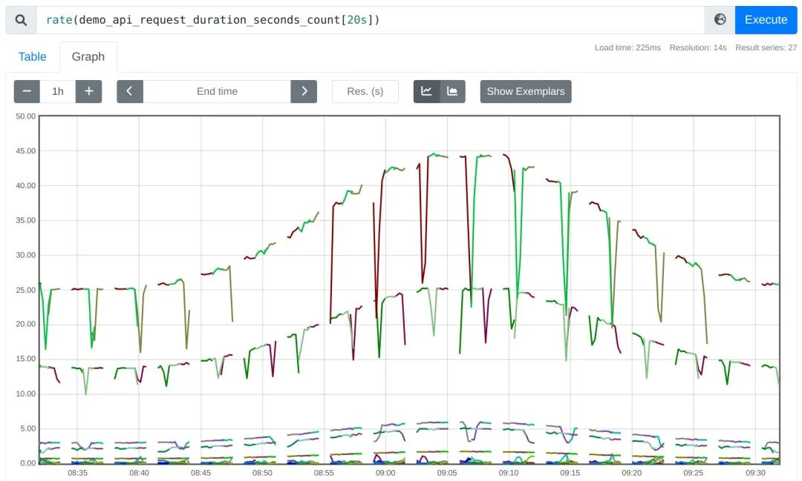
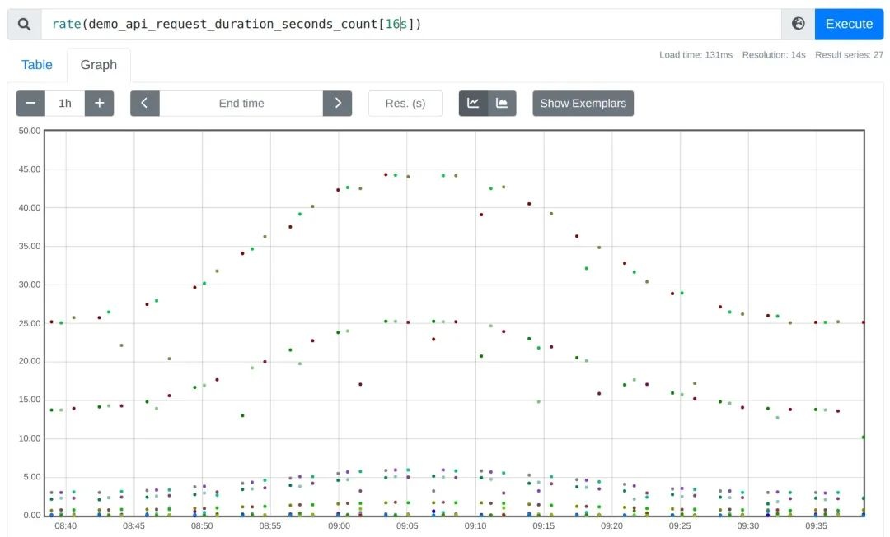
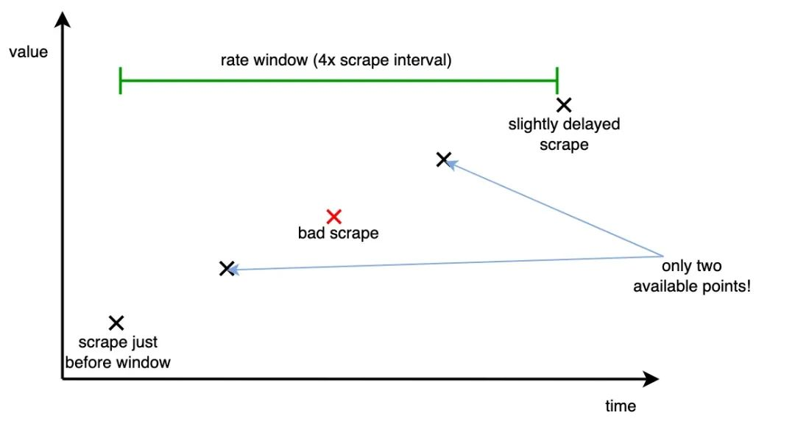
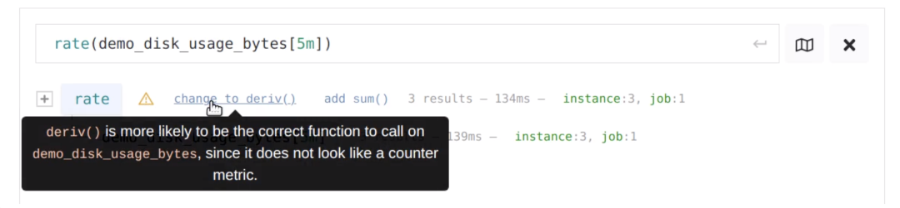

# 使用 Prometheus PromQL时需要避免这6个错误

[https://promlabs.com/blog/2022/12/11/avoid-these-6-mistakes-when-getting-started-with-prometheus](https://promlabs.com/blog/2022/12/11/avoid-these-6-mistakes-when-getting-started-with-prometheu)，这些都是 Prometheus 新手经常犯的错误。

## 错误 1：高基数炸弹

这是 Prometheus 使用者经常会犯的一个错，因为 Prometheus 时序是基于多标签的，它非常灵活，**有时你想新增一个标签，从而将一个粗粒度的指标进行拆分，但切记添加的标签值应该做到尽量收敛，不然会导致同一指标名的标签数量巨大而导致 Prometheus 严重的性能问题（OOM）**。

举个例子，比如你有一个只包含 method 标签的时间序列 `http_requests_total`：

```
http_requests_total{method="POST"}
http_requests_total{method="GET"}
http_requests_total{method="PUT"}
http_requests_total{method="DELETE"}
```

这个时间序列定义没问题，因为 HTTP 的 method 类型是有限的，但有一天，你可能想根据用户 id 进行区分，类似这样：

```
http_requests_total{method="POST",user_id="1"}
http_requests_total{method="POST",user_id="2"}
http_requests_total{method="POST",user_id="3"}
[…many more…]
http_requests_total{method="POST",user_id="16434313"}

http_requests_total{method="GET",user_id="1"}
http_requests_total{method="GET",user_id="2"}
http_requests_total{method="GET",user_id="3"}
[…many more…]
http_requests_total{method="GET",user_id="16434313"}
[…many more…]
```

如果你有非常多的不同用户，此时就会存在严重的高基数问题，这将导致 Prometheus 内存使用激增，最终可能因为 OOM 而导致崩溃。

所以请牢记：**指标上标签的每一种唯一组合都会自动创建一个对应时间序列，Prometheus 都会对其进行摄取、索引、存储和处理**。


虽然针对单个标签的不同值的数量没有明确的限制，但因为不同值都是一个新的时间序列，你需要确保其数量保持在你 Prometheus 服务器容量之下（一个大型 Prometheus 单节点能够处理几百万个时间序列），所以你在设计时间序列的标签的时候，需要确保它们的所有组合总数在你 Prometheus 服务器可以承受的范围内。

对此，有一些标签值我们要特别注意避免，例如：


* 公网 IP 或者邮件地址。
* HTTP 请求 Path 全路径，尤其这些路径带有动态 ID 等信息。
* 进程 ID（除非是有限集合）。


有时你想在不完全删除标签的情况下解决标签高基数的问题，那么我们就要想办法减少其值的基数。

**例如，对于 `/api/users/739567637385/posts/28388445` 的 HTTP 请求, 我们将动态信息部分使用 `user_id` 和 `post_id` 占位符统一替换，所以整个 path 可以替换为 `/api/users/{user_id}/posts/{post_id}`，从而有效减少 path 标签的值数量**。


## **错误 2：在告警表达式中因聚合而丢失有价值的标签**

在做告警的时候，我们往往会通过聚合计算去除不关心的一些标签。例如，如果你想确定某个服务的总体错误率（跨所有标签维度）是否过高，可以编写如下的规则：

```
sum(rate(errors_total{job="my-job"}[5m])) > 10
```

这看上去没什么问题，但默认情况下，`sum()` 聚合器会去掉时序的所有标签，它不仅会删除你想要聚合的维度（如实例、错误类型等），还会删除一些比较通用的标签，这些标签对于 Alertmanager 中进行告警的路由或静默是有帮助的，特别是 job 标签，因为不同 job 通常由不同的运维团队负责。

因此我们应该尽可能在聚合中保留此标签，可以使用 `sum by(job) (rate(errors_total{job="my-job"}[5m])) > 10` 这个告警表达式。

一个更好的选择是通过使用 without() 聚合修饰符替换 by() 聚合修饰符，从而显示排除不想要的标签，而尽可能保留下一些你不确定是否需要删除的标签：

```
sum without(instance, type) (rate(errors_total{job="my-job"}[5m])) > 10
```

这样，聚合时你没有明确指定删除的标签在 Alertmanager 中仍然可以使用，这对于告警的聚合和路由非常有用，也能帮助你更好了解报警的来源。

## 错误 3：使用无任何限定范围的选择器

在编写 PromQL 查询（尤其是告警）的时候，我们需要格外小心，应该从关心的业务或服务的数据中进行查询，而不是全局范围。

因为不同的业务可能使用了相同的指标名称，它们甚至表达了不同的含义，随着时间的推移，相同指标名称的服务会越来越多，这可能会影响到你的告警规则或者仪表盘数据。

为避免不小心从不相关的任务或者服务中查询数据，我们一般使用 job 标签来限定选择器的范围，确保其查询的数据都是你关心的业务或服务。

例如，以下查询就是一个不安全的**裸**选择器，它可能会从你不期望的其他 **job** 中选择具有相同指标名的数据：

```
rate(errors_total[5m]) > 10
```

我们可以使用` {job="my-job"} `的选择器从而将指标限定在 my-job 服务范围：

```
rate(errors_total{job="my-job"}[5m]) > 10
```

这显然是一个更安全的方式，它可以有效避免从无关服务中查询数据，对你告警产生干扰，也能大大提升查询性能。

## 错误 4：告警规则没有使用 for 字段

for 字段主要用于告警规则评估，它允许你能够指定任意告警需要在连续的规则评估周期中出现多长时间才从 pending 状态变为 firing，大多数告警规则可能我们可以忽略该字段，只需要两个评估周期即可触发告警，但有时，我们为了排除抖动的干扰，比如一些 CPU 使用率，或者某个节点因为一两次抓取异常就判定 down 了

如下警报规则，它使用 up 指标来查找无法成功抓取的目标，并省略了可选的 for 修饰符

```
alert: InstanceDown
expr: up == 0
```

一次失败的抓取（很容易发生）将导致触发此规则，通常你希望让你的警报规则不那么容易触发，并至少等待几分钟，看看问题是否真的存在，然后再触发通知

```
alert: InstanceDown
expr: up == 0
for: 5m  # 一个实例只有真的挂掉或者无法访问长达 5 分钟才创建告警信息
```

**不带 for 针对一些内置的带有平均数计算的查询表达式也同样有问题**，例如表示高错误率的告警：

```
alert: HighErrorRate
expr: rate(my_errors_total{job="my-job"}[5m]) > 10
```

这个规则将在第一次查询到最近 5m 中该错误数的平均值 > 10 就立即创建告警，虽然 5m 的平均周期能够带来一定的稳健性，但是由于 Promtheus `rate()` 特性，我们考虑一下，一个完全新的服务或者一段时间未收集到数据会发生什么

* 5 分钟的 rate() 窗口只会考虑一些最近的样本，实际上并不会对五分钟的数据进行平均。
* 时间序列甚至根本还没五分钟数据，该规则也可能会立即创建告警。

因此我们可以使用 for 修饰符来解决此问题：

```
alert: HighErrorRate
expr: rate(my_errors_total{job="my-job"}[5m]) > 10
for: 5m
```

几乎大多数的告警规则都可以添加此参数，从而使报警规则更加稳健，但请记住，这也会导致警报的反应时间变慢，因此需要找到一个平衡点。

## 错误 5：rate() 窗口时间太短


在太短的时间窗口内计算速率时，得到的图表可能会出现不连续中断的情况，例如 `rate(my_counter[1m])？rate()` 和**其他 PromQL 函数（如 `increase()`、`irate()`、`deriv()`）告诉你时间序列在给定时间窗口内上升或下降的速度，在输入时间窗口下至少需要两个样本，从而能够告诉你这两个样本之间的序列是如何发展的**。如果将时间窗口设置得太小，则在该窗口下可能只有一个或零个样本，在这种情况下，输出结果为空。

例如，如果你采用 20s 的时间窗口对一个 15s 抓取间隔的指标进行 rate()，那么在这 20 秒时间窗口内很可能不会涵盖两个样本，因此你会得到一个与实际结果差异很大的比率：



我们可以采取更极端的做法：如果将 rate 窗口缩小到 16s，当两个相距 15s 的点恰好落在任意对齐的 16s 窗口中时，则只会偶尔得到一个输出点：





当使用 Grafana 时，可以使用 `$__rate_interval` 模板变量自动为你选择一个安全的间隔。

## 错误 6：rate() 相关函数用错了指标类型

虽然 PromQL 在其他一些方面是静态类型的，但它不能直接告诉你，你是否把错误的指标类型传入了一个不是为处理它而设计的函数。

### rate() 函数用在 gauge 类型指标

**rate()、irate() 和 increase() 函数被设计成为仅适用于 Counter 类型指标，Counter 类型是追踪累计计数的指标，这些计数只会上升（永远不会下降），除了在追踪过程中偶尔因为重启而重置为 0。**

为了在 rate 计算中尽可能消除计数器重置的影响，这些函数尝试将提供的时间窗口内样本的值的任何减小都解释为重置并对其进行补偿。

这种计数器的重置检测和补偿意味着你只能从这些函数中获得正数的结果（或 0）。如果你不小心传入了一个可以自然上升和下降的指标（比如内存使用量），PromQL 将无法判断这个错误，而只会返回一个不正确的输出值。这是因为每次你的仪表指标下降时，rate() 都会将其理解为计数器重置并且会错误地“纠正”它。

### deriv() 函数用在 counter 类型指标

你可以认为 deriv() 函数大致等同于 rate()，但它作用于 Gauge 类型，**deriv() 告诉你在输入时间窗口内 Gauge 类型指标每秒上升或下降的速度**。

虽然并不常见，但这里与 rate() 相同的陷阱可能会给你带来另外的困扰：因为 deriv() 函数没有实现任何围绕 Counter 类型重置的逻辑，试图使用 deriv() 计算一个在提供的窗口下有重置的 Counter 的类型指标，就会得到一个不正确的结果，有时甚至是一个负数。

### 如何避免传入错误类型的指标？

由于 PromQL 无法自动检测这种不正确的用法，所以在使用这些函数时必须格外小心，我们除了经验和已有知识外，还可以依赖一些开源项目，例如 PromLens 查询构建器这样的工具来辅助检测是否传了错误的指标类型：


