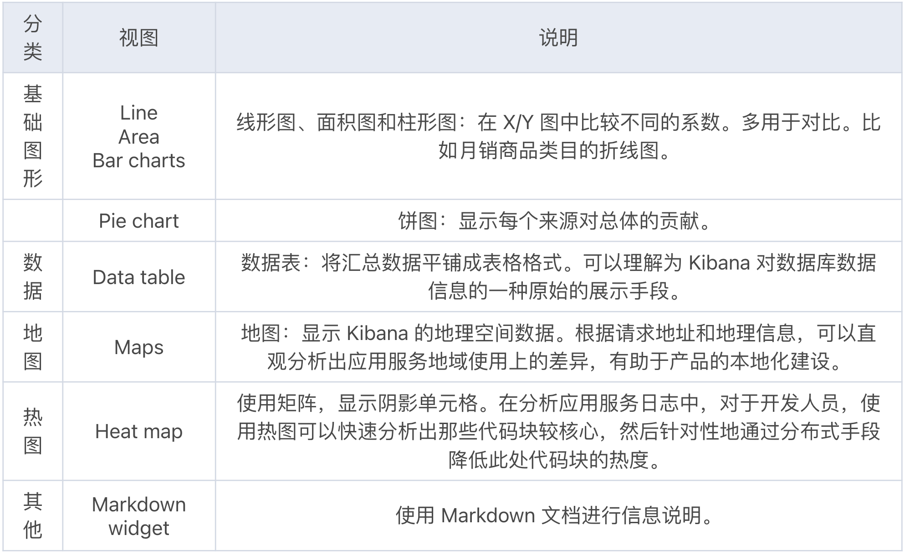
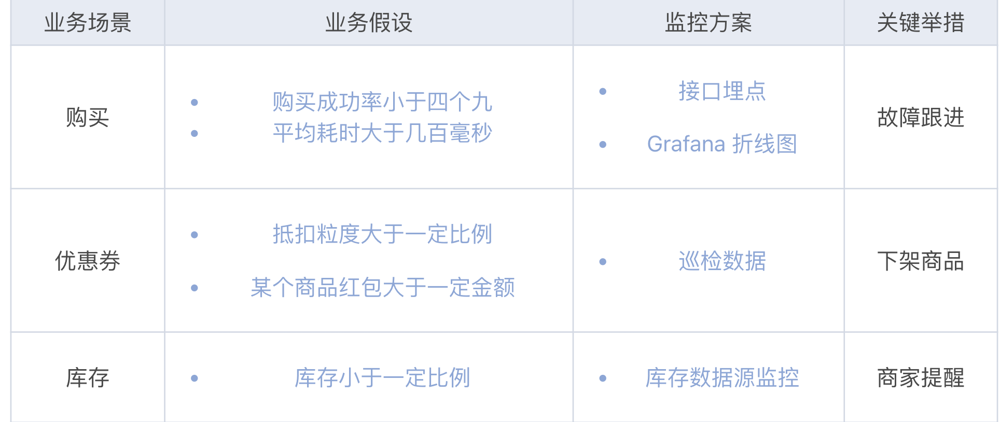

# **第一节 APM产品落地实战**

## **1 系统监控：老牌监控点评 CAT**

> CAT（Central Application Tracking）

首先，从时间上看，CAT 首个开源版本是在 2012 年，此时期与 APM 相关重大事件有：

* Google 公司发布《[Dapper 论文](https://ai.google/research/pubs/pub36356?fileGuid=xxQTRXtVcqtHK6j8)》；
* 紧随其后，Naver 公司发布开源无侵入 APM 系统[Pinpoint](https://github.com/pinpoint-apm/pinpoint?fileGuid=xxQTRXtVcqtHK6j8)；
* Twitter 公司发布开源 APM 系统[Zipkin](https://github.com/openzipkin/zipkin?fileGuid=xxQTRXtVcqtHK6j8)，Zipkin 是 Spring Cloud 分布式追踪系统[Spring-Cloud-Sleuth](https://github.com/spring-cloud/spring-cloud-sleuth?fileGuid=xxQTRXtVcqtHK6j8)的解决方案。

### **1-1 CAT 凭什么称为“老牌监控”？**

* Java 开发实现的实时应用监控平台,  起初专为大规模 Java 微服务集群提供实时监控报警场景
* 应用服务在代码中引入 CAT 客户端和相关埋点集成方案即可完成接
* 服务端由两个模块组成，**负责收集分析客户端数据的收集器模块**和**负责给用户提供报表展示的控制端模块**

总的来说 CAT 产品架构是由三个模块组成，架构设计非常清晰：

* Cat-client 提供给应用以及中间层埋点的底层 SDK
* Cat-consumer 用于实时分析从客户端提供的数据（收集器模块）
* Cat-home 作为给用户提供展示的控制端（控制端模块）

### **1-2 实时的代码段监控报表**

CAT 提供了非常丰富的报表，应用服务简单接入 CAT 客户端后，我们就可以通过 CAT 服务端全方位地监控应用集群了

### **1-3 客户端性能损耗低**

### **1-4 落地实践要点**

* 建议所有应用服务接入 CAT
* 不建议使用 CAT 分布式链路追踪功能
	* **“树形”模型无法追踪批处理框架的链路**
		* CAT 使用 ROOT、PARENT 和 CHILD 三个参数实现了分布式链路跟踪的“树形”模型，而“树形”模型是**无法绘制分布式集群中存在批处理框架的链路的**。
		* 即使不需要追踪批处理框架的链路，CAT 分布式链路跟踪代码也需要让每个 RD 理解跟踪模型，然后分布式跟踪的上下游都需要去进行手动埋点才可以实现
	* **报表展示效果不理想，且过时**
		* CAT 分布式链路追踪展示，可通过 Transaction 报表的 logview 视图查看。个人觉得其展示效果相较 SkyWalking、Zipkin 的分布式链路追踪视图存在明显差距。

### **1-5 线程优化**

**1.为什么要进行线程优化？**

* **从软件资源角度**：Java从应用视角看，线程的优化可以优化 JVM 资源，从而减少 GC。
* **从硬件资源角度**： 可以实现一个节点资源运行多个进程，降低硬件成本
* **从可用性角度**：非预期的 GC 导致应用节点不能按照预期响应消费者，造成应用服务不可用。

**2.使用线程的正确姿势**

正确使用方式是

* 使用线程池去管理线程；
* 线程的命名需要有意义；
* 任务线程的数量需要与工作线程挂钩，且需要考虑极端情况，如故障重启。

**3.CAT 改造**

为了让 Heartbeat 报表支持更细的框架线程粒度监控，我们需要掌握 CAT 的监控线程实现原理。Heartbeat 功能采集线程通过 `Java ThreadMXBean` 获取进程中的线程信

原理很简单，比如我们要监控 Apache Dubbo 的核心线程和活跃线程数，只需要在此处代码增加前缀` DubboServerHandler- `，即可监控 `Apache Dubbo` 的核心线程，然后遍历所有的线程，通过获取运行状态或者非等待状态的线程，就可以统计出活跃线程数。

**4. 优化实战**

此应用服务存在大量的内置框架（Apache Dubbo、Netty）的过度线程使用，这些**框架滥用线程**的形式通常会分为以下两种情况。

* 第一种：线程池使用一个较大的固定值。例如 Apache Dubbo 为例，服务提供者的默认线程数为 200 的 Fixed 的线程池。
* 第二种：和 CPU 核心数挂钩的线程池。非常典型的代码`Runtime.getRuntime().availableProcessors()*2` 获取硬件环境可用的 CPU 核心数 2 倍作为线程池个数，例如 Redisson。

* **数量优化**
	* 	第一种，框架使用线程池的方式显然就不合理。通过 CAT 改造，可以监控 Apache Dubbo 的线程数，你会发现一般的应用服务只用了十几个线程。
		* 建议，可以根据高峰和一定的未来预估来适当缩小线程池，并且考虑将线程池类型由 Fixed 改为 Cache，实现减少项目的启动时间和不必要的线程池数量。
	* 第二种，主要会在公司使用 IDC 机房，采取物理机多进程混合部署的方式，会存在线程滥用过多的情况。
		*  以 Redis 客户端 Redisson 为例，Redisson 客户端使用 Netty 与 Redis 集群通讯，默认的 Netty threads 为 0，这种配置会形成线程数与 CPU 核心数挂钩。
		*  对于常规的微服务进程，基本都会用到的框架有 HTTP Server、HTTP Client、JDBC、RPC Framework、MQ 和 NoSQL，我们可以自底向上，将每个应用服务的各个框架优化任务分配到各个成员。然后自顶向下，通过 CAT 的持续跟进优化，看是否达到了预期。

* **体积优化**
	* 适当缩小线程栈到 512k 以下，在应用服务使用较多线程时，优化的效果会非常明显

## **2 APM 引领者：Apache SkyWalking**

### **2-1 Apache SkyWalking 发展历程**

这里我先对下面内容使用的版本号，进行简要说明。版本后缀为什么是“.X”？其实软件的发布版本号分为三个部分，即“X.Y.Z”：

* “X”代表主要版本，此版本号的升级代表软件有重大特性发布，且特性很可能不向前兼容；
* “Y”代表次要版本，这个版本通常不提供重要的功能特性，而会对主要版本带来的重大特性，进行迭代升级；
* “Z”代表修复版本，用于 Bug 修复。

### **2-2 企业级落地**

如果早期落地方案不好，短期看到的都是 APM 工具带来的问题，对 APM 日后的推广非常不利。

**1.探针不稳定，如何及时止损并修复？**

* 解决思路是：实现秒级别的故障恢复和问题现场保留，然后通过持续的实践，最终找到适合自己团队的方法论。
* 止损方案：业务方接入 SkyWalking 探针时，**需要进行一段时间的灰度接入，确保灰度一段时间没有问题，才可以全量接入**。而如果灰度节点出现了问题，一些 CASE 自动（如进程挂掉）和兜底手动将通过脚本使用 Dump 命令对现场进行保留，然后打通发布平台快速摘除探针并上线。

**2.针对不同中间件，如何设计差异化落地方案？**

APM 监控存储的数据都是海量级别的。如果全记录下来，需要投入大量的设备资源，但带来的收益却很小，

假设要设计一款针对 Redis 的 APM 系统，也就是要做到能监控到的数据最小粒度为 Redis 操作命令，那势必要做出性能比 Redis 还要好的产品才可以

将要监控的业务系统快速的分为两类：

* 高 QPS 低业务编排能力的底层系统
* 低 QPS 高业务赋能的业务系统

**3.数据暴露的同时，如何保障信息安全？**

当你引入 SkyWalking 后，会发现固定的账户密码登录后，这些涉密信息便一览无余。

* SkyWalking 接入公司的登录系统，每个 APM 数据都必须有相应的应用归属。当用户查询数据时，只有用户所在的应用归属与 APM 数据的应用归属一致才可以展示。
* APM 在定位问题时，需要相关资源的数据联动展示，才能发挥出真正的价值。所以在应用拓扑和全链路追踪时，会展示相关联的技术数据，如端点信息、耗时等；但不会展示核心数据，如接口的出入参，执行 SQL 具体信息等。
* 同时也有部分相关联的数据是不对外展示的，如公司的人事、薪酬等，只对本应用负责的 RD 展示。

## **3 Java 性能分析神器 Alibaba Arthas**

### **3-1 Arthas 的核心应用场景如下**

* 场景 1：这个类从哪个 jar 包加载的？为什么会报各种类相关的 Exception？
* 场景 2：我改的代码为什么没有执行？难道是我没 commit？分支搞错了？
* 场景 3：遇到问题无法在线上 debug，难道只能通过加日志再重新发布吗？
* 场景 4：线上遇到某个用户的数据处理有问题，但线上同样无法 debug，线下无法重现！
* 场景 5：是否有一个全局视角来查看系统的运行状况？
* 场景 6：有什么办法可以监控到 JVM 的实时运行状态？
* 场景 7：怎么快速定位应用的热点，生成火焰图？

**总结起来就是，Arthas 不仅能解决开发者无法对线上服务进行 Remote Debug 的难题，还能以全局的视角进行在线监控诊断和热修复**

### **3-2 学习路径：命令+场景+原理**

Arthas 目前已经集成了 41 个在线命令

* 1.通过实操，熟悉命令

[根据官网的在线教程](https://arthas.aliyun.com/doc/arthas-tutorials.html?fileGuid=xxQTRXtVcqtHK6j8)，按照四个分类：基础命令、系统命令、类命令和增强命令，将这些命令通通实操一遍，对 Arthas 命令有个全局的感性认知。

* 2.深入场景，进行诊断

下面便是我对 Arthas 官网上七大场景的总结，这七个场景也最能体现 Arthas 产品的价值。

### **3-3 两套部署方案**

## **4 Alibaba Sentinel 时刻守卫流量健康**

Sentinel 是阿里开源的分布式架构的高可用防护工具，**它以流量为切入点，提供流量控制、流量塑形、熔断降级和过载保护等多维度的高可用保障策略**

Sentinel 便开始着力生态发展，如下图所示：Sentinel 提供更多 Java 微服务框架的开箱即用能力；同时 Sentinel 专注 API 网关服务，让开发者的高可用配置尽可能地收口，并着力于拥抱多语言生态和云原生支持的能力建设。

* Java 微服务框架适配： Sentinel 与其他 APM 系统（如 SkyWalking、CAT）监控框架的实现方式类似，通过插件化扩展和实现框架拦截器的方式，对 Java 微服务的 Web 服务端、RPC 框架、HTTP 客户端、消息队列等多个方向的框架进行适配。
	* 引入相应的组件依赖，并完成简单的配置，即可完成相应的框架接入 Sentinel。如上图右侧所示：Sentinel 适配的框架有 Spring、Dubbo、RocketMQ 等 Java 微服务框架。
* **API 网关服务： Sentinel 对很多常用的网关服务进行了适配**。
	* Sentinel 认为：在流量处于入口或是转发时进行高可用防护，要比流量来到应用服务后再进行流量控制，有效得多。如上图左侧所示：Sentinel 支持的 API 网关组件有 ZUUL、Spring Cloud Gateway 和 Nginx
* **多语言支持： Sentinel 在开源后，一直在探索多语言生态演进的路线**。
	* 开源之初，Sentinel 只支持 Java；开源后，社区大力发展多语言生态。到目前为止，已经扩展支持了 C++ 和 GO 语言的原生客户端版本。借助多语言的生态，Sentinel 覆盖了更多、更广的场景，如 GO 语言的 Web 应用等。如上图中部所示：Sentinel 支持了 GO 语言和多种云原生产品

Sentinel 一直在做云原生方向上的探索，目前已经具备支持 Service Mesh 高可用的能力，包括 Istio、envoy 和蚂蚁 MOSN 等架构的原生流控支持，未来会对云原生进行更多场景落地，比如 kubernetes 平台整合等。

### **1.技术骨架图，深入设计原理**

### **2 构建调用树（TreeNodeBuilder 和 Cluster NODE Builder）**

**规则控制（Action）**

### **3 服务节点引入**

* **对于客户端，我们将统一的基建脚手架中引入 Sentinel 客户端，即可完成部署**。如果应用服务没有脚手架基建，网关的应用服务引入 Sentinel 客户端可以优先于业务的应用服务。

* 对于服务端，我们需要对 Sentinel 引入动态数据源，解决应用服务重启后，规则丢失的问题。Sentinel 已经适配了所有常见的动态数据源组件，你可以因地制宜地选择其一进行部署。例如，企业内部使用 Apollo 解决了分布式配置统一管理的问题，那 Sentinel 动态数据源可以使用[sentinel-datasource-apollo](https://github.com/alibaba/Sentinel/tree/master/sentinel-extension/sentinel-datasource-apollo?fileGuid=xxQTRXtVcqtHK6j8)组件完成 Sentinel 服务端的动态数据源。

## **4 故障定位：Java VisualVM**

**Java VisualVM（All-in-One Java Troubleshooting Tool）**，VisualVM 是第一款集成了Java 命令行工具和支持实时在线问题分析的轻量级可视化工具，作为 Oracle Java 6 的一部分对外发布。

### **1.操作权限**

**VisualVM 不支持多用户-角色模式，所以我们需要尽可能缩小使用 VisualVM 操作应用服务的人员范围。**

动态管理产品树上每个应用服务节点上的归属成员，就可以实现 VisualVM 工具权限的统一管理。使用产品树对所有 APM 工具的使用权限进行收口，在团队愈发壮大时，收益也会越来越大。

### **2.安全限制**

JMX（Java Management Extensions）

JMX 是一个规范，它实现了 Java 远程监控管理的接口。

### **3 VisualVM 四个选项卡都有哪些能力？**

* **概述：此界面展示进程相关的概览信息、JVM 参数和系统属性**。因为企业中开发人员是无法直观查看线上配置，所以概述选项卡很好地展示进程使用的线上环境信息，可以让我们快速确定是否是环境问题造成的线上问题。

* **监视：此界面展示实时的 CPU 使用情况、JVM 堆信息，以及 Java 8 的元空间信息、类加载情况、进程中的线程情况**。此页面的监视数据不支持追溯历史，所以追溯历史可以使用 CAT 等 APM 工具解决。监视界面的执行 GC、堆 Dump 可以以最快速度进行现场保留。

* 线程：此页界面展示实时运行的各个线程情况，主要包括线程在一段时间内的运行状况，通过不同颜色的标识线程分别处于的 5 种常见状态：**运行、休眠、等待、驻留、监视**；右上角“线程 Dump”按钮，可以对线程进行快照操作。

* **抽样器：此界面对进程使用的 CPU 和内存进行采样，进行性能分析**。CPU 抽样，通过方法的视角，查看方法占用 CPU 的情况；内存抽样，通过类名归类和线程使用内存的视角，进行内存分配的调优。

### **4 VisualVM 的插件体系**

* 对于使用 Java 8 的用户，VisualVM 已经在 JDK 的 bin 目录中了。但当你打开插件仓库，会发现没有可以安装的插件，是因为插件的地址已失效，需要我们手动更新官方的插件中心地址。
* 对于使用 Java 11 的用户，VisualVM 在 JDK9 后，已不再为 Oracle JDK 的一部分，我们需要去[VisualVM官网](https://visualvm.github.io/?fileGuid=xxQTRXtVcqtHK6j8)进行下载。

目前 VisualVM 历经了十几年的发展，总共有 20 个多插件，根据插件类型可以分为以下 8 种。

* Profiling（性能剖析）：Startup Profiler、BTrace Workbench
* Sources（代码资源）：VisualVM-GoToSource
* Tools（工具）：Threads Inspector、VisualVM-JConsole、VisualVM-BufferMonitor、VisualVM-TDA-Module、KillApplication、VisualVM-Coherence、Visual GC、VisualVM-MBeans
* Platform（监控）：VisualVM-Extensions
* Security（安全）：VisualVM-Security
* Tracer（追踪）：Tracer-Monitor Probes、Tracer-Collections Probes、Tracer-JavaFX Probes、Tracer-IO Probes、Tracer-Swing Probes、Tracer-Jvmstat Probes、Tracer-JVM Probes
* UI（页面增强）：OQL Syntax Support
* Libraries（类库）：GraalJS

比如：Startup Profiler插件是在应用程序的启动阶段进行剖析的工具；GoToSource 插件是支持源代码导航和展示。

## **4 日志可视化：Kibana**

ELK 是 Elastic 公司的三个开源项目的缩写，这三个项目分别如下。

* Elasticsearch：基于 Apache Lucene 搜索引擎，使用 RESTful 接口屏蔽了搜索架构的复杂性。
* Logstash：服务器数据处理管道。
* Kibana：Elasticsearch 搜索引擎的可视化平台。
 
### **1 重新认识日志**

当下的业务开发人员都是将日志信息委托给日志框架进行打印，所以日志内容可以分为两类：

* 日志框架打印的日志信息
* 一线开发人员打印的日志信息

除了业务开发人员通过日志框架打印业务日志外，在框架层面还有框架日志。

其中日志框架打印的信息，常用的属性如下。

* **时间戳**：调用日志方法时生成时间戳，解决异步打印、异步收集造成的时间不精准问题。
* **线程名称**：由于线程 ID 不直观，所以通常使用线程名称来标识线程（注意不可以使用默认线程名称，需要根据使用线程情况来重命名线程名称）。
* **日志级别**：根据日志级别的不同，可粗略地对日志进行预处理。比如 DEBUG、TRACE 级别的日志只有在定位问题时才记录；当日志为 ERROR 级别时，立刻发出告警。
* **调用位置**：记录打印日志的类名和行号，有助于开发人员快速寻找源代码的上下文现场。
* **增强属性**：如全链路跟踪 ID，用于追溯引起日志打印的上下游。

### **2 Kibana 探索和分析日志**

* 第一种：通过 Kibana 探索（Discovery）功能，进行准确、实时的集中日志搜索。
* 第二种：创建多样的可视化视图（Visualize），将相关联的视图组合成仪表盘（Dashboard）。
* 第三种：通过 Elasticsearch SQL 直接从 Elasticsearch 中提取数据，加上丰富元素布局绘制画布（Canvas）。

使用方式都是必须基于创建索引模式（index pattern）

* **1.创建索引模式**

索引模式告诉 Kibana 哪些 Elasticsearch 索引包含了你想处理的日志数据，创建索引模式有多种方式，最常见的就是使用后置通配符。

在单个 Elasticsearch 集群内部完成索引模式的创建。如下图所示，集群内部有多个以“天”为切分维度的日志索引。如 `data_logs-20210307`、`data_logs-20210306`、d`ata_logs-20210305` 等，我们可以通过 `data_logs-*` 的正则表达式完成索引的匹配。

* **2.探索日志**

	* 搜索条件：网站请求非正常返回（HTTP 状态码非 200），且地域为中国流量。
	* 结果过滤：由于日志属性较多，实现只返回 IP 地址、机器设备和请求的 host。
	* 时间范围：最近七天。

* **3.制作多样的可视化视图**

* **4.构建仪表盘**

仪表盘是相关可视化视图的集合，进入仪表盘的编辑模式，引入相关主题的可视化视图。然后对可视化视图进行展示布局调整，就完成了仪表盘的创建。

* **5.绘制画布**

	* 创建空白工作区域（workpad）
	* 选择元素，设置元素的颜色、图像和数据
	* 指定元素的尺寸和调整布局
	* 保存画布的演示布局

## **5 多数据源让 Grafana 监控报警更高效**

### **5-1 Grafana 的核心设计**

* **Zabbix**

但当下对物理节点的监控诉求还是很需要的。接下来，我将讲述 Grafana 如何通过插件生态，集成 Zabbix 数据源，完成对物理节点的性能指标监控。

Zabbix 是监控分布式系统的解决方案，其具备物理机性能监控和对网络状况的监控。使用客户端、服务端模式进行收集数据，即物理机安装 Zabbix Agent 客户端采集数据传送给服务端，通过 web 服务直接对接服务端完成展示。由于 Zabbix web 展示监控数据不理想，所以解决方案是通过 Grafana 集成 Zabbix 数据源完成监控数据的展示。

Zabbix 数据源属于非官方支持的数据源，需要从开放的插件生态引入，重启 Grafana 服务后，即可在数据源中看到 Zabbix 数据源。

* **多维度报警**

相较于 Kibana 需要将用户升级为黄金用户以上级别才支持报警功能，Grafana 报警功能是完全开放的，只要将 Grafana 升级到 4.0 版本以上即可。

在报警配置界面，可以将报警信息发送至聊天工具 Slack、事件管理平台 PagerDuty 等在 Github 主流的报警媒介；也可以按照企业微信和钉钉的 API 开发文档，对接国内主流办公平台。通过配置报警媒介并集成监控数据源后，便能依据可视化面板的指标配置报警的规则了。

Grafana报警规则的设计是通过后台的一个调度程序，定时地通过查询引擎识别出当前可视化面板中的指标是否触及报警规则。如果触及，则调用报警媒介下达报警通知。

由于 Grafana 是可视化平台，监控数据的获取方式可视作为“拉模式”，且报警设计通过后台调度程序完成，所以此方案的设计来报警会稍许滞后。

### **应用服务配置 Grafana 指标**

**1.用户行为监控**

1）用户生命周期监控

常见生命周期分为如下图的 5 层，从用户接触产品到遗忘产品的整个过程中，我们可以通过监控分析用户在不同阶段的表现，有的放矢地优化产品体验，引导用户完成运营策略。

**2.核心场景监控**

* 业务场景：通过一组相关联的数据或事件，来反映自然语言描述的业务场景。
* 业务假设：通过业务场景可能在未来发生的事情做一系列的业务假设。
* 监控方案：以业务场景的数据指标为依据，监控业务假设是否成立。
* 关键举措：当假设成立时，启动一些应急举措。

* 1.预防拖垮核心资源
* 2.用户权限隔离

## **6 熟悉 APM 产品**

**APM 是应用性能管理（Application Performance Management）的缩写。从宏观角度上看，面向解决产品（对用户）体验不好的行为，都可以称为 APM，因此 APM 涉及的范畴非常广泛**

### **Apache SkyWalking**

* 通过链路追踪页面获取慢链路的 Endpoint；
* 再通过性能剖析页面上的输入框，描述你要剖析的 Endpoint；
* 最后 SkyWalking 会通过抽样展示这个 Endpoint 关联的线程堆栈信息

### **Alibaba Arthas**

* 通过日志上的数据面板（dashboard）命令或线程（thread）命令，获取想要 Dump 的线程 ID；
* 再通过线程命令，追加线程 ID 参数获取线程的堆栈信息；
* 最后通过各种在线故障排查命令，从而去诊断问题。

### **Java VisualVM**

* 通过应用服务使用日志框架中打印的线程名称，或 VisualVM 可视化客户端的线程选项卡展示的应用名称，从而获取线程实时工作状态；
* 再通过线程名称，使用 Threads intspector 插件获取线程的堆栈信息；
* 最后使用各种插件进行问题诊断。