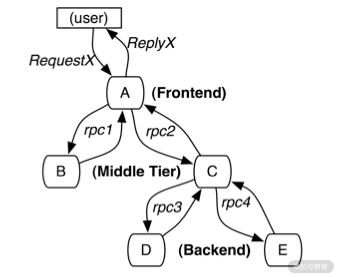
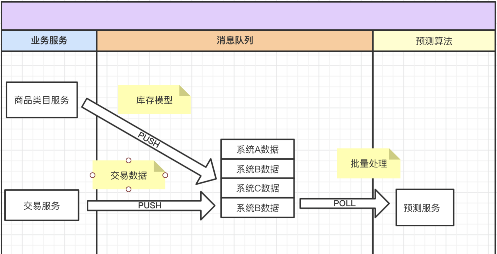

# **第二节 APM + OpenTracing 原理**

## **1 OpenTracing 解密: Dapper是树，SkyWalking是图**

### **什么是分布式链路跟踪？**

**分布式追踪就是把一次用户请求引起的，在分布式集群中的相关日志，串联起来的过程。**

市场上流行的分布式追踪实现是：通过链路标识，将一次用户请求，在分布式集群中各个应用节点打印的日志串联起来的过程，就是分布式链路跟踪。

追踪又可以简单分为以下两种。

* 对于**跨进程的链路追踪方案**，最优的技术方案是在远程调用发生时，**通过对请求协议增加链路标识，将上下游调用链绑定起来，就实现了分布式链路追踪的跨进程追踪**。
* 对于**跨线程的链路追踪方案**，如 Java 语言的微服务应用，**我们可以在主线程创建子线程时，将主线程的链路标识代入子线程，将主-子线程绑定起来，这样就实现了跨线程追踪**

目前以 SkyWalking、Zipkin 为代表的分布式追踪系统已经被广泛地接入到线上应用服务了

### **早期对典型追踪场景的论述**

* **1.标记方案（有侵入、准确度高）**

标记法顾名思义，**就是对应用监控日志打标记**。在应用程序中显式地对日志打标记，或者在框架拦截器中对请求进行标记**。通过这些标记，将一次请求引起的应用服务集群中的监控日志全部串联汇总起来的过程就是标记方案**。

Dapper 所论述的示例

前台服务 A 收到 RequestX 请求，Http Server 框架发现请求中没有标记，那么对这次流量进行标记，并识别为用户请求进行传播。

当请求传播到 B、C、D、E，再打印监控日志时，监控日志就带着与 A 衍生出来的标记，这样这次用户的请求通过 A 服务生成的标记就很容易被收集起来了。

不难看出，标记法的优点是精准；但缺点也显而易见，需要打标记。

* **2.黑盒方案（无侵入、准确度低）**

黑盒方案在无侵入的实现上，高于标记方案一个维度。黑盒方案认为应用服务是黑盒的，我们只关心可见的请求与日志，通过机器学习的方法，将这些请求和日志关联起来

> 最常见的机器学习方式用回归分析等统计学算法，将这些碎片化的请求和日志通过推测，重新组合成完整的链路。

黑盒方案的优势显而易见，不需要任何应用服务的架构修改和监控日志的变更；

黑盒方案的缺点很明显，机器学习的精度是逐渐提高的。所以上线新功能时，往往分布式监控可用度非常低，而且机器学习会消耗很多的运算资源。

### **SkyWalking 的图形追踪模型 (兼容树形模型的图形追踪模型)**

**1.克服树形追踪的不足——无法批处理**

> 图与树最大的区别就是每个节点可以有多个父节点

【预测系统场景】

一个典型的场景就是预测系统，通过各个系统的行为数据对产品的未来做出预测，如下图所示。

用户对各个系统的操作引发了一系列数据，这些数据会推送到消息队列，然后预测服务批量消费。可以看到预测服务的一次预测算法代码块的执行，是由多个业务服务引发的。那从预测服务这个点来看，如何与多个生产者服务串联链路呢？树形追踪模型显然是不能满足的。

**2.图形追踪的实现——支持批处理和“断链”场景**

以 SkyWalking 的存储模型为例

* **Span 打包**：SkyWalking 将一个任务线程中的所有 Span 打包为 Segment。**一个 Segment 中的 Span 由 0 递增，且具有相同父节点依赖**。

* **父节点描述：SkyWalking 父节点描述由多个属性组成**。
	* Refs 属性：描述当前 Segment 与相关生产者的 Segment 标识。
	* 在 RPC 调用的树形追踪链路中，为 1 个元素；但是当追踪场景有批处理框架时，链路从批处理框架起就为多个元素。

* **分布式链路 ID：分布式链路 ID 是重要的链路标记，其数据结构为数组**。
	* 如预测场景中，商品类目和交易服务等业务服务的分布式链路 ID 的数组长度为 1 个；当预测服务拉取一批用户请求行为后，分布式链路跟踪 ID 就是多个了。数量和拉取消息中的父节点描述数量有关。

## **2 亲和线程模型：分布式链路追踪 SkyWalking**

SkyWalking 使用字节码增强技术实现了监控，通常的场景下在应用服务的启动命令中，增加探针属性就能完成接入 SkyWalking 的 APM 监控。

### **工作线程、任务线程、线程池是如何配合的？**

两个关键词来描述线程，**那就是工作线程和任务线程**。

这两个词来自 Java 并发框架包（java.util.concurrent）中的线程池执行器类（ThreadPoolExecutor），其中当前正在执行 runWorker 方法的线程是工作线程；在 runWorker 不停循环，从等待执行队列中获取的对象为任务线程。

最好的线程管理策略就是使用线程池，线程池执行过程如下所示。

整个流程非常简单地分为两部分：

* 在主线程中因为有异步处理功能，所以创建任务线程并提交到阻塞队列；
* 工作线程会持续从队列中拿取任务线程并执行。

上图中的**主线程，是其他线程池中工作线程在执行的任务线程**

### **从监控视角重新认识线程**

以 Spring Boot 微服务为例，来看下 SkyWalking 是如何实现 Web 服务器的监控的。

* 工作线程

在 Spring Boot 微服务的场景中，主线程是在 Tomcat 容器的线程池中正在响应用户请求时执行的业务代码的任务线程。

**SkyWalking 在 Tomcat 进行转发请求的代码块进行监控**。在同步模式下，整体的监控类同于 Spring AOP 面向切面的设计思想，在执行方法的前后进行监控数据的收集，也就是对任务线程的执行过程进行监控。

* 任务线程

为了实现在执行任务线程的过程中，每处收集的监控信息可以不被开发人员感知即可实现关联，SkyWalking 使用了 Java 线程提供的线程本地变量，也就是 ThreadLocal 能力来实现。

在执行任务线程开始之初，当栈针触及第一个 SkyWalking 监控埋点后，会在 ThreadLocal 创建当前任务线程的跟踪信息，重要的属性如下

* 任务线程类型

根据第一个监控埋点的类型，将任务线程分为是要追踪跨进程链路还是**跨线程链路** 对于跨进程链路，又可以分为上游是人还是机器。以 SpringMvc 追踪为例，第一个监控埋点需要识别 HTTP Header 中的标记信息。

* 全链路跟踪标识

	* 若 HTTP Header 没有链路标识信息，就将追踪的链路渲染为人为调用，并创建全链路标识绑定到 ThreadLocal 信息中；
	* 反之，识别 HTTP Header 的链路标识，解析出全链路跟踪标识，并追加到 ThreadLocal 中的全链路标识信息。

当任务线程开始执行后，SkyWalking 监控埋点会有以下两类：**跨进程监控埋点和跨线程监控埋点**。

* 对于跨进程监控，需要找到面向传输的请求头部属性，将 ThreadLocal 中的全链路标识放入其中。
* 对于跨线程监控，那就很简单了，在主线程创建任务线程时，扩展任务线程对象的属性。将主线程的 ThreadLocal 中的链路标识放到扩展属性中，在任务线程执行时，识别这个属性完成串联。

最后，就是任务线程执行接近结束时，监控任务线程的结束，依赖于首个监控方法的退出时机，此时需要清理 SkyWalking 所有监控的 ThreadLocal 信息

**所以在线程复用的时候，若在任务线程结束的时候没有清理干净，那接下来执行的任务线程：轻则内存泄漏，无法串联链路；重则内存溢出，整个进程被不停的 Long GC 夯住。**

在 SkyWalking 的监控线程模型下，若监控了工作线程，就会出现以下情况：

* 工作线程在启动后，就会开启监控，在执行任务线程时会与主线程进行关联；
* 在结束任务线程时，由于工作线程并没有退出，所以监控信息不会上报；
* 当复用工作线程，再次执行任务线程时，会继续与新的（创建本次任务线程的）主线程进行关联。

那最终的结果就是：每一个工作线程内部的监控信息由于一直无法上报而无法得到释放，占用的内存空间会直线上升。且这些被占用的内存由于不能匹配内存垃圾回收算法，JVM 进程在运行一段时间到达临界值后，会频繁执行垃圾回收，但通过垃圾回收日志会发现收效甚微。

