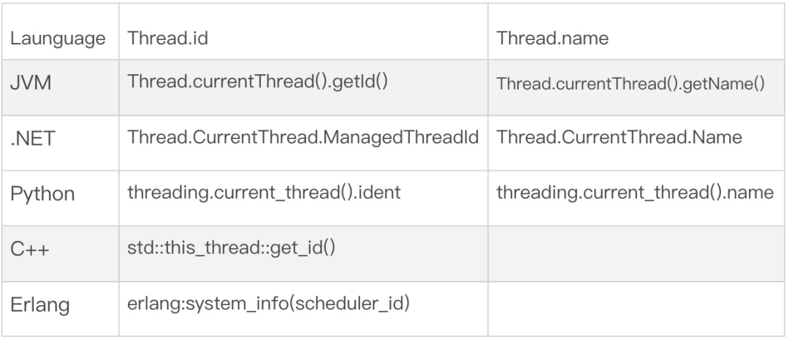
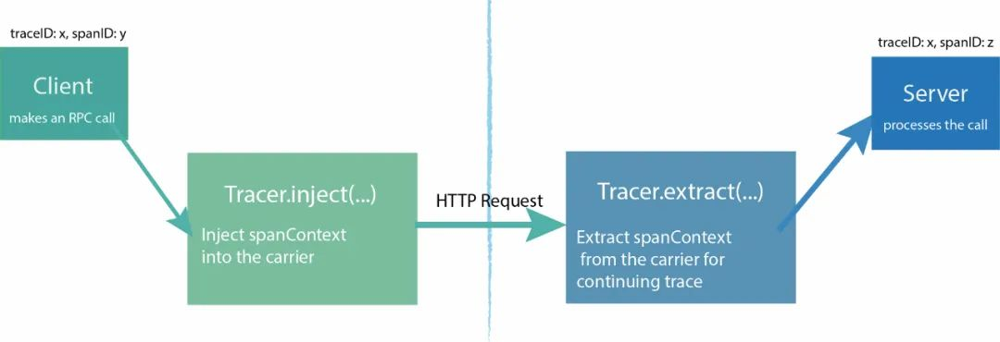

# **3 怎么理解分布式链路追踪技术？**

##**1 为什么需要链路追踪**


在学习分布式链路追踪之前，我们需要先理解这项技术产生的背景，以及它能够帮我们解决哪些棘手问题。

提到分布式链路追踪，我们要先提到微服务。相信很多人都接触过微服务，这里再回顾一下基本概念。

微服务是一种开发软件的架构和组织方法，**它侧重将服务解耦，服务之间通过API通信**。使应用程序更易于扩展和更快地开发，从而加速新功能上线。


> 微服务演变-亚马逊云

加速研发快速迭代，让微服务在业务驱动的互联网领域全面普及，独领风骚。但是，随之而来也产生了新问题：**当生产系统面对高并发，或者解耦成大量微服务时，以前很容易就能实现的监控、预警、定位故障就变困难了**。


## **2 什么是分布式链路追踪**

刚才说的情况，我们迫切需要一些新工具，帮我们理解微服务分布式系统的行为、精准分析性能问题。于是，分布式系统下链路追踪技术（Distributed Tracing）出现了。


它的核心思想是：**在用户一次请求服务的调⽤过程中，无论请求被分发到多少个子系统中，子系统又调用了更多的子系统，我们把系统信息和系统间调用关系都追踪记录下来。最终把数据集中起来可视化展示。它会形成一个有向图的链路，看起来像下面这样**。


> 电商系统的链路追踪图

后来，链路追踪技术相关系统慢慢成熟，**涌现了像Dapper、Zipkin、HTrace、OpenTelemetry等优秀开源系统**。他们也被业界，特别是互联网普遍采用。

目前Dapper（诞生于Google团队）应用影响最大，OpenTelemetry已经成为最新业界标准，我们重点基于OpenTelemetry讲解一下Trace内部结构

## **3 链路Trace的核心结构**

### **3-1 快速入门**

我们看看一个例子，某商家给（顾客）开账单（要求付款），在系统中大体的流程：


* 当商家从client发起开账单服务，请求从client程序先后进行了一系列操作：
* 网关load balancer：client的https请求先经过网关，网关调用下面的子系统
* 身份认证auth：网关RPC请求到服务auth，auth发起身份认证，完成后通知网关程序
* 生成账单billing：身份认证成功后，网关再发送RPC请求到服务billing，billing是生成账单的操作，billing处理完通知网关下一步
* 资源加载resource：billing成功，网关发送一个HTTP请求到服务resource，加载和账单相关资源，比如静态图片，相关顾客资料，resource完成通知网关
* 最后网关程序处理完开账单服务，返回结果给client

例子中，**我们把开账单服务一个流程或者叫一个事务称为Trace**。这里面有几个操作，分别是请求网关、身份认证、生成账单、加载资源，我们把每个操作（Operation）称为一个 Span。

### **3-2 Trace数据模型**

我们看看Trace广义的定义：**Trace是多个 Span 组成的一个有向无环图（DAG），每一个 Span 代表 Trace 中被命名并计时的连续性的执行片段**。

我们一般用这样数据模型描述Trace和Span关系：

```
            [Span user click]  ←←←(the root Span)
                       |         
                 [Span gateway]  
                       |
     +------+----------+-----------------------+
     |                 |                       |
 [Span auth]      [Span billing]     [Span loading resource] 
```

> 开账单Trace数据模型

数据模型包含了Span之间关系。**Span定义了父级Span，子Span的概念**。一个父级的Span会并行或者串行启动多个子Span。图三，Gateway就是auth、billing的父级Span。

上面这种图对于看清各组件的组合关系是很有用的，但是，它不能很好显示组件的调用时间，是串行调用还是并行调用。另外，这种图也无法显示服务调用的时间和先后顺序。因此，在链路追踪系统会用另一种图展现一个典型的Trace过程，如下面所示：


这种展现方式增加显示了执行时间的上下文，相关服务间的层次关系，任务的串行或并行调用关系。这样的视图有助于发现系统调用的关键路径。通过关注关键路径的执行过程，项目团队可能专注于优化路径中的关键位置，最大幅度的提升系统性能。例如：可以通过追踪一个用户请求访问链路，观察底层的子系统调用情况，发现哪些操作有耗时重要关注优化。

### **3-3 Span基本结构**

前面提到Span通俗概念：**一个操作，它代表系统中一个逻辑运行单元。Span之间通过嵌套或者顺序排列建立因果关系**。Span包含以下对象：

* **操作名称Name**：这个名称简单，并具有可读性高。例如：一个RPC方法的名称，一个函数名，或者一个大型计算过程中的子任务或阶段
* **起始时间和结束时间**：操作的生命周期
* **属性Attributes**：一组<K,V>键值对构成的集合。值可以是字符串、布尔或者数字类型，一些链路追踪系统也称为Tags
* **事件Event**
* **上下文 SpanContext**：Span上下文内容
* **链接Links**：描述Span节点关系的连线，它的描述信息保存在SpanContext中


**属性Attributes：**

我们分析一个Trace，通过Span里键值对`<K,V>`形式的Attributes获取基本信息。为了统一约定，**Span提供了基础的Attributes**。比如，Span有下面常用的Attributes属性：

* 网络连接Attributes：这些Attributes用在网络操作相关
* 线程Attributes

**这些Attributes记录了启动一个Span后相关线程信息。考虑到系统可以是不同开发语言，相应还会记录相关语言平台信息。**下面是不同语言开发的平台获取线程Id、Name方法：



**记录线程信息，对于我们排查问题时候非常必要的，当出现一个程序异常，我们至少要知道它什么语言开发，找到对于研发工程师。研发工程师往往需要线程相关信息快速定位错误栈**。


Span间关系描述Links：

我们看看之前Span数据模型：

```
                [Span gateway]
                   |     
     +------+------+------------------+ 
     |             |                  |
 [Span auth]  [Span billing]     [Span loading resource]
```

**一个Trace有向无环图，Span是图的节点，链接就是节点间的连线**。可以看到一个Span节点可以有多个Link，这代表它有多个子Span。

Trace定义了Span间两种基本关系：

* **ChildOf：Span A是Span B的孩子，即“ChildOf”关系**
* **FollowsFrom：Span A是Span B的父级Span**

**Span上下文信息SpanContext：**

字面理解Span上下文对象。它作用就是在一个Trace中，把当前Span和Trace相关信息传递到下级Span。它的基本结构类似`<Trace_id, Span_id, sampled> `，每个SpanContext包含以下基本属性：

* TraceId：随机16字节数组。比如：4bf92f3577b34da6a3ce929d0e0e4736
* SpanId：随机8字节数组。比如：00f067aa0ba902b7
* Baggage Items是存在于Trace一个键值对集合，也需要Span间传输。

### **3-4 Trace链路传递初探**

在一个链路追踪过程中，我们一般会有多个Span操作，为了把调用链状态在Span中传递下去，期望最终保存下来，比如打入日志、保存到数据库。**SpanContext会封装一个键值对集合，然后将数据像行李一样打包，这个打包的行李OpenTelemetry称为Baggage（背包）**。

**Baggage会在一条追踪链路上的所有Span内全局传输**。在这种情况下，Baggage会随着整个链路一同传播。我们可以通过Baggage实现强大的追踪功能。

方便理解，我们用开账单服务演示Baggage效果：

首先，我们在LoadBalancer请求中加一个Baggage，LoadBalancer请求了source服务。

```
@GetMapping("/loadBalancer")
@ResponseBody
public String loadBalancer(String tag){
    Span span = Span.current();   
    //保存 Baggage
 Baggage.current()
   .toBuilder()
   .put("app.username", "XYZ")
   .build()
   .makeCurrent();
......
    ##请求 resource
httpTemplate.getForEntity(APIUrl+"/resource",String.class).getBody();  
```

然后我们从resource服务中获取Baggage信息，并把它存储到Span的Attributes中。

```
@GetMapping("/resource")
@ResponseBody
public String resource(){
 String baggage = Baggage.current().getEntryValue("app.username");
 Span spanCur = Span.current(); 
    ##获取当前的 Span，把 Baggage 写的 resource
 spanCur.setAttribute("app.username", 
                         "baggage 传递过来的 value: "+baggage); 
```

最终，我们从跟踪系统的链路UI中点击source这个Span，找到传递的Baggage信息。


当然，Baggage拥有强大功能，也会有很大的消耗。由于Baggage的全局传输，每个键值都会被拷贝到每一个本地（local）及远程的子Span，如果包含的数量量太大，或者元素太多，它将降低系统的吞吐量或增加RPC的延迟。

### **3-5 链路添加业务监控**

我们进行系统链路追踪，除了Trace本身自带信息，如果我们还希望添加自己关注的监控。**Trace支持用打标签Tags方式来实现**。

Tags本质还是Span的 Attributes（在OpenTelemetry 定义中，统称Attributes。在Prometheus、Jaeger里面沿袭Tags老的叫法）。

打Tags的过程，其实就是在Span添加我们自定义的Attributes信息，这些Tags大部分和我们业务息息相关，为了更方便做业务监控、分析业务。

我们看一个Java打Tags的例子：页面定义好了一个Tag，名字叫“username”。我们输入Tags的值，然后把Tags通过一个HTTP请求发送给付账单的API。


**API获取Tags后，把它保存到当前Span的Attribute中。这个Span对应的是代码里面的一个Gateway方法，如果不重名Span名称，默认使用Gateway作为Span名称**。

```
@GetMapping("/loadBalancer")
public String gateway(String tag){
   Span Span = Span.current();  
   ##获取当前 Span，添加 username 的 tag
   Span.setAttribute("username", tag);
   ...... }
```

打了Tags后，我们可以在跟踪系统搜索Tag关键字。通过Tag可以快速找到对应的Trace。


**可以看到，根据Tags的key我们可以很方便筛选想要的Span信息。实际场景里，我们面临是从成千上万链路中快速定位访问异常的请求。打Tags对我们诊断程序非常有帮助**。

Baggage和Span Tags的区别：

* Baggage在全局范围内，（伴随业务系统的调用）在所有Span间传输数据。Tags不会进行传输，因为他们不会被子级的 Span 继承。

* **Span的Tags可以用来记录业务相关的数据，并存储于追踪系统中**。


### **3-4 全链路兼容性考虑**

在不同的平台、不同的开发语言、不同的部署环境(容器非容器）下，为了保证底层追踪系统实现兼容性，将监控数据记录到一个可插拔的Tracer上。在绝大部分通用的应用场景下**，追踪系统考虑使用某些高度共识的键值对，从而对诊断应用系统更有兼容，通用性**。

**这个共识称为语义约定Semantic conventions**。

你会从下面一些语义约定看出Trace做了哪些兼容性。

* General：通用约定，之前提到网络连接Attributes，线程Attributes
* **HTTP：针对HTTP请求的数据约定**
* Database：数据库数据约定，包括SQL和NoSQL不同类型
* **RPC/RMI：有关远程调用的约定**
* **Messaging：有关消息系统的Span约定，例如MQ的订阅、发布等**
* Exceptions：针对异常，错误状态等

例如，我们访问HTTP的应用服务器。应用系统处理请求中的URL、IP、HTTP动作（get/post等）、返回码，对于应用系统的诊断是非常有帮助的。监控者可以选择HTTP约定参数记录系统状态，像下面Trace展示的结果。


> Trace默认的语义约定

## **4 链路数据如何传播**

**在Trace传递中有一个核心的概念，叫Carrier（搬运工具**）。**它表示“搬运”Span中SpanContext的工具**。

比方说Trace为了把Span信息传递下去，**在HTTP调用场景中，会有HttpCarrier，在RPC的调用场景中会有RpcCarrier来搬运SpanContext**。Trace通过Carrier可以把链路追踪状态从一个进程“搬运”到另一个进程里。 

### **4-1 数据传播基本操作**

为了更清晰看懂数据传播的过程，我们先了解Span在传播中有的基本操作：

1、StartSpan：Trace在具体操作中自动生成一个Span

2、Inject注入：将Span的SpanContext写入到Carrier的过程

**链路数据为了进行网络传输，需要数据进行序列化和反序列化**。这个过程Trace通过一个负责数据序列化反序列化上下文的Formatter接口实现的。

例如在HttpCarrier使用中通常就会有一个对应的HttpFormatter。所以Inject注入是委托给Formatter将SpanContext进行序列化写入Carrier。

Formatter提供不同场景序列化的数据格式，叫做Format描述。比如：

* **Text Map：基于字符串的Map记录SpanContext信息，适用RPC网络传输**
* **HTTP Headers：方便解析HTTP Headers信息，用于HTTP传输**

一个Python程序实现Inject注入过程，Formatter序列化SpanContext成Text Map格式。

```
##Trace 生成一个span
    tracer = Tracer()
    span = tracer.start_span(operation_name='test')
    tracer.inject(
        span_context=span.context,
        format=Format.TEXT_MAP,
        carrier=carrier)
```
 
 3、Extract提取：将SpanContext从Carrier中Extract（提取出来）。

```
span_ctx = tracer.extract(format=Format.TEXT_MAP, carrier={})
```

同理，从Carrier提取的过程也需要委托Formatter将SpanContext反序列化。

### **4-1 运行原理**



> 链路数据在HTTP传递

我们基于HTTP通信解释传播原理。由图一，这个过程大致分为两步：

**1、发送端将 SpanContext 注入到请求中，相应伪代码实现**

```
/**
** 将 SpanContext 中的 TraceId，SpanId，Baggage 等根据 format 参数注入到请求中（Carrier）
** carrier := opentracing.HTTPHeadersCarrier(httpReq.Header)
** err := Tracer.Inject(Span.Context(), opentracing.HTTPHeaders, carrier)
**/
Inject(sm SpanContext, format interface{}, carrier interface{}) error
```

**2、接收端从请求中解析出SpanContext，相应伪代码实现**

```
// Inject() takes the `sm` SpanContext instance and injects it for
// propagation within `carrier`. The actual type of `carrier` depends on
/** 根据 format 参数从请求（Carrier）中解析出 SpanContext（包括 TraceId、SpanId、baggage）。
** 例如： 
**  carrier := opentracing.HTTPHeadersCarrier(httpReq.Header)
**  clientContext, err := Tracer.Extract(opentracing.HTTPHeaders, carrier)
**/
Extract(format interface{}, carrier interface{}) (SpanContext, error)
```

Carrier负责将追踪状态从一个进程“Carry”（搬运）到另一个进程。对于一个Carrier，如果已经被Injected，那么它也可以被Extracted（提取），从而得到一个SpanContext实例。这个SpanContext代表着被Injected到Carrier的信息。

说到这里，你可能想知道这个Carrier在HTTP中具体在哪。其实它就保存到HTTP的Headers中。而且，W3C组织为HTTP支持链路追踪专门在Headers中定义了Trace标准：

https://www.w3.org/TR/trace-context/#trace-context-http-headers-format

W3C组织是对网络标准制定的一个非盈利组织，W3C是万维网联盟的缩写，像HTML、XHTML、CSS、XML的标准就是由W3C来定制。

### **4-2 跨进程间传播数据**

数据传播按照场景分为两类：进程内传播、跨进程间传播`Cross-Process-Tracing`。

进程内传播是指Trace在一个服务内部传递，监控了服务内部相互调用情况，相当比较简单。追踪系统最困难的部分就是在分布式的应用环境下保持追踪的正常工作。任何一个追踪系统，都需要理解多个跨进程调用间的因果关系，无论他们是通过RPC框架、发布-订阅机制、通用消息队列、HTTP请求调用、UDP传输或者其他传输模式。所以业界谈起Tracing技术 往往说的是跨进程间的分布式链路追踪（Distrubute Tracing）。

我们用OpenTelemetry实践一个HTTP通信的Trace例子：

这是一个本地Localhost的Java程序，我们向下游服务192.168.0.100发起一个HTTP请求。

**程序中使用OpenTelemetry的inject注入，通过HTTP Headers把Localhost的Trace传递给192.168.0.100的下游服务**。传播前，手动还创建两个想要一块传播的Attributes。

```
@GetMapping("/contextR")
@ResponseBody
public String contextR() {
 TextMapSetter<HttpURLConnection> setter = new TextMapSetter<HttpURLConnection>() {
  @Override
  public void set(HttpURLConnection carrier, String key, String value) {
   // 我们把上下文放到 HTTP 的 Header
   carrier.setRequestProperty(key, value);
  }
 };
 Span spanCur = Span.current();
 Span outGoing = tracer.spanBuilder("/resource").setSpanKind(SpanKind.CLIENT).startSpan();
 try {
  URL url = new URL("http://192.168.0.100:8080/resource");
  HttpURLConnection transportLayer = (HttpURLConnection) url.openConnection();
  outGoing.setAttribute("http.method", "GET");
  outGoing.setAttribute("http.url", url.toString());   
  // 将当前 Span 的上下文注入到这个 HTTP 请求中
  OpenTelemetry.getPropagators().getTextMapPropagator().inject(Context.current(), transportLayer, setter);
  // Make outgoing call
...
```

运行程序，从监控平台我们看到，Trace从本地的程序成功传递到了192.168.0.100。


## **5 手动控制Trace：自动构建**


上面我们提到Trace，都是链路追踪系统自动完成的。虽然这很通用，但在实际应用中，我们有些时候还想查看更多的跟踪细节和添加业务监控。**链路追踪技术支持应用程序开发人员手工方式在跟踪的过程中添加额外的信息，甚至手动启动Span**，以期待监控更高级别的系统行为，或帮助调试问题。

**OpenTelemetry支持以SDK和API方式手动构建Trace。API、SDK都可以做一些基本Trace操作，可以理解API是Min实现，SDK是API的超集。**生产环境根据实际场景选择用哪一个。


### **5-1 创建Span**

要创建Span，只需指定Span的名称。手动创建Span需要显式结束操作，它的开始和结束时间由链路追踪系统自动计算。Java代码实例：

```
Span Span = Tracer.SpanBuilder("手工创建 SpanOne").startSpan();
try{
......
} finally {
    Span.end(); //手动创建 Span，我们需要手动结束 Span
}
```

应用程序运行时，我们可以这样获取一个Span。

```
Span Span = Span.current()
```

### **5-2 创建带链接Span**

**一个Span可以连接一个或多个因果相关的其他Span。实例中我们创建一个Span**。

**叫做“手工创建SpanOne”，然后分别创建了三个Span，通过link把它们关联成孩子Span。最后又创建了一个Span “childThree-Child”，把它作为“childThree”的孩子Span 关联**

```
@GetMapping("/createSpanAndLink")
public String createSpanAndLink() {
    String SpanName = "手工创建 SpanOne";
    //创建一个 Span，然后创建三个 child Span，最后关联 Span
    Span SpanOne = Tracer.SpanBuilder(SpanName)             
            .startSpan();
    Span childSpan = Tracer.SpanBuilder("childOne")
            .addLink(SpanOne.getSpanContext()).startSpan();
    Span childSpan2 = Tracer.SpanBuilder("childTwo")
            .addLink(SpanOne.getSpanContext()).startSpan();
    Span childSpan3 = Tracer.SpanBuilder("childThree")
            .addLink(SpanOne.getSpanContext()).startSpan();
    //创建一个 Span，关联 childSpan3,作为它的 childSpan
    Span childSpan3Child = Tracer.SpanBuilder("childThree-Child")
            .addLink(childSpan3.getSpanContext()).startSpan();
}
```

我们看看运行程序后，收集的Trace的效果：Link将各个Span连接起来。


### **5-3 创建带事件的Span**

Span可以携带零个或多个Span属性的命名事件进行注释，每一个事件都是一个 key:value键值对，并自动携带相应的时间戳。时间戳表示事件的持续时间。

```
@GetMapping("/event")
public String event(){
 Span span = Span.current();    
 span.updateName("创建 eventDemo"); 
 //手动更新 Event 持续时间
    span.addEvent("timeEvent",System.currentTimeMillis()+2000, 
                  TimeUnit.MILLISECONDS);  
    //给 Event 添加相关信息
    Attributes appInfo = Attributes.of(AttributeKey
                         .stringKey("app.id"), "123456",
                    AttributeKey.stringKey("app.name"), "应用程序 demo");     span.addEvent("auth.appinfo", appInfo);  
    logger.info("this is a event"); }
```

在上面程序可以看到，我们还可以给事件手动添加时间戳，这在复杂系统环境下还原真实持续事件很有意义的。看看运行程序后，追踪平台下Span生成的的效果：


## **6 数据如何上报**

有了程序的Trace数据，包含TraceId、Span、Spancontext一系列数据。接下来需要上报到监控系统，通过视图方式展示出Trace整个全貌。**我们习惯把Trace数据上报到监控过程称为数据收集（Data Collection）**。看看数据收集基本原理：


从图中，看到链路收集过程中，数据上报核心的几个组件：

* Collector：数据收集的处理器，它同时解析、加工监控数据，目的是给监控展示平台更直观的视图，便捷的查询。
* Exporters：采集器，从哪个应用程序获得Trace数据，目前主流跟踪系统几乎可以支持任何语言平台下开发程序，并且兼容主流操作系统和容器。为了支持Trace标准化到这种程序，工程师可谓呕心沥血，中间过程极不容易。

Data Collection在数据采集时候，Collector和Exporters有两种实现：Agent和Gateway。限于篇幅，我们在后面文章详细给大家讲解。


## **7 总结**

今天讲解了链路追踪的数据传播、数据上报的原理。如果你想动手实践文章中的代码, GitHub开放了地址：https://github.com/laziobird/opentelemetry-jaeger

APM为我们线上应用程序在故障定位、性能调优起到巨大作用。同时，我还会基于APM谈谈实际项目中，比如容器（Kubernetes）、服务网格（Istio）环境下，Trace数据采集具体实现和如何做监控。


