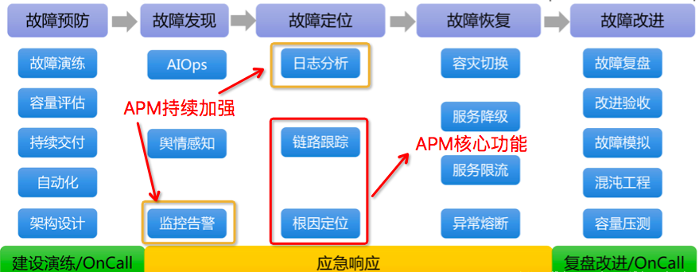
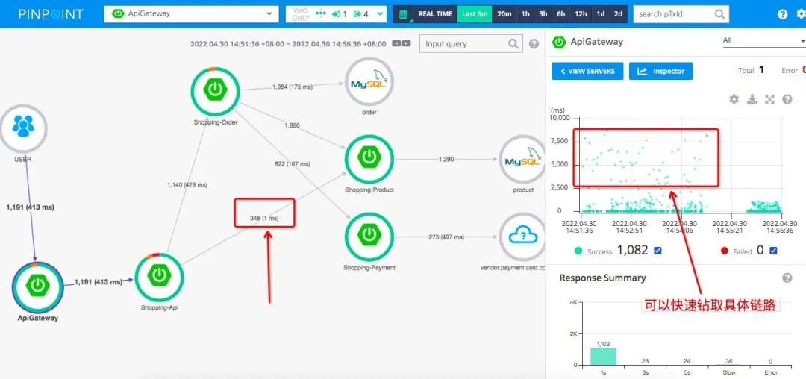

# **4 在生产环境中，如何选择靠谱的APM系统？**

## **1 APM 现状**

我们用一张图描述下 APM 在系统稳定性保障的位置：



目前 APM 开源、商业化产品比较成熟，大部分公司生产环境都部署了 APM 系统。本文从主流 APM 产品介绍出发，通过生产环境中关注的几个重要维度，给到大家一些适合自身公司场景的 APM 选型方案建议。

## **2 主流竞品概述**

我带大家大致回顾下目前国内、外都有哪些比较有口碑和市场占有率的 APM 监控产品：


* 除上面提及产品 ，市面上还有譬如：开源 ZipKin、Elastic APM、Dynatrace、国内的 OneAPM、博睿等。限于篇幅和个人了解程度，本文不做对比。我主要收录的判定维度：
* 产品体验：侧重生产环境的 APM 功能上易用性、实用性，个人喜好程度。
* 数据采样：很多 APM 在生产环境中收集链路数据过多，会遇到很多性能问题。特别大型分布式系统中，APM 采样能力、存储能力决定 APM 的靠谱程度。
* Agent能力：从 Agent 的技术生态、支持组件、开发语言能力。可能很多公司生产系统在这个维度就已经做了APM的选型了。比如你是 .Net 业务系统，上面提到一大半压根不支持。
* 报警 + DB 支持：预警、告警的能力、对调用链路中最典型数据库支持能力。
* 云原生的支持能力：在 Kubernetes 和 Istio 生产环境的成熟度，这个门槛也排除了很多 APM，特别是一些开源产品，这块普遍做得不理想。
* 数据大屏：题外话，数据大屏是公司期望对性能监控工具加强业务监控的体现。
* 社区和文档支持：产品对应的技术社区成熟度和产品文档的质量
* 其它：日志、数据大屏，自检，存储能力。限于优先级和本文篇幅，以后做更多相关分享

## **3 产品使用体验**

核心功能：业务链路图、链路追踪分析。

亮点：Pinpoint 的监控链路视图在实际使用中用的比较顺手。

推荐理由：业务链路图更直观、链路追踪分析更懂业务。



Pinpoint 链路分析指标丰富、从拓扑图钻取详细链路更高效：


备注：一般成熟的 APM，考虑到数据库核心场景，在调用链中，一般支持 SQL 传参完整显示。

## **4 数据采样**

调用链数据总体体量与业务体量正相关，全量采集调用链数据将会给公司系统整体带来两方面压力：

* 因数据上报造成的每个业务服务的网络 I/O 压力
* 因数据采集、分析造成的调用链追踪服务的计算和存储压力 为了降低这两方面压力，采样是大多数调用链追踪系统的必备模块。

实践中常用的采用策略可以分为三类：

* 头部连贯采样：Head-based coherent sampling
* 尾部连贯采样：Tail-based coherent sampling
* 单元采样：Unitary sampling 目前应用最广泛的采样策略主要是尾部采样

下面是它们基本原理图。


**Skywalking**：采样机制成熟，做在 server-side，能够支持简单的采样百分比 sample rate配置，允许 forceSampleErrorSegment：错误链路强制采用。更详细配置：

[https://skywalking.apache.org/docs/main/latest/en/setup/backend/trace-sampling/](https://skywalking.apache.org/docs/main/latest/en/setup/backend/trace-sampling/)


亮点：单独做了Slow SQL sampling 数据库慢查询的采样配置。

[https://skywalking.apache.org/docs/main/v8.5.0/en/setup/backend/slow-db-statement/](https://skywalking.apache.org/docs/main/v8.5.0/en/setup/backend/slow-db-statement/)

**Pinpoint：基本采样，支持百分比采样 Percent 和简单的总数采样 Counting**

**听云：基本采样**

对异常采集支持简单配置：ExceptionTrace Setting


**Jaeger**：依赖于 Opentelemetry 底层实现，支持尾部采样，异常采样，过滤规则采样等

[https://github.com/open-telemetry/opentelemetry-collector-contrib/tree/main/processor/tailsamplingprocessor](https://github.com/open-telemetry/opentelemetry-collector-contrib/tree/main/processor/tailsamplingprocessor)

Datadog 、腾讯云、阿里 Arms：APM 都有基本采样，采样支持策略也非常丰富

亮点：还进一步支持丰富的 DB、RUM（前端采样）

简单看一个腾讯云下面 APM 采样配置。


## **5 Agent 能力**

考虑我们业务系统在不同语言开发、不同操作环境下运行。而且，随着云原生和微服务的发展，现在业务系统也逐步部署在容器和服务网格中。这增加了 APM 产品的技术难度，实际情况：很多 APM 都支持不了所有场景，只能 Case By Case 考量。

因为 APM 普遍通过 Agent 方式采集链路数据。如果要看 APM 产品是否支持你的业务系统，最直接方式看 Agent 端实现能力了。

### **5-1 开源产品**

Pinpoint 虽然国内 Java 系统有一定使用量。但是 Pinpoint 探针升级慢，最近快半年没有升级。最新 Java 主流中间件很多不支持，对于 Kubernetes、Istio 还支持不了。

听云很久没维护，最新 Java 探针是 2020 年做了更新。Kubernetes、Istio 上不了生产环境

```
#### 2020-09-04 *Version:2.7.1*
1.重构Webflux插件，支持Spring Webflux 5.0.7.RELEASE ~ 5.2.8.RELEASE
```

Skywalking 平均两个月一个周期，主要支持 Java 主流中间件版本升级、它对 Kubenetes、Istio 成熟的支持，迭代兼容不同最新版本。Python、Go 也开始做了支持。

Istio 最新版本支持：Istio 1.10.3、1.11.4、1.12.0 release

Java 最新版本支持：JDK 16、17

### **5-2 商业产品**

[https://github.com/DataDog/dd-trace-java/releases](https://github.com/DataDog/dd-trace-java/releases)

我总结最近一个月，Datadog Agent 做了一些重要更新：

* 支持SAP的链路追踪：Enable tracing of SAP's HANA in-memory DB
* 支持 MQ 中间件 Kafka 数据流监控：Data streams monitoring for Kafka
* 支持最新 Apache HttpClient 5 监控：Apache HttpClient 5 instrumentation


亮点：开源的 Skywalking、商业的 Datadog 在主流的组件监控支持上下了功夫，而且对云原生上 Kubernetes 容器和 Istio 也成熟运用到生产环境，这是大部分其他APM产品没有做到的。

推荐：从这些方面看，如果你的业务系统不是主流的 APM 监控对象，比如采用 .Net 语言开发，或者用到了 SAP 公司的 IT 系统，那么你考虑的最重要优先级是哪些 APM 能真正支持。

另一方面，如果你的业务系统用到了最新的一些组件版本或者语言框架，比如 Java 用了最新版本，那很多开源 APM 是没有去迭代更新的。

### **5-3 总结**

毕竟商业端的 APM 有更多技术储备，和专注能力去兼容更多的组件。当然在生产环境，一些公司用了开源，借助本身技术能力，采用自研方式，做了一些个性化监控的技术方案。到底是开源还是商业，最核心是看性价比。如果你确实自研不了，开源也不能支持公司某些核心组件，考虑商业 APM 产品也是一种选择。

## **6 告警管理能力**

告警管理提供了可靠的告警收敛、通知，帮助业务系统快速检测和修复业务告警。

告警管理从功能上，包含基本功能：**添加监控事件、配置告警、告警推送**。

在实际生产环境中，一方面业务系统往往复杂，服务众多，简单一个个添加监控事件，会导致运维工作量骤增。另一方面，业务告警不光要及时推送，也需要提供足够丰富的报警数据和友好可视化展示，让 IT 人员快速定位问题和修复故障。

从这些维度，很多 APM 提供了告警高级功能：**告警模板，配置告警自动化，更友好的告警界面**。

我们看看主流APM具体对告警支持：

**Skywalking** 告警通过脚本配置：

[https://github.com/apache/skywalking/blob/master/docs/en/setup/backend/backend-alarm.md](https://github.com/apache/skywalking/blob/master/docs/en/setup/backend/backend-alarm.md)

Skywalking 报警界面不太友好，查看报警和添加报警事件比较麻烦。

不过 Skywalking 告警消息推送源比较丰富，比如飞书、钉钉、Slack。

还开放告警 hook，这样开发者基于自定义更多告警推动源。


**Pinpoint** 基本告警模板库、做了告警消息简单分组，但是不开放自定义告警源，有简单模板。

比起开源 APM，商业化 APM 告警高级功能比较强了。

我们看看 Datadog、国内观测云、阿里云 Arms 的高级功能：

告警模板库：丰富的告警模板，不用自己手动创建


监控配置更加自动化，比如下面对 MySQL 告警，通过灵活的监控阀值和指标配置，可以很快速和实用做到监控。这个比起纯脚本方式，极大节约了系统运维的工作量。当然，要提供这样的高级功能，对 APM 产品开发投入也是很大的。


友好的告警大屏：覆盖整个 IT 系统的告警状况，通过钻取查看具体某项服务


相比于商业的 APM 才能具备高级功能，开源产品限于资源有限，很难把告警能够做到如此。目前，从开源上能够把告警做得这样接近的，可以看看国内的专门做监控报警的夜莺团队，开源监控产品 Nightingale，原来 Open-falcon 的前身，在国内也是有众多的拥护者。

https://n9e.gitee.io/usage/

告警管理对应 APM 是一个相对重要功能，尽管商业 APM 远好于开源产品，毕竟付费。所以大家在实际项目中选型还是坚持性价比，你要看看公司业务系统对这些高级功能的迫切性和投入价值。确实有一些公司也在开源基础上自研了这些高级功能。

## **7 对 DB 的支持**

数据库是业务系统里面非常核心组件，生产环境常常可能因为数据库承载能力出现性能问题，最常见的例子就是慢查询。**通过 APM 可以看到完整慢查询 SQL 语句和耗时，也可以做慢查询和其他数据库 异常指标告警，这样快速定位数据库性能故障**。数据库支持实用度体现在两个方面。

SQL 调用链传参完整显示，比如 Skywalking，通过配置，看到的完整SQL：


> SQL传参显示效果

支持慢查询和相关性能指标的采集和展示，比如听云慢查询分析，它提供支持数据库 Oracle、MySQL、MS SQL Server。


刚才提到两个核心维度，有的 APM 会有不支持的情况：各种数据库比较多，要看具体说明。

整体看，DB 监控友好性还是体现细节方面，比如有些 APM 提供图形化界面动态配置慢查询和报警，的确运维使用上会大大便利。

所以，生产环境下使用 APM 对 DB 监控更多考虑效率的问题。

一般场景 Pinpoint、Skywalking 足够用。

## **8 Kubernetes 和 Istio 的支持**

对应 Kubernetes、Istio 的价值本文中不再赘述，在实际生产环境中，能真正支持好 Kubernetes、Istio 的 APM 确实不多，很多过去主流的 APM 都不支持的，甚至是一些商业的 APM 产品。

Pinpoint 目前最新开始支持 Kubernetes，不过到不了生产环境，Istio 完全不支持。

https://github.com/pinpoint-apm/pinpoint-kubernetes/issues

Skywalking 在 Kubernetes、Istio 可观测支持非常成熟。

这是 Skywalking 很大亮点，而且 Skywalking 对他们支持有一定时间，趟过很多坑。

之前生产环境，Istio 本身性能缺陷，Skywalking 做了很多优化：

比如说 Skywalking 从 Istio 性能很差的 Mixer 方案逐渐迁移到 Envoy 的 Access Log Service，以解决服务网格观察的性能瓶颈。更多，参考这篇干货：

[https://www.tetrate.io/blog/observe-service-mesh-with-skywalking-and-envoy-access-log-service/](https://www.tetrate.io/blog/observe-service-mesh-with-skywalking-and-envoy-access-log-service/)

Datadog Kubernetes、Istio 支持很强悍了。

比如支持灵活的日志过滤管理，可以优化 Kubernetes 下日志的采集策略。

[https://docs.datadoghq.com/agent/logs/advanced_log_collection/?tab=kubernetes#filter-logs](https://docs.datadoghq.com/agent/logs/advanced_log_collection/?tab=kubernetes#filter-logs)

Datadog 基于 Pod 去管理容器节点的链路追踪，可以支持 name、image、kube_namespace 这些粒度管理，可谓相当通用。


Istio 也有丰富支持，暴露很多 Envoy 监控指标：

https://docs.datadoghq.com/integrations/envoy

## **9 社区和文档成熟度**

### **9-1 技术文档**

Skywalking、Datadog、Arms 文档非常完整丰富，同时在网上搜索一些问题，都能找到合适的解决方案，这点对于维护者来说是非常有价值的。

不过 Arms 文档直观显得比较凌乱，毕竟它是很多团队，不同子系统集成而来，略微臃肿。

像 Skywalking 开源产品做了一些 APM 技术布道，搜索网上很多链路追踪技术文章都来于他们，这是开源社区的一些贡献。

完整、高质量技术文档对应使用开发者来说，作用当然不言而喻。另外一面，好的产品文档，有助于我们更多了解内部运行原理。

推荐总结：上生产环境，我们往往希望面对系统是可控的，完善、成熟的技术文档对于选型来说是一个很基本的要求。开源还有好处在于代码开放性，不用担心黑盒情况上一个监控，如果团队技术能力足够强，也能自己 fixed 或者优化问题。

### **9-2 社区生态**

开源产品一大优势在于开放性，主要体现社区和技术支持上。

比如Skywalking、Opentelemetry、Pinpoint 国内都有活跃的社群：