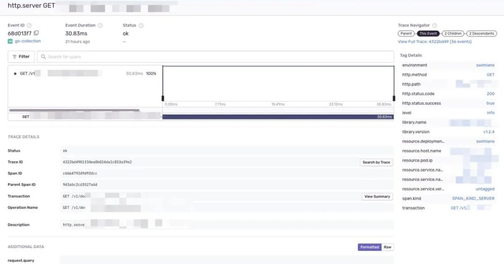
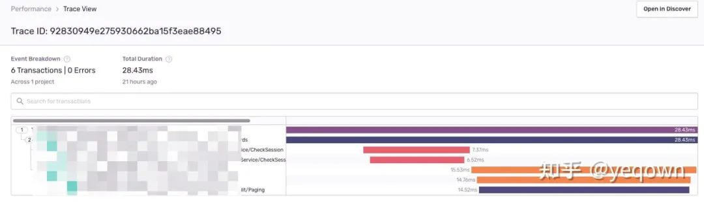
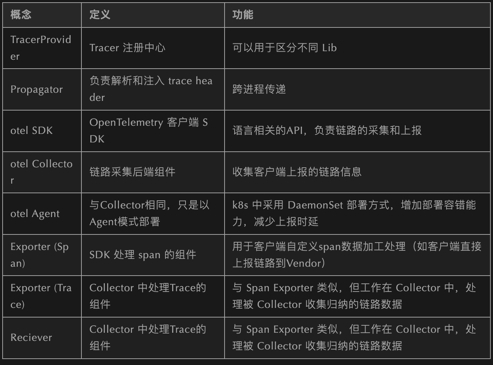

# **第五节 Sentry+OpenTelemetry前后端全链路打通**

自从微服务大行其道，容器化和k8s编排一统天下之后，“可观测性” 便被提出来。这个概念是指，对于应用或者容器的运行状况的掌控程度，其中分为了三个模块：`Metrics`、`Tracing`、`Logging`。

**Metrics 指应用采集的指标**；**Tracing 指应用的追踪；Logging 指应用的日志**。

日志自不用多说，这是最原始的调试和数据采集能力。Metrics 比较火的方案就是 Prometheus + Grafana，思路就是通过应用内埋入SDK，选择 Pull 或者 Push 的方式将数据收集到 prometheus 中，然后通过 Grafana 实现可视化，当然这不是本文的重点就此略过。

Tracing 也并不是可观测性提出后才诞生的概念，在微服务化的进程中就已经有Google的Dapper落地实践，并慢慢形成 OpenTracing 规范，这一规范又被多家第三方框架所支持，如 Jaeger、Zipkin 等。


OpenTelemetry 就是结合了 OpenTracing + OpenCensus 规范，约定并提供完成的可观测性套件，只是目前（2021-12-15）稳定下来的只有 Tracing 这一部分而已。对 OpenTelemetry 发展历史感兴趣的可以自行了解。

## **效果预览**

链路总览，包含了前端页面的生命周期 + 整个了链路采集到的Span聚合。


前端页面指标采集概览，**包含了该页面生命周期内的动作和日志等**。


**服务端链路细节，包含了服务端链路采集的标签和日志（事件）等信息**。



propagation兼容jaeger效果，保证jaeger侧链路完整，使用一致的 traceId检索。因为服务侧 sentry 是渐进更新的，因此没有接入的应用并不会展示在sentry侧， 等到完全更新后就会完整。




## **背景**

目前运行中的链路追踪组件是采用 opentracing + jaeger 实现，这套方案唯二的不足就是：

* opentracing 已经被 opentelemetry 兼容，且 opentelemetry 在可观测性上更全面，更灵活。
* 浏览器侧支持不完善（可以参见 https://github.com/jaegertracing/jaeger-client-javascript ）。

前端采用 sentry 来采集前端页面数据（APP + WEB 都支持很好），因此才有了这么一个 前后端链路打通的需求。打通总结/#sentry作为链路采集组件的优缺点)

最开始的需求目标是后端相关 Tracing SDK 全部使用sentry替换，但是结合上述对于sentry的调研，发现直接接入sentry并不是一个好的选择：

* 相关的 Tracing 概念没有被我个人和社区接受，社区内主流的还是 OpenTracing 和 OpenTeletemetry 规范，而且这两个规范都是相互兼容的（个人认为：OpenTelemetry 大有一统可观测性的趋势，他们立项也是朝着这个方向前进）。
* 官方go-SDK活跃度低乎想象，参见 https://github.com/getsentry/sentry-go/issues/387 截止本文时（since 2021-10-22）仍然没有任何回复，进一步阻止我直接使用sentry。
* 调研 OpenTelemetry 在研究它的架构设计时，发现其设计中包含了一个 Collector（详细介绍参见 附录/OpenTelemetry中的概念） 。从示意图我们也可以看出，它的作用近似于 Jaeger Collector / Agent，但是相比于 Jaeger 它更开放，支持多种 Vendor (Jaeger / Zipkin 等等)，更加灵活。


* 如果替换了 sentry 加入是不是以后还可能更换新的采集组件，服务这么多再来换一遍还是费时费力

## **方案描述**


那么基于以上的考虑，设计了如下的改造方案

* **在应用侧 Tracing SDK 全部替换为 otel SDK（后面经过考虑，还是自己做了一个防腐的 Tracing API封装）**。
	* 为了保证渐进更新服务端链路采集的同时，在Jaeger Dashborad中的链路不断，在 propagator 实现 otel 到 jaeger 的转换。
* **自己实现一个 Sentry Trace Exporter, 将客户端上报的链路，再投递到 sentry**。
* Collector 配置 exporter 时，同时上报到 sentry 和 jaeger

[https://github.com/yeqown/opentelemetry-quake](https://github.com/yeqown/opentelemetry-quake)

## **期间遇到的问题**

### **怎么定制自己的 Trace Exporter？**

主要还是参考 [https://github.com/open-telemetry/opentelemetry-collector-contrib](https://github.com/open-telemetry/opentelemetry-collector-contrib) 仓库中的实现。Collector 设计时已经考虑了用户自定义，所以按照官方的约定开发即可，至于 sentryexporter 在官方仓库已经存在了，所以我只是定制化了一下。


这里值得注意的是，如果你的collector需要使用特定的插件，那么需要使用官方的 [https://github.com/open-telemetry/opentelemetry-collector/cmd/builder](https://github.com/open-telemetry/opentelemetry-collector/cmd/builder) 来自己定制编译 collector, 这一点也可以在我提供的实践代码中找到。

### **Collector 和 Agent 的差异？**

可以简单理解为：中心化和分布式部署的区别，在实现上并没有区别。至于你应该使用哪种部署方式，当然视你的集群规模而定，如果只有不到100个服务实例，个人觉得仅仅collector足以，直到不足以承载。反之，如果你集群中节点众多，服务实例也众多，那么最好一开始就上agent。

### **k8s 中如何以 agent 方式部署 collector？**

官方也已经提供了样例代码，可以参考 [https://github.com/open-telemetry/opentelemetry-collector/examples/k8s/otel-config.yaml](https://github.com/open-telemetry/opentelemetry-collector/examples/k8s/otel-config.yaml)。

大致思路为：通过DaemonSet 在每个节点上运行一个 Collector 实例。这里需要注意的是，如果想要配置 `NODE_IP:PORT` 的方式让该节点上的服务直连 agent，那么需要在 `otel-config.yaml` 中添加如下配置：

```
apiVersion: apps/v1
# ....
template:
    metadata:
    labels:
        app: opentelemetry
        component: otel-agent
    spec:
        hostNetwork: true                  # 增加这一行
        dnsPolicy: ClusterFirstWithHostNet # 增加这一行
        containers:
            # ...
```

当然不止这么一种方式，比如还可以使用 hostPort, 视你的k8s集群配置而定。


### **sentry作为链路采集组件的优缺点**

缺点:

sentry 的主要场景并不是在于链路采集，而是在于前端页面采集（页面加载/路径/日志），包括页面异常数据；主要根据在于它独有（或许）的链路采集概念。其中常见的如下：


优点:

* 已经支持前后端链路打通，集成展示前端页面上发生的一切行为。
* 单独对异常进行采集和展示。

### **OpenTelemetry中的概念**


这里只是罗列了 Tracing 相关的概念：



