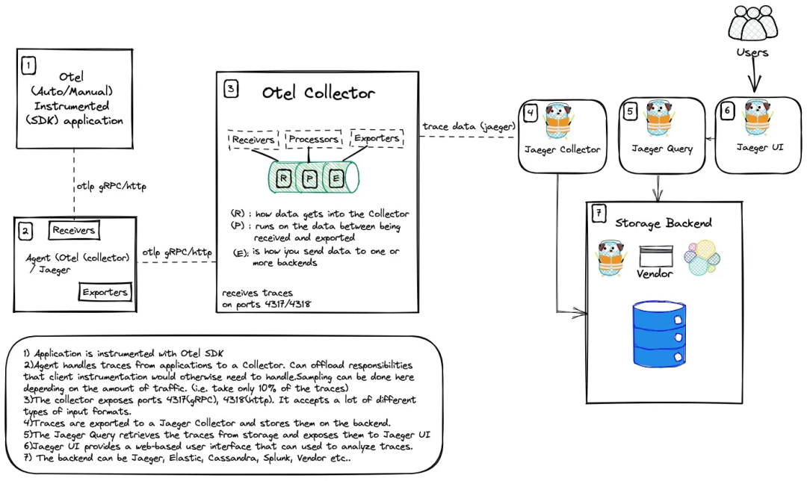
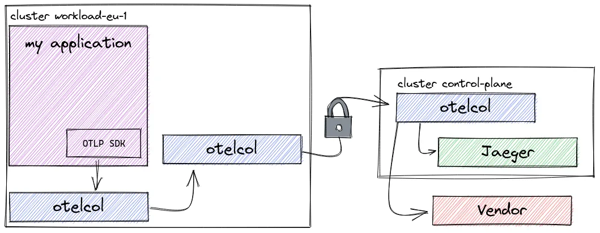

# 0 OpenTelemetry保姆入门攻略可PPT-2023

* 分布式追踪
* OpenTelemetry 是什么？
* OpenTelemetry 检测（自动和手动）
* OpenTelemetry 协议（OTLP）
* OpenTelemetry Collectors
* OpenTelemetry Collectors 部署模式
* OpenTelemetry 后端
* OpenTelemetry on Kubernetes
* OpenTelemetry Operator
* OpenTelemetry 示例应用程序

## 分布式追踪

### 为什么我们需要追踪？

我们需要为什么分布式追踪？为什么我们不能只使用指标和日志呢？假设你有一个如下所示的微服务架构


现在想象一下来自客户端的请求。

从上面的架构图中我们可以看出，一个请求可能要经过几十个或几百个网络调用。这使得我们很难知道请求所经过的整个路径，如果只有日志和指标，那么故障排查会非常复杂。

当我们的应用出现问题时，我们需要解决很多问题。

* 我们如何找出根本原因？
* 我们如何监视它所经过的所有服务？

> 分布式跟踪可以帮助查看整个请求过程中服务之间的交互，并可以让我们深入了解系统中请求的整个生命周期。它帮助我们发现应用程序中的错误、瓶颈和性能问题。

追踪从用户与应用程序进行交互的一刻开始，我们应该能够看到整个请求直到最后一层。

**跟踪数据（以 span 的形式）生成信息（元数据）**，可以帮助了解请求延迟或错误是如何发生的，以及它们对整个请求会产生什么样的影响。


**整个的这一个它叫做Trace一个链路， 然后比如说A到B，B到C这些，这些其实叫做一个一个的Span**


## 如何实现追踪？

为了实现追踪，我们需要做以下几件事：

1. 检测我们的应用程序
2. 收集和处理数据
3. 存储和可视化数据，以便我们可以查询它

为此我们可以使用两个开源项目：**OpenTelemetry 和 Grafana Tempo**。


## OpenTelemetry 是什么？

OpenTelemetry 可以用于从应用程序收集数据。

它是一组工具、API 和 SDK 集合，我们可以使用它们来检测、生成、收集和导出遥测数据（指标、日志和追踪），以帮助分析应用的性能和行为。


* **Microservice 是应用程序代码**
	* 可能需要通过API或者SDK集成
	* **应用手动去做一些埋点**
	* 有一些编程语言，比如说像java， Python这些，也支持auto埋点
	* 把埋点埋进去之后，会生成一生成我们的遥测数据，可以用这里的OTLP

* 所谓的OpenTelemetry 是一个数据规范的一个协议，会把这个数据发送到发送到一个采集器，**按照我们这种规范的话**， 都可以直接发送到这个采集器这边， **然后采集器这边**，他可以去做一系列的处理， 比如加一些原信息，做一些裁剪，采样。
* 处理完成过后，可以去选择发送到Jager, metrics 数据可以发送到Prometheus里面去，日志数据发送到Loki


OpenTelemetry 是：

* 开源的
* 受到可观测领域行业领导者的采用和支持
* 一个 CNCF 项目
* 与供应商无关的

OpenTelemetry 包括可观测性的三个支柱：**追踪、指标和日志**。（本文将重点关注追踪）

* **分布式追踪**是一种跟踪服务请求在分布式系统中从开始到结束的方法。
* **指标**是对一段时间内活动的测量，以便了解系统或应用程序的性能。
* **日志**是系统或应用程序在特定时间点发生的事件的文本记录。

### OpenTelemetry 与供应商无关

OpenTelemetry 提供了一个与供应商无关的**可观测性标准**，因为它旨在标准化跟踪的生成。**通过 OpenTelemetry，我们可以将检测埋点与后端分离**。这意味着我们不依赖于任何工具（或供应商）

我们不仅可以使用任何我们想要的编程语言，还可以挑选任何兼容的存储后端，从而避免被绑定在特定的商业供应商上面。


开发人员可以检测他们的应用程序，而无需知道数据将存储在哪里。

OpenTelemetry 为我们提供了创建跟踪数据的工具，为了获取这些数据，我们首先需要检测应用程序来收集数据。**为此，我们需要使用 OpenTelemetry SDK。**

### 检测（埋点）

应用程序的检测数据可以使用自动或手动（或混合）方式生成。 要使用 OpenTelemetry 检测应用程序，可以前往访问 OpenTelemetry 存储库，选择适用于的应用程序的语言，然后按照说明进行操作。

**自动检测**

使用自动检测是一个很好的方式，因为它简单、容易，不需要进行很多代码更改。

如果你没有必要的知识（或时间）来创建适合你应用程序量身的追踪代码，那么这种方法就非常合适。

**当使用自动检测时，将创建一组预定义的 spans，并填充相关属性**。

**手动检测**

**手动检测是指为应用程序编写特定的埋点代码**。这是向应用程序添加可观测性代码的过程。这样做可以更有效地满足你的需求，因为可以自己添加属性和事件。这样做的缺点是需要导入库并自己完成所有工作。



**传播器**

可以将 W3C tracecontext、baggage 和b3 等传播器（Propagators）添加到配置中。

> 不同的传播器定义特定的行为规范，以便跨进程边界传播带上上下文数据。

* **Trace Context：用于在 HTTP headers 中编码 trace 数据，以便在不同的服务间传递这些数据**。
* Baggage：用于在 span 之间传递键值对数据，例如用户 ID、请求 ID 等。
* B3：用于在 HTTP headers 中编码 trace 数据，以便在不同的服务间传递这些数据（主要用于 Zipkin 或其兼容的系统）。


**Trace Context**

在整个链路的形成过程当中， 怎么知道B是C的父级，所谓的**传播器**来实现的，在OpenTelemetry里面，它有个Propagator的一个API接口。有几种规范。

目前的话OpenTelemetry主要支持的就是W3C，W3C他们规范的一个trace context. 

比如父级的trace id以及父极的一个span id, 以及它的采样是否采样，这此信息给他以header的形式， 那个header的一个key叫做TRSPARENT, 通过这个header就可以传递下去, 然后传递到下一级的时候，当下一级肯定要从你的请求头里面去取。 **如果你从请求头里面能取到的一个， Traceparent 这样的一个header，就会把它解析出来**。  就会把上一层的这个Span head, 作为这一层的一个父级ID， 


**采样**

采样是一种通过减少收集和发送到后端的追踪样本数量来控制 OpenTelemetry 引入的噪声和开销的机制。

可以告诉 OpenTelemetry 根据要发送的追踪/流量的数量执行采样。（比如只采样 10% 的追踪数据）。


**两种常见的采样技术是头采样和尾采样。**

## OpenTelemetry 协议（OTLP）

**OpenTelemetry 协议（OTLP）规范描述了遥测数据在遥测源、收集器和遥测后端之间的编码、传输和传递机制。**

每种语言的 SDK **都提供了一个 OTLP 导出器，可以配置该导出器来通过 OTLP 导出数据**。然后，OpenTelemetry SDK 会将事件转换为 OTLP 数据。

**OTLP 是代理（配置为导出器）和收集器（配置为接收器）之间的通信。**

## OpenTelemetry Collectors

应用程序的遥测数据可以发送到 OpenTelemetry Collectors 收集器。


收集器是 OpenTelemetry 的一个组件，它接收遥测数据（span、metrics、logs 等），处理（预处理数据）并导出数据（将其发送到想要的通信后端）。


**Receivers**

接收器 Receivers 是数据进入收集器的方式，可以是推送或拉取。OpenTelemetry 收集器可以以多种格式接收遥测数据。


```
otlp:
  protocols:
    http:
    grpc:
      endpoint: "0.0.0.0:4317"
```

同样下面的示例，它可以以 Jaeger Thrift HTTP 协议方式接收遥测数据。

```
jaeger: # Jaeger 协议接收器
  protocols: # 定义接收器支持的协议
    thrift_http: # 通过 Jaeger Thrift HTTP 协议接收数据
      endpoint: "0.0.0.0:14278"
```

**Processors**


一旦接收到数据，收集器就可以处理数据。处理器在接收和导出之间处理数据。处理器是可选的，但有些是推荐的。

**比如 batch 处理器是非常推荐的。批处理器接收跨度、指标或日志，并将它们放入批次中**。批处理有助于更好地压缩数据，减少传输数据所需的传出连接数量。该处理器支持基于大小和时间的批处理。

```
processors:
  batch:
```

需要注意的是配置处理器并不会启用它。**需要通过 service 部分的 pipelines 启用**。

```
service:
  pipelines:
    traces:
      receivers: [jaeger]
      processors: [batch]
      exporters: [zipkin]
```

**Exporters**

为了可视化和分析遥测数据，我们还需要使用导出器。导出器是 OpenTelemetry 的一个组件，也是数据发送到不同系统/后端的方式。

比如 `console exporter` 是一种常见的导出器，对于开发和调试任务非常有用，他会将数据打印到控制台。

在 exporters 部分，可以添加更多目的地。例如，如果想将追踪数据发送到 Grafana Tempo，只需添加如下所示的配置：

```
exporters:
  logging:
  otlp:
    endpoint: "<tempo_endpoint>"
    headers:
      authorization: Basic <api_token>
```

当然最终要生效也需要在 service 部分的 pipelines 中启用。

```
service:
  pipelines:
    traces:
      receivers: [otlp]
      processors: []
      exporters: [logging, otlp]
```

OpenTelemetry 附带了各种导出器，在 OpenTelemetry 收集器 [Contrib](https://github.com/open-telemetry/opentelemetry-collector-contrib/tree/main/exporter) 存储库中可以找到。

**Extensions**

扩展主要适用于不涉及处理遥测数据的任务。扩展的示例包括健康监控、服务发现和数据转发。扩展是可选的。

扩展主要用于不涉及处理遥测数据的任务。比如健康监控、服务发现和数据转发等。扩展是可选的。

```
extensions:
  health_check:
  pprof:
  zpages:
  memory_ballast:
    size_mib: 512
```

## OpenTelemetry Collector 部署模式/策略

OpenTelemetry 收集器可以通过不同的方式进行部署，所以我们要考虑下如何部署它。具体选择哪种策略取决于你的团队和组织情况。

**Agent 模式**

在这种情况下，OpenTelemetry 检测的应用程序将数据发送到与应用程序一起驻留的（收集器）代理。然后，该代理程序将接管并处理所有来自应用程序的追踪数据。

收集器可以通过 sidecar 方式部署为代理，sidecar 可以配置为直接将数据发送到存储后端。


**Gateway 模式**

还可以决定将数据发送到另一个 OpenTelemetry 收集器，然后从（中心）收集器进一步将数据发送到存储后端。在这种配置中，我们有一个中心的 OpenTelemetry 收集器，它使用 deployment 模式部署，具有许多优势，如自动扩展。


使用中心收集器的一些优点是：

* 消除对团队的依赖
* 强制执行批处理、重试、加密、压缩的配置/策略
* 在中心位置进行身份验证
* 丰富的元数据信息
* 进行抽样决策
* 通过 HPA 进行扩展


**部署模式总结**

下面我们总结下常见的一些部署策略。

**基本版 - 客户端使用 OTLP 进行检测，将数据发送到一组收集器。**


可以将数据发送到多个导出器。


**在 Kubernetes 上部署 OpenTelemetry Collector 时可以使用的模式**

**sidecar 模式：**


代理作为 sidecar，其中使用 OpenTelemetry Collector 将容器添加到工作负载 Pod。然后，该实例被配置为将数据发送到可能位于不同命名空间或集群中的外部收集器。

daemonset 模式：

**Agent 作为 DaemonSet，这样我们每个 Kubernetes 节点就有一个代理 pod。**


负载均衡 - 基于 trace id 的负载均衡：


多集群 - 代理、工作负载和控制平面收集器：



**多租户模式**

两个租户，每个租户都有自己的 Jaeger。


**信号模式**

两个收集器，每个收集器对应一种遥测数据类型。


## OpenTelemetry 后端

OpenTelemetry **收集器并不提供自己的后端，所以可以使用任何供应商或开源产品！**

> 尽管 OpenTelemetry 不提供自己的后端，但通过使用它，我们不会依赖于任何工具或供应商，因为它与供应商无关。我们不仅可以使用我们想要的任何编程语言，而且还可以选择存储后端，并且只需配置另一个导出器即可轻松切换到另一个后端/供应商

为了可视化和分析遥测数据，我们只需要在 OpenTelemetry 采集器种配置一个导出器。**比如 Jaeger 就是一个非常流行的用于分析和查询数据的开源产品**。

]

我们可以在 OpenTelemetry 收集器中配置 Jaeger 导出器，以便将数据发送到 Jaeger。

```
exporters:
  jaeger:
    endpoint: "http://localhost:14250"
```

## **OpenTelemetry on Kubernetes**

在 Kubernetes 上使用 OpenTelemetry，主要就是部署 OpenTelemetry 收集器。我们建议使用 OpenTelemetry Operator 来部署，因为它可以帮助我们轻松部署和管理 OpenTelemetry 收集器，还可以自动检测应用程序。

### 部署

这里我们使用 Helm Chart 来部署 OpenTelemetry Operator，首先添加 Helm Chart 仓库：

```
$ helm repo add open-telemetry https://open-telemetry.github.io/opentelemetry-helm-charts
$ helm repo update
```

**默认情况下会部署一个准入控制器，用于验证 OpenTelemetry Operator 的配置是否正确，为了使 APIServer 能够与 Webhook 组件进行通信，Webhook 需要一个由 APIServer 配置为可信任的 TLS 证书**。

为了简单我们这里直接使用自动生成签名证书的方式，**使用下面的命令一键安装 OpenTelemetry Operator**：

```
$ helm upgrade --install --set admissionWebhooks.certManager.enabled=false --set admissionWebhooks.certManager.autoGenerateCert=true opentelemetry-operator open-telemetry/opentelemetry-operator --namespace kube-otel --create-namespace
```

* `--set admissionWebhooks.certManager.enabled=false`

正常部署完成后可以看到对应的 Pod 已经正常运行：

```
$ kubectl get pods -n kube-otel -l app.kubernetes.io/name=opentelemetry-operator
NAME                                      READY   STATUS    RESTARTS   AGE
opentelemetry-operator-6f77dc895c-4wn8z   2/2     Running   0          33s
```

此外还会自动为我们添加两个 OpenTelemetry 相关的 CRD：

```
$ kubectl get crd |grep opentelemetry
instrumentations.opentelemetry.io           2023-09-05T03:23:28Z
opentelemetrycollectors.opentelemetry.io    2023-09-05T03:23:28Z
```


到这里 OpenTelemetry Operator 就部署完成了。

**然后我们这里选择使用中心 OpenTelemetry 收集器，并让其他 OpenTelemetry 代理将数据发送到该收集器。从代理接收的数据将在此收集器上进行处理，并通过导出器发送到存储后端**。整个工作流如下图所示：

```
# central-collector.yaml
apiVersion: opentelemetry.io/v1alpha1
kind: OpenTelemetryCollector
metadata:
  name: simplest
spec:
  config: |
    receivers:
      otlp:
        protocols:
          grpc:
          http:
    processors:
      memory_limiter:
        check_interval: 1s
        limit_percentage: 75
        spike_limit_percentage: 15
      batch:
        send_batch_size: 10000
        timeout: 10s

    exporters:
      logging:
      otlp:
        endpoint: "<tempo_endpoint>"
        headers:
          authorization: Basic <api_token> # echo -n "<your user id>:<your api key>" | base64

    service:
      pipelines:
        traces:
          receivers: [otlp]
          processors: [memory_limiter, batch]
          exporters: [logging, otlp]
```

在这里 OpenTelemetry Collector 通过 grpc 和 http 两种协议来接收遥测数据，并通过日志记录导出和 Grafana Tempo 来记录这些 Span，这会将 Span 写入接收 Span 的 OpenTelemetry Collector 实例的控制台和 Grafana Tempo 后端去。

然后我们将使用 Sidecar 模式部署 OpenTelemetry 代理。该代理会将应用程序的追踪发送到我们的中心（网关）OpenTelemetry 收集器。


```
# sidecar.yaml
apiVersion: opentelemetry.io/v1alpha1
kind: OpenTelemetryCollector
metadata:
  name: sidecar
spec:
  mode: sidecar
  config: |
    receivers:
      otlp:
        protocols:
          grpc:
          http:
    processors:
      batch:
    exporters:
      logging:
      otlp:
        endpoint: "<path_to_central_collector>.<namespace>:4317"
    service:
      telemetry:
        logs:
          level: "debug"
         metrics:
           address: 0.0.0.0:8888
      pipelines:
        traces:
          receivers: [otlp]
          processors: [batch]
          exporters: [logging, otlp]
```


### 自动检测

OpenTelemetry Operator 可以注入和配置 OpenTelemetry 自动检测库。**目前支持 DotNet、Java、NodeJS、Python 和 Golang（需要手动开启）**。

**要使用自动检测，需要为 SDK 和检测配置添加一个 Instrumentation 资源。比如对于 Java 应用程序，配置如下**

```
apiVersion: opentelemetry.io/v1alpha1
kind: Instrumentation
metadata:
  name: java-instrumentation
spec:
  propagators:
    - tracecontext
    - baggage
    - b3
  sampler:
    type: always_on
  java:
```

如果是 Python 应用程序，配置如下：

```
apiVersion: opentelemetry.io/v1alpha1
kind: Instrumentation
metadata:
  name: python-instrumentation
spec:
  propagators:
    - tracecontext
    - baggage
    - b3
  sampler:
    type: always_on
  python:
```

**要启用检测，我们需要更新部署文件并向其添加注解。通过这种方式，我们告诉 OpenTelemetry Operator 将 sidecar 和 java 工具注入到我们的应用程序中。**

```
annotations:
  instrumentation.opentelemetry.io/inject-java: "true"
  sidecar.opentelemetry.io/inject: "true"
```

### 示例应用

这里我们将使用一个名为 Petclinic 的 Java 应用程序，这是一个使用 Maven 或 Gradle 构建的 Spring Boot 应用程序。该应用程序将使用 OpenTelemetry 生成数据

对于 Java 应用，我们可以通过下载 OpenTelemetry 提供的 opentelemetry-javaagent 这个 jar 包来使用 OpenTelemetry 自动检测应用程序。

只需要将这个 jar 包添加到应用程序的启动命令中即可，比如：

```
java -javaagent:opentelemetry-javaagent.jar -jar target/*.jar
```

Java 自动检测使用可附加到任何 Java 8+ 应用程序的 Java 代理 JAR。**它动态注入字节码以从许多流行的库和框架捕获遥测数据**。

**它可用于捕获应用程序或服务“边缘”的遥测数据，例如入站请求、出站 HTTP 调用、数据库调用等。**通过运行以上命令，我们可以对应用程序进行插桩，并生成链路数据，而对我们的应用程序没有任何修改。

**尤其是在 Kubernetes 环境中，我们可以使用 OpenTelemetry Operator 来注入和配置 OpenTelemetry 自动检测库，这样连 javaagent 我们都不需要去手动注入了**。

我们首先部署 Petclinic 应用程序。

```
apiVersion: apps/v1
kind: Deployment
metadata:
  name: petclinic
spec:
  selector:
    matchLabels:
      app: petclinic
  template:
    metadata:
      labels:
        app: petclinic
    spec:
      containers:
        - name: app
          image: cnych/spring-petclinic:latest
```

**然后我们为 Java 应用程序添加一个 Instrumentation 资源**。

```
# java-instrumentation.yaml
apiVersion: opentelemetry.io/v1alpha1
kind: Instrumentation
metadata:
  name: java-instrumentation
spec:
  propagators:
    - tracecontext
    - baggage
    - b3
  sampler:
    type: always_on
  java:
    image: ghcr.io/open-telemetry/opentelemetry-operator/autoinstrumentation-java:latest
    go:
    	image: ghcr.io/open-telemetry/opentelemetry-go-instrumentation/autoinstrumentation-go:latest
		env:
			name: OTEL_EXPORTER_OTLP_INSECURE
			value: "true"
```

为了启用自动检测，我们需要更新部署文件并向其添加注解。**这样我们可以告诉 OpenTelemetry Operator 将 sidecar 和 java-instrumentation 注入到我们的应用程序中。修改 Deployment 配置如下**：

```
# petclinic.yaml
apiVersion: apps/v1
kind: Deployment
metadata:
  name: petclinic
spec:
  selector:
    matchLabels:
      app: petclinic
  template:
    metadata:
      labels:
        app: petclinic
      annotations:
        instrumentation.opentelemetry.io/inject-java: "true"
        sidecar.opentelemetry.io/inject: "sidecar"
    spec:
      containers:
        - name: app
          image: cnych/spring-petclinic:latest
```

然后再创建一个 NodePort 类型的 Service 服务来暴露应用程序。

```
# petclinic-svc.yaml
apiVersion: v1
kind: Service
metadata:
  name: petclinic
spec:
  selector:
    app: petclinic
  type: NodePort
  ports:
    - protocol: TCP
      port: 80
      targetPort: 8080	
```

直接应用上面的资源清单即可：

```
$ kubectl apply -f central-collector.yaml
$ kubectl apply -f sidecar.yaml
$ kubectl apply -f java-instrumentation.yaml
$ kubectl apply -f petclinic.yaml
$ kubectl apply -f petclinic-svc.yaml
```

正常部署完成后可以看到对应的 Pod 已经正常运行：

```
$ kubectl get pods
NAME                                 READY   STATUS    RESTARTS   AGE
petclinic-6fdd56f4d7-qfff7           2/2     Running   0          62s
simplest-collector-87d8bf9bf-dh8pl   1/1     Running   0          36m
$ kubectl get svc
NAME                            TYPE        CLUSTER-IP       EXTERNAL-IP   PORT(S)                        AGE
petclinic                       NodePort    10.103.6.52      <none>        80:30941/TCP                   46s
simplest-collector              ClusterIP   10.102.131.126   <none>        4317/TCP,4318/TCP              17m
simplest-collector-headless     ClusterIP   None             <none>        4317/TCP,4318/TCP              17m
simplest-collector-monitoring   ClusterIP   10.98.65.171     <none>        8888/TCP                       17m
```

然后我们就可以通过 `http://<node_ip>:30941` 来访问 Petclinic 应用程序了。


当我们访问应用程序时，应用程序就将生成追踪数据，并将其发送到我们的中心收集器。我们可以通过访问 Grafana Tempo 来查看追踪数据，同时也可以通过访问中心收集器的控制台来查看追踪数据。因为我们在中心收集器中配置了日志记录导出器和 Grafana Tempo 两个导出器，当然也可以配置其他导出器。

```
$ kubectl logs -f petclinic-6fdd56f4d7-qfff7 -c otc-container
# ......
2023-09-10T04:11:41.164Z        info    TracesExporter  {"kind": "exporter", "data_type": "traces", "name": "logging", "resource spans": 1, "spans": 76}
2023-09-10T04:12:11.012Z        info    TracesExporter  {"kind": "exporter", "data_type": "traces", "name": "logging", "resource spans": 1, "spans": 3}
2023-09-10T04:12:16.221Z        info    TracesExporter  {"kind": "exporter", "data_type": "traces", "name": "logging", "resource spans": 1, "spans": 23}
^C
$ kubectl logs -f simplest-collector-677f4779ff-x8h2m
# ......
2023-09-10T04:11:09.221Z        info    service/service.go:161  Everything is ready. Begin running and processing data.
2023-09-10T04:11:49.222Z        info    TracesExporter  {"kind": "exporter", "data_type": "traces", "name": "logging", "resource spans": 1, "spans": 76}
2023-09-10T04:12:19.224Z        info    TracesExporter  {"kind": "exporter", "data_type": "traces", "name": "logging", "resource spans": 2, "spans": 26}
```

所以在 Grafana Tempo 中也可以看到对应的追踪数据：


同样如果你再添加一个 Jaeger 的导出器，那么你也可以在 Jaeger 中看到对应的追踪数据。

如果在部署中遇到任何问题，我们可以通过查看应用程序和容器的日志来进行排查

* https://medium.com/@magstherdev/opentelemetry-up-and-running-b4c58eaf8c05
* https://medium.com/@magstherdev/opentelemetry-on-kubernetes-c167f024b35f
* https://medium.com/@magstherdev/opentelemetry-in-action-fc61263c852
* https://github.com/open-telemetry/opentelemetry-go-instrumentation
