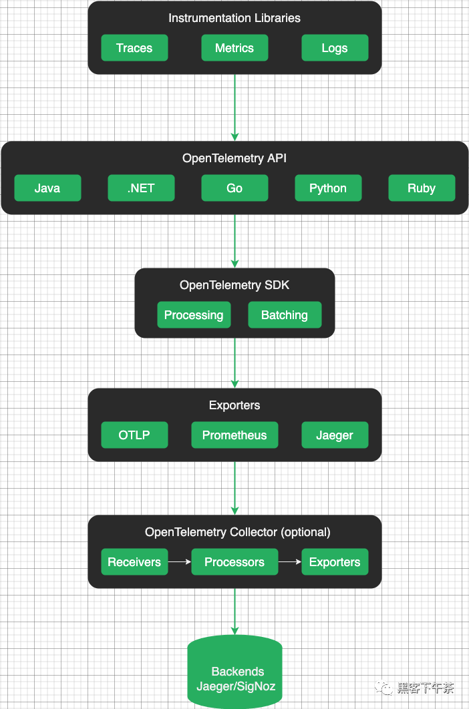
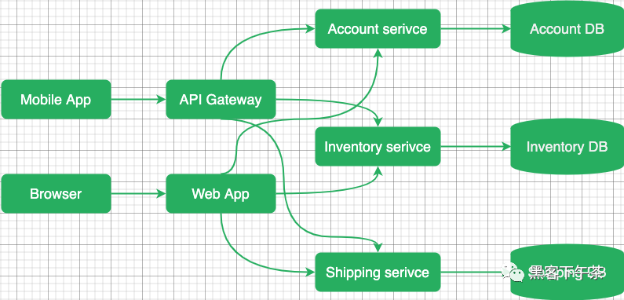
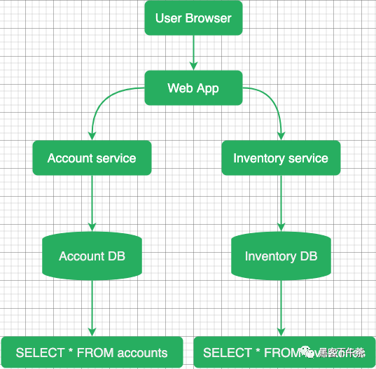
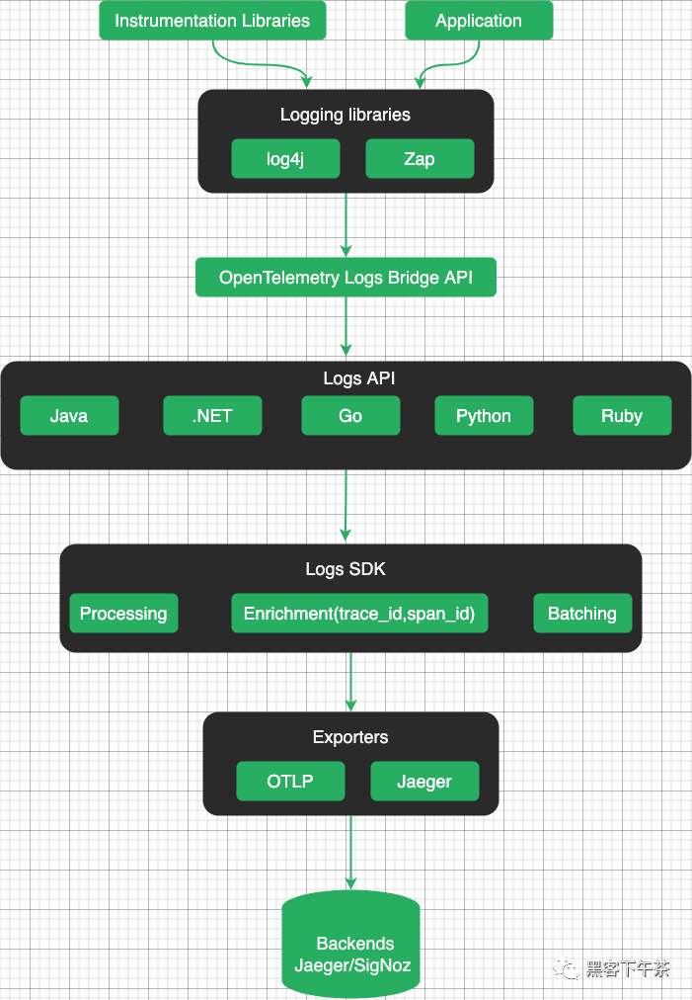
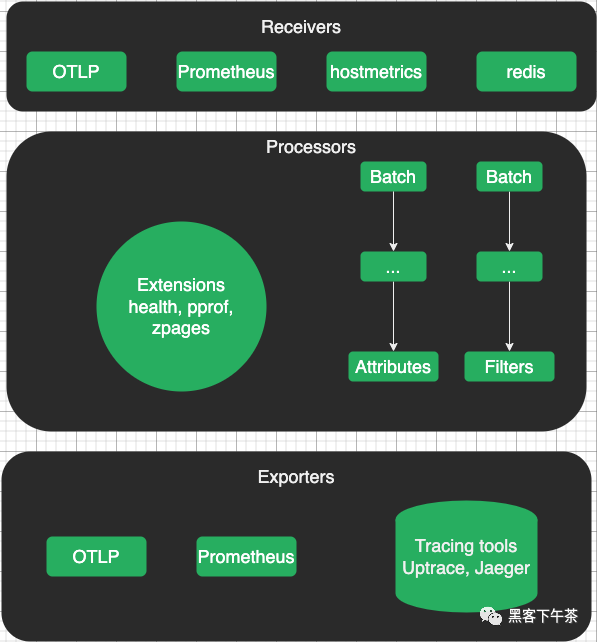

# **1 云原生可观测 OpenTelemetry 基础知识**

## **1 什么是 OpenTelemetry？**

OpenTelemetry 是一个开源的可观测性框架，由云原生基金会(CNCF)托管。它是 OpenCensus 和 OpenTracing 项目的合并。旨在为所有类型的可观测信号(如跟踪、指标和日志)提供单一标准。

* https://opentelemetry.io
* https://www.cncf.io
* https://opencensus.io

OpenTelemetry 指定了如何收集遥测数据并将其发送到后端平台。通过提供通用的数据格式和 API, OpenTelemetry 使组织更容易共享和重用遥测数据，从而与各种可观测性工具和平台集成。

OpenTelemetry 架构促进了灵活性、互操作性和可扩展性，使开发人员能够采用满足其特定需求和环境的可观测性实践。

## 遥测数据类型

OpenTelemetry 支持不同的遥测数据类型：

* **`OpenTelemetry Trace` 表示跨多个组件和服务的请求或操作的执行路径。**
	* 它们提供详细的时间和上下文信息，允许开发人员了解请求流并确定性能瓶颈。
* **`OpenTelemetry Metrics` 是对系统行为或资源利用率的定量测量。**
	* 它们有助于监控和分析一段时间内的性能，并可用于警报、容量规划和趋势分析。
* **OpenTelemetry Logs 包含有关应用程序中发生的事件、错误和活动的结构化或非结构化文本信息**。
	* 它们对于调试、审计和故障排除非常有用。

	
## 如何使用 OpenTelemetry?


开始使用 OpenTelemetry 最简单的方法是选择一个分布式跟踪工具( Jaeger/SigNoz/Uptrace)并遵循他们的文档。

* https://www.jaegertracing.io
* https://signoz.io
* https://uptrace.dev

## 术语表

* OpenTelemetry API 是一个编程接口，**您可以使用它来检测代码以收集遥测数据，如跟踪、指标和日志**。
* OpenTelemetry SDK 是 OpenTelemetry API 的官方实现，用于处理和将收集的遥测数据导出到后端。
* **OpenTelemetry Instrumentation 是流行框架和库的插件，它们使用 OpenTelemetry API 来记录重要的操作，例如 HTTP 请求、DB 查询、日志、错误等等**。
* **OpenTelemetry Collector 是应用程序和后端之间的代理**。
	* 它接收遥测数据，对其进行转换，然后将数据导出到可以永久存储数据的后端。
	* **Collector 还可以作为一个代理，从被监视的系统中提取遥测数据，例如，OpenTelemetry Redis 或文件系统指标**。
* **OTLP 是 SDK 和 Collector 使用的 OpenTelemetry 协议，用于将数据导出到后端或其他收集器**。作为传输协议，OTLP 可以使用 gRPC (OTLP/gRPC) 或 HTTP (OTLP/HTTP)。
* **OpenTelemetry Backend 负责接收、存储和分析 OpenTelemetry 收集的遥测数据**。它充当数据的中央存储库或处理管道，允许您聚合、查询、可视化并从应用程序生成的遥测数据中获得见解。
* **OpenTelemetry Jaeger** 是 OpenTelemetry 生态系统中的一个项目，通常被用作默认的 OpenTelemetry 后端，用于存储、分析和可视化遥测数据。

## OpenTelemetry 架构

### 概览图

OpenTelemetry 架构旨在提供一种标准化的方法来收集、传输和处理来自应用程序和服务的遥测数据。它由几个关键组件组成，这些组件协同工作以实现分布式系统中的可观测性。





### 可观测性信号

OpenTelemetry 提供了一种捕获可观测性信号的标准化方法：

* **Metrics(指标) 表明存在问题。**
* **Traces(跟踪) 会告诉你问题出在哪里**。
* **Logs(日志) 可以帮助您找到根本原因**。

**OpenTelemetry Metrics 是帮助量化系统行为的定量指标。**

它们提供有关应用程序某些方面的当前状态或速率的信息，例如 CPU 使用情况、内存消耗或请求延迟。OpenTelemetry 允许您定义和记录自定义指标，以监视应用程序的性能和运行状况。

https://opentelemetry.io/docs/concepts/signals/metrics/

**OpenTelemetry Traces 提供了请求在分布式系统中执行路径的详细记录**。

它们捕获单个操作及其关系的时间信息，使您能够了解请求流、确定瓶颈并解决性能问题。使用 OpenTelemetry，您可以对代码进行检测，以生成分布式跟踪并在服务之间进行关联。

https://opentelemetry.io/docs/concepts/signals/traces/

**OpenTelemetry Logs 是在应用程序执行期间发生的事件或消息的文本记录。**

它们帮助您理解应用程序行为、诊断问题和审计活动。OpenTelemetry 提供了一种机制，可以从应用程序中捕获结构化日志，并用上下文信息丰富它们。

https://opentelemetry.io/docs/concepts/signals/logs/

### Instrumentation 库(检测工具程序)

**OpenTelemetry 为不同的编程语言提供了库，开发人员可以使用这些库来检测他们的应用程序并收集遥测数据**。

Instrumentation 官方详细文档

https://opentelemetry.io/docs/instrumentation/

### OpenTelemetry SDK

OpenTelemetry SDK（软件开发工具包）是一个库和工具的集合，使开发人员能够对其应用程序进行检测并收集遥测数据以进行监控。

Otel SDK 提供了一个标准化和可扩展的框架，用于将 OpenTelemetry 集成到各种编程语言和环境中。

### Exporters(导出器)

**OpenTelemetry 导出器负责将遥测数据发送到外部系统或后端进行存储、分析和可视化。**

OpenTelemetry 提供了一系列导出程序，支持导出遥测数据的不同协议和格式。这样的导出器允许用户将 OpenTelemetry 与其首选的监控和分析工具无缝集成。

### OpenTelemetry 协议

**OpenTelemetry Protocol（OTLP）是一种开源的、与供应商无关的协议，用于从软件系统和应用程序收集、传输和导出遥测数据。**

OTLP 定义了在检测应用程序和后端系统之间交换的连接格式和数据结构。它指定了遥测数据的编码格式，包括指标、跟踪和日志的模式，以及在网络中传输这些数据的规则。

OTLP 导出器允许将收集的遥测数据传输到后端进行处理和分析。

### Context Propagation(上下文传播)

**Context propagation 确保相关的上下文数据(如 trace IDs、span IDs 和其他元数据)在应用程序的不同服务和组件之间一致地传播。**

通过传播上下文，OpenTelemetry 确保从不同服务和组件收集的遥测数据保持相关，即使在分布式和微服务架构中也是如此。它支持端到端跟踪，从而更容易理解请求流、性能瓶颈和系统依赖关系。

### Resource(资源)

**Resource 属性是键值对，提供有关被监视实体(如服务、进程或容器)的元数据。它们有助于识别资源，并提供可用于过滤和分组遥测数据的附加信息**。

通过在遥测数据中包含资源信息，OpenTelemetry 可以更好地分析、可视化和理解系统行为。它有助于关联和上下文化来自不同来源的遥测数据，并提供观测到的应用程序或服务的更全面的视图。

### OpenTelemetry Collector(收集器)

OpenTelemetry Collector 通过提供灵活、可扩展的遥测数据收集和处理解决方案，在 OpenTelemetry 生态系统中发挥着关键作用。

* https://opentelemetry.io/docs/collector/

**Otel Collector 作为一个集中的中介，简化了数据收集的复杂性，并实现了与不同后端和系统的灵活集成。**

### OpenTelemetry 后端

OpenTelemetry 不包括特定的内置后端或存储系统来处理和分析数据。

相反，OpenTelemetry 提供了基于您的特定需求和偏好选择和集成各种后端系统的灵活性。

**后端系统从插入指令的应用程序或 OpenTelemetry Collector 接收导出的遥测数据。这些系统负责存储、分析和可视化遥测数据**。

## OpenTelemetry 分布式追踪

分布式追踪允许您查看请求如何通过不同的服务和系统、每个操作的时间、发生时的任何日志和错误。

分布式追踪工具提供对系统行为的可见性，**帮助识别性能问题，协助调试，并帮助确保分布式应用程序的可靠性和可伸缩性**。

OpenTelemetry 跟踪在微服务架构的上下文中特别有价值，在微服务架构中，应用程序由多个独立的服务组成，共同工作以满足用户请求。

### **追踪是如何工作的？**

在现代应用程序中，**尤其是那些基于微服务或无服务器架构的应用程序，不同的服务经常相互交互以满足单个用户请求**。

这使得识别性能瓶颈、诊断问题和分析整个系统行为具有挑战性。

分布式跟踪旨在通过创建跟踪来解决这些挑战，跟踪是单个用户请求通过各种服务和组件的过程的表示。

**每个跟踪都由一系列相互连接的 span 组成，其中每个 span 代表特定服务或组件中的单个操作或活动**。

当请求进入服务时，跟踪上下文将与请求一起传播。这通常涉及到将跟踪头注入到请求中，允许下游服务参与同一跟踪。

当请求在系统中流动时，每个服务都会生成自己的 span，并使用有关其操作持续时间、元数据和任何相关上下文的信息更新跟踪上下文。



分布式跟踪工具使用生成的跟踪数据来提供对系统行为的可见性，帮助识别性能问题，帮助调试，并帮助确保分布式应用程序的可靠性和可扩展性。

### Spans(跨度)

Span 表示跟踪中的一个操作(工作单元)。span 可以是远程过程调用(RPC)、数据库查询或进程内函数调用。一个 span 有:

* span name(操作名称)。
* 父 span。
* span kind(类型)。
* 开始和结束时间。
* **报告操作成功或失败的 status**。
* **描述操作的一组键值 attributes**。
* **events 的时间轴**。
* 指向其它 span 的链接列表。
* 在**不同服务之间传播 trace ID 和其他数据的 span context**。

trace 是一个 span 树，它显示了请求通过应用程序所产生的路径。root span 是跟踪中的第一个 span。



### **Span 名称**

OpenTelemetry 后端使用 span 名称和一些属性将相似的 span 组合在一起。

**要正确地对 span 进行分组，请给它们起简短而简洁的名字**。

唯一的 span 名称的总数应小于 1000。否则，您将有太多的 span 组，您的体验可能会受到影响。

下面的名字很好，因为它们简短、独特，并且有助于将相似的 span 分组在一起:

Span name	 | Comment
------------- | -------------
`GET /projects/:id`	  | Good。带有参数名的路由名。
`select_project	`  | Good。不带参数的函数名。
`SELECT * FROM projects WHERE id = ?`  | Good。不带参数的函数名。

以下名称不正确，因为它们包含变量 params 和 args：

Span name	 | Comment
------------- | -------------
`GET /projects/42`	  |  Bad。包含一个变量参数 42。
`select_project(42)`  |  Bad。包含变量 42。
`SELECT * FROM projects WHERE id = 42`  | Bad。包含一个变量 arg 42。

### Span 类型

Span kind 必须是以下值之一:

* server 用于服务器操作，例如 HTTP 服务器处理程序。
* client 用于客户端操作，例如 HTTP 客户端请求。
* producer 对于消息生产者，例如 Kafka producer。
* consumer 一般用于消息消费者和异步处理，例如 Kafka consumer。
* internal 用于内部操作。


### Status code(状态码)

状态码表示操作成功或失败。必须是以下值之一:

* ok - 成功。
* error - 失败。
* unset - 允许后端分配状态的默认值。

### Attributes(属性)

要记录上下文信息，您可以用带有特定于操作的信息的属性对 span 进行注释。

例如，HTTP 端点可能具有 `http.method = GET` 与 `http.route = /projects/:id`。

您可以随意命名属性，但对于常见操作，您应该使用 semantic attributes 约定。它定义了一个公共属性键列表，其中包含它们的含义和可能的值。

### Events(事件)

您还可以用具有开始时间和任意数量属性的事件注释 span 。事件和 span 的主要区别在于事件没有结束时间(因此没有持续时间)。

事件通常表示异常、错误、日志和消息(例如在 RPC 中)，但是您也可以创建自定义事件。

### Context(上下文)

当 Span context 通过不同的组件和服务传播时，它携带有关该 span 的信息。

Trace/span context 是一个请求范围的数据，例如：

* Trace ID. 表示整个 trace 或 query 的全局唯一标识符。trace 中的所有 span 都具有相同的 trace ID。
* Span ID. trace 中特定 span 的唯一标识符。trace 中的每个 span 都有不同的 span ID。
* Trace flags. 指示 trace 的各种属性的 flag，例如是否对其进行了采样。采样是指确定应记录哪些 span 并将其报告给可观测性后端的过程。
* Trace State. 一个可选字段，包含与 trace 相关的其他供应商或应用程序特定数据。

Span context 对于保持分布式系统中 span 的连续性和相关性非常重要。它允许不同的服务和组件将其 span 与正确的跟踪相关联，并提供对请求或事务流的端到端可见性。

Span context 通常使用服务之间通信协议的标头或元数据进行传播，类似于 baggage 数据的传播方式。这确保了当服务接收到请求时，它可以提取 span context，并将传入的 span 与正确的 trace 相关联。

您可以使用上下文中的数据进行 span 相关性或采样，例如，您可以使用 trace id 来知道哪些 span 属于哪些 trace。

### Context propagation(上下文传播)

上下文传播确保相关的上下文数据，如 trace ID、span ID 和其他元数据，在应用程序的不同服务和组件之间一致地传播。

OpenTemetry 在进程内的函数之间传播上下文(进程内传播)，甚至从一个服务传播到另一个服务(分布式传播)。

进程内传播可以是隐式的，也可以是显式的，这取决于所使用的编程语言。隐式传播通过将活动上下文存储在线程局部变量(Java, Python, Ruby, NodeJS)中自动完成。显式传播需要显式地将活动上下文作为参数从一个函数传递到另一个函数(Go)。

对于分布式上下文传播，OpenTelemetry 支持几种协议，这些协议定义了如何序列化和传递上下文数据:

* W3C trace context 在 `traceparent header` 中, 例如, `traceparent=00-84b54e9330faae5350f0dd8673c98146-279fa73bc935cc05-01`。
	* https://www.w3.org/TR/trace-context/
* `B3 Zipkin` 在以 `x-b3-` 开始的 `header` 中, 例如, `X-B3-TraceId`。
	* https://github.com/openzipkin/b3-propagation

W3C trace context 是默认启用的推荐传播器。

### Baggage(行李)

**`Baggage` 的工作原理类似于 `span context`，允许您将自定义 `key:value` 对(属性)从一个服务传播到另一个服务。**

**在 gRPC 世界中，有一个类似的概念叫做 gRPC metadata。**

https://github.com/open-telemetry/opentelemetry-specification/blob/main/specification/baggage/api.md

Baggage 允许您将键值对与请求或事务关联起来。这些键值对表示可能与请求或事务处理相关的上下文信息，例如 user ID、session ID 或其他特定于应用程序的元数据。

Baggage 有助于维护和关联跨分布式系统的上下文信息，从而实现对应用程序行为的更好的可观测性和分析。它提供了一种标准化的方式来在整个系统中传递相关数据，而不依赖于特别的机制或手动检测。

### **什么时候优先去 Instrumentation**

Instrumentation 官方详细文档

https://opentelemetry.io/docs/instrumentation/

您不需要记录每个操作来充分利用跟踪。这可能会花费很多时间，而且通常是不必要的。优先考虑以下操作：

* Network 操作, 例如，HTTP 请求或 RPC 调用。
* Filesystem 操作, 例如，读/写文件。
* Database 查询，它结合了网络与文件系统操作。
* Errors and logs，例如，使用结构化日志。

## OpenTelemetry Metrics(指标)

OpenTelemetry Metrics 是一个关于如何收集、聚合和发送指标到 OpenTelemetry APM 工具(如 Uptrace 或 Prometheus )的标准。

在定义新标准的同时，OpenTelemetry 还致力于与现有的指标工具协议(如 Prometheus 和 Statsd)一起工作。此外，OpenTelemetry Collector 甚至支持更多的协议，如 AWS Metrics、InfluxDB、Chrony 等。

OpenTelemetry 还允许您通过示例关联指标和跟踪，这些示例应该向您展示系统状态的更广泛的图像。

### 什么是指标?


指标是表示系统运行状况和性能的数值数据点，例如 CPU 利用率、网络流量和数据库连接。

您可以使用指标来度量、监视和比较性能，例如，您可以度量服务器响应时间、内存利用率、错误率等等。

**Instruments**

instrument 是一种特定类型的指标(例如，counter, gauge, histogram)，用于收集关于应用程序行为的特定方面的数据。

您通过创建具有以下功能的 instrument 来捕获测量结果:

* 唯一的名称，例如 `http.server.duration`。
* 一种 instrument 类型，例如 `Histogram`。
* 一个可选的指标单位，例如 `milliseconds` 或 `bytes`。
* 可选描述。

**Timeseries(时间序列)**

一个 instrument 可以生成多个时间序列。时间序列是一个具有唯一属性集的指标，例如，对于相同的指标名称，每个主机都有一个单独的时间序列。

**Additive(可加) instruments**

Additive 或 summable instruments 产生的时间序列，当加在一起时，产生另一个有意义和准确的时间序列。测量 `non-decreasing` 数的 `Additive instruments` 也称为 `monotonic`(单调的)。

例如，`http.server.requests` 是一个 `additive` 时间序列，因为您可以将来自不同主机的请求数相加，以获得请求总数。

但是，`system.memory.utilization`(百分比) 不是相加的，因为来自不同主机的内存利用率之和没有意义(90% + 90% = 180%)。

**Synchronous(同步) instruments**

**`Synchronous instruments ` 与它们正在测量的操作一起被调用。例如，为了测量请求的数量，只要有新的请求，就可以调用 `counter.Add(ctx, 1)`。同步测量可以具有关联的 `trace context`。**

对于 `synchronous instruments`，`additive `和 `grouping instruments `之间的区别在于 `additive instruments` 产生 `summable` 时间序列，`grouping instruments` 产生 `histogram`。

Instrument		| Properties	 | Aggregation	 |  Example   
------------- | -------------  | -------------  | -------------
Counter	  |  单调的 | sum -> delta	 |  请求数，请求大小 |
UpDownCounter	 |  可加的	 | last value -> sum  |  连接数 |
Histogram	| 可分组的 | histogram	 | 请求持续时间、请求大小 |

### Asynchronous(异步) instruments


Asynchronous instruments 定期调用回调函数来收集测量值。例如，您可以使用观察器定期测量内存或 CPU 的使用情况。**Asynchronous 测量不能具有关联的 trace context。**

在 `UpDownCounterObserver (additive) ` 和 `GaugeObserver (grouping)`之间进行选择时， 对于 summable 时间序列，请选择 `UpDownCounterObserver`，否则，请选择 `GaugeObserver`。

例如，要测量 `system.memory.usage (bytes)`，应使用 `UpDownCounterObserver`。但要测量 `system.memory.utilization`（百分比），您应该使用 `GaugeObserver`。

Instrument Name			| Properties	 | Aggregation	 |  Example   
------------- | -------------  | -------------  | -------------
CounterObserver  |  单调的 | sum -> delta	 |  CPU time  |
UpDownCounter	 |  可加的	 | last value -> sum  |  Memory usage (bytes) |
GaugeObserver		| 可分组的 |  last value -> none/avg	 | Memory utilization (%)  |

### 选择 instruments

* 如果您需要直方图、热图或百分位数，请使用 `Histogram`。
* **如果您想通过记录增量值来计数**：
	* 如果该值是 `monotonic `的，请使用 `Counter`。
	* 否则，使用 `UpDownCounter`。
* **如果你想通过记录一个绝对值来测量某个东西**：
	* 如果该值是 monotonic 的，请使用 **CounterObserver**。
	* 否则，请使用 **UpDownCounterObserver**。
	* 如果该值是 **additive/summable** 的：
	* **如果该值不 additive/summable，请使用 GaugeObserver**。

### Counter

`synchronous monotonic`

`Counter` 是一种同步 instrument，用于测量相加的非递减值，例如：

* processed requests
* errors
* received bytes
* disk reads

Counters 用于测量一个事件的发生次数或一个值随时间的累积。它们只能随着时间的推移而增加。

对于 Counter 时间序列，后端通常计算增量并显示速率值，例如，`per_min(http.server.requests) `返回每分钟处理的请求数。

### CounterObserver

`asynchronous monotonic`

**CounterObserver 是 `Counter instrument` 的异步版本。**

### UpDownCounter

`synchronous additive`

`UpDownCounter` 是一种同步 instrument，用于测量可随时间增加或减少的附加值，例如：

* active requests
* open connections
* memory in use (megabytes)

对于加法非递减(non-decreasing)值，应使用 Counter 或 CounterObserver。

对于 `UpDownCounter` 时间序列，后端通常显示最后一个值，但不同的时间序列可以加在一起， 例如，`go.sql.connections_open` 返回打开的连接总数， `go.sql.connections_open{service.name = myservice} `返回一个服务的打开连接数。

### UpDownCounterObserver

`asynchronous additive`

**UpDownCounterOserver 是 UpDownCounter instrument 的异步版本。**

### Histogram

`synchronous grouping`

直方图是一种同步 instrument，它根据记录的值生成直方图，例如：

* request latency
* request size

直方图用于测量值随时间的分布。对于直方图时间序列，后端通常显示百分位数、热图和直方图。


### GaugeObserver

`asynchronous grouping`

GaugeObserver 是一种异步 instrument，用于测量 sum 不能产生有意义或正确结果的非相加值，例如：


* error rate
* memory utilization
* cache hit rate

对于 GaugeObserver 时间序列，后端通常显示最后一个值，不允许将不同的时间序列相加。

### Metrics 示例

邮件数量

要测量发送的电子邮件数量，您可以创建 Counter instrument，并在发送电子邮件时递增：

```
import "go.opentelemetry.io/otel/metric"

var emailCounter = meter.NewInt64Counter(
	"some.prefix.emails",
	metric.WithDescription("Number of sent emails"),
)

emailCounter.Add(ctx, 1)
```

稍后，您可以添加更多属性来收集详细的统计信息，例如：

* `kind = welcome` 和 `kind = reset_password `可以测量不同的电子邮件。
* `state = sent` 和 `state = bounced` 以衡量退回的电子邮件。

### 操作延迟

要测量操作的延迟，您可以创建 Histogram instrument 并与操作同步更新：

```
import "go.opentelemetry.io/otel/metric"

var opHistogram = meter.NewInt64Histogram(
	"some.prefix.duration",
	metric.WithDescription("Duration of some operation"),
)

t1 := time.Now()
op(ctx)
dur := time.Since(t1)

opHistogram.Record(ctx, dur.Microseconds())
```

### 缓存命中率

要测量缓存命中率，可以创建一个 CounterObserver 并观察缓存统计信息：

```
import "go.opentelemetry.io/otel/metric"

var counter metric.Int64CounterObserver

// Arbitrary key/value labels.
hits := []attribute.KeyValue{attribute.String("type", "hits")}
misses := []attribute.KeyValue{attribute.String("type", "misses")}
errors := []attribute.KeyValue{attribute.String("type", "errors")}

batchObserver := meter.NewBatchObserver(
	func(ctx context.Context, result metric.BatchObserverResult) {
		stats := cache.Stats()

		result.Observe(hits, counter.Observation(int64(stats.Hits)))
		result.Observe(misses, counter.Observation(int64(stats.Misses)))
		result.Observe(errors, counter.Observation(int64(stats.Errors)))
	})

counter = batchObserver.NewInt64CounterObserver("some.prefix.cache_operations")
```

### 出错率

要直接测量错误率，您可以创建一个 GaugeObserver 并观察该值，而不必担心它是如何计算的：

```
import "go.opentelemetry.io/otel/metric"

_ = meter.NewFloat64GaugeObserver("some.prefix.error_rate",
	func(ctx context.Context, result metric.Float64ObserverResult) {
		result.Observe(rand.Float64())
	},
	metric.WithDescription("Error rate as reported by some other system"),
)
```

## OpenTelemetry Logs(日志)

OpenTelemetry Logs 允许以一种能够与其他可观察信号进行关联和更好集成的方式记录和收集日志。

**日志对于理解应用程序行为、诊断问题和监视系统运行状况至关重要**。

分布式跟踪和指标提供了对系统性能的有价值的见解，而日志提供了关于特定事件、错误和应用程序行为的详细上下文和信息。

### 概述

虽然 OpenTelemetry 主要关注于收集指标和跟踪，但它也通过其日志 API 支持日志收集。OpenTelemetry 支持现有的日志解决方案，并确保它可以与现有的日志库和日志收集工具一起很好地工作。

OpenTelemetry 提供了一个日志 API，允许您检测应用程序并生成结构化日志。OpenTelemetry Logging API 旨在与其他遥测数据(如指标和跟踪)一起工作，以提供统一的可观测性解决方案。

OpenTelemetry 强调结构化的日志，允许您通过属性或元数据向日志条目附加额外的上下文信息。

这允许您包含相关的详细信息，例如 timestamps, request IDs, user IDs, correlation IDs 和其他有助于日志分析和故障排除的自定义上下文。



### 不同类型的日志

OpenTelemetry 支持从应用程序或系统中的各种源捕获日志。根据日志的生成和收集方式，日志可以分为 3 类。

* **系统和基础设施日志**

系统日志提供有关系统操作、性能和安全性的宝贵信息。系统日志通常由系统内的各种组件生成，包括操作系统、应用程序、网络设备和服务器。

系统日志是在主机级别编写的，具有无法轻易更改的预定义格式和内容。系统日志不包括有关跟踪上下文的信息。

* **Legacy first-party 日志**

First-party 日志由内部应用程序生成，记录特定的应用程序事件、错误和用户活动。这些日志对于应用程序调试和故障排除非常有用。

通常，开发人员可以修改这些应用程序，以更改日志的编写方式和包含的信息。例如，为了将日志与跟踪关联起来，开发人员可以手动将跟踪上下文添加到每个日志语句中，也可以使用日志库的插件自动添加。

例如，要传播上下文并将日志记录与 span 相关联，可以在日志消息中使用以下属性：

* `trace_id` 用于 TraceId, 十六进制编码。
* `span_id` 用于 SpanId, 十六进制编码。
* `trace_flags` 用于 trace flags, 根据 W3C traceflags 格式进行格式化。

例如：

```
request failed trace_id=958180131ddde684c1dbda1aeacf51d3 span_id=0cf859e4f7510204
```

### New first-party 日志

启动新项目时，您可以遵循 OpenTelemetry 的建议和最佳实践， 了解如何使用自动检测发出日志，或将日志库配置为使用 OpenTelemetry log 附加程序。

OpenTelemetry 的日志 API 允许开发人员对其应用程序进行 instrument， 以生成结构化日志，这些日志可以由日志后台或日志管理系统收集和处理。

日志 API 提供了一种将附加上下文信息附加到日志条目（如标签、属性或元数据）的方法。

使用 Logger API 记录不同严重性级别的事件或消息，如 debug、info、warn、error 等。您还可以将其他属性或上下文附加到日志条目以提供更多信息。

OpenTelemetry 还提供了一种标准化的方法，用于在分布式系统中传播日志中的上下文。这确保了相关的执行上下文被一致地捕获和保存，即使日志是由系统的不同组件生成的。

OpenTelemetry Logs 数据模型允许将 TraceId 和 SpanId 直接包含在 LogRecords 中。

### OpenTelemetry 收集器

OpenTelemetry Collector 是一个灵活且可扩展的代理，用于收集、处理和导出遥测数据。它简化了从多个源接收和管理遥测数据的任务，并能够将数据导出到多个后端或可观测性系统。

OpenTelemetry Collector 支持多个日志源，包括应用程序日志、日志文件、日志库和第三方日志系统。它提供了与流行的日志框架和库的集成，实现了日志数据的无缝接收。

收集器提供了转换和丰富日志数据的功能。您可以修改日志属性、添加元数据或使用其他上下文信息丰富日志，以增强其价值，并使其对分析和故障排除更有意义。

收集和处理后，OpenTelemetry Collector 可以将日志数据导出到各种日志后端或系统。它支持将日志导出到流行的日志记录平台、存储系统或日志管理工具，以进行长期存储、分析和可视化。


### OpenTelemetry 后端

一旦日志数据导出到日志后端，您就可以使用平台的功能处理和分析日志。这可以包括过滤、搜索、聚合和可视化日志，以深入了解应用程序的行为并解决问题。

## OpenTelemetry Sampling(采样)

OpenTelemetry 采样通过减少创建（采样）span 的数量，降低了跟踪的成本和冗长程度。

就性能而言，采样可以节省收集、处理和导出 span 所需的 CPU 周期和内存。

### 什么是采样？

在分布式追踪中使用采样来控制收集并发送到跟踪后端的数据量。它有助于平衡数据量和跟踪精度之间的权衡。

在分布式跟踪中，请求在流经系统时生成 span。span 表示在处理该请求期间发生的单个操作或事件。在一个复杂的系统中，这些 span 可能会变得非常多，并且将它们全部发送到跟踪后端可能会导致大量的开销和存储成本。

抽样涉及到决定哪些时间段要记录，哪些时间段要丢弃。

### 采样：何时何地

采样可能发生在 span 处理的不同阶段：

* 创建 trace 时 - 头部采样；
* 当后端接收到 trace 时 - 速率限制采样；
* 当完整的 trace 可用时 - 基于尾部的采样；

抽样策略的选择取决于几个因素，包括期望的可观测性水平、可用资源和系统的特定用例。

### 概率抽样

抽样提供了一种抽样概率，使得仅使用部分抽样 span 就能对所有 span 进行准确的统计计数。例如，如果采样概率为 50%，采样的 span 数为 10，则调整后的(总) span 数为 10 / 50% = 20。

```
Name		 	Side		 Adjusted count   Accuracy
基于头部的采样	Client-side		Yes  100%
速率限制采样	 	Server-side	Yes	  <90%
基于尾部采样		Server-side	  Yes	  <90%
```

### 基于头部的采样

基于头部的抽样尽可能早地做出抽样决策，并使用 context 将其传播给其他参与者。这允许通过不收集任何用于删除 span (操作)的遥测数据来节省 CPU 和内存资源。

基于头部的采样是最简单、最准确、最可靠的采样方法，与所有其他方法相比，您应该更喜欢这种方法。

基于头的采样的一个缺点是，不能对有错误的 span 进行采样，因为创建 span 时该信息不可用。为了解决这个问题，可以使用基于尾部的采样。

基于头部的采样也不考虑流量峰值，并且可能收集比期望的更多的数据。这就是 rate-limiting 采样变得方便的地方。

### OpenTelemetry 中基于头的采样

OpenTelemetry 有 2 个 span 属性负责客户端采样：

* IsRecording - 当为 false 时，span 将丢弃属性、事件、链接等。
* Sampled - 当为 false 时，OpenTelemetry 删除 span。

您应该检查 IsRecording 属性，以避免收集昂贵的遥测数据。

```
if span.IsRecording() {
    // collect expensive data
}
```

Sampler 是一个接受将要创建的 root span 的函数。该函数返回一个采样决策，该决策必须是:

* Drop - trace 被丢弃。IsRecording = false, Sampled = false。
* RecordOnly - 记录 trace，但不采样。IsRecording = true, Sampled = false。
* RecordAndSample - 记录并采样 trace。IsRecording = true, Sampled = true。

默认情况下，OpenTelemetry 对所有跟踪进行采样，但您可以将其配置为对部分跟踪进行采样。在这种情况下，后端使用概率抽样来调整 span 的数量。

### OpenTelemetry 采样器

**AlwaysOn sampler** 对每个 trace 进行采样，例如，将为每个请求启动并导出一个新的 trace。

AlwaysOff sampler 不采样 trace，换句话说，删除所有 trace。您可以使用此采样器执行负载测试或暂时禁用 trace。

TraceIDRatioBased sampler 使用 trace id 对跟踪的一小部分进行采样，例如，20% 的跟踪。

Parent-based sampler 是一种复合采样器，它根据 span 的父元素表现出不同的行为。当您开始一个新的 trace 时，采样器将决定是否对其进行采样，并将该决策向下传播到其他服务。

### 速率限制采样

速率限制采样发生在服务器端，并确保您不会超过某些限制，例如，它允许每秒采样 10 个或更少的跟踪。

限速采样支持调整计数，但精度较低。为了获得更好的结果并提高性能，您应该将限速采样与更有效和准确的基于头部的采样一起使用。

大多数后端在必要时自动应用限速采样。

### 基于尾部采样

在基于头部的采样的抽样中，抽样决策是预先做出的，通常是随机的。基于头部的采样不能对失败或异常长时间的操作进行采样，因为这些信息只能在跟踪结束时获得。

使用基于尾部的采样，我们延迟采样决策，直到跟踪的所有 span 可用，这使得基于来自跟踪的所有数据的更好的采样决策。例如，我们可以对失败或异常长的跟踪进行采样。

大多数 OpenTelemetry 后端在必要时自动应用基于尾部的采样，但是你也可以使用 OpenTelemetry Collector 和 tailsamplingprocessor 来根据你的需要配置采样。

### 基于概率的采样

基于概率的采样根据配置的概率或采样率随机选择要记录的跟踪的子集。例如，您可以设置采样率为 10%，这意味着只记录 10% 的迹线，其余的迹线被丢弃。

当您希望减少跟踪数据的数量，同时仍然保持系统行为的代表性样本时，基于概率的采样非常有用。它有助于在开销和所需的可观测性级别之间取得平衡。

以下是如何在 OpenTelemetry Go 中配置基于概率的采样器，基于 Uptrace。

```
import "go.opentelemetry.io/contrib/samplers/probability/consistent"

sampler := consistent.ParentProbabilityBased(
	consistent.ProbabilityBased(0.5), // sample 50% of traces
)

uptrace.ConfigureOpentelemetry(
	uptrace.WithTraceSampler(sampler),

	// Other options
)
```

## OpenTelemetry Collector(收集器)

OpenTelemetry Collector 是一个高性能、可扩展和可靠的数据收集管道，用于可观察性数据。它从各种来源接收遥测数据，执行处理和转换为通用格式，然后将数据导出到各种后端进行存储和分析。

Otel Collector 支持多种数据格式、协议和平台，使其成为可观察性需求的灵活、可扩展的解决方案。

### OpenTelemetry Collector 是如何工作的？

OpenTelemetry Collector 是应用程序和分布式跟踪工具(如 SigNoz/Jaeger)之间与供应商无关的代理/中间人。

OpenTelemetry Collector 的工作原理是接收来自各种来源的遥测数据， 对数据进行处理和规范化，然后将其导出到各种后端进行存储和分析。



Otel Collector 提供强大的数据处理能力，允许您执行聚合，过滤，采样和丰富的遥测数据。在将数据发送到后端系统之前，您可以转换和重塑数据以满足特定的监视和分析需求。

Otel Collector 是用 Go 语言编写的，使用 Apache 2.0 license ，允许您更改源代码并安装自定义扩展。这是以运行和维护您自己的 OpenTelemetry Collector 实例为代价的。

### 何时使用 OpenTelemetry Collector?

大多数情况下，将遥测数据直接发送到后端是开始使用 OpenTelemetry 的好方法。但是，您可能希望在服务旁边部署收集器，以获得批处理、重试、敏感数据过滤等功能。

OpenTelemetry Collector 最突出的特性是能够操作整个轨迹，而不是单个 span。为了实现这一点，OpenTelemetry Collector 缓冲接收到的 span，并按 trace id 对它们进行分组。这是实现基于 tail-based sampling 的关键要求。

OpenTelemetry Collector 也可以作为一个 agent，从被监控的系统中提取遥测数据，例如，OpenTelemetry Redis 或 host metrics。

### Otelcol 与 Otelcol-Contrib

OpenTelemetry Collector 在 GitHub 上有 2 个存储库:

* opentelemetry-collector 是只包含最关键组件的核心。它以 otelcol 二进制文件的形式分发。

	* https://github.com/open-telemetry/opentelemetry-collector

* opentelemetry-collector-contrib 包含核心和所有额外的可用组件，例如，Redis 和 PostgreSQL 接收器。它以 otelcol-contrib 二进制文件的形式分发。

	* https://github.com/open-telemetry/opentelemetry-collector-contrib

您应该始终安装和使用 otelcol-contrib，因为它和核心一样稳定，并且支持更多的特性。

### 安装
	
OpenTelemetry Collector 为 Linux、MacOS 和 Windows 分发预编译的二进制文件。

### Linux

要安装 otelcol-contrib binary 和相关的 systemd 服务，运行以下命令将 0.82.0 替换为所需的版本，并将 amd64 替换为所需的架构:

Debian


```
wget https://github.com/open-telemetry/opentelemetry-collector-releases/releases/download/v0.82.0/otelcol-contrib_0.82.0_linux_amd64.deb
sudo dpkg -i otelcol-contrib_0.82.0_linux_amd64.deb
```

RPM

```
wget https://github.com/open-telemetry/opentelemetry-collector-releases/releases/download/v0.82.0/otelcol_0.82.0_linux_amd64.rpm
sudo rpm -ivh otelcol_0.82.0_linux_amd64.rpm
```

您可以使用以下命令检查已安装服务的状态:

```
sudo systemctl status otelcol-contrib
```

使用以下命令检查日志:

```
sudo journalctl -u otelcol-contrib -f
```

您可以在 `/etc/otelcol-contrib/config.yaml` 中编辑配置。并重新启动 OpenTelemetry Collector:

```
sudo systemctl restart otelcol-contrib
```

### 从源代码编译

你也可以在本地编译 OpenTelemetry Collector:

```
git clone https://github.com/open-telemetry/opentelemetry-collector-contrib.git
cd opentelemetry-collector-contrib
make install-tools
make otelcontribcol
./bin/otelcontribcol_linux_amd64 --config ./examples/local/otel-config.yaml
```

### 配置

OpenTelemetry Collector 是高度可配置的，允许您自定义其行为并将其集成到可观测性堆栈中。它提供了用于指定输入、处理器和导出器的配置选项，使您能够根据自己的特定需求定制代理。

默认情况下，你可以在 `/etc/otelcol-contrib/config.yaml `中找到配置文件。例如(Uptrace):

```
# receivers configure how data gets into the Collector.
receivers:
  otlp:
    protocols:
      grpc:
      http:

# processors specify what happens with the received data.
processors:
  resourcedetection:
    detectors: [env, system]
  cumulativetodelta:
  batch:
    send_batch_size: 10000
    timeout: 10s

# exporters configure how to send processed data to one or more backends.
exporters:
  otlp/uptrace:
    endpoint: otlp.uptrace.dev:4317
    headers:
      uptrace-dsn: 'https://<token>@uptrace.dev/<project_id>'

# service.pipelines pull the configured receivers, processors, and exporters together into
# pipelines that process data.
#
# receivers, processors, and exporters that are not used in pipelines are silently ignored.
service:
  pipelines:
    traces:
      receivers: [otlp]
      processors: [batch]
      exporters: [otlp/uptrace]
    metrics:
      receivers: [otlp]
      processors: [cumulativetodelta, batch, resourcedetection]
      exporters: [otlp/uptrace]
    logs:
      receivers: [otlp]
      processors: [batch]
      exporters: [otlp/uptrace]
```
 
您可以通过官方文档了解更多关于 Otel Collector 的信息。

https://opentelemetry.io/docs/collector/configuration/

### 故障排除

如果 otelcol 没有像预期的那样工作，您可以检查日志输出是否存在潜在问题。日志记录的详细程度默认为 INFO，但您可以使用配置文件更改它:

```
service:
  telemetry:
    logs:
      level: 'debug'
```

查看潜在问题的日志。

```
sudo journalctl -u otelcol-contrib -f
```

您还可以启用 metrics 来监视 OpenTelemetry Collector:

```
receivers:
  prometheus/otelcol:
    config:
      scrape_configs:
        - job_name: 'otelcol'
          scrape_interval: 10s
          static_configs:
            - targets: ['0.0.0.0:8888']

service:
  telemetry:
    metrics:
      address: ':8888'
  pipelines:
    metrics/hostmetrics:
      receivers: [prometheus/otelcol]
      processors: [cumulativetodelta, batch, resourcedetection]
      exporters: [otlp/uptrace]
```

### 扩展

Extensions 为 OpenTelemetry Collector 提供了额外的功能，并且不需要直接访问遥测数据， 例如，健康检查扩展响应健康检查请求。

```
extensions:
  # Health Check extension responds to health check requests
  health_check:
  # PProf extension allows fetching Collector's performance profile
  pprof:
  # zPages extension enables in-process diagnostics
  zpages:
  # Memory Ballast extension configures memory ballast for the process
  memory_ballast:
    size_mib: 512
```

### 资源检测

为了检测来自主机的资源信息，Otel Collector 自带 resourcedetection processor。

[https://github.com/open-telemetry/opentelemetry-collector-contrib/tree/main/processor/resourcedetectionprocessor](https://github.com/open-telemetry/opentelemetry-collector-contrib/tree/main/processor/resourcedetectionprocessor)

Resource Detection Processor 自动检测和标记有关数据生成环境的元数据。这种元数据称为 "resources"，为遥测数据提供上下文，可以包括主机、服务、容器和云提供商等信息。

例如，要检测 host.name 和 os.type 属性，可以使用系统检测器：

```
processors:
  resourcedetection:
    detectors: [env, system]

service:
  pipelines:
    metrics:
      receivers: [otlp, hostmetrics]
      processors: [batch, resourcedetection]
      exporters: [otlp/uptrace]
```

要添加自定义属性，如 IP 地址，你可以使用 env 变量和 env 检测器:

```
export OTEL_RESOURCE_ATTRIBUTES="instance=127.0.0.1"
```

为了检测更多的信息，您可以使用更专门的检测器，例如，如果您正在使用 Amazon EC2，您可以使用 ec2 检测器来发现 `cloud.region` 和 `cloud.availability_zone` 属性：

```
processors:
  resourcedetection/ec2:
    detectors: [env, ec2]
```

如果您正在使用 Google Cloud:

```
processors:
  resourcedetection/gcp:
    detectors: [env, gcp]
```

如果你正在使用 Docker:

```
processors:
  resourcedetection/docker:
    detectors: [env, docker]
```

您可以查看官方文档，了解 Heroku、Azure、Consul 和许多其他可用的检测器。

https://github.com/open-telemetry/opentelemetry-collector-contrib/tree/main/processor/resourcedetectionprocessor#system-metadata

### 内存限制器

memorylimiterprocessor 是一个组件，允许用户在处理遥测数据时限制 OpenTelemetry Collector 消耗的内存量。它可以防止收集器使用过多的内存，这可能导致性能问题甚至崩溃。

https://github.com/open-telemetry/opentelemetry-collector/blob/main/processor/memorylimiterprocessor/README.md

Memory Limiter Processor 的工作方式是定期检查 OpenTelemetry Collector 消耗的内存量，并将其与用户定义的内存限制进行比较。如果收集器使用的内存超过指定的限制，处理器将开始丢弃遥测数据，直到内存使用低于限制。

要启用内存限制器：

```
processors:
  memory_limiter:
    check_interval: 1s
    limit_mib: 4000
    spike_limit_mib: 800

service:
  pipelines:
    metrics:
      processors: [memory_limiter]
```

## OpenTelemetry 主机指标


hostmetricsreceiver 是一个 OpenTelemetry Collector plugin，它收集关于主机系统的各种指标，例如，CPU, RAM，磁盘指标和其他系统级指标。

[https://github.com/open-telemetry/opentelemetry-collector-contrib/tree/main/receiver/hostmetricsreceiver](https://github.com/open-telemetry/opentelemetry-collector-contrib/tree/main/receiver/hostmetricsreceiver)

通过收集和分析主机指标，您可以深入了解主机系统的性能和运行状况，并识别可能影响应用程序和服务整体性能的潜在问题或瓶颈。

### 主机指标

要开始收集主机指标，您需要在要监视的每个系统上安装 Collector，并将以下行添加到 Collector 配置中:

```
processors:
  resourcedetection:
    detectors: [env, system]
  cumulativetodelta:

receivers:
  hostmetrics:
    collection_interval: 10s
    scrapers:
      # CPU utilization metrics
      cpu:
      # Disk I/O metrics
      disk:
      # File System utilization metrics
      filesystem:
      # CPU load metrics
      load:
      # Memory utilization metrics
      memory:
      # Network interface I/O metrics & TCP connection metrics
      network:
      # Paging/Swap space utilization and I/O metrics
      paging:

service:
  pipelines:
    metrics:
      receivers: [otlp, hostmetrics]
      processors: [cumulativetodelta, batch, resourcedetection]
      exporters: [otlp/uptrace]
```

### 文件系统指标

如果您使用的是不常见的文件系统，您可能需要更彻底地配置 filesystem 接收器，例如，只抓取支持的文件系统类型并避免警告：

```
receivers:
  hostmetrics:
    collection_interval: 10s
    scrapers:
      cpu:
      disk:
      load:
      filesystem:
        include_fs_types:
          match_type: strict
          fs_types: [ext3, ext4]
      memory:
      network:
      paging:
```

### 进程指标

要收集每个进程的 CPU、内存和磁盘 I/O 指标，您需要启用各自的抓取器：

```
receivers:
  hostmetrics:
    collection_interval: 10s
    scrapers:
      # Process count metrics
      process:
      # Per process CPU, Memory, and Disk I/O metrics
      processes:
```

这些抓取器在默认情况下是禁用的，因为它们需要以更高的权限运行 OpenTelemetry Collector 才能访问其他进程的信息。

在 Linux 上，你可以在 root 用户下运行 otelcol-contrib:

```
# /lib/systemd/system/otelcol-contrib.service

User=root
Group=root
```

或者使用 sudo 启动该进程：

```
# /lib/systemd/system/otelcol-contrib.service

ExecStart=sudo /usr/bin/otelcol-contrib $OTELCOL_OPTIONS
```

### 容器主机指标

在 Linux 上，OpenTelemetry 从 Linux 系统目录收集指标。要收集关于主机系统而不是容器的指标，可以在运行容器时挂载主机文件系统:

```
# mount the entire filesystem
docker run -v /:/hostfs ...

# or mount only parts you need
docker run -v /proc:/hostfs/proc ...
```

然后配置 `root_path`，以便 hostmetrics 接收器知道根文件系统的位置:

```
receivers:
  hostmetrics:
    root_path: /hostfs
```


