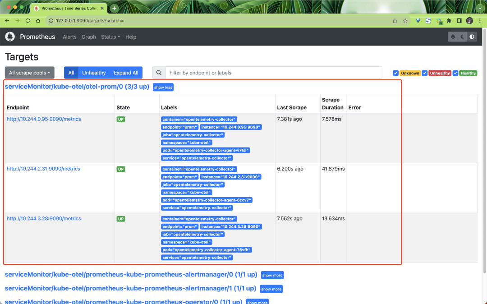
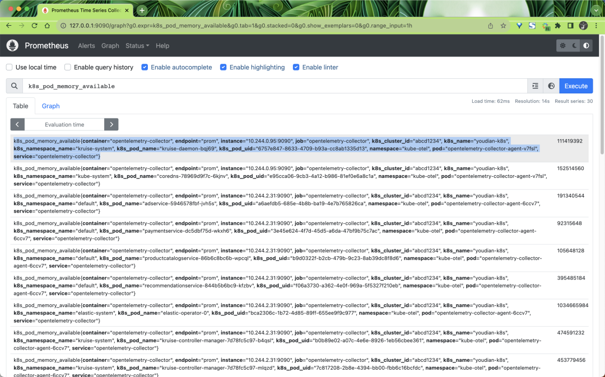
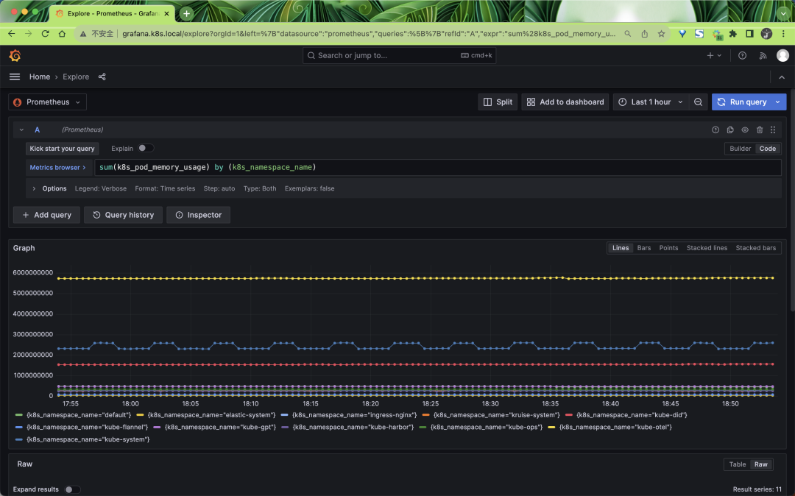

# 2 使用 OpenTelemetry Collector 采集 Kubernetes 指标数据

Kubernetes 已成为一个被广泛采用的行业工具，对可观测性工具的需求也在不断增加。

为此，OpenTelemetry 创建了许多不同的工具，来帮助 Kubernetes 用户观察他们的集群和服务。

接**下来我们将开始使用 OpenTelemetry 监控 Kubernetes 集群，将专注于收集 Kubernetes 集群、节点、pod 和容器的指标和日志，并使集群能够支持发出 OTLP 数据的服务。**

Kubernetes 以多种不同的方式暴露了许多重要的遥测数据。它具有用于许多不同对象的日志、事件和指标，以及其工作负载生成的数据。 

为了收集这些数据，我们将使用 OpenTelemetry Collector。该收集器可以高效地收集所有这些数据

**为了收集所有的数据，我们将需要安装两个收集器，一个作为 Daemonset，一个作为 Deployment**。

收集器的 DaemonSet 将用于收集服务、日志和节点、Pod 和容器的指标，而 Deployment 将用于收集集群的指标和事件。

为了安装收集器，我们这里将使用 [OpenTelemetry Collector Helm 图表](https://github.com/open-telemetry/opentelemetry-helm-charts/tree/main/charts/opentelemetry-collector)，该图表带有一些配置选项，可以更轻松地配置收集器。

首先需要添加 OpenTelemetry Helm 仓库：

```
$ helm repo add open-telemetry https://open-telemetry.github.io/opentelemetry-helm-charts
$ helm repo update
```

收集 Kubernetes 遥测数据的**第一步是部署一个 OpenTelemetry Collector 的 DaemonSet 实例**，以**收集与节点和运行在这些节点上的工作负载相关的遥测数据**。


使用 DaemonSet 可以确保此收集器实例被安装在所有节点上。每个 DaemonSet 中的收集器实例将仅从其运行的节点收集数据

通过 OpenTelemetry Collector Helm Chat 配置所有这些组件非常简单，它还会处理所有与 Kubernetes 相关的细节，例如 RBAC、挂载和主机端口等。不过需要注意的是，默认情况下这个 Chart 图表不会将数据发送到任何后端。

## 指标采集

我们这里首先创建一个 Prometheus 实例来收集指标数据，如下所示，我们使用 Helm Chart 来快速部署 Prometheus：

```
$ helm repo add prometheus-community https://prometheus-community.github.io/helm-charts
$ helm repo update
```

然后创建一个 `prometheus-values.yaml` 文件来配置 Prometheus Helm Chart：

```
# prometheus-values.yaml
kubeStateMetrics:
  enabled: false

nodeExporter:
  enabled: false

kubelet:
  enabled: false

kubeApiServer:
  enabled: false

kubeControllerManager:
  enabled: false

coreDns:
  enabled: false

kubeDns:
  enabled: false

kubeEtcd:
  enabled: false

kubeScheduler:
  enabled: false

kubeProxy:
  enabled: false

sidecar:
  datasources:
    label: grafana_datasource
    labelValue: "1"
  dashboards:
    enabled: true

prometheus:
  prometheusSpec:
    enableFeatures:
      - remote-write-receiver

prometheusOperator:
  enabled: true
  admissionWebhooks:
    patch:
      enabled: true
      image:
        registry: cnych
        repository: ingress-nginx-kube-webhook-certgen
        tag: v20221220-controller-v1.5.1-58-g787ea74b6

grafana:
  ingress:
    enabled: true
    ingressClassName: nginx
    hosts:
      - grafana.k8s.local
```

注意这里我们没有定制任何 Exporter，因为我们将使用 `OpenTelemetry Collector` 来收集指标数据，然后再将其发送到 Prometheus 中。


此外为了能够将收集器指标发送到 Prometheus ，我们需要启用远程写入功能，正常只需要在 Prometheus 启动参数中指定 `--web.enable-remote-write-receiver` 即可，但是我们这里是通过 Prometheus Operator 方式部署的，所以我们需要去修改 Prometheus 的 CR 实例对象，启用 `remote-write-receiver` 特性。

另外我们还为 Grafana 启用了 Ingress，这样我们就可以通过 `grafana.k8s.local ` 来访问 Grafana 了，默认用户名为 admin，密码为 prom-operator

接下来直接使用下面的命令一键部署 Prometheus 即可：

```
$ helm upgrade --install prometheus prometheus-community/kube-prometheus-stack -f prometheus-values.yaml --namespace kube-otel --create-namespace
Release "prometheus" does not exist. Installing it now.

NAME: prometheus
LAST DEPLOYED: Wed Aug 23 09:42:23 2023
NAMESPACE: kube-otel
STATUS: deployed
REVISION: 1
NOTES:
kube-prometheus-stack has been installed. Check its status by running:
  kubectl --namespace kube-otel get pods -l "release=prometheus"

Visit https://github.com/prometheus-operator/kube-prometheus for instructions on how to create & configure Alertmanager and Prometheus instances using the Operator.
```


部署后的资源对象如下所示：

```
$ kubectl get pods -n kube-otel
NAME                                                     READY   STATUS    RESTARTS   AGE
alertmanager-prometheus-kube-prometheus-alertmanager-0   2/2     Running   0          6m3s
prometheus-grafana-5d95cbc57f-v2bw8                      3/3     Running   0          61s
prometheus-kube-prometheus-operator-74fcfc7ff6-2bzfj     1/1     Running   0          6m19s
prometheus-prometheus-kube-prometheus-prometheus-0       2/2     Running   0          6m3s
$ kubectl get ingress -n kube-otel
NAME                 CLASS   HOSTS               ADDRESS       PORTS   AGE
prometheus-grafana   nginx   grafana.k8s.local   10.98.12.94   80      114s
```

现在我们需要将指标数据发送到 Prometheus，所以我们需要在 Otel 采集器里面去配置导出器，**可以使用到 prometheus 或者 `prometheusremotewrite` 导出器**。

我们这里将使用如下的 otel-collector-ds-values.yaml 文件来配置 OpenTelemetry Collector Helm Chart：


```
# otel-collector-ds-values.yaml
mode: daemonset

tolerations:
  - key: node-role.kubernetes.io/control-plane
    effect: NoSchedule

clusterRole:
  create: true
  rules:
    - apiGroups:
        - ""
      resources:
        - nodes/proxy
      verbs:
        - get
        - watch
    - apiGroups:
        - ""
      resources:
        - nodes
      verbs:
        - list
        - watch
        - get

presets:
  hostMetrics:
    enabled: true
  kubernetesAttributes:
    enabled: true
  kubeletMetrics:
    enabled: true

ports:
  prom: # 添加一个 9090 端口，用于 Prometheus 抓取
    enabled: true
    containerPort: 9090
    servicePort: 9090
    protocol: TCP

service: # 创建一个 Service，后面 ServiceMonitor 会用到
  enabled: true

config:
  receivers:
    prometheus:
      config:
        scrape_configs:
          - job_name: opentelemetry-collector
            scrape_interval: 10s
            static_configs:
              - targets:
                  - ${env:MY_POD_IP}:8888
  exporters:
    logging:
      loglevel: debug
    prometheus:
      endpoint: "0.0.0.0:9090"
      metric_expiration: 180m
      resource_to_telemetry_conversion:
        enabled: true
    # prometheusremotewrite:
    #   endpoint: http://prometheus-kube-prometheus-prometheus:9090/api/v1/write
    #   tls:
    #     insecure: true
  processors:
    metricstransform:
      transforms:
        include: .+
        match_type: regexp
        action: update
        operations:
          - action: add_label
            new_label: k8s.cluster.id
            new_value: abcd1234
          - action: add_label
            new_label: k8s.cluster.name
            new_value: youdian-k8s
  service:
    pipelines:
      metrics:
        exporters:
          - prometheus
        processors:
          - memory_limiter # 内存限制一般放在最前面
          - metricstransform
          - k8sattributes
          - batch # 批量处理器放在最后
        receivers:
          - otlp
          - hostmetrics
          - kubeletstats
          - prometheus
```

直接使用上面的配置文件来部署 OpenTelemetry Collector DaemonSet：

```
$ helm upgrade --install opentelemetry-collector open-telemetry/opentelemetry-collector -f otel-ds-values.yaml --namespace kube-otel --create-namespace

$ kubectl get pods -n kube-otel
NAME                                                     READY   STATUS      RESTARTS   AGE
opentelemetry-collector-agent-22rsm                      1/1     Running     0          18h
opentelemetry-collector-agent-v4nkh                      1/1     Running     0          18h
opentelemetry-collector-agent-xndlq                      1/1     Running     0          18h
```

安装后我们可以查看当前采集器的配置信息，使用命令 `kubectl get cm -n kube-otel opentelemetry-collector-agent -oyaml`：

```
exporters:
  logging:
    loglevel: debug
  prometheus:
    endpoint: 0.0.0.0:9090
    metric_expiration: 180m
    resource_to_telemetry_conversion:
      enabled: true
extensions:
  health_check: {}
  memory_ballast:
    size_in_percentage: 40
processors:
  batch: {}
  k8sattributes:
    extract:
      metadata:
        - k8s.namespace.name
        - k8s.deployment.name
        - k8s.statefulset.name
        - k8s.daemonset.name
        - k8s.cronjob.name
        - k8s.job.name
        - k8s.node.name
        - k8s.pod.name
        - k8s.pod.uid
        - k8s.pod.start_time
    filter:
      node_from_env_var: K8S_NODE_NAME
    passthrough: false
    pod_association:
      - sources:
          - from: resource_attribute
            name: k8s.pod.ip
      - sources:
          - from: resource_attribute
            name: k8s.pod.uid
      - sources:
          - from: connection
  memory_limiter:
    check_interval: 5s
    limit_percentage: 80
    spike_limit_percentage: 25
  metricstransform:
    transforms:
      action: update
      include: .+
      match_type: regexp
      operations:
        - action: add_label
          new_label: k8s.cluster.id
          new_value: abcd1234
        - action: add_label
          new_label: k8s.cluster.name
          new_value: youdian-k8s
receivers:
  hostmetrics:
    collection_interval: 10s
    root_path: /hostfs
    scrapers:
      cpu: null
      disk: null
      filesystem:
        exclude_fs_types:
          fs_types:
            - autofs
            - binfmt_misc
            - bpf
            - cgroup2
            - configfs
            - debugfs
            - devpts
            - devtmpfs
            - fusectl
            - hugetlbfs
            - iso9660
            - mqueue
            - nsfs
            - overlay
            - proc
            - procfs
            - pstore
            - rpc_pipefs
            - securityfs
            - selinuxfs
            - squashfs
            - sysfs
            - tracefs
          match_type: strict
        exclude_mount_points:
          match_type: regexp
          mount_points:
            - /dev/*
            - /proc/*
            - /sys/*
            - /run/k3s/containerd/*
            - /var/lib/docker/*
            - /var/lib/kubelet/*
            - /snap/*
      load: null
      memory: null
      network: null
  kubeletstats:
    auth_type: serviceAccount
    collection_interval: 20s
    endpoint: ${K8S_NODE_NAME}:10250
  otlp:
    protocols:
      grpc:
        endpoint: ${env:MY_POD_IP}:4317
      http:
        endpoint: ${env:MY_POD_IP}:4318
  prometheus:
    config:
      scrape_configs:
        - job_name: opentelemetry-collector
          scrape_interval: 10s
          static_configs:
            - targets:
                - ${env:MY_POD_IP}:8888
service:
  extensions:
    - health_check
    - memory_ballast
  pipelines:
    metrics:
      exporters:
        - prometheus
      processors:
        - memory_limiter
        - metricstransform
        - k8sattributes
        - batch
      receivers:
        - otlp
        - hostmetrics
        - kubeletstats
        - prometheus
  telemetry:
    metrics:
      address: ${env:MY_POD_IP}:8888
# ...... 省略其他
```

上面的配置信息是 OpenTelemetry Collector 真正运行时的配置信息，我们这里只保留了和 metrics 相关的配置。从上面配置文件可以看出我们定义了 

4 个接收器：

* hostmetrics 接收器
* kubeletstats 接收器
* otlp 接收器
* prometheus 接收器

4 个处理器：

* batch 处理器
* `memory_limiter` 处理器
* k8sattributes 处理器
* metricstransform 处理器

2 个导出器：

* logging 导出器
* prometheus 导出器

下面我们来详细介绍一下其他组件。

### otlp 接收器

otlp 接收器是在 OTLP 格式中收集跟踪、指标和日志的最佳解决方案。如果您在以其他格式发出应用程序遥测数据，那么收集器很有可能也有一个相应的接收器。这个前面我们已经详细介绍过了，我们这里定义了 `http` 和 `grpc` 两种协议，分别监听 `4317` 和 `4318` 端口。配置如下所示：

```
receivers:
  otlp:
    protocols:
      grpc:
        endpoint: ${env:MY_POD_IP}:4317
      http:
        endpoint: ${env:MY_POD_IP}:4318
```

### hostmetrics 接收器

`hostmetrics` 接收器用于收集主机级别的指标，例如 CPU 使用率、磁盘使用率、内存使用率和网络流量。我们这里的配置如下所示：

```
receivers:
  hostmetrics:
    collection_interval: 10s
    root_path: /hostfs
    scrapers:
      cpu: null
      disk: null
      filesystem:
        exclude_fs_types:
          fs_types:
            - autofs
            - binfmt_misc
            - bpf
            - cgroup2
            - configfs
            - debugfs
            - devpts
            - devtmpfs
            - fusectl
            - hugetlbfs
            - iso9660
            - mqueue
            - nsfs
            - overlay
            - proc
            - procfs
            - pstore
            - rpc_pipefs
            - securityfs
            - selinuxfs
            - squashfs
            - sysfs
            - tracefs
          match_type: strict
        exclude_mount_points:
          match_type: regexp
          mount_points:
            - /dev/*
            - /proc/*
            - /sys/*
            - /run/k3s/containerd/*
            - /var/lib/docker/*
            - /var/lib/kubelet/*
            - /snap/*
      load: null
      memory: null
      network: null
```

配置红通过 `collection_interval` 指定了每 10 秒收集一次指标，并使用根路径 `/hostfs` 来访问主机文件系统。

hostmetrics 接收器包括多个抓取器，用于收集不同类型的指标。例如，cpu 抓取器用于收集 CPU 使用率指标，disk 抓取器用于收集磁盘使用率指标，memory 抓取器用于收集内存使用率指标,load 抓取器用于收集 CPU 负载指标。在这个配置文件中，我们只启用了 filesystem 抓取器，用于收集文件系统使用率指标。

**filesystem 抓取器的配置中，指定了要排除某些文件系统类型和挂载点的指标收集。具体来说，它排除了文件系统类型 `autofs`、`binfmt_misc`、`bpf`、`cgroup2`......，它还排除了挂载点 `/dev/*`、`/proc/*`、`/sys/*`、`/run/k3s/containerd/*`、`/var/lib/docker/*`、`/var/lib/kubelet/*` 和` /snap/*`，这些排除操作确保只收集相关的文件系统使用率指标**。

### kubeletstats 接收器

Kubelet Stats Receiver 用于从 kubelet 上的 API 服务器中获取指标。通常用于收集与 Kubernetes 工作负载相关的指标，例如 CPU 使用率、内存使用率和网络流量。这些指标可用于监视 Kubernetes 集群和工作负载的健康状况和性能。

`Kubelet Stats Receiver` 默认支持在端口 10250 暴露的安全 Kubelet 端点和在端口 10255 暴露的只读 Kubelet 端点。

如果 `auth_type` 设置为 `none`，则将使用只读端点。如果 `auth_type` 设置为以下任何值，则将使用安全端点：

* tls 告诉接收方使用 TLS 进行身份验证，并要求设置 `ca_file`、`key_file` 和 `cert_file` 字段。
* `serviceAccount` 告诉该接收者使用默认的 `ServiceAccount` 令牌来向 kubelet API 进行身份验证。
* `kubeConfig` 告诉该接收器使用 kubeconfig 文件（KUBECONFIG 环境变量或 `~/.kube/config`）进行身份验证并使用 APIServer 代理来访问 kubelet API。
* `initial_delay`（默认 = 1 秒），定义接收器在开始之前等待的时间。

此外还可以指定以下参数：

* `collection_interval`（默认= 10s），收集数据的时间间隔。
* `insecure_skip_verify`（默认= false），是否跳过证书验证。

默认情况下，所有生成的指标都基于 kubelet 的 `/stats/summary` 端点提供的资源标签。对于某些场景而言，这可能还不够。

因此，可以利用其他端点来获取附加的元数据，并将它们设置为指标资源的额外标签。当前支持的元数据包括以下内容：


* `container.id` - 使用从通过 `/pods` 暴露的容器状态获取的容器 ID 标签来增强指标。
* `k8s.volume.type` - 从通过 `/pods` 暴露的 Pod 规范收集卷类型，并将其作为卷指标的标签。如果端点提供的信息不仅仅是卷类型，这些信息也会根据可用字段和卷类型进行同步。例如，`aws.volume.id` 将从 `awsElasticBlockStore` 同步，`gcp.pd.name` 将从 `gcePersistentDisk` 同步。

如果你希望将 `container.id` 标签添加到你的指标中，请使用 `extra_metadata_labels` 字段来启用它，例如：

```
receivers:
  kubeletstats:
    collection_interval: 10s
    auth_type: "serviceAccount"
    endpoint: "${env:K8S_NODE_NAME}:10250"
    insecure_skip_verify: true
    extra_metadata_labels:
      - container.id
```

**如果没有设置 `extra_metadata_labels`，则不会进行额外的 API 调用来获取额外的元数据**。

默认情况下，该收集器将收集来自容器、pod 和节点的指标。我们可以通过设置一个 `metric_groups` 来指定要收集的数据来源，可以指定的值包括 container、pod、node 和 volume。

比如希望仅从接收器收集节点和 Pod 指标，则可以使用以下配置：

```
receivers:
  kubeletstats:
    collection_interval: 10s
    auth_type: "serviceAccount"
    endpoint: "${env:K8S_NODE_NAME}:10250"
    insecure_skip_verify: true
    metric_groups:
      - node
      - pod
```

`K8S_NODE_NAME` 环境变量在 Kubernetes 集群里面我们可以通过 Downward API 来注入。

### prometheus 接收器

Prometheus 接收器以 Prometheus 格式接收指标数据。该接收器旨在最大限度地成为 Prometheus 的替代品，但是目前不支持下面这些 Prometheus 的高级功能：

* `alert_config.alertmanagers`
* `alert_config.relabel_configs`
* `remote_read`
* `remote_write`
* `rule_files`

该接收器是让 Prometheus 抓取你的服务的直接替代品。它支持 `scrape_config` 中的全部 `Prometheus` 配置，包括服务发现。

就像在启动 Prometheus 之前在 YAML 配置文件中写入一样，例如：

```
prometheus --config.file=prom.yaml
```

> 注意：由于收集器配置支持env变量替换，prometheus配置中的字符将被解释为环境变量。如果要在prometheus配置中使用字符，则必须使用


比如我们可以通过下面的配置来让收集器接收 Prometheus 的指标数据，使用方法和 Prometheus 一样，只需要在 `scrape_configs` 中添加一个任务即可：

```
receivers:
  prometheus:
    config:
      scrape_configs:
        - job_name: opentelemetry-collector
          scrape_interval: 10s
          static_configs:
            - targets:
                - ${env:MY_POD_IP}:8888
        - job_name: k8s
          kubernetes_sd_configs:
            - role: pod
          relabel_configs:
            - source_labels:
                [__meta_kubernetes_pod_annotation_prometheus_io_scrape]
              regex: "true"
              action: keep
          metric_relabel_configs:
            - source_labels: [__name__]
              regex: "(request_duration_seconds.*|response_duration_seconds.*)"
              action: keep
```

我们这里添加的 `opentelemetry-collecto`r 任务，是去抓取 8888 端口的数据，而 8888 端口就是 `OpenTelemetry Collector` 的端口，这个端口我们在 `service.telemetry` 中已经定义了，这样我们就可以通过该接收器来抓取 `OpenTelemetry Collector `本身的指标数据了。

### batch 处理器

**批处理器接受追踪、指标或日志，并将它们分批处理**。批处理有助于更好地压缩数据，并减少传输数据所需的外部连接数量。该处理器支持基于大小和时间的批处理。

强烈建议在每个采集器上配置批处理器。批处理器应该在内存限制器（`memory_limiter`）以及任何其他采样处理器之后的管道中定义。这是因为批处理应该在任何数据采样之后再发生。

批处理器中可以配置如下所示的一些参数：


* `send_batch_size`（默认值=8192）：无论超时如何，达到此数量的追踪、指标数据或日志记录后，都将立即发送批处理。`send_batch_size` 起到触发器的作用，不影响批处理的大小。如果需要强制限制发送到管道中下一个组件的批处理大小，可以配置 `send_batch_max_size`。
* timeout（默认值=200ms）：无论批处理大小如何，在经过一定时间后，将立即发送批处理。如果设置为零，则忽略`send_batch_size`，因为数据将立即发送，只受 `send_batch_max_size` 的限制。
* `send_batch_max_size`（默认值=0）：批处理大小的上限。0 表示批处理大小无上限，此属性确保较大的批处理被拆分为较小的单位。它必须大于或等于` send_batch_size`。
* `metadata_keys`（默认值=空）：当设置时，此处理器将为 client.Metadata 中值的每个不同组合创建一个批处理程序实例。
* `metadata_cardinality_limit`（默认值=1000）：当 `metadata_keys `不为空时，此设置限制将在进程的生命周期内处理的元数据键值的唯一组合的数量。

比如如下配置包含一个默认的批处理器和一个具有自定义设置的第二个批处理器。批处理器 batch/2 将在 10 秒内缓冲最多 10000 个 span、指标数据点或日志记录，而不会分割数据项以强制执行最大批处理大小。

```
processors:
  batch:
  batch/2:
    send_batch_size: 10000
    timeout: 10s
```

下面的配置将强制执行最大批处理大小限制，即 10000 个 span、指标数据点或日志记录，而不引入任何人为的延迟。

```
processors:
  batch:
    send_batch_max_size: 10000
    timeout: 0s
```

### `memory_limiter` 处理器

内存限制处理器用于防止收集器的内存不足情况。考虑到收集器处理的数据的数量和类型是环境特定的，并且收集器的资源利用率也取决于配置的处理器，因此对内存使用情况进行检查非常重要。

* `memory_limiter `处理器允许定期检查内存使用情况，如果超过定义的限制，将开始拒绝数据并强制 GC 减少内存消耗。
* `memory_limiter` 使用软内存限制和硬内存限制，硬限制始终高于或等于软限制。

内存使用量随时间变化，硬限制是进程堆分配的最大内存量，超过此限制将触发内存限制操作。软限制是内存使用量下降到硬限制以下的阈值，恢复正常操作。

比如定义硬限制 `limit_mib` 为 100 MiB，软限制是 80 MiB，那么 `spike_limit_mib` 则为 20 MiB。当内存使用量超过硬限制时，处理器将拒绝接收数据，并强制执行垃圾收集以尝试释放内存。当内存使用量超过软限制时，处理器将进入内存限制模式，如果内存使用量下降到软限制以下，则恢复正常操作，数据将不再被拒绝，并且不会执行强制垃圾收集。

在内存限制模式下，处理器返回的错误是非永久性错误。当接收器方看到此错误时，他们会重试发送相同的数据。

强烈建议在每个收集器上配置 ballast 扩展以及 `memory_limiter `处理器。ballast 扩展应配置为分配给收集器的内存的 1/3 到 1/2。 `memory_limiter` 处理器应该是管道中定义的第一个处理器（紧接在接收器之后）。这是为了确保可以将背压发送到适用的接收器，并在触发 memory_limiter 时将数据丢失的可能性降到最低。

内存限制器主要的配置选项包括下面这些：


* `check_interval`（默认 = 0s）：用于指定检查内存使用情况的时间间隔。比如设置为 5s，表示每 5 秒检查一次内存使用情况。
* `limit_mib`（默认 = 0）：进程堆分配的最大内存量（以 MiB 为单位）。请注意，通常进程的总内存使用量将比该值高出约 50MiB，这定义了硬限制。
* `spike_limit_mib`（默认 = `limit_mib` 的 20%）：内存使用测量之间预期的最大峰值。该值必须小于` limit_mib`。软限制值将等于 `limit_mib` - `spike_limit_mib`。 `spike_limit_mib` 的建议值约为 limit_mib 的 20%。
* `limit_percentage`（默认值 = 0）：进程堆要分配的最大总内存量。此配置在具有 cgroup 的 Linux 系统上受支持，旨在用于像 docker 这样的动态平台。此选项用于根据可用总内存计算内存限制。例如，设置为 75%，总内存为 1GiB，将限制为 750 MiB。固定内存设置 (`limit_mib`) 优先于百分比配置。
* `spike_limit_percentage`（默认 = 0）：内存使用测量之间预期的最大峰值。该值必须小于 `limit_percentage`。该选项用于根据总可用内存计算 `spike_limit_mib`。例如，如果总内存为 1GiB，则设置为 25% 将峰值限制为 250MiB。此选项仅与 `limit_percentage ` 一起使用。


### k8sattributes 处理器

Kubernetes 属性处理器允许使用 K8s 元数据自动设置追踪、指标和日志资源属性。当 k8sattributes 处理器被应用于一个 Kubernetes 集群中的 Pod 时，它会从 Pod 的元数据中提取一些属性，例如 Pod 的名称、UID、启动时间等其他元数据。这些属性将与遥测数据一起发送到后端，以便在分析和调试遥测数据时可以更好地了解它们来自哪个 Pod。

在 k8sattributes 处理器中，`pod_association ` 属性定义了如何将遥测数据与 Pod 相关联。例如，如果一个 Pod 发送了多个遥测数据，那么这些遥测数据将被关联到同一个 Pod 上，以便在后续的分析和调试中可以更好地了解它们来自哪个 Pod。

比如我们这里定义的处理器如下所示：

```
k8sattributes:
  extract:
    metadata: # 列出要从k8s中提取的元数据属性
      - k8s.namespace.name
      - k8s.deployment.name
      - k8s.statefulset.name
      - k8s.daemonset.name
      - k8s.cronjob.name
      - k8s.job.name
      - k8s.node.name
      - k8s.pod.name
      - k8s.pod.uid
      - k8s.pod.start_time
  filter: # 只有来自与该值匹配的节点的数据将被考虑。
    node_from_env_var: K8S_NODE_NAME
  passthrough: false # 表示处理器不会传递任何不符合过滤条件的数据。
  pod_association:
    - sources:
        - from: resource_attribute # from 表示规则类型
          name: k8s.pod.ip
    - sources:
        - from: resource_attribute # resource_attribute 表示从接收到的资源的属性列表中查找的属性名称
          name: k8s.pod.uid
    - sources:
        - from: connection
```

其中 extract 选项列出要从 Kubernetes 中提取的元数据属性，我们这里包括命名空间、Deployment、StatefulSet、DaemonSet、CronJob、Job、Node、Pod 名称、Pod UID 和 Pod 启动时间。 filter 属性指定仅考虑名称与 `K8S_NODE_NAME` 环境变量的值匹配的节点的数据。

passthrough选项设置为 false，这意味着处理器不会传递任何不符合过滤条件的数据。

最后，`pod_association` 选项定义了如何将从 Kubernetes 中提取的 Pod 元数据与遥测数据关联起来。在这个配置文件中，`pod_association` 属性定义了三个关联源，分别是 `k8s.pod.ip`、`k8s.pod.uid` 和 `connection`。

* 第一个关联源是 `k8s.pod.ip`，它使用 Pod IP 作为关联的来源。这意味着从同一个 Pod IP 发送的所有遥测数据都将与同一个 Pod 关联起来。
* 第二个关联源是 `k8s.pod.uid`，它使用 Pod UID 作为关联的来源。这意味着从同一个 Pod UID 发送的所有遥测数据都将与同一个 Pod 关联起来。
* 第三个关联源是 `connection`，它使用连接信息作为关联的来源。这意味着从同一个连接发送的所有遥测数据都将与同一个 Pod 关联起来。

如果未配置 Pod 关联规则，则资源仅通过连接的 IP 地址与元数据关联。

通过这些关联源，`pod_association` 属性可以确保遥测数据与正确的 Pod 相关联，从而使得在分析和调试遥测数据时更加方便和准确。

要收集的元数据由定义的元数据配置确定，该配置定义了要添加的资源属性列表。列表中的项与将要添加的资源属性名称完全相同。默认情况下添加以下属性：

* k8s.namespace.name
* k8s.pod.name
* k8s.pod.uid
* k8s.pod.start_time
* k8s.deployment.name
* k8s.node.name


你可以使用 metadata 配置更改此列表。并非所有属性都能够被添加。只有来自 metadata 的属性名称应该用于 `pod_association` 的 `resource_attribute`，空值或不存在的值将会被忽略。

此外 k8sattributesprocessor 还可以通过 pod 和命名空间的标签和注解来设置资源属性。

### metricstransform 处理器

指标转换处理器可用于重命名指标，以及添加、重命名或删除标签键和值。它还可用于跨标签或标签值对指标执行缩放和聚合。下表提供了可应用于一个或多个指标的受支持操作的完整列表。

```
操作    示例 (基于指标 system.cpu.usage)

Rename metrics		重命名 system.cpu.usage_time

Add labels			添加一个新的标签 identifirer 值为 1

Rename label keys		重命名标签 state 为 cpu_state

Rename label values		对于标签 state, 将值 idle 重命名为 -

Delete data points		删除标签为 state=idle 的所有数据点

Toggle data type		从 int 数据点更改为 double 数据点

Scale value		将值乘以 1000，从秒转换为毫秒。

Aggregate across label sets		仅保留标签 state，对该标签具有相同值的所有点求平均值

Aggregate across label values		标签state，将值为 user 或 system 的点求和，并赋给used = user + system。
```

我们这里的添加的配置如下：

```
metricstransform:
  transforms:
    action: update
    include: .+
    match_type: regexp
    operations:
      - action: add_label
        new_label: k8s.cluster.id
        new_value: abcd1234
      - action: add_label
        new_label: k8s.cluster.name
        new_value: youdian-k8s
```

表示我们会对所有的指标添加 `k8s.cluster.id` 和 `k8s.cluster.name` 两个标签。

### logging 导出器

日志导出器，用于将数据导出到标准输出，主要用于调试阶段。

### prometheus 导出器

Prometheus 导出器，该导出器可以指定一个端点，将从接收器接收到的指标数据通过这个端点进行导出，这样 Prometheus 只需要从这个端点拉取数据即可。而 `prometheusremotewrite` 导出器则是将指标数据直接远程写入到指定的地址，这个地址是支持 Prometheus 远程写入协议的地址。（经测试当前版本远程写入的导出器有一定问题）

我们这里的配置如下：

```
prometheus:
  endpoint: 0.0.0.0:9090
  metric_expiration: 180m
  resource_to_telemetry_conversion:
    enabled: true
```

* endpoint：指标将通过路径 `/metrics` 暴露的地址，也就是我们想通过上面地址来访问指标数据，我们这里表示想在 9090 端口来暴露指标数据。
* `metric_expiration`（默认值= 5m）：定义了在没有更新的情况下暴露的指标的时间长度。
* 	`resource_to_telemetry_conversion`（默认为 false）：如果启用为 true，则所有资源属性将默认转换为指标标签。

所以最后我们可以在 Prometheus 中去采集 OpenTelemetry Collector 在 9090 端口暴露的指标数据，只需要创建一个如下所示的 ServiceMonitor 对象即可：

```
apiVersion: monitoring.coreos.com/v1
kind: ServiceMonitor
metadata:
  name: otel-prom
  namespace: kube-otel
  labels:
    release: prometheus
spec:
  endpoints:
    - interval: 10s
      port: prom # 我们在helm values 中定义了一个 prom 的 Service 端口
      path: metrics
  selector:
    matchLabels:
      component: agent-collector
      app.kubernetes.io/instance: opentelemetry-collector
```

创建后我们就可以在 Prometheus 中找到 OpenTelemetry Collector 暴露的指标数据了。




采集到的指标里面包含了很多的标签，这些标签都是通过我们前面定义的处理器添加的，比如：



同样我们也可以通过 Grafana 来查询这些指标数据：



