# **2 使用 OpenTelemetry Tracing 了解您的微服务**

微服务架构具有诸多优势，包括增强团队自主性、提高扩展与部署灵活性。但缺点是，系统中的服务越多（一个微服务应用可能包含几十个甚至几百个服务），清晰地了解系统总体运行情况的难度就越大。

作为复杂软件系统的编写者和维护者，我们深知掌握系统运行情况的重要性。可观测性工具可帮助我们清晰地了解众多服务和支持基础设施。

在本教程中，我们将重点介绍微服务应用的一种非常重要的可观测性工具：链路追踪（tracing）。

在步入正题之前，让我们先定义一下讨论可观测性时通常会用到的一些术语：

* **可观测性**—仅基于对复杂系统（如微服务应用）的外部输出（如链路追踪、日志和指标）的了解就能获悉其内部状态或状况的能力。
* **监控**—观测并检查对象在一段时间内的进度或状态的能力。例如，您可以监控在高峰时段传入应用的流量，并使用这些信息对应用进行相应的扩展。
* **遥测**—收集指标、链路追踪和日志，并将它们从源点转移到另一个系统进行存储和分析的行为。有时，遥测还指数据本身。
* **链路追踪**—记录请求或操作通过分布式系统所有节点的过程。
* **Span**—一项操作链路追踪中的记录及其相关元数据。链路追踪由许多嵌套的 span 组成。
* **事件记录/日志**—带时间戳的文本记录，包含元数据。
* **指标**—在运行时捕获的度量值。例如，一个应用在某一时间点占用的内存量。

我们可借助所有这些概念来了解微服务的性能。链路追踪是可观测性策略中特别有用的部分，因为链路追踪提供了发出请求时多个通常松散耦合的组件之间的“全局视图”。

这也是识别性能瓶颈的一种尤为高效的方法。

本教程使用了来自 OpenTelemetry (OTel) 的链路追踪工具套件，OTel 是一套用于收集、处理并导出遥测数据的厂商中立的开源标准，正快速被广泛采用。

在 OTel 的概念中，链路追踪将一个可能包括多个服务的数据流分成了一系列按时间顺序排列的数据块，以便于您理解：

* 在数据块中执行的所有步骤
* 执行所有这些步骤花费的时间
* 关于每个步骤的元数据

## 教程概述

本教程主要介绍了如何利用 OTel 来跟踪微服务应用的操作。在本教程的四个挑战中，您将学习如何跟踪通过系统的请求并解决有关自身微服务的问题：

* 设置基本 OTel 埋点（instrumentation）
* 为所有服务设置 OTel 埋点和链路追踪可视化
* 学习解读 OTel 链路追踪
* 根据链路追踪解读优化埋点

以下挑战介绍了在首次设置链路追踪时我们推荐使用的流程。具体步骤：


* 了解系统以及您正在监测的特定操作。
* 确定您需要从运行系统中获取的信息。
* 对系统进行原生监测（这意味着使用默认配置，不要试图删除您不需要的信息或收集自定义数据点），并评估监测是否有助于您解决问题。
* 调整报告的信息，以便更快地解决这些问题。

## 教程架构和遥测目标

### 架构和用户流

下图显示了本教程中所用的微服务及其他元素之间的整体架构和数据流。

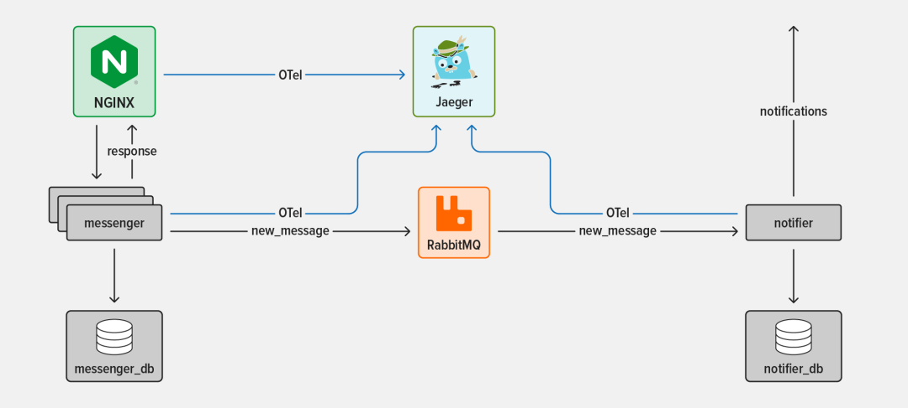

两种微服务如下：

* 信使（messenger）服务(https://github.com/microservices-march/messenger) - **一个简单的聊天 API，具有消息存储功能**
* 通知器（notifier）服务(https://github.com/microservices-march/notifier) - **一个根据用户偏好触发事件以提醒用户的监听器**

三种支持基础架构包括：

* NGINX 开源版 - 通往**信使**服务和整个系统的入口点
* RabbitMQ - 一个常用的开源消息代理，支持服务异步通信
* Jaeger - 一个开源的端到端分布式链路追踪系统，用于从相关系统组件中收集遥测数据并实现可视化查看。

现在暂时把 OTel 搁置脑后，重点介绍下我们正在跟踪的事件序列，即当用户发送新的聊天消息并且接收者收到相关通知时会发生什么。

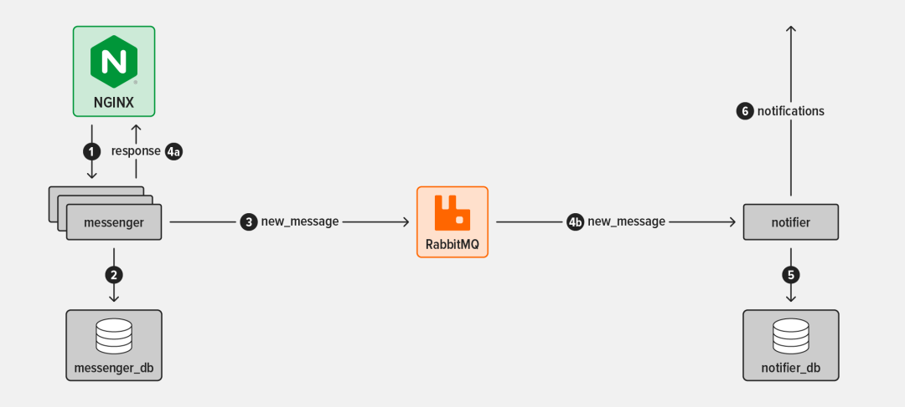

流程分解如下：

* 用户向**信使**服务发送消息。NGINX 反向代理拦截消息，并将其转发给**信使**并将其转发给信使服务的众多实例之一。
* **信使**服务将新消息写入其数据库。
* **信使**服务在名为 `chat_queue` 的 RabbitMQ 消息队列上生成一个事件，以表明消息已发送。该事件为普通事件，无具体目标。
* 与此同时：
	* **4a. 信使信使服务向发送者返回一个响应，报告该消息已成功发送。**
	* **4b. 通知器服务注意到 `chat_queue` 上的新事件，并使用该事件**。
* **通知器**服务在其数据库中查看新消息接收者的通知偏好。
* **通知器服务使**用接收者首选的方法发送一个或多个通知（在本教程中，选择的方法是短信和电子邮件)。

### 遥测目标

在设置遥测工具时，最好先确定一组明确的监测目标，而不是“发送所有内容，希望获得洞察”。在本教程中，我们有三个主要的遥测目标：


1. 了解一个请求在新消息流期间所经历的所有步骤。
2. 确信在正常情况下消息流可在五秒钟内端到端执行完毕。
3. 查看**通知器**服务在多长时间之后才开始处理**信使**服务派发的事件（延迟过长可能意味着**通知器**服务在读取事件队列时遇到了问题，出现事件堆积）。

请注意，这些目标与系统的技术操作和用户体验有关。

## 教程准备工作和设置

### 准备工作

若在自己的环境中完成本教程的学习，您需要：

* 一个兼容 Linux/Unix 的环境

注：由于 NGINX 的 OpenTelemetry 模块不兼容（包括 Linux aarch64 架构和搭载 M1 或 M2 芯片的苹果设备），本教程中涉及跟踪 NGINX 的活动不能在基于 ARM 的处理器上工作。涉及信使和通知器服务的活动适用于所有架构。

* 基本了解 Linux 命令行、JavaScript 和 bashbash （本教程会提供并解释所有代码和命令，因此即使您知识有限也无妨）
* Docker 和 Docker Compose
* Node.js 19.x 或更高版本

	* 我们只测试了版本 19.x，但预计更新版本的 Node.js 也适用。
	* 如欲了解有关 Node,js 安装的详细信息，请查看信使服务代码库中的 README 文件。您也可以通过安装 asdf，获取与教程中所用完全相同的 Node.js 版本。

* curl（已安装在大多数系统上）
* **架构和用户流部分提到了以下技术：信使和通知器（将在下一部分中下载）、NGINX 开源版、Jaeger 和 RabbitMQ**。

注：本教程用到了 JavaScript SDK，因为信使和通知器服务均使用 Node.js 编写而成。您还需要设置 OTel 自动埋点特性，以便了解 OTel 提供的信息类型。本教程介绍了有关 OTel Node.js SDK 的常用信息，如欲了解更多详情，请参阅 [OTel 文档]：

[https://opentelemetry.io/docs/instrumentation/js/getting-started/nodejs](https://opentelemetry.io/docs/instrumentation/js/getting-started/nodejs)/。

### 设置

* 开启终端会话。
* 在主目录下，创建 microservices-march 目录，并将本教程会用到的 GitHub 代码库复制到其中。（您也可以使用其他目录名称，相应修改指令即可）。

```
mkdir ~/microservices-march
cd ~/microservices-march
git clone https://github.com/microservices-march/messenger --branch mm23-metrics-start
git clone https://github.com/microservices-march/notifier --branch mm23-metrics-start
git clone https://github.com/microservices-march/platform --branch mm23-metrics-start
```

## 挑战 1：设置基本 OTel 埋点

在这个挑战中，启动信使服务并配置 OTel 自动埋点以将遥测数据发送至控制台。

### 启动信使服务

1. 切换到平台 platform 代码库并启动 Docker Compose：

```
cd ~/microservices-march/platform
docker compose up -d --build
```
这将同时启动 RabbitMQ 和 Jaeger——两者将在后面的挑战中用到。


* `‑d `标记指示 Docker Compose 在容器启动时与之分离（否则容器将始终与您的终端保持连接）。
* `--build` 标记指示 `Docker Compose ` 在启动时重建所有镜像。这可确保您正在运行的镜像通过任何潜在的文件变更保持更新。

2. 切换到信使 messenger 代码库的 app 目录并安装 Node.js（您也可以按需采用其他替代方法）：

```
cd ~/microservices-march/messenger/app
asdf install
```

3. 安装依赖项：

```
npm install
```

为信使服务启动 PostgreSQL 数据库：

```
docker compose up -d
```

创建数据库模式和表格，并插入一些种子数据：

```
npm run refresh-db
```

### 配置发送到控制台的 OTel 自动埋点

借助 OTel 自动埋点，无需修改信使代码库中的任何内容即可设置链路追踪。所有链路追踪配置并非直接编写在应用代码中，而是在脚本中定义，然后在运行时把脚本导入 Node.js 进程。

此处，您可以配置信使服务的自动埋点使用最基本的链路追踪目标位置，即控制台。在挑战 2 中，您需要更改配置，将链路追踪发送到作为外部收集器的 Jaeger。

1. 仍然在 messenger 代码库的 app 目录下操作，安装核心 OTel Node.js 包：

```
npm install @opentelemetry/sdk-node@0.36.0 \
            @opentelemetry/auto-instrumentations-node@0.36.4
```

下列库提供了以下功能：

* `@opentelemetry/sdk-node`—— 生成并导出 OTel 数据
* `@opentelemetry/auto-instrumentations-node`—— 使用所有常见 Node.js 埋点的默认配置进行自动设置


2. 新建一个名为 tracing.mjs 的文件，添加 OTel 链路追踪的设置和配置代码：

```
touch tracing.mjs
```

在您常用的文本编辑器中，打开 tracing.mjs 并添加下列代码：

```
//1
import opentelemetry from "@opentelemetry/sdk-node";
import { getNodeAutoInstrumentations } from "@opentelemetry/auto-instrumentations-node";

//2
const sdk = new opentelemetry.NodeSDK({
  traceExporter: new opentelemetry.tracing.ConsoleSpanExporter(),
  instrumentations: [getNodeAutoInstrumentations()],
});

//3
sdk.start();
```

这些代码会完成以下操作：


新建 NodeSDK 实例并对其进行配置，以便：

* 面向 Postgres 数据库的 `@opentelemetry/instrumentation-pg ` 库 (`pg`)
* 面向 `Node.js` Express 框架的 `@opentelemetry/instrumentation-express`
* 面向 RabbitMQ 的 `@opentelemetry/instrumentation-amqplib` 库 (amqplib)
* 将 span 发送至控制台 (`ConsoleSpanExporter`)。
* 将自动埋点用作基本埋点组。该埋点加载了所有最常见的自动埋点库。本教程用到了以下库：

启动 SDK。

启动信使服务，导入您在第三步中创建的自动埋点脚本。

```
node --import ./tracing.mjs index.mjs
```

稍后，控制台（您的终端）中开始显示大量与链路追踪相关的输出：

```
...
{
  traceId: '9c1801593a9d3b773e5cbd314a8ea89c',
  parentId: undefined,
  traceState: undefined,
  name: 'fs statSync',
  id: '2ddf082c1d609fbe',
  kind: 0,
  timestamp: 1676076410782000,
  duration: 3,
  attributes: {},
  status: { code: 0 },
  events: [],
  links: []
}
...
```

注：让终端会话保持打开状态，以便在挑战 2 中使用。

## 挑战 2：为所有服务设置 OTel 埋点和链路追踪可视化

您可以使用许多工具来查看和分析链路追踪，但本教程使用的是 Jaeger。Jaeger 是一个简单的开源端到端分布式链路追踪框架，内置一个基于 Web 的用户界面，用于查看 span 及其他链路追踪数据。

**平台**代码库中提供的基础架构包括 Jaeger（已在挑战 1 的第一步中启动），因此您可以专注于分析数据，不用考虑工具问题。


**您可通过在浏览器中访问 http://localhost:16686** 端点来访问 Jaeger，但如果您现在就访问该端点，不会看到与您的系统有关的任何内容。

这是因为您目前收集的链路追踪正被发送到控制台！如欲在 Jaeger 中查看链路追踪数据，需使用 OpenTelemetry 协议 (OTLP) 格式导出链路追踪。

在这个挑战中，您需要为以下服务配置埋点以监测核心用户流：


* 信使服务，将链路追踪目标位置从控制台切换到 Jaeger。
* 通知器服务
* NGINX

### 配置 OTel 自动埋点发送到外部收集器

值得一提的是，使用 OTel 自动埋点意味着您无需修改信使代码库中的任何内容即可设置链路追踪。

但所有链路追踪配置都位于在运行时被导入 Node.js 进程的脚本中。

此处，您可将由信使服务生成的链路追踪的目标位置从控制台更改为外部收集器（在本教程中为 Jaeger）。

1. 仍然在与挑战 1 中相同的终端下操作，在信使代码库的 app 目录下，安装 OTLP 输出器 Node.js 包：

```
npm install @opentelemetry/exporter-trace-otlp-http@0.36.0
```


`@opentelemetry/exporter-trace-otlp-http` 库通过 HTTP 导出 OTLP 格式的链路追踪信息，用于向 OTel 外部收集器发送遥测数据。

2.打开 tracing.mjs（已在挑战 1 中创建和编辑），并进行以下修改：

```
import { OTLPTraceExporter } from "@opentelemetry/exporter-trace-otlp-http";
```

注：为了简单起见，本教程假设收集器位于默认位置 http://localhost:4318/v1/traces。在真实系统中，最好明确设置该位置。

* 将提供给 OTel SDK 的“导出器”从挑战 1 中所用的控制台导出器更改为可通过 HTTP 向兼容 OTLP 的收集器发送 OTLP 数据的导出器。将

```
traceExporter:new opentelemetry.tracing.ConsoleSpanExporter(),
```

将下列一行添加到文件顶部的 import 语句中：

3.按下 Ctrl+c 停止信使服务，该终端是在配置 OTel 自动埋点发送到控制台的第四步中启动的。重启该服务，以使用在第二步中配置的新导出器：

```
^c
node --import ./tracing.mjs index.mjs
```

4.开启第二个终端会话。（在后面的指令中称其为客户端终端，在第一步和第三步中使用的原始终端被称作信使终端。）等待大约十秒钟，然后向信使服务发送健康检查请求（如要查看多个链路追踪，则可多运行几次）：

```
curl -X GET http://localhost:4000/health
```

在发送请求前等待 10 秒钟有助于您的跟踪更容易被找到，因为在服务启动时自动埋点会生成许多链路追踪。

在浏览器中，访问 Jaeger 用户界面：`http://localhost:16686`，并验证 OTLP 导出器是否按预期运行。

在标题栏中点击 Search（搜索），从 Service（服务）字段的下拉菜单中选择名称以 `unknown_service` 开头的服务。

点击 Find Traces（查找追踪）按钮：


点击窗口右侧的链路追踪，以显示其中的 span 列表。每个 span 都描述了作为链路追踪的一部分运行的各项操作，有时涉及多个服务。**截图中的 jsonParser span 显示了运行信使服务的请求处理代码的 jsonParser 部分所用的时长**。

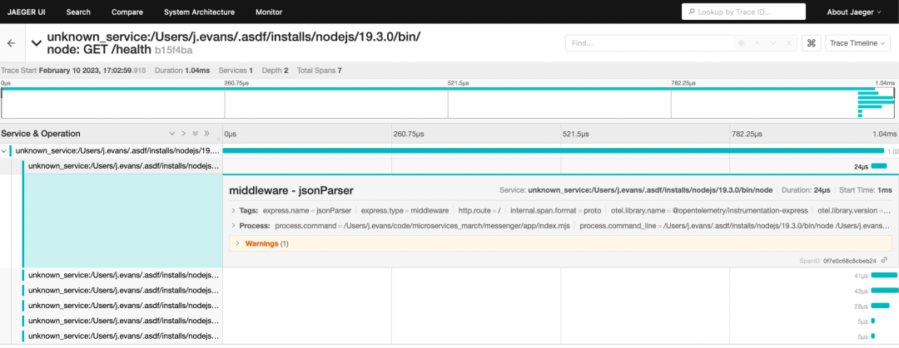

正如第五步中所述，OTel SDK 导出的服务名称 (`unknown_service`) 毫无意义。要想解决这个问题，在信使终端按下 Ctrl+c 来停止信使服务。 然后再安装几个 Node.js 包：

```
^c 
npm install @opentelemetry/semantic-conventions@1.10.0 \
            @opentelemetry/resources@1.10.0
```

下列两个库提供以下功能：

* `@opentelemetry/semantic-conventions`——定义了 OTel 规范中所定义的链路追踪的标准属性。
* `@opentelemetry/resources`——定义一个对象（资源）以代表生成 OTel 数据的来源（在本教程中为信使服务）。

8.在文本编辑器中打开 `tracing.mjs` 并进行以下修改：

* 将下列行添加到文件顶部的 import 语句中：

```
import { Resource } from "@opentelemetry/resources";
import { SemanticResourceAttributes } from "@opentelemetry/semantic-conventions";
```

* 在 OTel 规范中的正确键值下创建一个名为 messenger 的 resource，具体方法是在最后一个 import 语句后添加以下行：

```
const resource = new Resource({
  [SemanticResourceAttributes.SERVICE_NAME]: "messenger",
});
```

* 通过在以下黑色行之间添加橙色高亮显示的行，将 resource 对象传递给 NodeSDK 构造函数：

```
const sdk = new opentelemetry.NodeSDK({
  resource,
  traceExporter: new OTLPTraceExporter({ headers: {} }),
  instrumentations: [getNodeAutoInstrumentations()],
});
```

9.重启信使服务：

```
node --import ./tracing.mjs index.mjs
```

10.等待大约十秒钟，然后在客户端终端中（已在第四步中打开）向服务器发送另一健康检查请求（如欲查看多个链路追踪，则可多运行几次命令）：

```
curl -X GET http://localhost:4000/health
```

注：让客户端终端保持打开状态，以便在下一部分中再次使用，同时让信使终端保持打开状态，以在挑战 3 中再次使用

11.确认一个名为 messenger（信使）的新服务出现在浏览器的 Jaeger 用户界面中（这可能需要几秒钟的时间，而且您可能需要刷新 Jaeger 用户界面）：

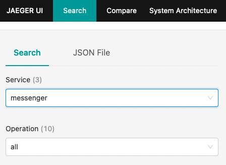

12.从 Service 下拉菜单中选择 messenger，然后点击 Find Traces 按钮，即可查看由信使服务生成的所有最新链路追踪（截图显示了 20 条信息中的两条最新信息）：

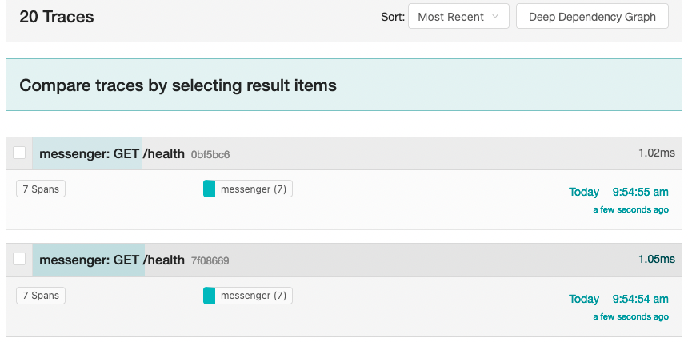

13.点击一个追踪，以显示其中的 span。每个 span 都被正确地标记为源自于信使服务：

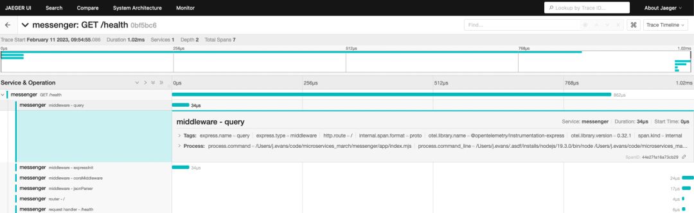

### 配置通知器服务的 OTel 自动埋点

现在为通知器服务启动并配置自动埋点，运行与前两部分中信使服务基本相同的命令。

1.开启新的终端会话（在后续步骤中被称为通知器终端）。**切换到通知器代码库的 app 目录并安装 Node.js（您也可以按需采用其他替代方法）**：

```
cd ~/microservices-march/notifier/app
asdf install
```

2 安装依赖项：

```
npm install
```

3 为通知器服务启动 PostgreSQL 数据库：

```
docker compose up -d
```

4 创建数据库模式和表格，并插入一些种子数据：

```
npm run refresh-db
```

5 安装 OTel Node.js 包（关于这些包功能的描述，请参阅“配置 OTel 自动埋点发送到控制台”中的第一步和第三步）：

```
npm install @opentelemetry/auto-instrumentations-node@0.36.4 \
  @opentelemetry/exporter-trace-otlp-http@0.36.0 \
  @opentelemetry/resources@1.10.0 \
  @opentelemetry/sdk-node@0.36.0 \
  @opentelemetry/semantic-conventions@1.10.0
```

6 新建一个名为 tracing.mjs 的文件：

```
touch tracing.mjs
```

7 在您常用的文本编辑器中，打开 tracing.mjs 并添加以下脚本，以启动并运行 OTel SDK：

```
import opentelemetry from "@opentelemetry/sdk-node";
import { getNodeAutoInstrumentations } from "@opentelemetry/auto-instrumentations-node";
import { OTLPTraceExporter } from "@opentelemetry/exporter-trace-otlp-http";
import { Resource } from "@opentelemetry/resources";
import { SemanticResourceAttributes } from "@opentelemetry/semantic-conventions";

const resource = new Resource({
  [SemanticResourceAttributes.SERVICE_NAME]: "notifier",
});

const sdk = new opentelemetry.NodeSDK({
  resource,
  traceExporter: new OTLPTraceExporter({ headers: {} }),
  instrumentations: [getNodeAutoInstrumentations()],
});

sdk.start();
```

注：本脚本与信使（notifier）服务所用的完全相同，唯一不同之处是`SemanticResourceAttributes.SERVICE_NAME` 字段中的值是 `notifier`。

**8 使用 OTel 自动埋点启动通知器服务：**

```
node --import ./tracing.mjs index.mjs
```

9 等待大约十秒钟，然后在客户端终端向**通知器**服务发送健康检查请求。该服务将监听端口 5000，以防止与监听端口 4000 的**信使**服务发生冲突：

```
curl http://localhost:5000/health
```

注：让客户端终端和通知器终端保持打开状态，以便在挑战 3 中再次使用。

10 确认一个名为 notifier 的新服务出现在浏览器的 Jaeger 用户界面中：

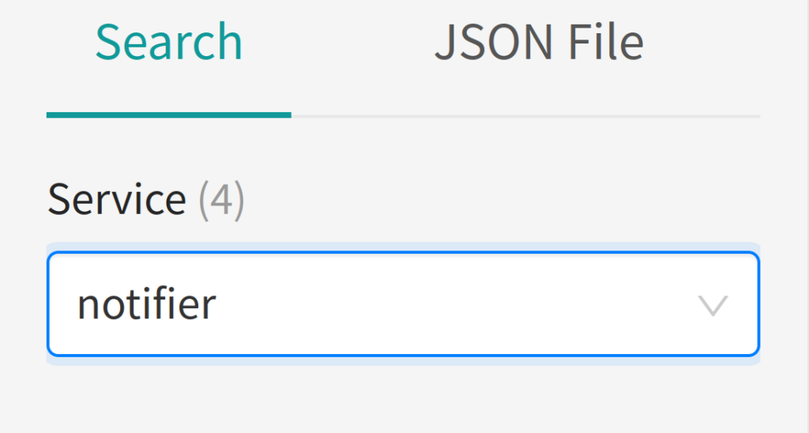

### 配置 NGINX 的 OTEL 埋点

对于 NGINX，您需要手动设置链路追踪，而不是使用 OTel 自动埋点方法。

目前，使用 OTel 对 NGINX 进行监测的最常见方式是使用[用 C 语言编写的模块]：https://github.com/open-telemetry/opentelemetry-cpp-contrib/tree/main/instrumentation/otel-webserver-module#nginx-webserver-module。

第三方模块是 NGINX 生态系统的一个重要组成部分，但需要进行一些设置。本教程向您展示了如何进行这些设置。有关背景信息，请参阅我们的博文《为 NGINX 和 NGINX Plus 编译第三方动态模块》。

1 开启新的终端会话（NGINX 终端），将目录更改为信使代码库的根目录，并新建一个名为 load-balancer 的目录及三个名为 Dockerfile、`nginx.conf` 和 `opentelemetry_module.conf` 的文件：

```
cd ~/microservices-march/messenger/
mkdir load-balancer
cd load-balancer
touch Dockerfile
touch nginx.conf
touch opentelemetry_module.conf
```

在您常用的文本编辑器中，打开 Dockerfile 并添加以下内容（注释解释了每一行代码的功能，即便您不完全理解这些注释，也能构建和运行 Docker 容器）：

```
FROM --platform=amd64 nginx:1.23.1

# 用我们自己的文件替换 nginx.conf 文件
COPY nginx.conf /etc/nginx/nginx.conf

# 定义 NGINX OTel 模块的版本
ARG OPENTELEMETRY_CPP_VERSION=1.0.3

# 定义编译和运行 NGINX 时所用共享库的搜索路径
ENV LD_LIBRARY_PATH=$LD_LIBRARY_PATH:/opt/opentelemetry-webserver-sdk/sdk_lib/lib

# 1. 下载最新版本的 Consul 模板和 OTEL C++ Web 服务器模块、otel-webserver-module
ADD https://github.com/open-telemetry/opentelemetry-cpp-contrib/releases/download/webserver%2Fv${OPENTELEMETRY_CPP_VERSION}/opentelemetry-webserver-sdk-x64-linux.tgz /tmp

RUN apt-get update \
  && apt-get install -y --no-install-recommends dumb-init unzip \
# 2. 提取模块文件
  && tar xvfz /tmp/opentelemetry-webserver-sdk-x64-linux.tgz -C /opt \
  && rm -rf /tmp/opentelemetry-webserver-sdk-x64-linux.tgz \
# 3. 将‘load_module’指令安装并添加至主 NGINX 配置文件的顶部
  && /opt/opentelemetry-webserver-sdk/install.sh \
  && echo "load_module /opt/opentelemetry-webserver-sdk/WebServerModule/Nginx/1.23.1/ngx_http_opentelemetry_module.so;\n$(cat /etc/nginx/nginx.conf)" > /etc/nginx/nginx.conf

# 4. 复制到 NGINX OTel 模块的配置文件中
COPY opentelemetry_module.conf /etc/nginx/conf.d/opentelemetry_module.conf

EXPOSE 8085

STOPSIGNAL SIGQUIT
```

3 打开 nginx.conf 并添加以下内容：

```
events {}

http {
    include /etc/nginx/conf.d/opentelemetry_module.conf;

    upstream messenger {
        server localhost:4000;
    }

    server {
        listen 8085;

        location / {
            proxy_pass http://messenger;
        }
    }
}
```

这个基本的 NGINX 配置文件指示 NGINX：

* 设置一个名为信使的上游组，以表示信使服务实例组。
* 在端口 8085 监听 HTTP 请求
* 将以 `/ `开头的路径的所有传入请求（即所有传入请求）转发到信使上游

注：这与 NGINX 在生产环境中作为反向代理和负载均衡器的实际配置很相似。**唯一的主要区别是，upstream 块中 server 指令的参数通常是域名或 IP 地址，而非 localhost。**

4 打开 `opentelemetry_module.conf ` 并添加以下内容：

```
NginxModuleEnabled ON;
NginxModuleOtelSpanExporter otlp;
NginxModuleOtelExporterEndpoint localhost:4317;
NginxModuleServiceName messenger-lb;
NginxModuleServiceNamespace MicroservicesMarchDemoArchitecture;
NginxModuleServiceInstanceId DemoInstanceId;
NginxModuleResolveBackends ON;
NginxModuleTraceAsError ON;
```

5 构建一个包含 NGINX 和 NGINX OTel 模块的 Docker 镜像：

```
docker build -t messenger-lb .
```

6 启动 NGINX 反向代理和负载均衡器的 Docker 容器：

```
docker run --rm --name messenger-lb -p 8085:8085 --network="host" messenger-lb
```

7 在客户端终端，通过 NGINX 反向代理和负载均衡器向信使服务发送健康检查请求（在发送该请求之前无需等待）：

```
curl http://localhost:8085/health
```

注：让 NGINX 和客户端终端保持打开状态，以便在挑战 3 中再次使用。

8 在浏览器中，确认新的 `messenger-lb `服务与您之前启动的服务一同列在 Jaeger 用户界面中。您可能需要在您的浏览器中重新加载 Jaeger 用户界面。

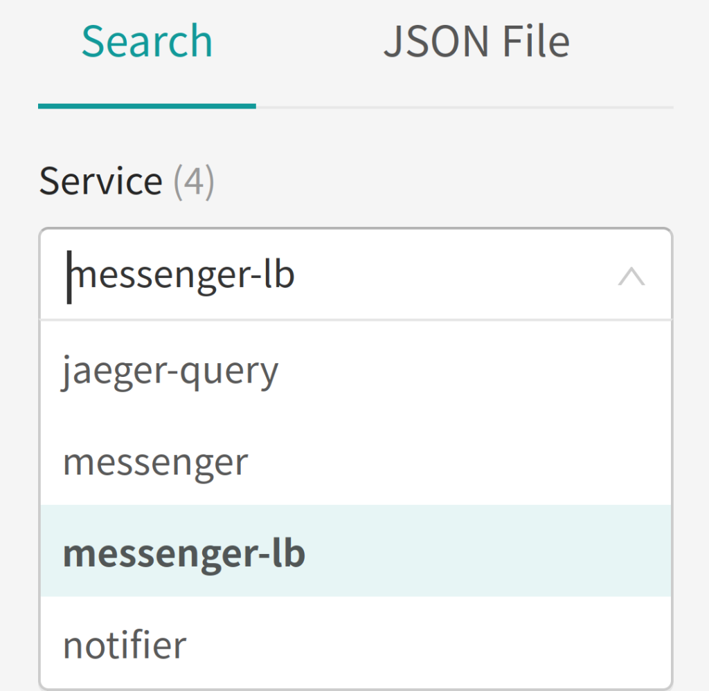

## 挑战 3：学习解读 OTel 链路追踪

在架构和用户流中，我们概述了用户流的各个阶段，现在简单回顾一下：

* 一位用户通过向另一位用户发送消息开始对话。
* NGINX 反向代理拦截消息并将其转发给**信使**服务。
* 该**信使**服务将消息写入其数据库，然后通过 RabbitMQ 派发事件。
* **通知器**服务使用该事件，查询接收者（第二位用户）的通知偏好，并通过首选方法向接收者发送通知。


实施遥测的目标是：

* 了解一个请求在新的消息流中所经历的所有步骤。
* 确认在正常情况下消息流可在五秒钟内端到端执行完毕。
* 查看通知器服务在多长时间之后才开始处理信使服务派发的事件。

在这个挑战中，您将学习如何评估 OTel 埋点生成的链路追踪是否满足上述目标要求。首先，运行系统并创建一些链路追踪数据。然后，检查消息流的链路追踪以及其中分别由 NGINX、信使服务和通知器服务生成的部分。

### 创建链路追踪数据

在客户端终端，设置对话并在两位用户之间发送几条消息：

```
curl -X POST \
    -H "Content-Type: application/json" \
    -d '{"participant_ids": [1, 2]}' \
    'http://localhost:8085/conversations'

curl -X POST \
    -H "User-Id: 1" \
    -H "Content-Type: application/json" \
    -d '{"content": "This is the first message"}' \
    'http://localhost:8085/conversations/1/messages'

curl -X POST \
    -H "User-Id: 2" \
    -H "Content-Type: application/json" \
    -d '{"content": "This is the second message"}' \
    'http://localhost:8085/conversations/1/messages'
```

**通知器**服务生成如下输出，并显示在通知器终端中：

```
Received new_message: {"type":"new_message","channel_id":1,"user_id":1,"index":1,"participant_ids":[1,2]}
Sending notification of new message via sms to 12027621401

Received new_message:  {"type":"new_message","channel_id":1,"user_id":2,"index":2,"participant_ids":[1,2]}

Sending notification of new message via email to the_hotstepper@kamo.ze

Sending notification of new message via sms to 19147379938
```

### 准备好解读链路追踪

在浏览器中打开 Jaeger 用户界面，从 Service 下拉菜单中选择 `messenger-lb`，然后点击 Find Traces 按钮。 此时界面上会显示一个链路追踪列表，回溯到用户流起初。点击任何链路追踪，即可显示相关详情，如下截图所示：

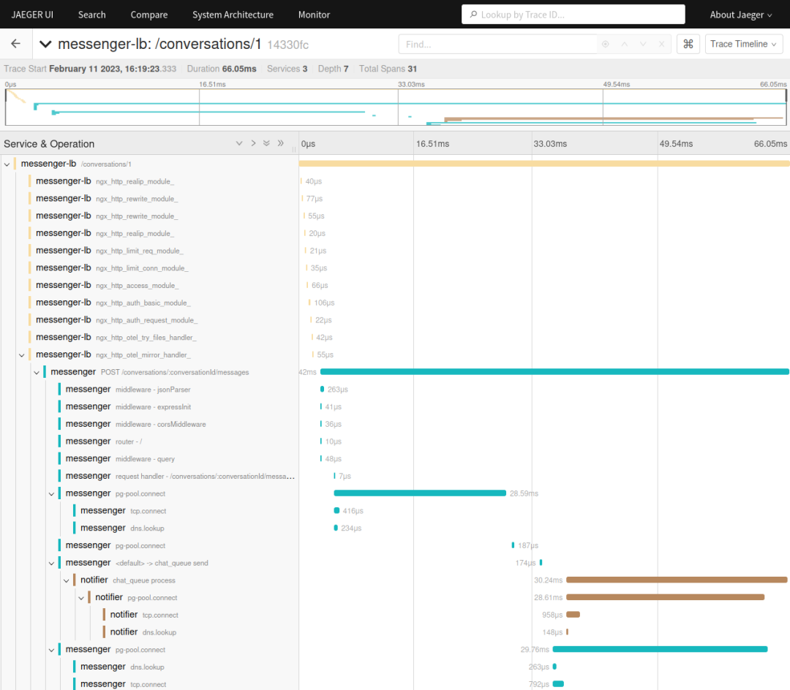

点击并查看详情。在继续操作之前，考虑一下链路追踪中的信息可如何帮助您实现挑战 3 的简介中提到的监测目标。相关问题包括：

* 哪些信息有助于实现目标？
* 缺少什么信息？
* 哪些信息不相关？

### 检查链路追踪的 NGINX (messenger-lb) 部分

**目标 1：在新的消息流中查看一个请求所经历的全部步骤**

从 NGINX span 开始，父 span 包含 11 个子 span。由于当前的 NGINX 配置非常简单，因此子 span 意义不大，只显示了 NGINX 请求处理生命周期中每个步骤所用的时间。但 父 span（第一个）提供了一些有价值的信息：

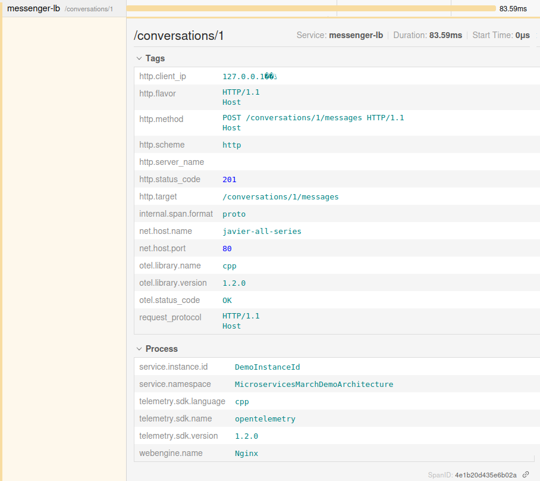

在 Tags（标签）下，您能够看到以下属性：

综合来看，这三条信息传达的意思是：“向 `/conversations/1/messages` 发送了一个 POST 请求，响应为 201（创建成功）”。这与架构和用户流中的第一步和第 4a 步相对应）。


* `http.method` 字段——POST（在 REST 术语中，这意味着创建）
* `http.status_code` 字段——201（表示创建成功）
* `http.target`字段——`conversations/1/messages` （消息端点）

在 Process（进程）下，webengine.name 字段显示这是该请求的 NGINX 部分。

此外，由于信使和通知器的 span 嵌套在 `messenger-lb conversations/1 span` 内（如准备好解读链路追踪中的截图所示），您可以判断通过 NGINX 反向代理发送给信使服务的请求是否到达了流程中的所有预期组件。

该信息满足目标要求，因为您可以看到 NGINX 反向代理是流程的一部分。

**目标 2：验证消息流能否在五秒内执行完毕**

在标记 messenger-lb 的 span 列表中，查看最新 span（位于列表的底部），以了解请求的 NGINX 部分所用时长。在截图中，span 从 589 微秒 (µs) 开始，持续了 24µs，这意味着整个反向代理操作只花了 613µs——约 0.6 毫秒 (ms)。（当然，当您自己操作本教程步骤时，具体数值会有所不同）。


在这样的设置中，大多数情况下，这些值只是相对于其他度量值而言有用，并随系统而变。不过在本例中，该操作的时长显然不到 5 秒阈值。

该信息满足目标要求，因为您可以看到 NGINX 操作的时长都不曾接近 5 秒。如果消息流中出现了非常缓慢的操作，那一定是后来发生的。

**目标 3：查看通知器服务读取信使服务派发的事件需要多长时间**

NGINX 反向代理层并不包括任何相关信息，因此您可以转到信使 span。

### 检查链路追踪的信使部分

**目标 1：在新的消息流中查看一个请求所经历的全部步骤**

链路追踪的信使服务部分包含另外 11 个 span。同样，大多数子 span 涉及 Express 框架在处理请求时使用的基本步骤，意义不大。但父 span（第一个）再次提供了一些有价值的信息：

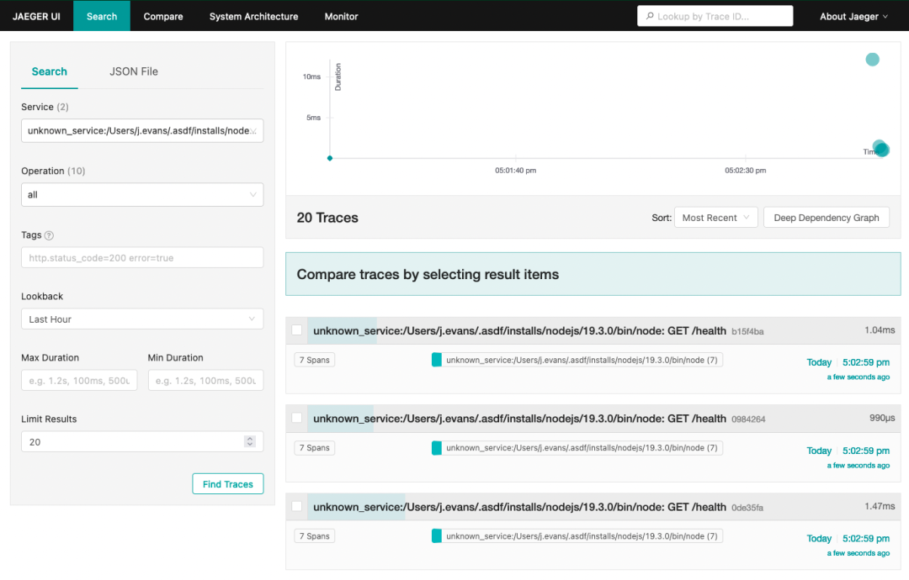

在 Tags 下，您能够看到以下属性：

* `http.method` 字段——POST（同样在 REST 术语中，这意味着创建）
* `http.route` 字段——`/conversations/:conversationId/messages`（消息路由）
* `http.target` 字段——`/conversations/1/messages`（消息端点）

该信息满足目标要求，因为从中可以看出信使服务是流程的一部分，而且到达的端点是新的消息端点。


**目标 2：验证消息流能否在五秒内执行完毕**


如下截图所示，链路追踪的**信使**部分开始于 1.28 ms，结束于 36.28ms，总时长为 35ms。其中大部分时间花在解析 JSON（**middleware - jsonParser**）和连接数据库（pg-pool.connect 和 tcp.connect）上。


鉴于在消息编写过程中还进行了几次 SQL 查询，因此这也很合理。这反过来表明，您可能需要增加自动埋点配置，以捕获这些查询的用时。（本教程没有用到这个额外的埋点，因此在挑战 4 中，您会手动创建 span，后者可用于打包数据库查询。）

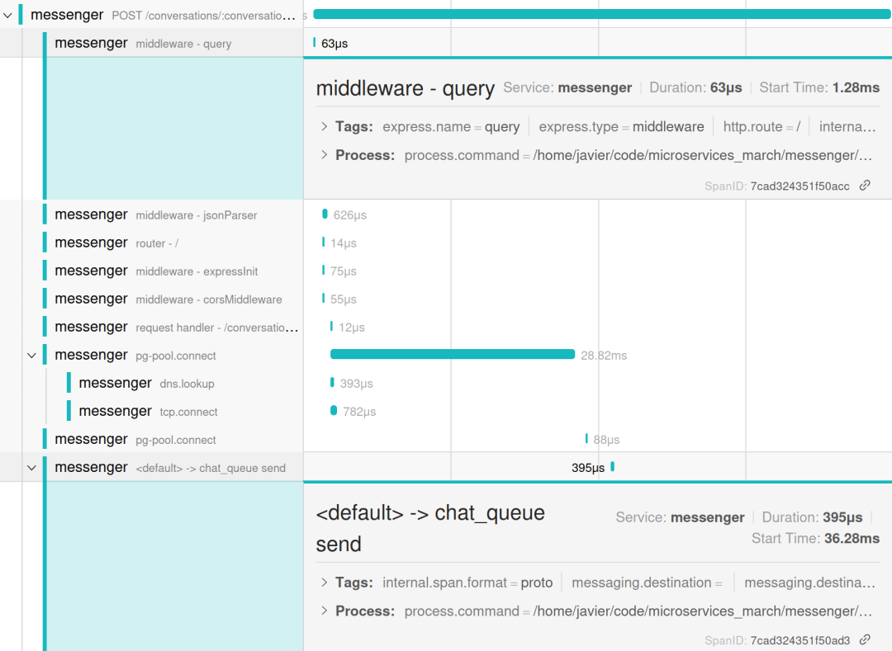

该信息满足目标要求，因为从中可以看出信使操作的时长都不曾接近 5 秒。如果消息流中出现了非常缓慢的操作，那一定是后来发生的。

**目标 3：查看通知器服务读取信使服务派发的事件需要多长时间**

与 NGINX span 一样，信使 span 不包含这些信息，因此您可以转到通知器 span。

### 检查链路追踪的通知器部分

**目标 1：在新的消息流中查看一个请求所经历的全部步骤**

链路追踪的**通知**器部分只包含两个 span：

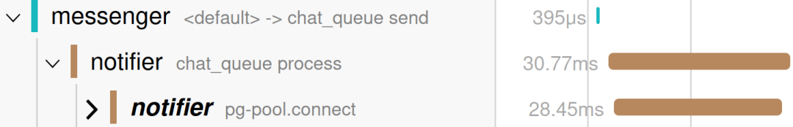

* `chat_queue process` span——确认通知器服务处理了来自 chat_queue 消息队列的事件
* `pg-pool.connect` span——显示处理完事件后，通知器服务与其数据库建立了某种连接

仅凭从这些 span 中获取的信息，无法全面了解每一步。您可以看到通知器服务使用来自队列的事件，但却不知道：

* 该服务发送的消息通知是否与信使服务派发的事件相对应
* 相关消息通知是否正确地发送给了消息接收者

这表明您需要执行以下操作才能充分了解通知器服务流：

* 手动监测显示通知正在发送中的 span
* 确保信使服务派发的事件和通知器服务使用的事件之间以链路追踪 ID 的形式建立了明确的联系

**目标 2：验证消息流能否在五秒内执行完毕**

通过查看通知器服务 span 的总用时，您可以看到请求在消息流的通知器部分花费了 30.77 ms。但是，由于没有表示整个消息流（向接收者发送通知）“结束”的 span，因此您无法确定消息流这一部分的总用时或操作完成的总用时。

**目标 3：查看通知器服务读取信使服务派发的事件需要多长时间**

您可以看到通知器服务的 `chat_queue` process 开始于 6.12ms，即信使服务的 `chat_queue` send 开始（于 4.12ms）后 2ms。

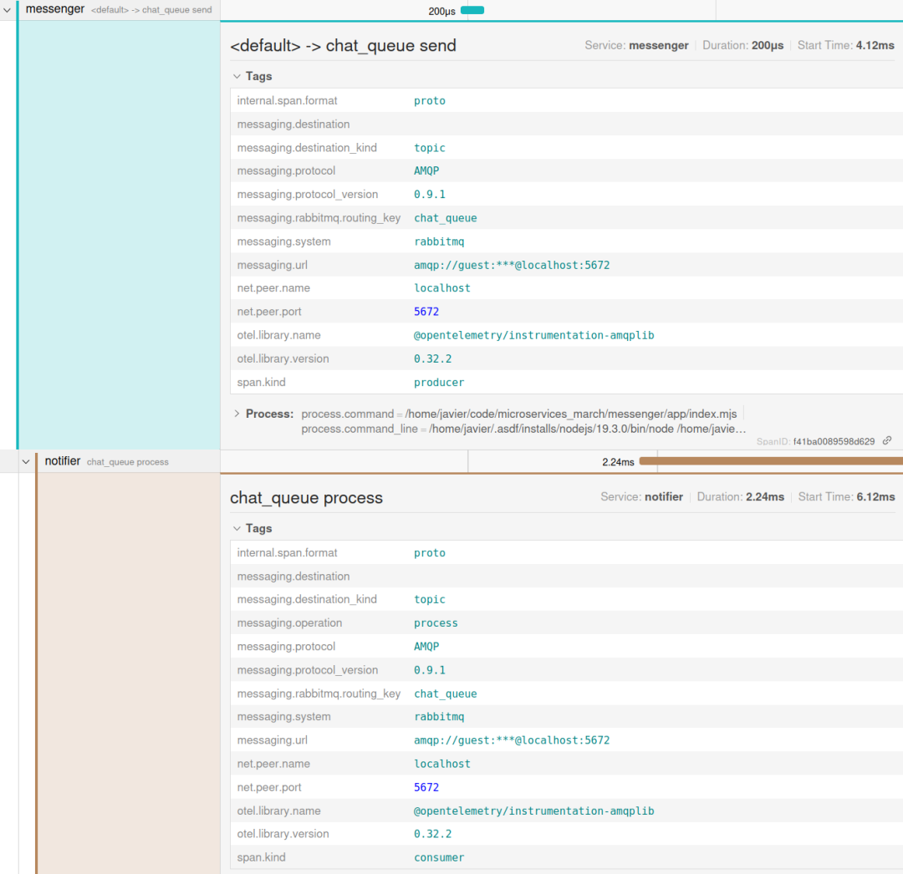

该目标达成了，因为您知道通知器在信使 服务派发事件 2ms 后使用了该事件。与目标 2 不同的是，您不需要知道事件是否已被完全处理，也不需要知道耗时多少便可实现此目标。

### 结论

根据我们对当前 OTel 自动埋点生成的链路追踪的分析，可以清楚地发现：

许多 span 以当前形式而言毫无用处：

* NGINX 正在生成与功能相关的 span，例如授权检查和文件服务，但这些 span 与您所关心的角色 — 反向代理无关。但目前面向 NGINX 的 OTel 埋点不允许您省略不相关的 span，因此我们也无能为力。
* 在 Node.js 服务（信使和通知器服务）的 span 中，以下 span 似乎与目标相关：JSON 解析、request handler 以及所有数据库操作的 span。一些中间件 span（例如 expressInit 和 corsMiddleware）似乎不相关，可以移除。


以下服务缺少关键 span：

* 通知器服务发送的通知
* 信使服务派发的 RabbitMQ 事件与通知器服务处理的事件之间的明确映射

这意味着，基本埋点满足了最后一个目标要求：

* 查看通知器服务在多长时间之后开始处理信使服务派发的事件。

然而，没有足够的信息来实现前两个目标：

* 了解一个请求在新的消息流中所经历的所有步骤。
* 确认在正常情况下消息流可在五秒钟内端到端执行完毕。

## **挑战 4：根据链路追踪解读优化埋点**

在这个挑战中，您将需要根据在挑战 3 中完成的追踪分析，优化 OTel 埋点。其中包括删除不必要的 span, 创建新的自定义 span，并确认通知器服务使用的事件是信使服务生成的事件。

### 删除不必要的 span

1.在您常用的文本编辑器中，打开信使代码库的 app 目录下的 tracing.mjs 文件，并在顶部的导入语句列表的末尾添加以下内容：

```
const IGNORED_EXPRESS_SPANS = new Set([
  "middleware - expressInit",
  "middleware - corsMiddleware",
]);
```

这定义了一组 span 名称，这些名称来自于下面 Jaeger 用户界面截图中的 span 列表，但由于无法为该消息流提供有用的信息而将从追踪中删除。您可能决定也不需要该截图中所列的其他 span，并将其添加到 `IGNORED_EXPRESS_SPANS 列表中。

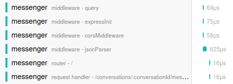

2.将过滤器添加至自动埋点配置，以删除您不需要的 span，具体方法是将下列橙色高亮显示的部分：

```
const sdk = new opentelemetry.NodeSDK({
  resource,
  traceExporter: new OTLPTraceExporter({ headers: {} }),
  instrumentations: [getNodeAutoInstrumentations()],
});
```

更改为以下行：

```
const sdk = new opentelemetry.NodeSDK({
  resource,
  traceExporter: new OTLPTraceExporter({ headers: {} }),
  instrumentations: [
    getNodeAutoInstrumentations({
      "@opentelemetry/instrumentation-express": {
        ignoreLayers: [
          (name) => {
            return IGNORED_EXPRESS_SPANS.has(name);
          },
        ],
      },
    }),
  ],
});
```

`getNodeAutoInstrumentations` 函数引用了第一步中定义的 span 集，以将这些 span 从 @opentelemetry/instrumentation-express 生成的链路追踪中滤除。换而言之，对于属于 `IGNORED_EXPRESS_SPANS` 的 span，将 return 语句解析为 true，同时 `ignoreLayers` 语句从链路追踪中移除该 span。

3.在信使终端，按下 Ctrl+c 来停止信使服务。然后重启它。

```
^c
node --import ./tracing.mjs index.mjs
```

4.等待大约十秒钟，然后在客户端终端发送一条新消息：

```
curl -X POST \
 -H "User-Id: 2" \
 -H "Content-Type: application/json" \
 -d '{"content": "This is the second message"}' \
 'http://localhost:8085/conversations/1/messages'
```

5 在 Jaeger 用户界面中再检查信使 span。两个 `middleware span — expressInit` 和 `corsMiddleware `不再显示（您可以将其与挑战 3 中检查链路追踪的信使部分的目标 2 截图进行比较）。

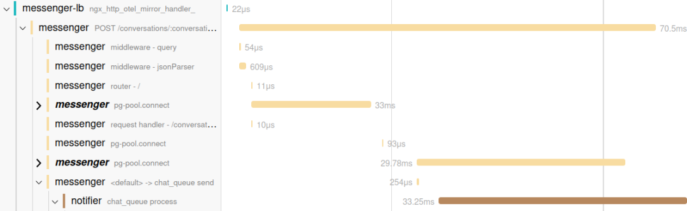

### 设置自定义 span

在这一部分中，您将首次接触到应用代码。自动埋点无需更改应用便可生成大量信息，但有些见解必须通过对业务逻辑的特定部分进行监测才能获取。

对于您正在监测的新消息流，一个示例是跟踪向消息接收者发送通知。

1.打开**通知器**代码库的 **app 目录下的 index.mjs**。该文件包含服务的所有业务逻辑。在文件顶部的 **import 语句列表的末尾添加以下行**：

```
import { trace } from "@opentelemetry/api";
```

2.替换该代码（在文件中的第 91 行左右）：

```
for (let pref of preferences) {
  console.log(
    `Sending notification of new message via ${pref.address_type} to ${pref.address}`
  );
}
```

用以下代码替换上文:

```
const tracer = trace.getTracer("notifier"); // 1
tracer.startActiveSpan( // 2
  "notification.send_all",
  {
    attributes: {
      user_id: msg.user_id,
    },
  },
  (parentSpan) => {
    for (let pref of preferences) {
      tracer.startActiveSpan(  // 3
        "notification.send",
        {
          attributes: { // 4
            notification_type: pref.address_type,
            user_id: pref.user_id,
          },
        },
        (span) => {
          console.log(
            `Sending notification of new message via ${pref.address_type} to ${pref.address}`
          );
          span.end(); // 5
        }
      );
    }
    parentSpan.end(); // 6
  }
);
```

新代码会执行以下操作：

* 获取 tracer，它是一个全局对象，用于与 OTel 链路追踪进行交互。
* 开启一个名为 `notification.send_all` 的新的父 span，并设置 `user_id` 属性以识别消息的发送者。
* 进入一个循环，其中列举了接收者的通知偏好，并在 `notification.send_all` 下新建了一个名为 `notification.send` 的子 `span。每个通知都会生成一个新 span。
* 为子 span 设置更多的属性：
* notification_type——短信或电子邮件之一
* user_id——通知接收用户的 ID
* 依次关闭每个子 `notification.send`。
* 关闭父 `notification.send_all`。

```
^c
node --import ./tracing.mjs index.mjs
```

4 等待大约十秒钟，然后在客户端终端发送一条新消息：

```
curl -X POST \
 -H "User-Id: 2" \
 -H "Content-Type: application/json" \
 -d '{"content": "This is the second message"}' \
 'http://localhost:8085/conversations/1/messages'
```

5 在 Jaeger 用户界面中再检查通知器 span。您会看到父 span 和两个子 span，每个 span 都有“发送通知”操作：

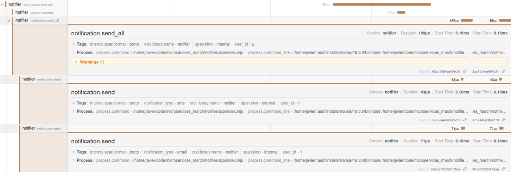

现在您可以完全实现第一个和第二个目标，因为您可以看到一个请求在新的消息流中所经历的所有步骤。在每个 span 上所花费的时间能够暴露这些步骤之间的任何延迟。

### 确认信使和通知器正在处理同一个事件

如欲全面了解消息流，您还需要确认以下一点。通知器服务处理的事件实际上是信使服务派发的事件吗？

您不必做出任何明确的修改便可连接这两个追踪，但您也不能盲目相信自动埋点。

考虑到这一点，您可以添加一些快速调试代码，以验证在 NGINX 服务中启动的追踪确实与通知器服务所用的追踪相同（具有相同的追踪 ID）。

1.打开信使代码库的 app 目录下的 index.mjs 文件，并进行以下修改：

在顶部的导入语句列表的末尾添加以下代码：

```
import { trace } from "@opentelemetry/api";
```

**在现有的黑色行下面添加橙色高亮显示的代码：**

```
async function createMessageInConversation(req, res) {
  const tracer = trace.getActiveSpan();
  console.log("TRACE_ID: ", tracer.spanContext().traceId);
```

新行列出了信使中处理新消息创建的函数内的 `TRACE_ID`。

2.打开通知器代码库的 app 目录下的 index.mjs 文件，并在现有的黑色行下面添加橙色高亮显示的行：

```
export async function handleMessageConsume(channel, msg, handlers) {
  console.log("RABBIT_MQ_MESSAGE: ", msg);
```

新行列出了通知服务接收的 AMQP 事件的全部内容。

```
^c
node --import ./tracing.mjs index.mjs
```

4 等待大约 10 秒钟，然后在客户端终端上再次发送信息：

```
curl -X POST \
 -H "User-Id: 2" \
 -H "Content-Type: application/json" \
 -d '{"content": "This is the second message"}' \
 'http://localhost:8085/conversations/1/messages'
 ```
 
5 查看信使服务和通知器服务的日志。在信使服务日志中，如下所示的一行报告了消息的链路追踪 ID（当您自己操作本教程步骤时，实际 ID 会有所不同）：
 
 ```
 TRACE_ID:  29377a9b546c50be629c8e64409bbfb5
```

6 同样地，通知器服务日志在如下所示的输出中报告链路追踪 ID：

```

_spanContext: {
  traceId: '29377a9b546c50be629c8e64409bbfb5',
  spanId: 'a94e9462a39e6dbf',
  traceFlags: 1,
  traceState: undefined
},
```

7 在控制台中链路追踪 ID 是匹配的，但最后您可以将其与 Jaeger 用户界面中的链路追踪 ID 进行比较。

在相关链路追踪 ID 端点（您的端点会有所不同，但在本例中是 http://localhost:16686/trace/29377a9b546c50be629c8e64409bbfb5），打开用户界面，查看整个链路追踪。

Jaeger 链路追踪确认：

* 在派发事件时，信使服务中的 AMQP 自动埋点添加了这个链路追踪 ID 作为元数据的一部分。
* 通知器服务中的 AMQP 自动埋点需要该元数据并相应地设置了链路追踪上下文。

注：在实际生产系统中，一旦确认流程按预期运行，即可删除您在本部分中添加的代码。

## 资源清理

整个教程下来，您创建了不少容器和镜像！使用以下指令来将其删除。

删除任何正在运行的 Docker 容器：

```
docker rm $(docker stop messenger-lb)
```

删除平台服务以及信使与通知器数据库服务：

```
cd ~/microservices-march/platform && docker compose down
cd ~/microservices-march/notifier && docker compose down
cd ~/microservices-march/messenger && docker compose down
```

## 后续步骤

* 在一个 NGINX 反向代理和两个 Node.js 服务中设置了 OTel 埋点。
* 以严谨的眼光审视了 OTel 自动埋点提供的数据，并增添了一些缺失的遥测数据，以实现 OTel 实验的目标：
	* 在不直接更改任何应用代码的情况下，对特定请求在消息传递系统中的经历获得了清晰的视图。
您确认了在正常情况下消息流可在五秒内端到端执行完毕。
	* 确认了在正常情况下消息流可在五秒内端到端执行完毕。


