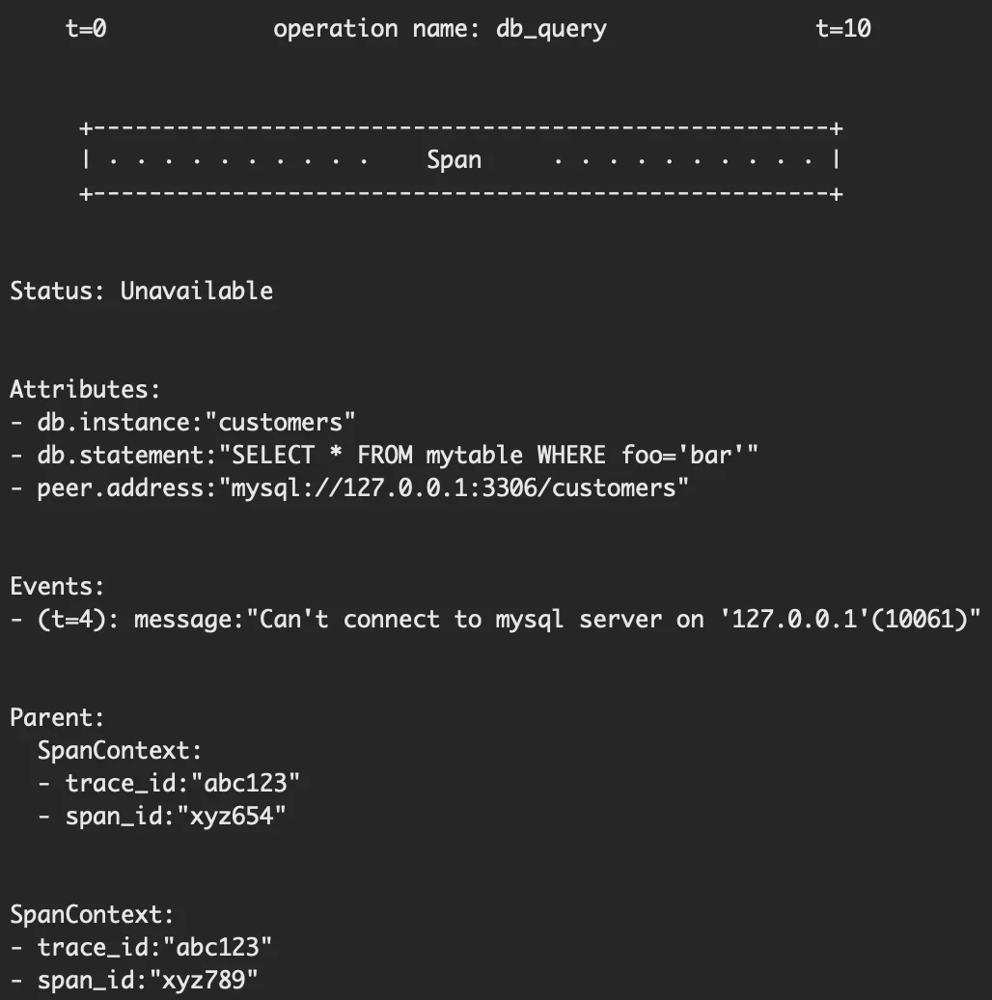
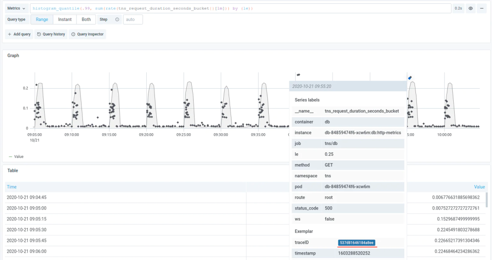

# **4 聊聊可观测性之数据模型**

但是管理容器是一件复杂的事情，后来出现了 Kubernetes，成为了事实上的容器管理标准，目前各大公司都在使用 Kubernetes。

因为容器和 Kubernetes 降低了服务（应用）的部署和升级成本，所以催生了「微服务」的概念，服务从「单体复杂服务」向「多个简单服务」演变，在之前，需要着重考虑服务内的架构设计，单个服务对外提供尽可能多的能力，而在微服务中，会直接把单个服务拆分成多个服务，服务之间用 API 调用。

在微服务中，架构设计的重要性降低，API 设计的重要性提高。

另外，拆分出微服务后，编程的难度事实上降低了，对编程人员的要求也降低了。

这说明一个事实，随着基础设施的不断发展，会有越来越多的「编程能力」沉淀成基础设施，使编程的难度不断降低：软件开发不断向简单的方式发展。

但是，随着微服务的发展，服务变得太多了，管理负责度又上升了，比如怎么去解决服务发现的问题、怎么控制流量、服务之间怎么做隔离，服务状态怎么观测等等。**这时候又出现了「服务治理」的概念，关于服务治理，有一个新的词：Service Mesh，现在事实标准是 Istio**。

## 概述

可观测性是为了应对微服务的复杂场景下发明出来的一个词，本质上是为了衡量系统运行的状态，可观测性是服务治理的一个维度，和功能性、可测试性、可运维性一样。

**一般常说可观测性包含三个度量角度：Metric、Logging、Tracing，其实还有一个：Profiling**。

* Metric：**指标，对系统中某一类信息的聚合统计，比如 QPS、延迟、错误率等**。
* Logging：日志，对系统所做行为的一种记录，它是离散的，没有相关性，为了区分这种记录的重要程度，会分级别（DEBUG、INFO、WARN、ERROR、FATAL）。
* Tracing：**调用链，它反映的是请求经过某个组件的运行情况，经过组件的数据叫做 Span**，Span 可以体现经过组件的状态、一些关键属性和事件、上下文信息。**Span 之间通过 Trace ID 关联**。
* **Profiling：一般叫做 Continuous Profiling，持续分析，它反映的是程序内部的运行状态，比如栈调用、执行时间等**。可以把 Profiling 可视化成火焰图方面分析问题。

**般来说，基于这些度量处理故障的流程是：Metric → Tracing → Logging → Profiling**

* **根据 Metric 配置的告警策略发现问题**，
* **基于 Tracing 查看是哪个组件出问题**，
* **基于 Logging 查看组件的日志**，
* **Profiling 分析组件具体的故障或性能问题**。

## 数据模型

在 Tracing 领域，之前有两个项目，一个是 OpenTracing，它是一个规范，Jaeger 就是基于 OpenTracing 的开源实现，另一个是 OpenCensus，它是 Google 开源的度量工具。**这两个项目功能高度重合，在 CNCF 主导下合并成了 OpenTelemetry，而 OpenTracing 和 OpenCensus 也不再维护**。

当然 OpenTelemetry 不止做 Tracing，**还覆盖 Metric 和 Logging**，**它的目标是统一可观测性的标准协议，包括数据模型、API 规范、多语言 SDK、采集器**。

OpenTelemetry 只做统一的协议和规范，具体数据的后端存储和展示不是它的范围。**协议和规范是可观测性对外暴露的「接口」，它的统一对于使用方来说是巨大的好处，目前来看，OpenTelemetry 未来会成为事实标准**。

**<mark>为了对接不同的后端实现，OpenTelemetry 提供了各种 Exporter，比如为对接 Prometheus 提供了 Prometheus Exporter，对接 Cortex 和 Thanos 提供了 Prometheus Remote Write Exporter，对接 Loki 提供了 Loki Exporter，对接 Jaeger 提供了 Jaeger gRPC Exporter。</mark>**

* Metric 我们使用分布式 Prometheus 方案 Cortex，数据模型和 Prometheus 一致
* Logging 我们使用 Loki
* **Tracing 我们使用 Grafana Tempo，Tempo 本身兼容 Zipkin、Jaeger、OpenTelemetry 等协议，所以 Tracing 直接采用 OpenTelemetry 的数据模型**
* Profiling 的后端实现基本可以复用 Loki，数据模型也和 Logging 类似

先看 Metric，它的数据模型：LabelSet + Timestamp + Number

* LabelSet 就是 Series，是若干个 label name / value 组合，指标名称也是一个 label name / value。
* Timestamp 是时间戳，精度是毫米。
* Number 是数值，类型是 float64。

下面是一个 Metric 例子：


另外，Prometheus 内置几种 Metric 类型，包括 Counter、Gauge、Histogram、Summary，

* Counter 是自增的，
* `Gauge` 可增可减，
* `Histogram` 是直方图，
* `Summary` 是摘要，
* **Histogram 和 Summary 区别是 Histogram 需要通过 `_bucket` 来计算 P 值，而 Summary 在客户端直接计算好 P 值，直接存储即可。**

另外，Prometheus 还有很多内置函数，来做 Metric 的聚合，这里不再赘述。

**再看 Logging，数据模型：LabelSet + Timestamp + String**

和 Metric 类似，只是 Number 换成了 String，Timestamp 精度是纳秒。

在 Loki 中，使用 Logql 语法查询日志（和 Promql 类似），下面是一个例子

```
{container="query-frontend",namespace="loki-dev"} |= "metrics.go" | logfmt | duration > 10s and throughput_mb < 500
```

下一个是 Tracing，Tracing 比较复杂：**Operation Name + Start / End Timestamp + Attributes + Events + Parent + SpanContext**


* Operation Name：操作名
* Start / End Timestamp：开始和结束时间
* Attributes：KV 对，包括 Status（比如 OK、Cancelled、Permission Denied）、
* SpanKind（CLIENT、SERVER、PRODUCER、CONSUMER、INTERNAL 等）、自定义信息等

* Events：若干个元组列表，每个元组包括 timestamp、name、Attributes，用于记录一系列重要事件
* Parent 包含父亲的 Span ID、Trace ID
* SpanContext 包含自身的 Span ID、Trace ID

下面是一个例子：



最后看 Profiling，数据模型：**LabelSet + Timestamp + []byte**

**Profiling 的数据格式是 protocol buffers，所以用 []byte。**

上面介绍了四种数据模型，其实在实际场景中，它们之间也会互相融合，下面说几种常见的融合场景。

**第一，Metric 和 Tracing 融合。**

这里要用到 Exemplar，Exemplar 最早被用在 Google 的 StackDriver 中，后面成为了 OpenMetrics 标准的一部分，在应用通过标准 /metrics 端口暴露 Metric 时，Exemplar 信息也会被一起暴露。

Prometheus 目前已支持 Exemplar，Prometheus 通过 /metrics 采集数据时也会把 Exemplar 存储下来，并暴露单独的 API 来获取 Exemplar 信息。

```
$ curl -g 'http://localhost:9090/api/v1/query_exemplar?query=test_exemplar_metric_total&start=2020-09-14T15:22:25.479Z&end=020-09-14T15:23:25.479Z'
{
    "status": "success",
    "data": [
        {
            "seriesLabels": {
                "__name__": "test_exemplar_metric_total",
                "instance": "localhost:8090",
                "job": "prometheus",
                "service": "bar"
            },
            "exemplars": [
                {
                    "labels": {
                        "traceID": "EpTxMJ40fUus7aGY"
                    },
                    "value": 6,
                    "timestamp": 1600096945479,
                    "hasTimestamp": true
                }
            ]
        },
    ]
}
```

借助 Exemplar，可以把 Trace ID 作为一个 label pair 加入 Exemplar 中，从而可以在Prometheus 查询到 Tracing 的信息，从而将 Metric 和 Tracing 连接起来。




**第二，Logging 和 Tracing 融合。**

只要使用带有 Tracing 库的 SDK，每个请求都会带上 Trace ID，并把这些 ID 打在日志中。

通过 Trace ID 可以定位到一个唯一的 Tracing， 跳转到 Tracing 系统的 UI 进行查询。

**第三，Metric 和 Profiling 融合。**

基于 Exemplar，把 Profiling ID 也放入 Exemplar 中，Prometheus 支持存储和查询即可。

至于展示，可以在 Grafana 上开发一个 pprof 的 Panel 插件，这样可以展示 Profiling。

