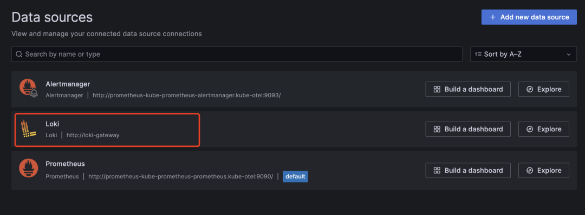
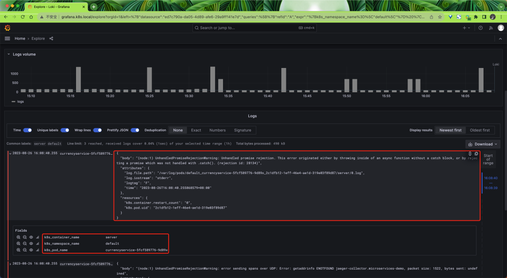
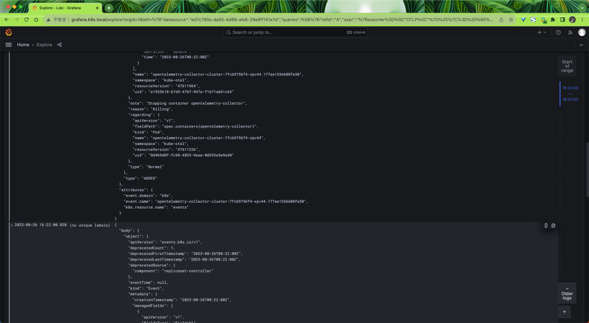

# 5 使用 OpenTelemetry Collector 收集 Kubernetes 日志数据

### 安装 Loki


首先我们需要部署 Loki 来收集[日志数据](https://cloud.tencent.com/solution/cloudlog?from_column=20065&from=20065)，同样我们这里使用 Helm Chart 来快速部署，不过需要注意同样不需要部署任何日志采集器，因为我们将使用 OpenTelemetry Collector 来收集日志数据，然后再将其发送到 Loki 中。

```
$ helm repo add grafana https://grafana.github.io/helm-chart
$ helm repo update
```

我们这里创建一个 loki-values.yaml 文件来配置 Loki Helm Chart：

```
# loki-values.yaml
loki:
  commonConfig:
    replication_factor: 1
  auth_enabled: false
  storage:
    type: "filesystem"
singleBinary:
  replicas: 1
  persistence:
    enabled: true
    size: 10Gi
    storageClass: cfsauto
monitoring:
  lokiCanary:
    enabled: false
  selfMonitoring:
    grafanaAgent:
      installOperator: false
test:
  enabled: false
gateway:
  ingress:
    enabled: true
    ingressClassName: nginx
    tls: []
    hosts:
      - host: loki.k8s.local
        paths:
          - path: /
            pathType: Prefix
```

然后直接使用下面的命令一键部署 Loki 即可：

```
$ helm upgrade --install loki grafana/loki -f loki-values.yaml --namespace kube-otel

$ kubectl get pods -n kube-otel -l app.kubernetes.io/instance=loki
NAME                            READY   STATUS    RESTARTS   AGE
loki-0                          1/1     Running   0          3m52s
loki-gateway-5ffc9fbbf5-m5q75   1/1     Running   0          8m42s

$ kubectl get ingress -n kube-otel
NAME                 CLASS   HOSTS               ADDRESS       PORTS   AGE
loki-gateway         nginx   loki.k8s.local      10.98.12.94   80      11m
```

### 启用 filelog 接收器

接下来我们就需要配置 OpenTelemetry Collector 来将日志数据发送到 Loki 中，首先更新 `otel-collector-ds-values.yaml` 文件，我们需要添加一个 Loki 的导出器，并开启 `filelogreceiver` 接收器

**`opentelemetry-collector`**

```
# otel-collector-ds-values.yaml
mode: daemonset

presets:
  hostMetrics:
    enabled: true
  kubernetesAttributes:
    enabled: true
  kubeletMetrics:
    enabled: true
  # 启用 filelogreceiver 收集器
  logsCollection:
    enabled: true

config:
  exporters:
    loki:
      endpoint: http://loki-gateway/loki/api/v1/push
      timeout: 10s # 超时时间
      read_buffer_size: 200
      write_buffer_size: 100
      retry_on_failure: # 配置重试
        enabled: true
        initial_interval: 10s # 初始间隔
        max_interval: 60s # 最大间隔
        max_elapsed_time: 10m # 最大时间
      default_labels_enabled:
        exporter: false

  processors:
    resource:
      attributes:
        - action: insert
          key: loki.resource.labels
          value: k8s.namespace.name,k8s.pod.name,k8s.container.name

  service:
    pipelines:
      logs:
        exporters:
          - loki
        processors:
          - memory_limiter
          - k8sattributes
          - resource
          - batch
```

然后重新更新 OpenTelemetry Collector DaemonSet：

```
$ helm upgrade --install opentelemetry-collector ./opentelemetry-collector -f otel-ds-values.yaml --namespace kube-otel --create-namespace
```

同样更新后查看完整的配置信息，使用命令 `kubectl get cm -n opentelemetry-collector-agent -oyaml`：

```
exporters:
  logging:
    loglevel: debug
  loki:
    endpoint: http://loki-gateway/loki/api/v1/push
    timeout: 10s # 超时时间
    read_buffer_size: 200
    write_buffer_size: 100
    retry_on_failure: # 配置重试
      enabled: true
      initial_interval: 10s # 初始间隔
      max_interval: 60s # 最大间隔
      max_elapsed_time: 10m # 最大时间
    default_labels_enabled:
      exporter: false
extensions:
  health_check: {}
  memory_ballast:
    size_in_percentage: 40
processors:
  batch: {}
  k8sattributes:
    extract:
      metadata:
        - k8s.namespace.name
        - k8s.deployment.name
        - k8s.statefulset.name
        - k8s.daemonset.name
        - k8s.cronjob.name
        - k8s.job.name
        - k8s.node.name
        - k8s.pod.name
        - k8s.pod.uid
        - k8s.pod.start_time
    filter:
      node_from_env_var: K8S_NODE_NAME
    passthrough: false
    pod_association:
      - sources:
          - from: resource_attribute
            name: k8s.pod.ip
      - sources:
          - from: resource_attribute
            name: k8s.pod.uid
      - sources:
          - from: connection
  memory_limiter:
    check_interval: 5s
    limit_percentage: 80
    spike_limit_percentage: 25
  resource:
    attributes:
      - action: insert
        key: loki.resource.labels
        value: k8s.namespace.name,k8s.pod.name,k8s.container.name
receivers:
  filelog:
    exclude:
      - /var/log/pods/kube-otel_opentelemetry-collector*_*/opentelemetry-collector/*.log
    include:
      - /var/log/pods/*/*/*.log
    include_file_name: false
    include_file_path: true
    operators:
      - id: get-format
        routes:
          - expr: body matches "^\\{"
            output: parser-docker
          - expr: body matches "^[^ Z]+ "
            output: parser-crio
          - expr: body matches "^[^ Z]+Z"
            output: parser-containerd
        type: router
      - id: parser-crio
        regex: ^(?P<time>[^ Z]+) (?P<stream>stdout|stderr) (?P<logtag>[^ ]*) ?(?P<log>.*)$
        timestamp:
          layout: 2006-01-02T15:04:05.999999999Z07:00
          layout_type: gotime
          parse_from: attributes.time
        type: regex_parser
      - combine_field: attributes.log
        combine_with: ""
        id: crio-recombine
        is_last_entry: attributes.logtag == 'F'
        max_log_size: 102400
        output: extract_metadata_from_filepath
        source_identifier: attributes["log.file.path"]
        type: recombine
      - id: parser-containerd
        regex: ^(?P<time>[^ ^Z]+Z) (?P<stream>stdout|stderr) (?P<logtag>[^ ]*) ?(?P<log>.*)$
        timestamp:
          layout: "%Y-%m-%dT%H:%M:%S.%LZ"
          parse_from: attributes.time
        type: regex_parser
      - combine_field: attributes.log
        combine_with: ""
        id: containerd-recombine
        is_last_entry: attributes.logtag == 'F'
        max_log_size: 102400
        output: extract_metadata_from_filepath
        source_identifier: attributes["log.file.path"]
        type: recombine
      - id: parser-docker
        output: extract_metadata_from_filepath
        timestamp:
          layout: "%Y-%m-%dT%H:%M:%S.%LZ"
          parse_from: attributes.time
        type: json_parser
      - id: extract_metadata_from_filepath
        parse_from: attributes["log.file.path"]
        regex: ^.*\/(?P<namespace>[^_]+)_(?P<pod_name>[^_]+)_(?P<uid>[a-f0-9\-]+)\/(?P<container_name>[^\._]+)\/(?P<restart_count>\d+)\.log$
        type: regex_parser
      - from: attributes.stream
        to: attributes["log.iostream"]
        type: move
      - from: attributes.container_name
        to: resource["k8s.container.name"]
        type: move
      - from: attributes.namespace
        to: resource["k8s.namespace.name"]
        type: move
      - from: attributes.pod_name
        to: resource["k8s.pod.name"]
        type: move
      - from: attributes.restart_count
        to: resource["k8s.container.restart_count"]
        type: move
      - from: attributes.uid
        to: resource["k8s.pod.uid"]
        type: move
      - from: attributes.log
        to: body
        type: move
    start_at: beginning
  otlp:
    protocols:
      grpc:
        endpoint: ${env:MY_POD_IP}:4317
      http:
        endpoint: ${env:MY_POD_IP}:4318
service:
  extensions:
    - health_check
    - memory_ballast
  pipelines:
    logs:
      exporters:
        - loki
      processors:
        - memory_limiter
        - k8sattributes
        - resource
        - batch
      receivers:
        - otlp
        - filelog
# 同样只保留了和 logs 相关的配置，其他省略......
```


除非通过 `default_labels_enabled` 设置禁用，默认标签始终会被设置。

* job=service.namespace/service.name
* instance=service.instance.id
* exporter=OTLP
* level=severity

如果 service.name 和 service.namespace 存在，那么设置 `job=service.namespace/service.name`。如果 `service.name` 存在且 `service.namespace` 不存在，则会设置 `job=service.name`。

如果 `service.name` 不存在且 `service.namespace` 存在，则不会设置 job 标签。如果存在 `service.instance.id` 则设置 `instance=service.instance.id`。如果 `service.instance.id` 不存在，则不设置 `instance` 标签。

我们这里的完整配置如下：

```
loki:
  endpoint: http://loki-gateway/loki/api/v1/push
  timeout: 10s # 超时时间
  read_buffer_size: 200
  write_buffer_size: 100
  retry_on_failure: # 配置重试
    enabled: true
    initial_interval: 10s # 初始间隔
    max_interval: 60s # 最大间隔
    max_elapsed_time: 10m # 最大时间
```

我们这里配置了超时时间，读写缓冲区大小，发送队列，重试等。

`read_buffer_size` 和 `write_buffer_size` 字段分别指定了 OpenTelemetry 导出器的读取和写入缓冲区的大小。这些缓冲区用于在发送数据之前缓存数据，以提高发送效率和可靠性。

`read_buffer_size` 字段指定了导出器从数据源读取数据时使用的缓冲区大小。如果数据源产生的数据量超过了缓冲区的大小，导出器将分批读取数据并将其缓存到缓冲区中，直到缓冲区被填满或数据源没有更多数据为止。

`write_buffer_size `字段指定了导出器将指标数据写入目标时使用的缓冲区大小。如果导出器产生的数据量超过了缓冲区的大小，导出器将分批将数据写入目标，并将其缓存到缓冲区中，直到缓冲区被填满或目标不可用为止。

通过配置这些缓冲区的大小，您可以控制 OpenTelemetry 导出器的性能和可靠性。如果您的数据源产生的数据量很大，可以增加 `read_buffer_size` 和 `write_buffer_size` 的大小，以提高导出器的吞吐量和效率。如果您的目标不太稳定或网络不太可靠，可以减小 `write_buffer_size` 的大小，以减少数据丢失的风险。

另外添加了一个resource的处理器，将 `k8s.namespace.name`、`k8s.pod.name`、`k8s.container.name` 转换为 Loki 标签，这样我们就可以在 Loki 中对其进行索引了。

```
resource:
  attributes:
    - action: insert
      key: loki.resource.labels
      value: k8s.namespace.name,k8s.pod.name,k8s.container.name
```

### filelog 接收器

**该接收器用于从文件中收集并解析日志数据，它会从指定的文件中读取日志数据，然后将其发送到 OpenTelemetry Collector 中**。

我们这里对该接收器的配置如下所示：

```
filelog:
  exclude:
    - /var/log/pods/kube-otel_opentelemetry-collector*_*/opentelemetry-collector/*.log
  include:
    - /var/log/pods/*/*/*.log
  include_file_name: false
  include_file_path: true
  operators:
    - id: get-format
      routes:
        - expr: body matches "^\\{"
          output: parser-docker
        - expr: body matches "^[^ Z]+ "
          output: parser-crio
        - expr: body matches "^[^ Z]+Z"
          output: parser-containerd
      type: router
    - id: parser-crio
      regex: ^(?P<time>[^ Z]+) (?P<stream>stdout|stderr) (?P<logtag>[^ ]*) ?(?P<log>.*)$
      timestamp:
        layout: 2006-01-02T15:04:05.999999999Z07:00
        layout_type: gotime
        parse_from: attributes.time
      type: regex_parser
    - combine_field: attributes.log
      combine_with: ""
      id: crio-recombine
      is_last_entry: attributes.logtag == 'F'
      max_log_size: 102400
      output: extract_metadata_from_filepath
      source_identifier: attributes["log.file.path"]
      type: recombine
    - id: parser-containerd
      regex: ^(?P<time>[^ ^Z]+Z) (?P<stream>stdout|stderr) (?P<logtag>[^ ]*) ?(?P<log>.*)$
      timestamp:
        layout: "%Y-%m-%dT%H:%M:%S.%LZ"
        parse_from: attributes.time
      type: regex_parser
    - combine_field: attributes.log
      combine_with: ""
      id: containerd-recombine
      is_last_entry: attributes.logtag == 'F'
      max_log_size: 102400
      output: extract_metadata_from_filepath
      source_identifier: attributes["log.file.path"]
      type: recombine
    - id: parser-docker
      output: extract_metadata_from_filepath
      timestamp:
        layout: "%Y-%m-%dT%H:%M:%S.%LZ"
        parse_from: attributes.time
      type: json_parser
    - id: extract_metadata_from_filepath
      parse_from: attributes["log.file.path"]
      regex: ^.*\/(?P<namespace>[^_]+)_(?P<pod_name>[^_]+)_(?P<uid>[a-f0-9\-]+)\/(?P<container_name>[^\._]+)\/(?P<restart_count>\d+)\.log$
      type: regex_parser
    - from: attributes.stream
      to: attributes["log.iostream"]
      type: move
    - from: attributes.container_name
      to: resource["k8s.container.name"]
      type: move
    - from: attributes.namespace
      to: resource["k8s.namespace.name"]
      type: move
    - from: attributes.pod_name
      to: resource["k8s.pod.name"]
      type: move
    - from: attributes.restart_count
      to: resource["k8s.container.restart_count"]
      type: move
    - from: attributes.uid
      to: resource["k8s.pod.uid"]
      type: move
    - from: attributes.log
      to: body
      type: move
  start_at: beginning
```

可以看到配置非常长，首先通过 `exclude` 排除一些不需要收集的日志文件，然后通过 `include` 指定了需要收集的日志文件，由于我们的 Kubernetes 集群是基于 Containerd 容器运行时的，所以采集的日志目录为 `/var/log/pods/*/*/*.log`，然后通过 `include_file_path` 来指定是否将文件路径添加为属性 `log.file.path`，`include_file_name` 指定是否将文件名添加为属性 `log.file.name`。

`start_at` 表示在启动时，从文件的哪个位置开始读取日志。选项有 beginning 或 end，默认为 end。

然后就是最重要的 operators 属性，用来指定如何处理日志文件，运算符是日志处理的最基本单元。每个运算符都完成一个单一的责任，比如从文件中读取行，或者从字段中解析 JSON。然后，这些运算符被链接在一起，形成一个管道，以实现所需的结果。

例如用户可以使用 `file_input` 操作符从文件中读取日志行。然后，这个操作的结果可以发送到 `regex_parser` 操作符，根据正则表达式创建字段。最后，这些结果可以发送到 `file_output` 操作符，将日志写入到磁盘上的文件中。

**我们这里首先配置了一个 `router` 操作符**：

```
id: get-format
routes:
  - expr: body matches "^\\{"
    output: parser-docker
  - expr: body matches "^[^ Z]+ "
    output: parser-crio
  - expr: body matches "^[^ Z]+Z"
    output: parser-containerd
type: router
```

该操作符允许根据日志内容动态路由日志，我们这里是 Containerd 的容器运行时，产生的日志数据可以匹配 `body matches "^[^ Z]+Z"`，然后将数据路由到 `parser-containerd` 操作符。

```
id: parser-containerd
regex: ^(?P<time>[^ ^Z]+Z) (?P<stream>stdout|stderr) (?P<logtag>[^ ]*) ?(?P<log>.*)$
timestamp:
  layout: "%Y-%m-%dT%H:%M:%S.%LZ"
  parse_from: attributes.time
type: regex_parser
```

`parser-containerd` 是一个 `regex_parser `操作符，它使用指定的正则表达式来解析前面路由过来的日志数据，然后会将结果存储在 time、stream、logtag、log 等属性中，并格式化 timestamp 时间戳。

接下来再通过 recombine 操作符将连续的日志组合成单个日志。

```
combine_field: attributes.log
combine_with: ""
id: containerd-recombine
is_last_entry: attributes.logtag == 'F'
max_log_size: 102400
output: extract_metadata_from_filepath
source_identifier: attributes["log.file.path"]
type: recombine
```

经过上面处理后进入` extract_metadata_from_filepath` 这个操作符，该操作符使用正则表达式从文件路径中提取元数据，然后将其存储在 namespace、`pod_name`、uid、`container_name`、`restart_count` 等属性中。

```
id: extract_metadata_from_filepath
parse_from: attributes["log.file.path"]
regex: ^.*\/(?P<namespace>[^_]+)_(?P<pod_name>[^_]+)_(?P<uid>[a-f0-9\-]+)\/(?P<container_name>[^\._]+)\/(?P<restart_count>\d+)\.log$
type: regex_parser
```

接下来就是通过 move 操作符将一个字段从一个位置移动（或重命名）到另一个位置。

```
- from: attributes.stream
  to: attributes["log.iostream"]
  type: move
- from: attributes.container_name
  to: resource["k8s.container.name"]
  type: move
- from: attributes.namespace
  to: resource["k8s.namespace.name"]
  type: move
- from: attributes.pod_name
  to: resource["k8s.pod.name"]
  type: move
- from: attributes.restart_count
  to: resource["k8s.container.restart_count"]
  type: move
- from: attributes.uid
  to: resource["k8s.pod.uid"]
  type: move
- from: attributes.log
  to: body
  type: move
```

最后我们可以将 Loki 数据源添加到 Grafana 中：



Loki 数据源

然后在 Explorer 页面切换到 Loki 数据源下面就可以看到 Loki 中的日志数据了：



**Loki 日志**

启用 k8sobject 接收器

同样对于 Gateway 模式的采集器我们还可以去开启 k8sobject 接收器来采集 Kubernetes Events 数据，然后更新 `otel-collector-deploy-values.yaml `文件：

```
# otel-collector-deploy-values.yaml
mode: deployment

# 我们只需要一个收集器 - 多了就会产生重复数据
replicaCount: 1

presets:
  clusterMetrics:
    enabled: true
  kubernetesEvents:
    enabled: true

config:
  exporters:
    loki:
      endpoint: http://loki-gateway/loki/api/v1/push
      timeout: 10s # 超时时间
      read_buffer_size: 200
      write_buffer_size: 100
      retry_on_failure: # 配置重试
        enabled: true
        initial_interval: 10s # 初始间隔
        max_interval: 60s # 最大间隔
        max_elapsed_time: 10m # 最大时间

  service:
    pipelines:
      logs:
        exporters:
          - loki
```

然后重新更新 OpenTelemetry Collector Deployment：

```
$ helm upgrade --install opentelemetry-collector-cluster ./opentelemetry-collector -f otel-collector-deploy-values.yaml --namespace kube-otel --create-namespace
```

这里我们开启了 kubernetesEvents 预设，对应的配置如下所示：

```
k8sobjects:
  objects:
    - group: events.k8s.io
      mode: watch
      name: events
```


`k8sobjects` 接收器可以用来拉取或 Watch Kubernetes API 服务器中的对象，我们这里通过 group、mode、name 来指定要拉取的 Kubernetes Events 对象。

最后我们也可以在 Loki 中查找到对应的 Events 日志数据。


