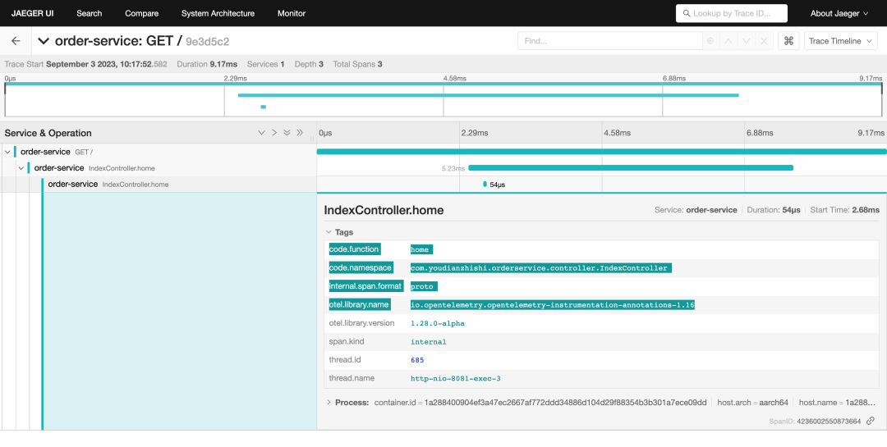
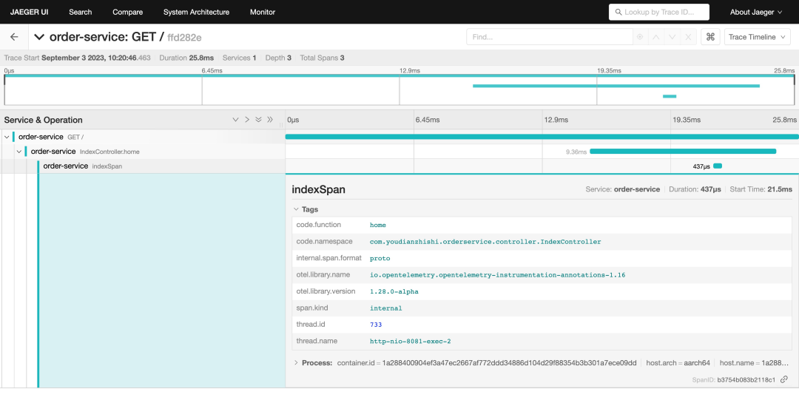
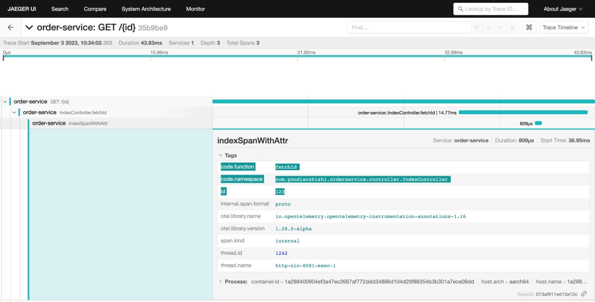
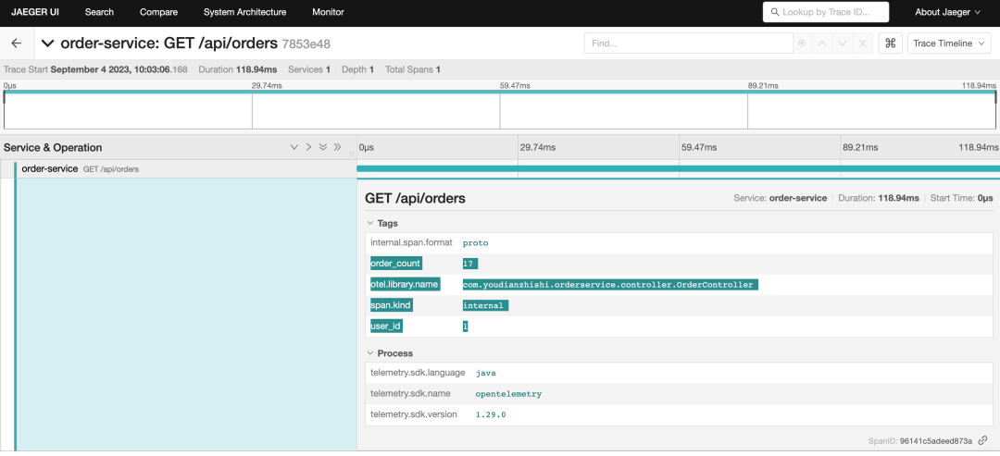
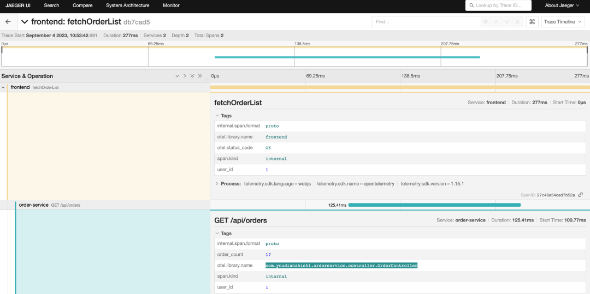
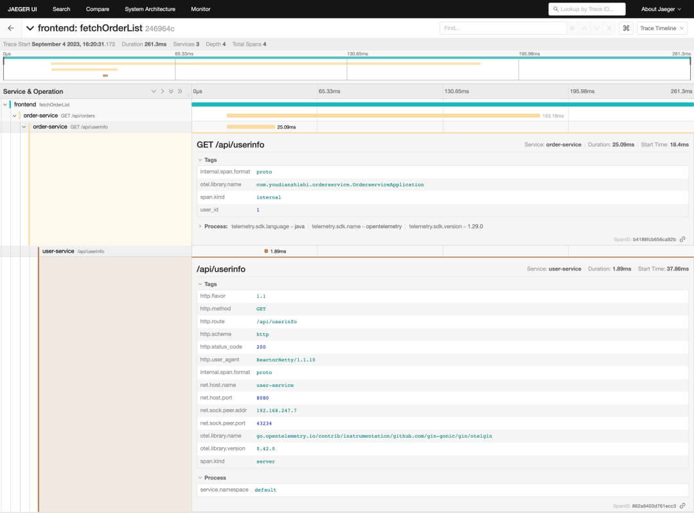
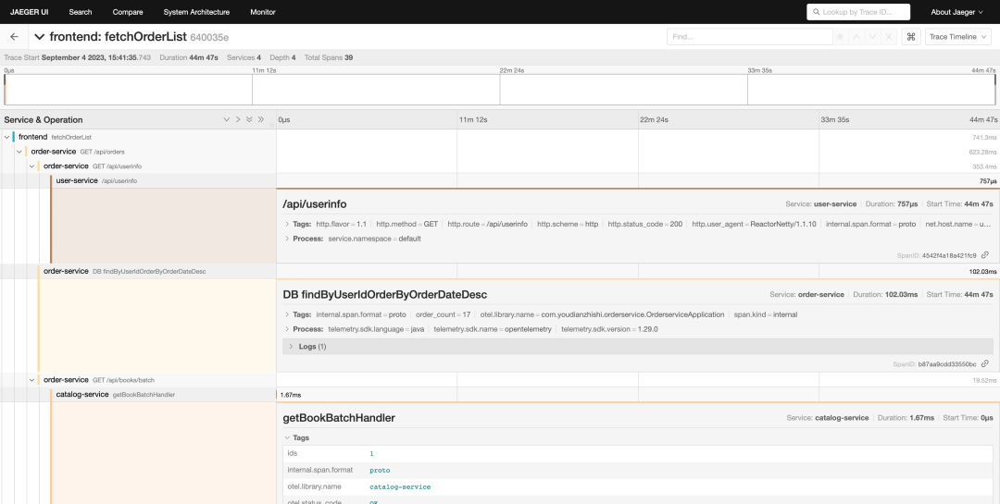

# 8 Java 应用通过 OpenTelemetry API 实现手动埋点


Java 应用可以通过 OpenTelemetry 提供的 Java agent 来实现自动埋点功能，在大多数场景下也完全足够了，但是有时候我们需要更加精细的控制，这时候我们就需要使用手动埋点的方式来实现了。

###  使用注解埋点

我们可以在 Java 应用通过手动埋点的方式来实现链路追踪，但如果我们不希望进行太多的代码更改，那么可以使用注解的方式来实现，OpenTelemetry 提供了一些注解来帮助我们实现手动埋点，比如 `@WithSpan`、`@SpanAttribute`。

首先我们需要添加依赖库 `opentelemetry-instrumentation-annotations`。

```
<dependencies>
  <dependency>
    <groupId>io.opentelemetry.instrumentation</groupId>
    <artifactId>opentelemetry-instrumentation-annotations</artifactId>
    <version>1.29.0</version>
  </dependency>
</dependencies>
```


开发人员可以使用 `@WithSpan` 注解来向 `OpenTelemetry` 自动检测发送信号，每当标记的方法被执行时都应创建一个新的 span。

比如我们在 Order Service 中的 `IndexController` 中添加一个 `@WithSpan `注解，代码如下所示：

```
// src/main/java/com/youdianzhishi/orderservice/controller/IndexController.java
package com.youdianzhishi.orderservice.controller;

// ......

import io.opentelemetry.instrumentation.annotations.WithSpan;


@RestController
@RequestMapping("/")
public class IndexController {
    @GetMapping
    @WithSpan
    public ResponseEntity<String> home(HttpServletRequest request) {
        return new ResponseEntity<>("Hello OpenTelemetry!", HttpStatus.OK);
    }
}
```

然后我们重建镜像，重新启动容器，当我们访问首页的时候就可以看到 Jaeger UI 中多了一个 IndexController.home 的 span 了。



每次应用程序调用有注解的方法时，它都会创建一个表示其持续时间并提供任何抛出异常的 span。默认情况下，span 名称是 `<className>.<methodName>`，当然也可以在注解中提供了一个名称作为参数，比如可以使用 `@WithSpan("indexSpan") `来指定 span 的名称，这样在 Jaeger UI 中就可以看到 `indexSpan` 的 span 了。



此外当为一个带注解的方法创建一个 span 时，可以通过使用 `@SpanAttribute` 注解来自动将方法调用的参数值添加为创建 span 的属性。

比如我们在 `IndexController` 中添加一个 `fetchId` 函数，并接收一个 id 参数，我们就可以使用 `@SpanAttribute` 注解来将接收的 `id `参数添加为 `indexSpanWithAttr` 这个 `span` 的属性，代码如下所示：

```
// src/main/java/com/youdianzhishi/orderservice/controller/IndexController.java
package com.youdianzhishi.orderservice.controller;

// ......

import io.opentelemetry.instrumentation.annotations.WithSpan;
import io.opentelemetry.instrumentation.annotations.SpanAttribute;


@RestController
@RequestMapping("/")
public class IndexController {
    @GetMapping
    @WithSpan("indexSpan")
    public ResponseEntity<String> home(HttpServletRequest request) {
        return new ResponseEntity<>("Hello OpenTelemetry!", HttpStatus.OK);
    }

    @GetMapping("/{id}")
    @WithSpan("indexSpanWithAttr")
    public ResponseEntity<String> fetchId(@SpanAttribute("id") @PathVariable Long id) {
        return new ResponseEntity<>("Hello OpenTelemetry：" + id, HttpStatus.OK);
    }
}
```

然后我们重建镜像，重新启动容器，当我们访问 `http://localhost:8081/123` 的时候就可以看到 Jaeger UI 中多了一个 `indexSpanWithAttr` 的 span 了，并且该 span 的属性中包含了我们传递的 id 参数。



### 使用 API 手动埋点


除了使用注解的方式来实现埋点之外，**我们还可以使用 OpenTelemetry 提供的 API 来实现手动埋点**，这样我们就可以更加精细的控制我们的 span 了，当然这样也会增加我们的代码量，但就不需要使用 `java agent` 了。

在 Java 应用中，要实现手动埋点，

* 首先第一步是获取 `OpenTelemetry` 接口的实例，我们需要尽早在应用程序中配置一个 `OpenTelemetrySdk` 的实例，我们可以使用 `OpenTelemetrySdk.builder()` 方法来完成这个操作。
* 然后可以通过返回的 `OpenTelemetrySdkBuilder` 实例获取与信号、跟踪和指标相关的提供程序，以构建 `OpenTelemetry` 实例。
* 我们可以使用 `SdkTracerProvider.builder() `和 `SdkMeterProvider.builder() `方法来构建 Provider。
* 此外还强烈建议将 Resource 实例定义为生成遥测数据的实体的表示；特别是 service.name 属性是最重要的遥测源标识信息的一部分。

```
<!-- pom.xml -->
<project>
    <dependencyManagement>
        <dependencies>
            <dependency>
                <groupId>io.opentelemetry</groupId>
                <artifactId>opentelemetry-bom</artifactId>
                <version>1.29.0</version>
                <type>pom</type>
                <scope>import</scope>
            </dependency>
        </dependencies>
    </dependencyManagement>

    <dependencies>
        <dependency>
            <groupId>io.opentelemetry</groupId>
            <artifactId>opentelemetry-api</artifactId>
        </dependency>
        <dependency>
            <groupId>io.opentelemetry</groupId>
            <artifactId>opentelemetry-sdk</artifactId>
        </dependency>
        <dependency>
            <groupId>io.opentelemetry</groupId>
            <artifactId>opentelemetry-exporter-otlp</artifactId>
        </dependency>
        <dependency>
            <groupId>io.opentelemetry</groupId>
            <artifactId>opentelemetry-semconv</artifactId>
            <version>1.29.0-alpha</version>
        </dependency>
    </dependencies>
</project>
```

在 `pom.xml `文件中添加了 `opentelemetry-api`、`opentelemetry-sdk`、`opentelemetry-exporter-otlp`、`opentelemetry-semconv `这几个依赖库，其中 `opentelemetry-semconv` 是用来定义一些常用的属性的，比如 `service.name`、`http.method`、`http.status_code` 等，当然现在我们就不需要 `opentelemetry-instrumentation-annotations` 这个依赖库了。

**在 Spring Boot 项目中，初始化 `OpenTelemetry` 的一种常见方法是使用 `@Configuration` 类**。

这样的类会在 Spring Boot 应用启动时自动运行，使得初始化工作更加集中和组织化。

我们这里创建一个如下所示的 OpenTelemetryConfig 类，代码如下所示：

```
// src/main/java/com/youdianzhishi/orderservice/config/OpenTelemetryConfig.java
package com.youdianzhishi.orderservice.config;

import io.opentelemetry.api.OpenTelemetry;
import io.opentelemetry.api.common.Attributes;
import io.opentelemetry.exporter.otlp.trace.OtlpGrpcSpanExporter;
import io.opentelemetry.sdk.OpenTelemetrySdk;
import io.opentelemetry.sdk.resources.Resource;
import io.opentelemetry.sdk.trace.SdkTracerProvider;
import io.opentelemetry.sdk.trace.export.SimpleSpanProcessor;
import io.opentelemetry.semconv.resource.attributes.ResourceAttributes;

import org.springframework.context.annotation.Bean;
import org.springframework.context.annotation.Configuration;
import org.springframework.core.annotation.Order;

@Configuration
@Order(2)
public class OpenTelemetryConfig {

    @Bean
    public OpenTelemetry openTelemetry() {
        GlobalOpenTelemetry.resetForTest(); // 初始化之前先重置 GlobalOpenTelemetry

        // 从环境变量中获取 OTLP Exporter 的地址
        String exporterEndpointFromEnv = System.getenv("OTLP_EXPORTER_ENDPOINT");
        String exporterEndpoint = exporterEndpointFromEnv != null ? exporterEndpointFromEnv
                : "http://otel-collector:4317";

        String serviceNameFromEnv = System.getenv("SERVICE_NAME");
        String serviceName = serviceNameFromEnv != null ? serviceNameFromEnv : "order-service";

        // 初始化 OTLP Exporter
        OtlpGrpcSpanExporter exporter = OtlpGrpcSpanExporter.builder()
                .setEndpoint(exporterEndpoint)
                .build();

        Resource resource = Resource.getDefault()
                .merge(Resource.create(Attributes.of(
                        ResourceAttributes.SERVICE_NAME, serviceName,
                        ResourceAttributes.TELEMETRY_SDK_LANGUAGE, "java")));

        // 初始化 TracerProvider
        SdkTracerProvider tracerProvider = SdkTracerProvider.builder()
                .addSpanProcessor(SimpleSpanProcessor.create(exporter))
                .setResource(resource)
                .build();

        // 初始化 ContextPropagators，这里我们配置包含 W3C Trace Context 和 W3C Baggage
        ContextPropagators propagators = ContextPropagators.create(
                TextMapPropagator.composite(
                        W3CTraceContextPropagator.getInstance(),
                        W3CBaggagePropagator.getInstance()));

        // 初始化并返回 OpenTelemetry SDK
        return OpenTelemetrySdk.builder()
                .setPropagators(propagators)
                .setTracerProvider(tracerProvider)
                .buildAndRegisterGlobal();
    }

    @Bean
    public Tracer tracer() {
        return openTelemetry().getTracer(OrderserviceApplication.class.getName());
    }
}
```

在上述代码中，我们定义了一个 `@Configuration` 类，并使用 `@Bean `注解为 `OpenTelemetry` 创建了一个 `Bean`，`Spring` 会管理这个 `Bean` 的生命周期，并在需要时自动注入。

这样，你的 `Spring Boot` 应用每次启动时，都会执行这些初始化代码，从而确保了 `OpenTelemetry` 的正确配置。

在真正初始化的代码中，我们首先从环境变量中获取 OTLP Exporter 的地址，然后初始化 OTLP Exporter，接着初始化 `TracerProvider`，最后初始化并返回 `OpenTelemetry SDK`。

比如现在我们在 `OrderController `中的 `getAllOrders` 处理器中来手动埋点，代码如下所示：

```
// src/main/java/com/youdianzhishi/orderservice/controller/OrderController.java
package com.youdianzhishi.orderservice.controller;

// ......

import io.opentelemetry.api.OpenTelemetry;
import io.opentelemetry.api.trace.StatusCode;
import io.opentelemetry.api.trace.Tracer;

@RestController
@RequestMapping("/api/orders")
public class OrderController {
    private static final Logger logger = LoggerFactory.getLogger(OrderserviceApplication.class);

    @Autowired
    private OrderRepository orderRepository;

    @Autowired
    private WebClient webClient;

    @Autowired
    private Tracer tracer;  // 注入 Tracer

    @GetMapping
    public ResponseEntity<List<OrderDto>> getAllOrders(HttpServletRequest request) {
        // 创建一个新的 Span 并设置 Span 名称为 "GET /api/orders"
        var span = tracer.spanBuilder("GET /api/orders").startSpan();

        // 将 Span 注入到上下文中
        try (var scope = span.makeCurrent()) {
            // 从拦截器中获取用户信息
            User user = (User) request.getAttribute("user");

            // 要根据 orderDate 倒序排列
            List<Order> orders = orderRepository.findByUserIdOrderByOrderDateDesc(user.getId());

            // 将Order转换为OrderDto
            List<OrderDto> orderDtos = orders.stream().map(order -> {
                try {
                    return order.toOrderDto(webClient);
                } catch (Exception e) {
                    throw new RuntimeException(e);
                }
            }).collect(Collectors.toList());

            span.setAttribute("user_id", user.getId());
            span.setAttribute("order_count", orders.size());

            return new ResponseEntity<>(orderDtos, HttpStatus.OK);
        } catch (Exception e) {
            // 记录 Span 错误
            span.recordException(e).setStatus(StatusCode.ERROR, e.getMessage());
            return new ResponseEntity<>(HttpStatus.INTERNAL_SERVER_ERROR);
        } finally {
            // 记录 Span 结束时间
            span.end();
        }
    }

    // 忽略其他......
}
```

上面代码中我们首先通过 `openTelemetry.getTracer(OrderController.class.getName())` 方法来初始化 Tracer，然后通过 `tracer.spanBuilder("getAllOrders").startSpan()` 方法来创建一个新的 Span，接着通过 `span.makeCurrent()` 方法将 Span 注入到上下文中，然后就可以在 try 代码块中执行我们的业务逻辑了，这里我们添加了两个属性，如果出现了异常则会记录异常信息，最后在 finally 代码块中结束 Span。

我们还需要修改 Dockerfile 中的启动命令，代码如下所示：

```
# ......
# CMD ["mvn", "-Pdev", "spring-boot:run"]
CMD ["mvn", "spring-boot:run"]
```

因为现在我们不需要使用 `java agent` 了，所以去掉 `-Pdev` 参数（该 profile 中定义了 `java agent` 启动参数），然后重新构建镜像，重新启动容器，当我们访问订单列表后就可以看到 Jaeger UI 中多了一个 `getAllOrders `的 `span` 了。



很明显我们可以看到现在的 span 非常简单，没有和前端 frontend 服务的 span 关联起来。

由于前端 `frontend `在请求后端接口的时候我们已经注入了 `W3CTraceContext`，所以我们只需要在 Java 应用中通过 `propagation api` 来获取到 `span context`，然后将其作为父级 `span`，这样就可以将前端的 span 和后端的 span 关联起来了。

这里我们可以添加一个拦截器来使用 `propagation` 接口解析 `span context`，代码如下所示：

```
// src/main/java/com/youdianzhishi/orderservice/interceptor/OpenTelemetryInterceptor.java
package com.youdianzhishi.orderservice.interceptor;

// ......

@Component
public class OpenTelemetryInterceptor implements HandlerInterceptor {
    @Autowired
    private OpenTelemetry openTelemetry;

    @Override
    public boolean preHandle(HttpServletRequest request, HttpServletResponse response, Object handler) {
        TextMapGetter<HttpServletRequest> getter = new TextMapGetter<>() {
            @Override
            public Iterable<String> keys(HttpServletRequest carrier) {
                return Collections.list(carrier.getHeaderNames());
            }

            @Override
            public String get(HttpServletRequest carrier, String key) {
                return carrier.getHeader(key);
            }
        };

        // 提取传入的Trace Context
        Context extractedContext = openTelemetry.getPropagators().getTextMapPropagator()
                                       .extract(Context.current(), request, getter);

        StringBuilder sb = new StringBuilder();
        sb.append(request.getMethod()).append(" ").append(request.getRequestURI());
        Span span = tracer.spanBuilder(sb.toString()).setParent(extractedContext)
                    .startSpan();

        // 将解析出来的SpanContext存储在请求属性中，以便后续使用
        request.setAttribute("currentSpan", span);

        return true;
    }
}
```

上面代码中我们首先通过 `openTelemetry.getPropagators().getTextMapPropagator()` 方法来获取到 `TextMapPropagator`，然后通过 `extract` 方法来解析 `span context`，然后将解析出来的 `span context` 设置为子 `span` 的父级` span`，最后将 `span context` 存储在请求属性中，以便后续使用。

这里的关键是在初始化 `OpenTelemetry `的时候需要配置 `ContextPropagators`，代码如下所示：

```
// 初始化 ContextPropagators，这里我们配置包含 W3C Trace Context 和 W3C Baggage
ContextPropagators propagators = ContextPropagators.create(
        TextMapPropagator.composite(
                W3CTraceContextPropagator.getInstance(),
                W3CBaggagePropagator.getInstance()));
```


这样我们才能去解析 `TraceContext` 和 `Baggage` 两种上下文传播机制。而其中的 getter 就是用来从 HTTP 请求头中获取 `span context` 的方式。

当然最后我们还需要在 `WebMvcConfig` 中注册该拦截器，代码如下所示

```
// src/main/java/com/youdianzhishi/orderservice/config/WebMvcConfig.java
package com.youdianzhishi.orderservice.config;

// ......

@Configuration
@Order(4)
public class WebMvcConfig implements WebMvcConfigurer {

    @Autowired
    private TokenInterceptor tokenInterceptor;

    @Autowired
    private OpenTelemetryInterceptor otelCtxInterceptor;

    @Override
    public void addInterceptors(InterceptorRegistry registry) {
        registry.addInterceptor(otelCtxInterceptor)
            .addPathPatterns("/api/orders/**");

        registry.addInterceptor(tokenInterceptor)
            .addPathPatterns("/api/orders/**") // 指定拦截器应该应用的路径模式
            .excludePathPatterns("/api/login", "/api/register"); // 指定应该排除的路径模式
    }

}
```

这样当我们在请求 `/api/orders/**` 下面的接口时，就可以从请求属性中获取父级的 `span context` 了。

现在我们重新修改 `getAllOrders` 处理器，代码如下所示：

```
@GetMapping
public ResponseEntity<List<OrderDto>> getAllOrders(HttpServletRequest request) {
    // 从请求属性中获取 Span
    Span span = (Span) request.getAttribute("currentSpan");

    try {
        // 从拦截器中获取用户信息
        User user = (User) request.getAttribute("user");

        // 要根据 orderDate 倒序排列
        List<Order> orders = orderRepository.findByUserIdOrderByOrderDateDesc(user.getId());

        // 将Order转换为OrderDto
        List<OrderDto> orderDtos = orders.stream().map(order -> {
            try {
                return order.toOrderDto(webClient);
            } catch (Exception e) {
                throw new RuntimeException(e);
            }
        }).collect(Collectors.toList());

        span.setAttribute("user_id", user.getId());
        span.setAttribute("order_count", orders.size());

        return new ResponseEntity<>(orderDtos, HttpStatus.OK);
    } catch (Exception e) {
        // 记录 Span 错误
        span.recordException(e).setStatus(StatusCode.ERROR, e.getMessage());
        return new ResponseEntity<>(HttpStatus.INTERNAL_SERVER_ERROR);
    } finally {
        // 记录 Span 结束时间
        span.end();
    }

}
```

这里我们首先通过请求属性获取到 span context，这里我们添加了两个属性，如果出现了异常则会记录异常信息，最后在 finally 代码块中结束 Span。

现在我们重新启动容器，当我们访问订单列表后就可以看到 Jaeger UI 中多了一个 `GET /api/orders` 的 span 了，并且该 span 和前端 frontend 服务的 span 关联起来了。



当然这还不够，因为我们的订单列表接口还会去请求 user-service 服务来获取用户信息，还会去请求 catalog-service 服务获取书籍信息，所以我们还需要在这两个请求中也注入我们这里的 span，这样就可以将整个链路串联起来了。

首先针对 TokenInterceptor 拦截器我们先创建一个子 span，代码如下所示：

```
// src/main/java/com/youdianzhishi/orderservice/interceptor/TokenInterceptor.java
package com.youdianzhishi.orderservice.interceptor;

// ......

@Component
public class TokenInterceptor implements HandlerInterceptor {

    @Autowired
    private WebClient webClient;

    @Autowired
    private Tracer tracer;

    @Override
    public boolean preHandle(HttpServletRequest request, HttpServletResponse response, Object handler) {
        // 先获取 Span
        Span currentSpan = (Span) request.getAttribute("currentSpan");
        Context context = Context.current().with(currentSpan);

        // 创建新的 Span，作为子 Span
        Span span = tracer.spanBuilder("GET /api/userinfo")
            .setParent(context).startSpan();

        // 将子 Span 设置为当前上下文，相当于切换上下文到子 Span
        try (Scope scope = span.makeCurrent()) {

            try {
                String token = request.getHeader("Authorization");
                if (token == null) {
                    response.setStatus(HttpStatus.UNAUTHORIZED.value());
                    span.addEvent("Token is null").setStatus(StatusCode.ERROR);
                    return false;
                }
                // 从环境变量中获取 userServiceUrl
                String userServiceEnv = System.getenv("USER_SERVICE_URL");
                String userServiceUrl = userServiceEnv != null ? userServiceEnv : "http://localhost:8080";
                User user = webClient.get()
                        .uri(userServiceUrl + "/api/userinfo")
                        .header(HttpHeaders.AUTHORIZATION, token)
                        .retrieve()
                        .onStatus(httpStatus -> httpStatus.equals(HttpStatus.UNAUTHORIZED),
                                clientResponse -> Mono.error(new RuntimeException("Unauthorized")))
                        .onStatus(
                                httpStatus -> httpStatus.is4xxClientError()
                                        && !httpStatus.equals(HttpStatus.UNAUTHORIZED),
                                clientResponse -> Mono.error(new RuntimeException("Other Client Error")))
                        .bodyToMono(User.class)
                        .block();
                if (user != null) {
                    request.setAttribute("user", user);
                    span.setAttribute("user_id", user.getId());
                    return true;
                } else {
                    response.setStatus(HttpStatus.UNAUTHORIZED.value());
                    span.addEvent("User is null").setStatus(StatusCode.ERROR);
                    return false;
                }
            } catch (RuntimeException e) {
                span.recordException(e).setStatus(StatusCode.ERROR, e.getMessage());
                if (e.getMessage().equals("Unauthorized")) {
                    response.setStatus(HttpStatus.UNAUTHORIZED.value());
                } else {
                    response.setStatus(HttpStatus.BAD_REQUEST.value());
                }
                return false;
            } catch (Exception e) {
                span.recordException(e).setStatus(StatusCode.ERROR, e.getMessage());
                response.setStatus(HttpStatus.INTERNAL_SERVER_ERROR.value());
                return false;
            } finally {
                request.setAttribute("parentSpan", span);
                span.end();
            }
        }

    }
}
```

在上面代码中我们首先获取当前上下文的 Span，然后创建一个名为 GET /api/userinfo 的 span，将其设置为当前上下文的子 span，并将上下文切换到当前子 span，然后执行我们的业务逻辑，最后结束子 span。

然后我们可以统一在 WebClient 中来注入 span context，这样当我们 Java 服务请求其他服务的时候就可以形成链路。

```
// src/main/java/com/youdianzhishi/orderservice/config/WebClientConfig.java
package com.youdianzhishi.orderservice.config;

// ......

@Configuration
@Order(3)
public class WebClientConfig {
    @Autowired
    private OpenTelemetry openTelemetry;

    @Bean
    public WebClient webClient() {
        return WebClient.builder().filter(traceExchangeFilterFunction()).build();
    }

    @Bean
    public ExchangeFilterFunction traceExchangeFilterFunction() {
        return (clientRequest, next) -> {
            // 获取当前上下文的 Span
            Span currentSpan = Span.current();
            Context context = Context.current().with(currentSpan);

            // 创建新的请求头并添加跟踪信息
            HttpHeaders newHeaders = new HttpHeaders();
            newHeaders.putAll(clientRequest.headers());

            TextMapSetter<HttpHeaders> setter = new TextMapSetter<HttpHeaders>() {
                @Override
                public void set(HttpHeaders carrier, String key, String value) {
                    carrier.add(key, value);
                }
            };

            // 将当前上下文的 Span 注入到请求头中
            openTelemetry.getPropagators().getTextMapPropagator().inject(context, newHeaders, setter);

            // 创建一个新的 ClientRequest 对象
            ClientRequest newRequest = ClientRequest.from(clientRequest)
                    .headers(headers -> headers.addAll(newHeaders))
                    .build();

            return next.exchange(newRequest);
        };
    }
}
```

在上面代码中我们为 WebClient 添加了一个名为 `traceExchangeFilterFunction` 的过滤器函数，在该函数中我们首先获取当前上下文的 Span，然后创建一个新的请求头并添加跟踪信息，最后将当前上下文的 Span 通过 `Propagator` 接口注入到请求头中，这样当我们请求其他服务的时候就可以形成链路了。

现在我们重新启动容器，当我们访问订单列表后就可以看到 Jaeger UI 中多了一个 `GET /api/userinfo` 的 span 了，并且该 span 和还会和 user-service 服务的 span 关联起来。



同样的方式我们还可以在 `getAllOrders` 处理器中添加数据库查询的 span，代码如下所示：

```
// 新建一个 DB 查询的 span
Span dbSpan = tracer.spanBuilder("DB findByUserIdOrderByOrderDateDesc").setParent(context).startSpan();
// 要根据 orderDate 倒序排列
List<Order> orders = orderRepository.findByUserIdOrderByOrderDateDesc(user.getId());
dbSpan.addEvent("OrderRepository findByUserIdOrderByOrderDateDesc From DB");
dbSpan.setAttribute("order_count", orders.size());
dbSpan.end();
```

将 Order 转换为 OrderDto 也可以添加一个 span，代码如下所示：

```
// src/main/java/com/youdianzhishi/orderservice/model/Order.java
package com.youdianzhishi.orderservice.model;

// ......

public OrderDto toOrderDto(WebClient webClient, Tracer tracer, Context context) throws Exception {
    // 创建新的 Span，作为子 Span
    Span span = tracer.spanBuilder("GET /api/books/batch").setParent(context).startSpan();

    try (Scope scope = span.makeCurrent()) { // 切换上下文到子 Span

        span.setAttribute("order_id", this.getId());
        span.setAttribute("status", this.getStatus());

        OrderDto orderDto = new OrderDto();
        orderDto.setId(this.getId());
        orderDto.setStatus(this.getStatus());
        SimpleDateFormat formatter = new SimpleDateFormat("yyyy-MM-dd HH:mm:ss");
        String strDate = formatter.format(this.getOrderDate());
        orderDto.setOrderDate(strDate);

        List<Integer> bookIds = this.getBookIds(); // 假设你有一个可以获取书籍ID的方法
        // 将 bookIds 转换为字符串，以便于传递给 WebClient
        String bookIdsStr = bookIds.stream().map(String::valueOf).collect(Collectors.joining(","));
        span.addEvent("get book ids");
        span.setAttribute("book_ids", bookIdsStr);

        // 用 WebClient 调用批量查询书籍的服务接口
        // 从环境变量中获取 bookServiceUrl
        String catalogServiceEnv = System.getenv("CATALOG_SERVICE_URL");
        String catalogServiceUrl = catalogServiceEnv != null ? catalogServiceEnv : "http://localhost:8082";
        Mono<List<BookDto>> booksMono = webClient.get() // 假设你有一个webClient实例
                .uri(catalogServiceUrl + "/api/books/batch?ids=" + bookIdsStr)
                .retrieve()
                .bodyToMono(new ParameterizedTypeReference<>() {
                });
        List<BookDto> books = booksMono.block();

        span.addEvent("get books info from catalog service");

        // 还需要将书籍数量和总价填充到 OrderDto 对象中
        int totalAmount = 0;
        int totalCount = 0;
        List<BookQuantity> bqs = this.getBookQuantities();
        for (BookDto book : books) {
            // 如果 book.id 在 bqs 中，那么就将对应的数量设置到 book.quantity 中
            int quantity = bqs.stream().filter(bq -> bq.getId() == book.getId()).findFirst().get().getQuantity();
            book.setQuantity(quantity);
            totalCount += quantity;
            totalAmount += book.getPrice() * quantity;
        }

        orderDto.setBooks(books);
        orderDto.setAmount(totalAmount);
        orderDto.setTotal(totalCount);

        span.addEvent("calculate total amount and total count");

        span.end();

        return orderDto;
    }
}
```

这里同样我们会为每一个转换创建一个子 span，然后将其设置为当前上下文的子 span，最后结束子 span，这样当我们通过 WebClient 去请求 `catalog-service` 服务的时候也就可以形成链路了。

最后我们再去查看下完整的链路，如下图所示：



完整代码请查看：[https://github.com/cnych/podemo](https://github.com/cnych/podemo)。

